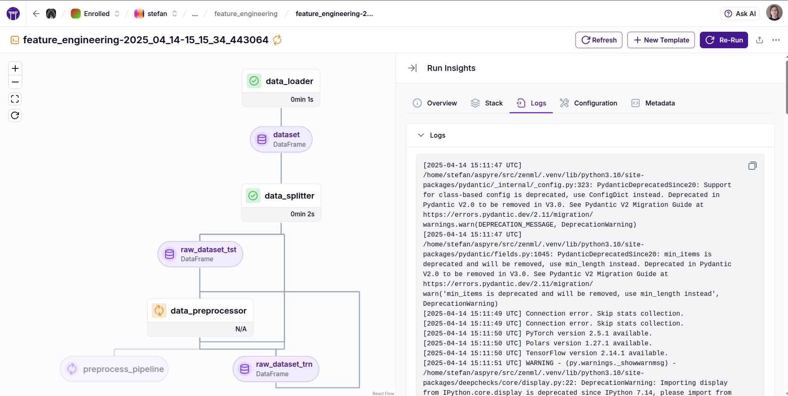
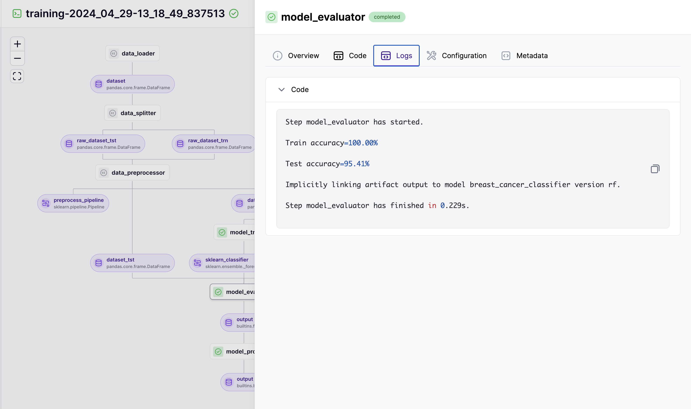

# Logging

By default, ZenML uses a logging handler to capture two types of logs:

* **Pipeline run logs**: Logs collected from your ZenML client while triggering and waiting for a pipeline to run. These logs cover everything that happens client-side: building and pushing container images, triggering the pipeline, waiting for it to start, and waiting for it to finish. These logs are now stored in the artifact store, making them accessible even after the client session ends.

* **Step logs**: Logs collected from the execution of individual steps. These logs only cover what happens during the execution of a single step and originate mostly from the user-provided step code and the libraries it calls.

For step logs, users are free to use the default python logging module or print statements, and ZenML's logging handler will catch these logs and store them.

```python
import logging

from zenml import step

@step 
def my_step() -> None:
    logging.warning("`Hello`")  # You can use the regular `logging` module.
    print("World.")  # You can utilize `print` statements as well. 
```

All these logs are stored within the respective artifact store of your stack. You can visualize the pipeline run logs and step logs in the dashboard as follows:

* Local ZenML server (`zenml login --local`): Both local and remote artifact stores may be accessible
* Deployed ZenML server: Local artifact store logs won't be accessible; remote artifact store logs require [service connector](https://docs.zenml.io/how-to/infrastructure-deployment/auth-management/service-connectors-guide) configuration (see [remote storage guide](https://docs.zenml.io/user-guides/production-guide/remote-storage))


In order for logs to be visible in the dashboard with a deployed ZenML server, you must configure both a remote artifact store and the appropriate service connector to access it. Without this configuration, your logs won't be accessible through the dashboard.





## Logging Configuration

### Environment Variables and Remote Execution

For all logging configurations below, note:
- Setting environment variables on your local machine only affects local pipeline runs
- For remote pipeline runs, you must set these variables in the pipeline's execution environment using Docker settings:

```python
from zenml import pipeline
from zenml.config import DockerSettings

docker_settings = DockerSettings(environment={"ENVIRONMENT_VARIABLE": "value"})

# Either add it to the decorator
@pipeline(settings={"docker": docker_settings})
def my_pipeline() -> None:
    my_step()

# Or configure the pipelines options
my_pipeline = my_pipeline.with_options(
    settings={"docker": docker_settings}
)
```

### Enabling or Disabling Logs Storage

You can control log storage for both pipeline runs and steps:

#### Step Logs

To disable storing step logs in your artifact store:

1. Using the `enable_step_logs` parameter with step decorator:

    ```python
    from zenml import step

    @step(enable_step_logs=False)  # disables logging for this step
    def my_step() -> None:
        ...
    ```

2. Setting the `ZENML_DISABLE_STEP_LOGS_STORAGE=true` environment variable in the execution environment:

    ```python
    from zenml import pipeline
    from zenml.config import DockerSettings

    docker_settings = DockerSettings(environment={"ZENML_DISABLE_STEP_LOGS_STORAGE": "true"})

    # Either add it to the decorator
    @pipeline(settings={"docker": docker_settings})
    def my_pipeline() -> None:
        my_step()

    # Or configure the pipelines options
    my_pipeline = my_pipeline.with_options(
        settings={"docker": docker_settings}
    )
    ```

    This environment variable takes precedence over the parameter mentioned above.

#### Pipeline Run Logs

To disable storing client-side pipeline run logs in your artifact store:

1. Using the `enable_pipeline_logs` parameter with pipeline decorator:

    ```python
    from zenml import pipeline

    @pipeline(enable_pipeline_logs=False)  # disables client-side logging for this pipeline
    def my_pipeline():
        ...
    ```

2. Using the runtime configuration:

    ```python
    # Disable pipeline logs at runtime
    my_pipeline.with_options(enable_pipeline_logs=False)
    ```

3. Setting the `ZENML_DISABLE_PIPELINE_LOGS_STORAGE=true` environment variable:

    ```python
    from zenml import pipeline
    from zenml.config import DockerSettings

    docker_settings = DockerSettings(environment={"ZENML_DISABLE_PIPELINE_LOGS_STORAGE": "true"})

    # Either add it to the decorator
    @pipeline(settings={"docker": docker_settings})
    def my_pipeline() -> None:
        my_step()

    # Or configure the pipelines options
    my_pipeline = my_pipeline.with_options(
        settings={"docker": docker_settings}
    )
    ```

    The environment variable takes precedence over parameters set in the decorator or runtime configuration.

### Setting Logging Verbosity

Change the default logging level (`INFO`) with:

```bash
export ZENML_LOGGING_VERBOSITY=INFO
```

Options: `INFO`, `WARN`, `ERROR`, `CRITICAL`, `DEBUG`

For remote pipeline runs:

```python
from zenml import pipeline
from zenml.config import DockerSettings

docker_settings = DockerSettings(environment={"ZENML_LOGGING_VERBOSITY": "DEBUG"})

# Either add it to the decorator
@pipeline(settings={"docker": docker_settings})
def my_pipeline() -> None:
    my_step()

# Or configure the pipelines options
my_pipeline = my_pipeline.with_options(
    settings={"docker": docker_settings}
)
```

### Setting Console Logging Format

Change the console/stdout logging format with:

```bash
export ZENML_CONSOLE_LOGGING_FORMAT=console
```

Options:

- `console` (default): Human-readable console output. Client-side `INFO` logs use a compact layout, while `DEBUG` logs and server logs use a full structured text layout.
- `json`: JSON formatted console/stdout logs.
- Any other valid Python `%`-style logging format string, such as `%(asctime)s - %(message)s`, for custom console output.


```bash
export ZENML_CONSOLE_LOGGING_FORMAT='%(asctime)s %(message)s'
```

The format must use `%`-string formatting style. See the [available LogRecord attributes](https://docs.python.org/3/library/logging.html#logrecord-attributes). This only changes terminal output; stored logs keep their raw message and structured metadata.


The older `ZENML_LOGGING_FORMAT` environment variable is deprecated and will be removed in a future version. Use `ZENML_CONSOLE_LOGGING_FORMAT` instead. Existing configurations such as `ZENML_LOGGING_FORMAT='%(asctime)s %(message)s'` continue to work during the deprecation period.


The compact client console layout is:

```text
<message> | <extras as JSON, if any>
[traceback and stack_info if any]
```

The full structured console layout for `DEBUG` logs is:

```text
<time> | <loglevel> | <logger-name>:<function-name>:<line-number> | <message> | <extras as JSON, if any>
[traceback and stack_info if any]
```

The JSON format emits the same information as fields:

```json
{
  "timestamp": "2026-05-21 13:09:55,515",
  "level": "INFO",
  "logger": "__main__",
  "function": "loader",
  "line": 15,
  "message": "Training started",
  "dataset": "mnist",
  "epochs": 10,
  "step": "loader"
}
```

When an exception is logged, the JSON output includes an `exception` object with the exception type, message, and stack trace.

### Adding Structured Fields

ZenML uses Python's standard `logging` module. If you want to attach structured fields to a log record, use the standard `extra` argument:

```python
import logging

logger = logging.getLogger(__name__)

logger.info(
    "training.started",
    extra={"dataset": "mnist", "epochs": 10},
)
```


Avoid using Python `LogRecord` attribute names such as `name`, `message`, `levelname`, `filename`, or `lineno` as keys in `extra` because they are reserved for Python's internal use.


When a custom console format string is configured, ZenML uses that format as-is for console output. It does not append structured `extra` fields or apply ZenML's default console coloring and highlighting to that custom layout.


### Disabling Rich Traceback Output

ZenML uses [rich](https://rich.readthedocs.io/en/stable/traceback.html) for enhanced traceback display. Disable it with:

```bash
export ZENML_ENABLE_RICH_TRACEBACK=false
```

### Disabling Colorful Logging

Console logs use colors by default. Disable colorful logging with:

```bash
ZENML_LOGGING_COLORS_DISABLED=true
```

### Showing Step Names in Logs

ZenML hides step name prefixes in console logs by default. You can show them with:

```bash
ZENML_DISABLE_STEP_NAMES_IN_LOGS=false
```

When enabled, console logs include the step name as a prefix:

```
[data_loader] Loading data from source...
[data_loader] Data loaded successfully.
[model_trainer] Training model with parameters...
```

These prefixes only appear in console output, not in stored logs. You can disable the step name prefixes in console with:

```bash
ZENML_DISABLE_STEP_NAMES_IN_LOGS=true
```

## Limitations

### on Steps and pipelines

When running steps and pipelines, ZenML only captures logs emitted from the
thread that executes the corresponding function. If your step code spawns additional
threads or runs async code, logs from those execution contexts may not be captured.

For instance, only the log emitted directly in the step function is captured:

```python
import logging
import threading

from zenml import step

logger = logging.getLogger(__name__)


@step
def async_step() -> None:
    def _process() -> None:
        logger.info("This log is NOT captured")

    logger.info("This log is captured")
    thread = threading.Thread(target=_process)
    thread.start()
    thread.join()
```

As a workaround, you can run it under the copied `contextvars` context so
ZenML can associate the log records with the running step:

```python
import contextvars
import logging
import threading

from zenml import step

logger = logging.getLogger(__name__)


@step
def async_step() -> None:
    def _process() -> None:
        logger.info("This log is now captured")

    ctx = contextvars.copy_context()
    thread = threading.Thread(target=lambda: ctx.run(_process))
    thread.start()
    thread.join()
```

### on the Dashboard

When viewing logs in the dashboard, ZenML currently loads logs **in bulk** and
pagination/filtering happens on the client side. To keep the response size and
server memory usage bounded (especially when logs are stored in remote artifact
stores), the dashboard is limited to **500 pages** (**100 log entries per
page**, i.e. **50,000 entries** total) by default.

You can adjust this limit by setting `ZENML_LOGS_MAX_ENTRIES_PER_REQUEST` in the
environment when you are deploying your ZenML workspace.

Downloading logs from the dashboard will also only include up to this limit.


We’re actively working on improving log loading to remove the need for this cap.
We'll update the documentation as this evolves with future releases.



## Best Practices for Logging

1. **Use appropriate log levels**:
   - `DEBUG`: Detailed diagnostic information
   - `INFO`: Confirmation that things work as expected
   - `WARNING`: Something unexpected happened
   - `ERROR`: A more serious problem occurred
   - `CRITICAL`: A serious error that may prevent continued execution

2. **Include contextual information** in logs
3. **Log at decision points** to track execution flow
4. **Avoid logging sensitive information**
5. **Use structured logging** when appropriate
6. **Configure appropriate verbosity** for different environments

## See Also
- [Steps & Pipelines](./steps_and_pipelines.md)
- [YAML Configuration](./yaml_configuration.md)
- [Advanced Features](./advanced_features.md) 

<figure><figcaption></figcaption></figure>
