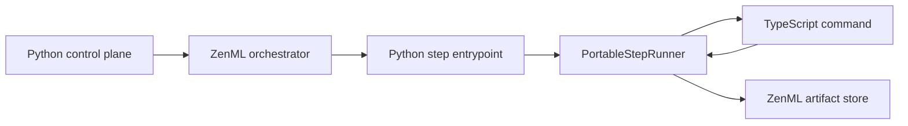
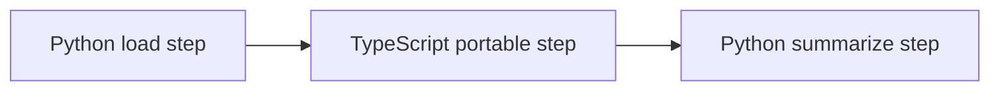

# Experimental TypeScript steps with ZenBabel

ZenBabel is an experimental execution path for running a non-Python step body inside an otherwise normal ZenML pipeline. The current proof point is deliberately small: a Python-controlled static pipeline can route one TypeScript step body through a portable JSON subprocess protocol.

The short version is:

- ZenML's control plane is still Python.
- The orchestrator path is still the existing ZenML stack path.
- The TypeScript step exchanges inputs, outputs, and parameters as JSON-compatible values only.
- This is not yet a public TypeScript SDK.

## What actually happens

Think of the TypeScript process as a guest worker inside a normal ZenML step container. The house is still Python: ZenML creates the run, resolves upstream artifacts, starts the step, records status, and stores outputs. The guest worker only receives JSON files, does its work, writes JSON files back, and exits.



For a mixed pipeline, the shape looks like this:



The handoff between Python and TypeScript is the `zenml-portable-json-v1` contract:

1. ZenML materializes upstream artifacts in Python.
2. `PortableStepRunner` validates that those values are strict portable JSON.
3. It writes input JSON files and a manifest file.
4. It sets `ZENML_PORTABLE_STEP_MANIFEST` for the child process.
5. The TypeScript command reads the manifest, reads inputs, writes outputs, and exits.
6. ZenML reads the output JSON and stores it through existing Python materializers.

## Current v1 scope

Supported in the experimental path:

- static pipeline snapshots,
- TypeScript step bodies launched as subprocess commands,
- JSON-compatible values: objects with string keys, arrays, strings, booleans, null, finite numbers, and JavaScript-safe integers,
- existing ZenML artifact tracking after the TypeScript process returns JSON.

Not supported yet:

- Python-free pipeline definition or submission,
- dynamic pipelines with portable steps,
- non-JSON artifacts such as pandas DataFrames, NumPy arrays, model objects, images, files, pickle/cloudpickle payloads, custom materializers, metadata extraction, or visualizations across the language boundary,
- a stable TypeScript SDK surface,
- broad orchestrator-specific guarantees beyond the existing container entrypoint path.

## Why the example has a small compiler bridge

The runtime support and the importer are in place, but the public SDK does not yet expose a first-class way to write `typescript_step(...)` inside a Python `@pipeline`. The example therefore uses a narrow local bridge:

1. Python compiles a normal static pipeline with a placeholder step.
2. `zenml.zenbabel.build_steps(...)` imports the external TypeScript step spec.
   In this example, the external TypeScript step spec is still authored as a small Python dictionary; a real TypeScript emitter or SDK is out of scope for v1.
3. The bridge patches the compiled placeholder step with the portable `source` and `execution_spec`.
4. The normal ZenML run path then sees `zenml-portable-json-v1` and routes the step to `PortableStepRunner`.

That bridge is explanatory scaffolding, not the final SDK shape.

## Try it

See the repository example at:

```text
examples/zenbabel_mixed_static/
```

It contains:

- a Python-controlled pipeline,
- a TypeScript helper that reads `ZENML_PORTABLE_STEP_MANIFEST`,
- a TypeScript scoring step,
- a Dockerfile for a Python + ZenML + Node step image,
- smoke-test instructions and Local Docker run instructions.

The full demo requires both pieces to be true:

1. The active stack must be Docker-capable for this path, such as Local Docker with an image builder. The plain local orchestrator is not enough because it runs Python steps directly and does not use the demo pipeline's Docker settings. The demo image must contain the branch ZenML code for all steps, not only the TypeScript step, because the Python step module imports the experimental ZenBabel symbols.
2. The active ZenML server/store must include this experimental branch schema. Older Cloud or staging servers can strip the new `StepSpec.execution_spec` field when the snapshot is saved and returned. The same thing can happen with a local daemon if it was started earlier from another virtual environment. If that happens, the TypeScript step reaches the normal Python runner as `PortableStepAdapter`, and the adapter correctly fails because it should only run through `PortableStepRunner`.

For Local Docker, the example also rewrites a local store URL from `127.0.0.1` or `localhost` to `host.docker.internal` inside the step environment. Without that rewrite, the container phones its own loopback address instead of the host ZenML server. The demo also disables step heartbeat because portable JSON v1 does not support heartbeat yet.

If your local daemon was started before you switched to this worktree, restart it from the ZenBabel branch environment:

```bash
uv run zenml login --local --restart
```

For quick local validation without Docker or a compatible server, use the example's `--compile-only` mode. It checks that the compiler bridge creates the `zenml-portable-json-v1` execution spec before any server/store round trip.

Use this page and the example as a snapshot of the experimental v1 story. Future TypeScript SDK work may make the authoring experience cleaner, but it should preserve the same honest boundary: the current stable ZenML control plane is Python, and this portable path only moves a JSON-shaped step body across the language line.

<figure><figcaption></figcaption></figure>
