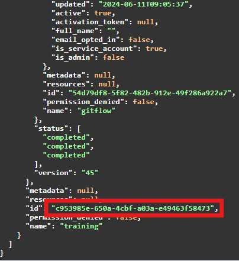


This is an older version of the ZenML documentation. To read and view the latest version please [visit this up-to-date URL](https://docs.zenml.io).




This is a [ZenML Pro](https://zenml.io/pro)-only feature. Please
[sign up here](https://cloud.zenml.io) to get access.


## Run a template 

Triggering a pipeline from the REST API **only** works if you've created at 
least one run template for that pipeline.

As a pre-requisite, you need a pipeline name. After you have it, there are 
three calls that need to be made in order to trigger a pipeline from the 
REST API:

1. `GET /pipelines?name=<PIPELINE_NAME>` -> This returns a response, where a <PIPELINE_ID> can be copied
2. `GET /run_templates?pipeline_id=<PIPELINE_ID>` -> This returns a list of responses where a <TEMPLATE_ID> can be chosen
3. `POST /run_templates/<TEMPLATE_ID>/runs` -> This runs the pipeline. You can pass the [PipelineRunConfiguration](https://sdkdocs.zenml.io/latest/core_code_docs/core-config/#zenml.config.pipeline_run_configuration.PipelineRunConfiguration) in the body

## A working example


Learn how to get a bearer token for the curl commands 
[here](../../reference/api-reference.md#using-a-bearer-token-to-access-the-api-programmatically).


Here is an example. Let's say would we like to re-run a pipeline called 
`training`. We first query the `/pipelines` endpoint:

```shell
curl -X 'GET' \
  '<YOUR_ZENML_SERVER_URL>/api/v1/pipelines?hydrate=false&name=training' \
  -H 'accept: application/json' \
  -H 'Authorization: Bearer <YOUR_TOKEN>'
```

<figure><figcaption><p>Identifying the pipeline ID</p></figcaption></figure>

We can take the ID from any object in the list of responses. In this case, 
the <PIPELINE_ID> is `c953985e-650a-4cbf-a03a-e49463f58473` in the response.

After this, we take the pipeline ID and call the`/run_templates?pipeline_id=<PIPELINE_ID>` API:

```shell
curl -X 'GET' \
  '<YOUR_ZENML_SERVER_URL>/api/v1/run_templates?hydrate=false&logical_operator=and&page=1&size=20&pipeline_id=b826b714-a9b3-461c-9a6e-1bde3df3241d' \
  -H 'accept: application/json' \
  -H 'Authorization: Bearer <YOUR_TOKEN>'
```

We can now take the <TEMPLATE_ID> from this response. Here it is `b826b714-a9b3-461c-9a6e-1bde3df3241d`.

<figure><figcaption><p>Identifying the template ID</p></figcaption></figure>

Finally, we can use the template ID to trigger the pipeline with a different 
configuration:

```shell
curl -X 'POST' \
  '<YOUR_ZENML_SERVER_URL>/api/v1/run_templates/b826b714-a9b3-461c-9a6e-1bde3df3241d/runs' \
  -H 'accept: application/json' \
  -H 'Content-Type: application/json' \
  -H 'Authorization: Bearer <YOUR_TOKEN>' \
  -d '{
  "steps": {"model_trainer": {"parameters": {"model_type": "rf"}}}
}'
```

A positive response means your pipeline has been re-triggered with a 
different config!

<!-- For scarf -->
<figure></figure>
