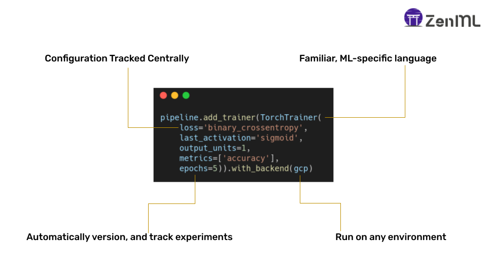

# ZenML 101

**ZenML** is an extensible, open-source MLOps framework for using production-ready Machine Learning pipelines, in a simple way. At its core, **ZenML** will orchestrate your experiment pipelines from **sourcing data** to **splitting, preprocessing, training**, all the way to the **evaluation of results** and even **serving**.

While there are other pipelining solutions for Machine Learning experiments, **ZenML** is focused on the following:

* Simplicity.
* Reproducibility.
* Integrations.

## Why do I need ZenML?

**ZenML** solves the problem of getting Machine Learning in models to production. You should use **ZenML** if you struggle with:

* **Reproducing** training results in production.
* Managing ML **metadata**, including data, code, and model versioning.
* Getting \(and keeping\) ML models in **production**.
* **Reusing** code/data and reducing waste.
* Maintaining **comparability** between ML models.
* **Scaling ML** training/inference to large datasets.
* Retaining code **quality** alongside development velocity.
* Keeping up with the ML **tooling landscape** in a coherent manner.

## Who is ZenML for?

ZenML is created for data science / machine learning teams that are engaged in not only training models, but also putting them out in production. Production can mean many things, but examples would be:

* If you are using a model to generate analysis periodically for any business process.
* If you are using models as a software service to serve predictions.
* If you are trying to understand patterns using machine learning for any business process.

In all of the above, there will be team that is engaged with creating, deploying, managing and improving the entire process. You always want the best results, the best models, and the most robust and reliable results. This is where ZenML can help.

In terms of user persona, ZenML is created for **producers of the models.** This role is classically known as 'data scientist' in the industry and can range from research-minded individuals to more engineering-driven people. The goal of ZenML is to enable these practitioners to **own** their models until deployment and beyond.

## What is so special about ZenML?

Here, we could dive into an analysis of other similar tools out there, but as these tend to get outdated really quickly, it is not a useful endeavor. We can however list the vision and philosophy behind ZenML:

* We wanted a tool that is **flexible**: Simple python functions can be converted into a workflow step.
* We wanted a tool that is **simple:** You can run it locally and with a few commands can get it running on the cloud with minimum changes.
* We wanted to created a **machine learning specific** workflow tool: With ML, workflows need to focus not just on tasks, but also data like models, parameters, statistics and other ML-specific artifacts. This way we can solve machine learning specific problems and create a more understandable API.
* We wanted a tool that can **integrate** with the exploding ML/MLOps landscape: It is so confusing right now because every team that is doing serious ML has their own way of doing things. This is completely fine, but we built ZenML to be a connector and gateway to many other amazing tools for specific problems in machine learning.

## Okay, how can I learn more?

A good place to go from this point is to:

* Read more about [core concepts](core-concepts.md) to inform your decision about using **ZenML**
* Get up and running with your [first pipeline](https://github.com/zenml-io/zenml/tree/f912d2d512477e6ed84e839259d42cb73eeedf2b/docs/book/starter-guide/quickstart.md) with our [starter guide](https://github.com/zenml-io/zenml/tree/f912d2d512477e6ed84e839259d42cb73eeedf2b/docs/book/starter-guide/repository.md)

## Get involved!

If you're just not ready to use **ZenML** for whatever reason, but still would like to stay updated, then the best way is to [star the GitHub repository](https://github.com/zenml-io/zenml)! You can then keep up with the latest and greatest from **ZenML**, and it would help us tremendously to get more people using it.

Contributions are also welcome! Please read our [contributing guide](https://github.com/zenml-io/zenml/blob/main/CONTRIBUTING.md) to get started.

