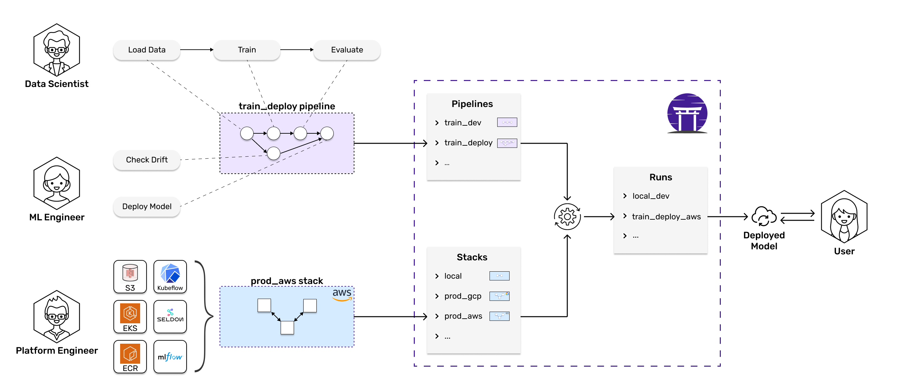
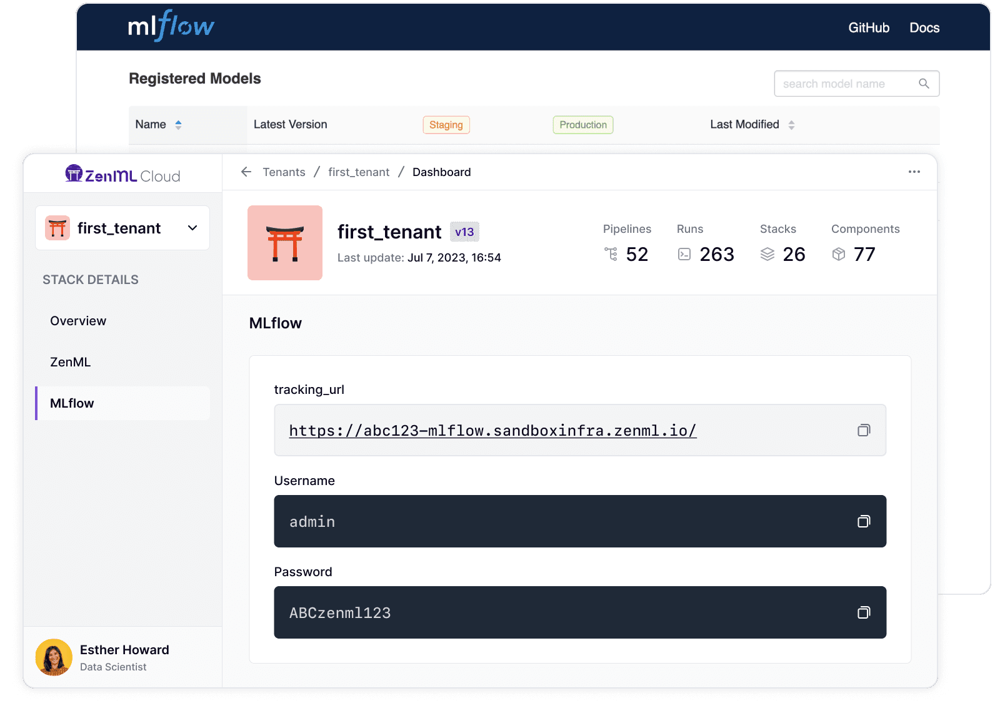
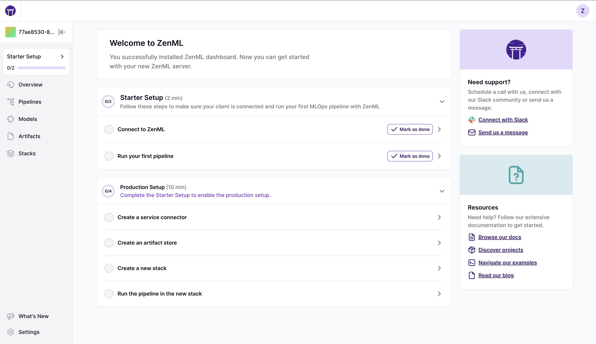

# ⭐ Introduction

**ZenML** is an extensible, open-source MLOps framework for creating portable, production-ready machine learning pipelines. By decoupling infrastructure from code, ZenML enables developers across your organization to collaborate more effectively as they develop to production.





ZenML enables MLOps infrastructure experts to define, deploy, and manage sophisticated production environments that are easy to share with colleagues.

*   <mark style="color:purple;">**ZenML Pro**</mark>**:** [ZenML Pro](getting-started/zenml-pro/zenml-cloud.md) provides a control plane that allows you to deploy a managed ZenML instance and get access to exciting new features such as CI/CD, Model Control Plane, and RBAC.

    <figure><figcaption></figcaption></figure>
*   **Self-hosted deployment:** ZenML can be deployed on any cloud provider and provides many Terraform-based utility functions to deploy other MLOps tools or even entire MLOps stacks:

    ```bash
    # Deploy ZenML to any cloud
    zenml deploy --provider aws

    # Connect cloud resources with a simple wizard
    zenml stack register --provider aws

    # Deploy entire MLOps stacks at once
    zenml stack deploy  --provider gcp
    ```
*   **Standardization:** With ZenML, you can standardize MLOps infrastructure and tooling across your organization. Simply register your staging and production environments as ZenML stacks and invite your colleagues to run ML workflows on them.

    ```bash
    # Register MLOps tools and infrastructure
    zenml orchestrator register kfp_orchestrator -f kubeflow

    # Register your production environment
    zenml stack register production --orchestrator kubeflow ...
    ```
* Registering your environments as ZenML stacks also enables you to browse and explore them in a convenient user interface. Try it out at [https://www.zenml.io/live-demo](https://www.zenml.io/live-demo)!
*   **No Vendor Lock-In:** Since infrastructure is decoupled from code, ZenML gives you the freedom to switch to a different tooling stack whenever it suits you. By avoiding vendor lock-in, you have the flexibility to transition between cloud providers or services, ensuring that you receive the best performance and pricing available in the market at any time.

    ```bash
    zenml stack set gcp
    python run.py  # Run your ML workflows in GCP
    zenml stack set aws
    python run.py  # Now your ML workflow runs in AWS
    ```

:rocket: **Learn More**

Ready to deploy and manage your MLOps infrastructure with ZenML? Here is a collection of pages you can take a look at next:

<table data-view="cards"><thead><tr><th></th><th></th><th data-hidden data-card-target data-type="content-ref"></th></tr></thead><tbody><tr><td><span data-gb-custom-inline data-tag="emoji" data-code="1f3d7">🏗️</span> <mark style="color:purple;"><strong>Switch to production</strong></mark></td><td>Set up and manage production-ready infrastructure with ZenML.</td><td><a href="user-guide/production-guide/cloud-orchestration.md">cloud-orchestration.md</a></td></tr><tr><td><span data-gb-custom-inline data-tag="emoji" data-code="1f4cb">📋</span> <mark style="color:purple;"><strong>Component guide</strong></mark></td><td>Explore the existing infrastructure and tooling integrations of ZenML.</td><td><a href="./component-guide/README.md">./component-guide/README.md</a></td></tr><tr><td><span data-gb-custom-inline data-tag="emoji" data-code="1f64b">🙋</span> <mark style="color:purple;"><strong>FAQ</strong></mark></td><td>Find answers to the most frequently asked questions.</td><td><a href="reference/faq.md">faq.md</a></td></tr></tbody></table>



ZenML gives data scientists the freedom to fully focus on modeling and experimentation while writing code that is production-ready from the get-go.

*   **Develop Locally:** ZenML allows you to develop ML models in any environment using your favorite tools. This means you can start developing locally, and simply switch to a production environment once you are satisfied with your results.

    ```bash
    python run.py  # develop your code locally with all your favorite tools
    zenml stack set production
    python run.py  # run on production infrastructure without any code changes
    ```
*   **Pythonic SDK:** ZenML is designed to be as unintrusive as possible. Adding a ZenML `@step` or `@pipeline` decorator to your Python functions is enough to turn your existing code into ZenML pipelines:

    ```python
    from zenml import pipeline, step

    @step
    def step_1() -> str:
      return "world"

    @step
    def step_2(input_one: str, input_two: str) -> None:
      combined_str = input_one + ' ' + input_two
      print(combined_str)

    @pipeline
    def my_pipeline():
      output_step_one = step_1()
      step_2(input_one="hello", input_two=output_step_one)

    my_pipeline()
    ```
* **Automatic Metadata Tracking:** ZenML automatically tracks the metadata of all your runs and saves all your datasets and models to disk and versions them. Using the ZenML dashboard, you can see detailed visualizations of all your experiments. Try it out at [https://www.zenml.io/live-demo](https://www.zenml.io/live-demo)!


ZenML integrates seamlessly with many popular open-source tools, so you can also combine ZenML with other popular experiment tracking tools like [Weights & Biases](./component-guide/experiment-trackers/wandb.md), [MLflow](./component-guide/experiment-trackers/mlflow.md), or [Neptune](./component-guide/experiment-trackers/neptune.md) for even better reproducibility.


:rocket: **Learn More**

Ready to develop production-ready code with ZenML? Here is a collection of pages you can take a look at next:

<table data-view="cards"><thead><tr><th></th><th></th><th data-hidden data-card-target data-type="content-ref"></th></tr></thead><tbody><tr><td><span data-gb-custom-inline data-tag="emoji" data-code="1f9f1">🧱</span> <mark style="color:purple;"><strong>Core Concepts</strong></mark></td><td>Understand the core concepts behind ZenML.</td><td><a href="getting-started/core-concepts.md">core-concepts.md</a></td></tr><tr><td><span data-gb-custom-inline data-tag="emoji" data-code="1f423">🐣</span> <mark style="color:purple;"><strong>Starter Guide</strong></mark></td><td>Get started with ZenML and learn how to build your first pipeline and stack.</td><td><a href="user-guide/starter-guide/">starter-guide</a></td></tr><tr><td><span data-gb-custom-inline data-tag="emoji" data-code="1f3c3">🏃</span> <mark style="color:purple;"><strong>Quickstart (in Colab)</strong></mark></td><td>Build your first ZenML pipeline and deploy it in the cloud.</td><td><a href="https://colab.research.google.com/github/zenml-io/zenml/blob/main/examples/quickstart/notebooks/quickstart.ipynb">https://colab.research.google.com/github/zenml-io/zenml/blob/main/examples/quickstart/notebooks/quickstart.ipynb</a></td></tr></tbody></table>



ZenML empowers ML engineers to take ownership of the entire ML lifecycle end-to-end. Adopting ZenML means fewer handover points and more visibility on what is happening in your organization.

*   **ML Lifecycle Management:** ZenML's abstractions enable you to manage sophisticated ML setups with ease. After you define your ML workflows as [Pipelines](getting-started/core-concepts.md#1-development) and your development, staging, and production infrastructures as [Stacks](getting-started/core-concepts.md#2-execution), you can move entire ML workflows to different environments in seconds.

    ```bash
    zenml stack set staging
    python run.py  # test your workflows on staging infrastructure
    zenml stack set production
    python run.py  # run your workflows in production
    ```
* **Reproducibility:** ZenML enables you to painlessly reproduce previous results by automatically tracking and versioning all stacks, pipelines, artifacts, and source code. In the ZenML dashboard, you can get an overview of everything that has happened and drill down into detailed lineage visualizations. Try it out at [https://www.zenml.io/live-demo](https://www.zenml.io/live-demo)!

<figure><figcaption></figcaption></figure>

*   **Automated Deployments:** With ZenML, you no longer need to upload custom Docker images to the cloud whenever you want to deploy a new model to production. Simply define your ML workflow as a ZenML pipeline, let ZenML handle the containerization, and have your model automatically deployed to a highly scalable Kubernetes deployment service like [Seldon](./component-guide/model-deployers/seldon.md).

    ```python
    from zenml.integrations.seldon.steps import seldon_model_deployer_step
    from my_organization.steps import data_loader_step, model_trainer_step

    @pipeline
    def my_pipeline():
      data = data_loader_step()
      model = model_trainer_step(data)
      seldon_model_deployer_step(model)
    ```

:rocket: **Learn More**

Ready to manage your ML lifecycles end-to-end with ZenML? Here is a collection of pages you can take a look at next:

<table data-view="cards"><thead><tr><th></th><th></th><th data-hidden data-card-target data-type="content-ref"></th></tr></thead><tbody><tr><td><span data-gb-custom-inline data-tag="emoji" data-code="1f423">🐣</span> <mark style="color:purple;"><strong>Starter Guide</strong></mark></td><td>Get started with ZenML and learn how to build your first pipeline and stack.</td><td><a href="user-guide/starter-guide/">starter-guide</a></td></tr><tr><td><span data-gb-custom-inline data-tag="emoji" data-code="1f414">🐔</span> <mark style="color:purple;"><strong>How To</strong></mark></td><td>Discover advanced ZenML features like config management and containerization.</td><td><a href="./how-to/build-pipelines/README.md">./how-to/build-pipelines/README.md</a></td></tr><tr><td><span data-gb-custom-inline data-tag="emoji" data-code="1f9d1-1f3eb">🧑‍🏫</span> <mark style="color:purple;"><strong>Examples</strong></mark></td><td>Explore ZenML through practical use-case examples.</td><td><a href="https://github.com/zenml-io/zenml-projects">https://github.com/zenml-io/zenml-projects</a></td></tr></tbody></table>



<figure><figcaption></figcaption></figure>
