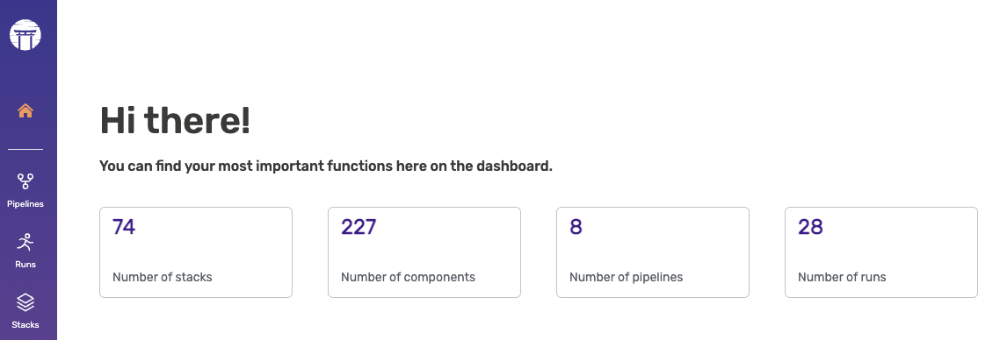

# ⭐ Introduction

ZenML is an extensible, open-source MLOps framework for creating portable, 
production-ready machine learning pipelines.
By decoupling infrastructure from code, ZenML enables developers across your 
organization to collaborate more effectively as they develop to production.






ZenML gives data scientists the freedom to fully focus on modeling and
experimentation while writing code that is immediately production-ready.

**Develop Locally:** Since ZenML code runs in any environment, you can 
develop ML models locally with all your favorite tools. Once you are happy with 
your results, you can switch to a production environment via a single command 
and all your code will just work:

```bash
python run.py  # develop your code locally with all your favorite tools
zenml stack set production
python run.py  # run on production infrastructure without any code changes
```

**Pythonic SDK:** ZenML is designed to be as unintrusive as possible. Adding 
a ZenML `@step` or `@pipeline` decorator to your Python functions is enough to 
turn your existing code into ZenML pipelines:

```python
from zenml import pipeline, step

@step
def step_1() -> str:
  return "world"

@step
def step_2(input_one: str, input_two: str) -> None:
  combined_str = input_one + ' ' + input_two
  print(combined_str)

@pipeline
def my_pipeline():
  output_step_one = step_1()
  step_2(input_one="hello", input_two=output_step_one)

my_pipeline()
```

**Automatic Metadata Tracking** ZenML automatically tracks metadata of all your
experiments and saves all your datasets and models to disk and versions them.
Using the ZenML dashboard, you can then see detailed visualizations of all your 
experiments.
Try it out at [https://demo.zenml.io/](https://demo.zenml.io/)!

<figure>

</figure>


ZenML integrates seamlessly with many popular open-source tools, so you can 
also combine ZenML with other popular experiment tracking tools like
[Weights & Biases](./user-guide/component-galery/experiment-trackers/wandb.md),
[MLflow](./user-guide/component-galery/experiment-trackers/mlflow.md), or
[Neptune](./user-guide/component-galery/experiment-trackers/neptune.md)
for even better reproducibility.






ZenML empowers ML engineers to take ownership of the entire ML lifecycle
end-to-end. Adopting ZenML means fewer handover points and more visibility
on what is happening in your organization.

**ML Lifecycle Management:** ZenML's abstractions enable you to manage
sophisticated ML setups with ease. After you define your ML workflows as 
[Pipelines](./getting-started/core-concepts.md#1-development) and your 
development, staging, and production infrastructures as 
[Stacks](./getting-started/core-concepts.md#2-execution), you can move 
entire ML workflows to different environments in seconds.

```bash
zenml stack set staging
python run.py  # test your workflows on staging infrastructure
zenml stack set production
python run.py  # run your workflows in production
```

**Reproducibility:** ZenML enables you to painlessly reproduce previous results
by automatically tracking and versioning all stacks, pipelines, artifacts, and
source code. In the ZenML dashboard, you can get an overview of everything that
has happened and drill down into detailed lineage visualizations.
Try it out at [https://demo.zenml.io/](https://demo.zenml.io/)!

<figure>

</figure>

**Automated Deployments:** With ZenML, you no longer need to upload custom 
Docker images to the cloud whenever you want to deploy a new model to 
production. Simply define your ML workflow as a ZenML pipeline, let ZenML 
handle the containerization, and have your model automatically deployed to 
a highly scalable Kubernetes deployment service like 
[Seldon](./user-guide/component-galery/model-deployers/seldon.md).

```python
from zenml.integrations.seldon.steps import seldon_model_deployer_step

from my_organization.steps import data_loader_step, model_trainer_step


@pipeline
def my_pipeline():
  data = data_loader_step()
  model = model_trainer_step(data)
  seldon_model_deployer_step(model)
```





ZenML enables MLOps infrastructure experts to define, deploy, and manage
sophisticated production environments that are easy to share with colleagues.

**Standardization:** With ZenML, you can standardize MLOps infrastructure and 
tooling across your organization. Simply set up a ZenML server, register your 
production environment as a ZenML stack, and invite your colleagues to run 
their ML workflows on it:

```bash
zenml deploy --provider aws  # Deploy ZenML to any cloud
zenml orchestrator deploy kfp --flavor kubeflow --cloud gcp  # Deploy MLOps tools and infra to any cloud
zenml stack register production ...  # Register your production environment
zenml stack share production  # Make it available to your colleagues
```

**No Vendor Lock-In:** Since infrastructure is decoupled from code, ZenML gives
you the freedom to switch to a different tooling stack whenever it suits you.
By avoiding vendor lock-in, you have the flexibility to transition between 
cloud providers or services, ensuring that you receive the best 
performance and pricing available in the market at any time.

```bash
zenml stack set gcp
python run.py  # Run your ML workflows in GCP
zenml stack set aws
python run.py  # Now your ML workflow runs in AWS
```

**Extensibility:** ZenML is open-source and highly extensible, so you benefit 
from industry-standard best-practices built into the framework while retaining
the option to customize it to fit your specific needs.

<table data-view="cards">
    <thead><tr><th></th><th></th><th></th><th data-hidden data-card-target data-type="content-ref"></th></tr></thead>
    <tbody>
        <tr><td><span data-gb-custom-inline data-tag="emoji" data-code="1f4cb">📋</span> <strong>Component Guide</strong></td><td>Browse through the already-implemented integrations for ZenML.</td><td></td><td><a href="user-guide/component-galery/">component-galery</a></td></tr>
        <tr><td><span data-gb-custom-inline data-tag="emoji" data-code="1f3d7">🏗</span> <strong>Platform Guide</strong></td><td>Set up and manage production-ready infrastructure with ZenML.</td><td></td><td><a href="platform-guide/set-up-your-mlops-platform/">set-up-your-mlops-platform</a></td></tr>
        <tr><td><span data-gb-custom-inline data-tag="emoji" data-code="1f9d1-1f3eb">🧑🏫</span> <strong>Examples</strong></td><td>Take a peek at how ZenML works in concrete examples.</td><td></td><td><a href="learning/examples/">examples</a></td></tr>
    </tbody>
</table>





## Directions

Ready to harness the power of ZenML for your machine learning projects? Here is a collection of pages you can take a look at next:

<table data-view="cards">
    <thead><tr><th></th><th></th><th></th><th data-hidden data-card-target data-type="content-ref"></th></tr></thead>
    <tbody>
        <tr><td><span data-gb-custom-inline data-tag="emoji" data-code="1f4bf">💿</span> <strong>Installation</strong></td><td>Install ZenML via pip.</td><td></td><td><a href="getting-started/installation.md">installation.md</a></td></tr>
        <tr><td><span data-gb-custom-inline data-tag="emoji" data-code="1f9f1">🧱</span> <strong>Core Concepts</strong></td><td>Understand the core concepts behind ZenML.</td><td></td><td><a href="getting-started/core-concepts.md">core-concepts.md</a></td></tr>
        <tr><td><span data-gb-custom-inline data-tag="emoji" data-code="1f3c3">🏃</span> <strong>Quickstart</strong></td><td>Build your first ZenML pipeline and deploy it in the cloud.</td><td></td><td><a href="https://github.com/zenml-io/zenml/blob/main/examples/quickstart/README.md">quickstart</a></td></tr>
        <tr><td><span data-gb-custom-inline data-tag="emoji" data-code="1f423">🐣</span> <strong>Starter Guide</strong></td><td>Get started quickly with a simple setup.</td><td></td><td><a href="user-guide/starter-guide/">starter-guide</a></td></tr>
        <tr><td><span data-gb-custom-inline data-tag="emoji" data-code="1f414">🐔</span> <strong>Advanced Guide</strong></td><td>Hone your MLOps skills with an advanced guide.</td><td></td><td><a href="user-guide/advanced-guide/">advanced-guie</a></td></tr>
        <tr><td><span data-gb-custom-inline data-tag="emoji" data-code="1f4cb">📋</span> <strong>Component Guide</strong></td><td>Browse through the already-implemented integrations for ZenML.</td><td></td><td><a href="user-guide/component-galery/">component-galery</a></td></tr>
        <tr><td><span data-gb-custom-inline data-tag="emoji" data-code="1f3d7">🏗</span> <strong>Platform Guide</strong></td><td>Set up and manage production-ready infrastructure with ZenML.</td><td></td><td><a href="platform-guide/set-up-your-mlops-platform/">set-up-your-mlops-platform</a></td></tr>
        <tr><td><span data-gb-custom-inline data-tag="emoji" data-code="1f9d1-1f3eb">🧑🏫</span> <strong>Examples</strong></td><td>Take a peek at how ZenML works in concrete examples.</td><td></td><td><a href="learning/examples/">examples</a></td></tr>
        <tr><td><span data-gb-custom-inline data-tag="emoji" data-code="1f64b">🙋</span> <strong>FAQ</strong></td><td>Find the answers to the most frequently asked questions.</td><td></td><td><a href="learning/faq.md">faq.md</a></td></tr>
    </tbody>
</table>
