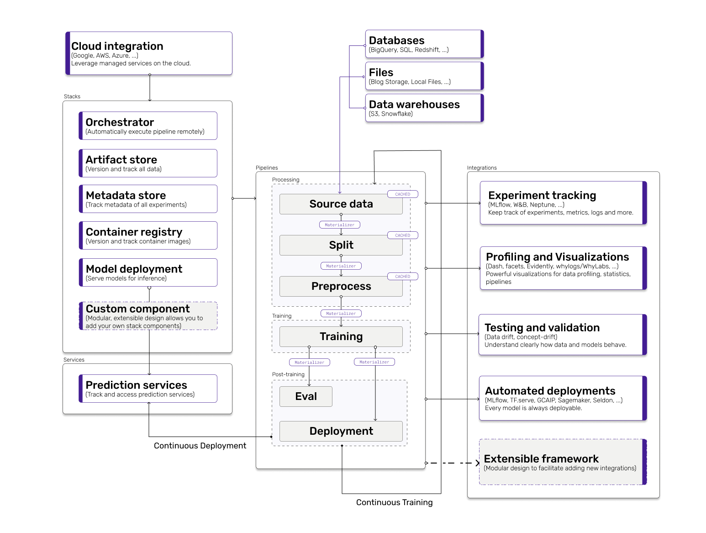

# Core Concepts

**ZenML** consists of the following key components:



On a high level, data passes through a **pipeline** via **steps** as an **artifact** or **parameters** and is persisted 
in an **artifact store**. Every **step** reads its predecessor's result artifacts and writes its own result 
artifacts to the **artifact store** via **materializers**. 

Pipelines and steps are defined in code, but the underlying infrastructure in which they run on can be configured via 
**stacks**. A stack is the configuration for all the infrastructure that one is using in the ML lifecycle. It can consist 
of many components. E.g. An orchestrator is an important component of a **stack**. An **orchestrator** 
manages the lifecycle of a pipeline, either as a single **run** or a recurring run on a **schedule**.

You can fetch these **steps** and their output **artifacts** in a post-execution workflow via the **Repository**. 

## Profiles

Profiles are configuration contexts stored on the machine where ZenML is used to run pipelines.
They can be used to manage multiple individual ZenML global configurations on the same machine. Profiles control
where the ZenML [Stacks](../guides/functional-api/deploy-to-production.md) are stored.

A `default` Profile is created automatically and set as the active Profile the first time ZenML runs. It is
sufficient for most use cases that require configuring Stacks used to run ZenML pipelines. However, if you need to
maintain multiple sets of Stacks independently of each other, you can create additional Profiles and switch between
them when needed.

Profiles are also a way to customize the storage backend where the information about Stacks is persisted.

## Repository

Every ZenML project starts inside a ZenML repository and, it is at the core of all ZenML activity. Every action that 
can be executed within ZenML must take place within such a repository. 

In order to create a ZenML repository, do the following after having installed ZenML:

```
zenml init
```

The initialization creates a local `.zen` folder where various information about your local configuration lives, 
e.g., the Profile and the active [Stack](../guides/functional-api/deploy-to-production.md) that you are using to run
pipelines.

## Pipeline

Pipelines are designed as simple functions. They are created by using decorators appropriate to the specific use case 
you have. The moment it is `run`, a pipeline is compiled and passed directly to the orchestrator, to be run in the 
orchestrator environment.

Within your repository, you will have one or more pipelines as part of your workflow. A ZenML 
pipeline is a sequence of tasks that execute in a specific order and yield artifacts. The artifacts are stored 
within the artifact store and indexed via the metadata store. Each individual task within a pipeline is known as a 
step.

```python
@pipeline
def mnist_pipeline(
    importer,
    normalizer: normalizer,
    trainer,
    evaluator,
):
    # Link all the steps artifacts together
    X_train, y_train, X_test, y_test = importer()
    X_trained_normed, X_test_normed = normalizer(X_train=X_train, X_test=X_test)
    model = trainer(X_train=X_trained_normed, y_train=y_train)
    evaluator(X_test=X_test_normed, y_test=y_test, model=model)


# Initialize the pipeline
p = mnist_pipeline(
    importer=importer_mnist(),
    normalizer=normalizer(),
    trainer=trainer(config=TrainerConfig(epochs=1)),
    evaluator=evaluator(),
)

# Run the pipeline
p.run()
```

Pipelines consist of many steps that define what actually happens to the data flowing through 
the pipelines.

## Step

A step is a single piece or stage of a ZenML pipeline. Think of each step as being one of the nodes of the DAG. 
Steps are responsible for one aspect of processing or interacting with the data / artifacts in the pipeline. ZenML 
implements a basic `step` interface:

```python
from zenml.steps import step

@step  # this is where the magic happens
def simplest_step_ever(basic_param_1: int, basic_param_2: str) -> int:
    return basic_param_1 + int(basic_param_2)
```

There are only a few considerations for the parameters and return types.

- All parameters passed into the signature must be [typed](https://docs.python.org/3/library/typing.html). Similarly, 
if you're returning something, it must be also be typed with the return operator (`->`)
- ZenML uses [Pydantic](https://pydantic-docs.helpmanual.io/usage/types/) for type checking and serialization 
under-the-hood, so all [Pydantic types](https://pydantic-docs.helpmanual.io/usage/types/) are 
supported \[full list available soon].

While this is just a function with a decorator, it is not super useful. ZenML
steps really get powerful when you put them together with data artifacts. Read
about more of that
[here](https://docs.zenml.io/v/docs/guides/functional-api/materialize-artifacts)!

## Artifact Store

An artifact store is a place where artifacts are stored. These artifacts may have been produced by the pipeline 
steps, or they may be the data first ingested into a pipeline via an ingestion step. An artifact store will store all intermediary pipeline step results, which in turn will be tracked in the metadata store.

## Artifact

Artifacts are the data that power your experimentation and model training. It is actually steps that produce 
artifacts, which are then stored in the artifact store. Artifacts are written in the signature of a step like so:

```python
# Some code
def my_step(first_artifact: int, second_artifact: torch.nn.Module -> int:
    # first_artifact is an integer
    # second_artifact is a torch.nn.Module
    return 1
```

Artifacts can be serialized and deserialized (i.e. written and read from the Artifact Store) in different ways 
like `TFRecord`s or saved model pickles, depending on what the step produces.The serialization and deserialization 
logic of artifacts is defined by Materializers.

## Materializers

A materializer defines how and where Artifacts live in between steps. It is used to convert a ZenML artifact into 
a specific format. They are most often used to handle the input or output of ZenML steps, and can be extended by 
building on the `BaseMaterializer` class. We care about this because steps are not just isolated pieces of work; 
they are linked together and the outputs of one step might well be the inputs of the next.

We have some built-in ways to serialize and deserialize the data flowing between steps. Of course, if you are 
using some library or tool which doesn't work with our built-in options, you can write 
[your own custom materializer](https://docs.zenml.io/guides/functional-api/materialize-artifacts) to ensure that your data can 
be passed from step to step in this way. We use our 
[`fileio` utilities](https://apidocs.zenml.io/api_reference/zenml.io.fileio.html) to do the disk operations 
without needing to be concerned with whether we're operating on a local or cloud machine.

## Parameter and BaseStepConfig

When we think about steps as functions, we know they receive input in the form of artifacts. We also know that 
they produce output (also in the form of artifacts, stored in the artifact store). But steps also take parameters. 
The parameters that you pass into the steps are also (helpfully!) stored in the metadata store. This helps freeze the 
iterations of your experimentation workflow in time, so you can return to them exactly as you ran them. Parameters can 
be passed in as a subclass of `BaseStepConfig` like so:

```python
from zenml.steps import BaseStepConfig

class MyStepConfig(BaseStepConfig):
    basic_param_1: int = 1
    basic_param_2: str = 2

@step
def my_step(params: MyStepConfig):
    # user params here
    pass
```

## Metadata Store

The configuration of each pipeline, step and produced artifacts are all tracked within the metadata store. 
The metadata store is an SQL database, and can be `sqlite` or `mysql`.

ZenML puts a lot of emphasis on guaranteed tracking of inputs across pipeline steps. The strict, fully automated, and deeply built-in tracking enables some powerful features - e.g. reproducibility.

## Metadata

Metadata are the pieces of information tracked about the pipelines, experiments and configurations that you are running 
with ZenML. Metadata are stored inside the metadata store.

## Model Deployer

Model Deployers integrate with external tools, services or platforms responsible
for online model serving. Online serving is the process of hosting and loading
machine-learning models as part of a managed web service and providing access to
the models through an API endpoint like HTTP or GRPC. Once deployed, you can
send inference requests to the model through the web service's API and receive
fast, low-latency responses.

Configuring a Model Deployer as part of your ZenML Stack enables you to
implement continuous model deployment pipelines that train models and
continuously deploy them to a model prediction web service. The Model Deployer
also acts as a registry for models that are served with ZenML. You can use the
Model Deployer to list all models that are currently deployed for online
inference, to query specific models served during a particular pipeline run
or step, or to suspend, resume or delete a model server.

## Orchestrator

An orchestrator manages the running of each step of the pipeline, administering the actual pipeline runs. The orchestrator is especially important, as it defines **where** the actual pipeline job runs. Think of it as the 
`root` of any pipeline job, that controls how and where each individual step within a pipeline is executed. Therefore, the orchestrator can be used to great effect to scale jobs in production.

## Container Registry

A container registry is a store for (Docker) containers. A ZenML workflow involving a container registry would automatically 
containerize your code to be transported across stacks running remotely. As part of the 
deployment to the cluster, the ZenML base image would be downloaded (from a cloud container registry) and used as 
the basis for the deployed 'run'. E.g. When you are running a local container-based stack, you would therefore have a local 
container registry which stores the container images you create that bundle up your pipeline code. You could also use a 
remote container registry like the [Elastic Container Registry](https://aws.amazon.com/ecr/) at AWS in a more production setting.

## Secrets

A ZenML Secret is a grouping of key-value pairs. These are accessed and
administered via the ZenML Secret Manager (a stack component).

Secrets are distinguished by having different schemas. An AWS SecretSchema, for
example, has key-value pairs for `AWS_ACCESS_KEY_ID` and `AWS_SECRET_ACCESS_KEY`
as well as an optional `AWS_SESSION_TOKEN`. If you don't specify a schema at the
point of registration, ZenML will set the schema as `ArbitrarySecretSchema`, a
kind of default schema where things that aren't attached to a grouping can be
stored.

## Secrets Manager

Most projects involving either cloud infrastructure or of a certain complexity
will involve secrets of some kind. You use secrets, for example, when connecting
to AWS, which requires an `access_key_id` and a `secret_access_key` which it
(usually) stores in your `~/.aws/credentials` file.

You might find you need to access those secrets from within your Kubernetes
cluster as it runs individual steps, or you might just want a centralized
location for the storage of secrets across your project. ZenML offers a local
secrets manager and an integration with the managed [AWS Secrets
Manager](https://aws.amazon.com/secrets-manager).

## Stack

The stack is essentially all the configuration for the infrastructure of your MLOps platform.

A stack is made up of multiple components. Some examples are:

- An Artifact Store
- A Metadata Store
- An Orchestrator
- A Step Operator
- A Container Registry

You have to registry each individual component separately with unique names. Then you can put together a stack as follows: 

```bash
zenml stack register STACK_NAME \
    -m METADATA_STORE_NAME \
    -a ARTIFACT_STORE_NAME \
    -o ORCHESTRATOR_NAME \
    -s STEP_OPERATOR_NAME \
    -c CONTAINER_REGISTRY_NAME \
    ...
```

When users want to run pipelines on remote architecture, all they need to do is swap out a `local` stack with a 
cloud-based stack, which they can configure. After a stack has been set as active, just running a pipeline will run that pipeline on the that stack.

## Step Operator

The step operator defers the execution of individual steps in a pipeline to specialized runtime environments that are optimized for Machine Learning workloads. This is helpful when there is a requirement for specialized cloud backends ✨ for different steps. One example could be using powerful GPU instances for training jobs or distributed compute for ingestion streams.

While an orchestrator defines how and where your entire pipeline runs, a step operator defines how and where an individual 
step runs. This can be useful in a variety of scenarios. An example could be if one step within a pipeline should run on a 
separate environment equipped with a GPU (like a trainer step).

A concrete example is as follows. Let's say we want to run training as a custom [AWS Sagemaker](https://aws.amazon.com/pm/sagemaker/) 
job. 

This operator can be registered as follows:

```bash
zenml step-operator register sagemaker \
    --type=sagemaker
    ...
```

```python
@step(custom_step_operator="sagemaker")
def trainer(...) -> ...:
    """Train a model"""
    # This will run on Sagemaker with a GPU configured above.
```

## Service

A service is a longer-lived entity that extends the capabilities of ZenML beyond the run of a pipeline. E.g. A service could 
be a prediction service that loads models for inference in a production setting. 

## Integrations

Since production scenarios often look complex, **ZenML** is built with integrations in mind. 
An integration is a third-party tool or platform that implements a ZenML abstraction. It can be part of a stack.
A tool can implement many abstractions and therefore an integration can have different 
entrypoints for the user. We have a consistently updated integrations page which shows all 
current integrations supported by the ZenML core team [here](../features/integrations.md). 
However, as ZenML is a framework users are encouraged to use these as a guideline and implement 
their own integrations by extending the various ZenML abstractions.

## Visualizers

Visualizers contain logic to create visualizations within the ZenML ecosystem.

**Tying Things All Together**

ZenML's core abstractions are either close to or replicate completely the commonly-found abstractions found in the 
industry for pipeline-style workflows. As a data science team, it perhaps isn't natural to think of your work from 
within this 'pipeline' abstraction, but we think you'll see the benefits if you try it out with some examples. 
Check out our [Get Started](../guides/functional-api) guide to see an example of what ZenML will add to your current workflow!

## Important considerations

- **Artifact stores** and **metadata stores** can be configured per **repository** as well as per **pipeline**. 
However, only **pipelines** with the same **artifact store** and **metadata store** are comparable, and therefore 
should not change to maintain the benefits of caching and consistency across **pipeline** runs.

This page is changing rapidly and therefore we need help to maintain it. If you see a concept here that is outdated, 
please reach out to us directly on our [Slack](https://zenml.io/slack-invite) in the #general channel!

