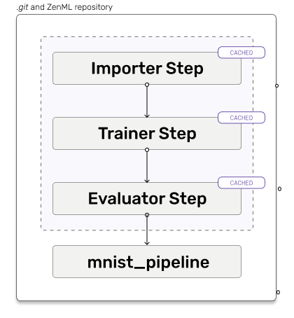

# Quickstart

Our goal here is to help you to get the first practical experience with ZenML and give you a brief overview on 
some basic functionalities of ZenML. We'll create a training pipeline for the [MNIST](http://yann.lecun.com/exdb/mnist/) dataset.

If you want to run this notebook in an interactive environment, feel free to run it in a 
[Google Colab](https://colab.research.google.com/github/zenml-io/zenml/blob/main/examples/quickstart/quickstart.ipynb) 
or view it on [GitHub](https://github.com/zenml-io/zenml/tree/main/examples/quickstart) directly.

## Install and initialize

```shell
# Install the dependencies for the quickstart
pip install zenml
```

Once the installation is completed, you can go ahead and create your first ZenML repository for your project:

```shell
# Initialize ZenML
zenml init
```

We are building a [sklearn model](https://scikit-learn.org/stable/) in this example, so we need to install that integration:

```shell
zenml integration install sklearn -f
```


We are just using sklearn for the purposes of illustration; ZenML works with any ML library such as PyTorch, Tensorflow, 
HuggingFace, PyTorch Lightning, etc. See our [full list of integrations](../features/integrations.md) for a complete overview.



Now, the setup is completed. For the next steps, just make sure that you are executing the code within your 
ZenML repository.

## Run your first pipeline

In the code that follows, you can see that we are defining the various steps of our pipeline. Each step is 
decorated with `@step`. The pipeline in turn is decorated with the `@pipeline` decorator.


Note that type hints are used for inputs and outputs of each step. The routing of step outputs
to step inputs is handled within the pipeline definition.




```python
import numpy as np
from sklearn.base import ClassifierMixin

from zenml.integrations.sklearn.helpers.digits import (
    get_digits,
    get_digits_model,
)
from zenml.pipelines import pipeline
from zenml.steps import Output, step


@step
def importer() -> Output(
    X_train=np.ndarray, X_test=np.ndarray, y_train=np.ndarray, y_test=np.ndarray
):
    """Loads the digits array as normal numpy arrays."""
    X_train, X_test, y_train, y_test = get_digits()
    return X_train, X_test, y_train, y_test


@step
def trainer(
    X_train: np.ndarray,
    y_train: np.ndarray,
) -> ClassifierMixin:
    """Train a simple sklearn classifier for the digits dataset."""
    model = get_digits_model()
    model.fit(X_train, y_train)
    return model


@step
def evaluator(
    X_test: np.ndarray,
    y_test: np.ndarray,
    model: ClassifierMixin,
) -> float:
    """Calculate the accuracy on the test set"""
    test_acc = model.score(X_test, y_test)
    print(f"Test accuracy: {test_acc}")
    return test_acc


@pipeline
def mnist_pipeline(
    importer,
    trainer,
    evaluator,
):
    """Links all the steps together in a pipeline"""
    X_train, X_test, y_train, y_test = importer()
    model = trainer(X_train=X_train, y_train=y_train)
    evaluator(X_test=X_test, y_test=y_test, model=model)


pipeline = mnist_pipeline(
    importer=importer(),
    trainer=trainer(),
    evaluator=evaluator(),
)
pipeline.run()
```


This code block should work 'as is'. Copy paste it into your IDE and run it!


If you had a hiccup or you have some suggestions/questions regarding our framework, you can always check 
[our Github](https://github.com/zenml-io/zenml) or even better join us on 
[our Slack channel](https://zenml.io/slack-invite).

## Wait, how is this useful?

The above code looks like it is yet another standard pipeline framework that added to your work, but there is a lot 
going on under the hood that is mighty helpful:

- All data is versioned and tracked as it flows through the steps.
- All parameters and return values are tracked by a central metadata store that you can later query.
- Individual step outputs are now cached, so you can swap out the trainer for other implementations and iterate fast.

With just a little more work, one can:

- Deploy this pipeline [in production on the cloud](../features/guide-aws-gcp-azure.md) with a production ready orchestrator like Kubeflow.
- Useful metadata like [statistics, schemas and drifts](../guides/common-usecases/visualizers.md) can be inferred from the model and data flowing through these steps.
- Models trained this way can be set up to be easily deployed, run batch inference on, or set up in continuous 
training loops with automatic deployments.

Best of all: We let you and your infra/ops team decide what the underlying tools are to achieve all this.

## Next Steps?

Normally at this point in a quickstart, you'd like to learn more about what the product has to offer (if the docs 
have succeeded in making you feel so). There are essentially two choices you can make:

- If your work involves a use-case that is fairly 'standard' training/inference/deployment, start with 
the [Class-based API](../guides/class-based-api/) guide.
- If you have a more complex workflow that requires more control over your pipelines, start with 
the [Functional API](../guides/functional-api/) guide.

If you're not sure, pick any one of the above. They are the easiest way to learn how ZenML enables MLOps.

However, for those of you who don't want to read guides, then feel free to start perusing the docs with 
the [Core Concepts](core-concepts.md) before the guides. See you there!
