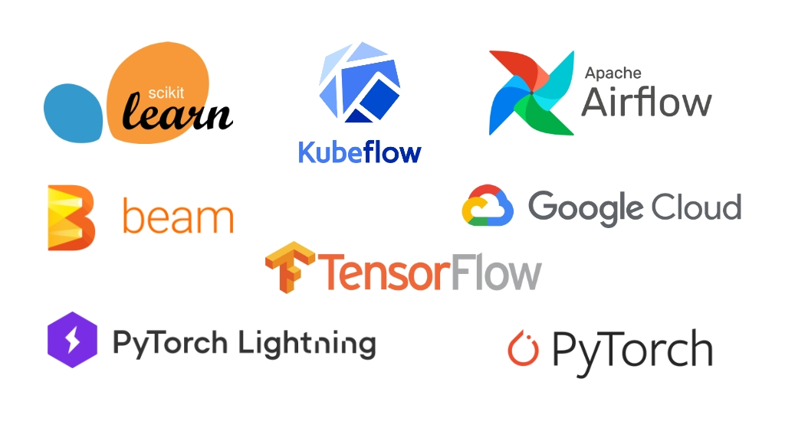

# ZenML

**ZenML** is an extensible, open-source MLOps framework to create production-ready machine learning pipelines. Built 
for data scientists, it has a simple, flexible syntax, is **cloud-** and **tool-agnostic**, and has 
interfaces/abstractions that are catered towards ML workflows.

At its core, **ZenML pipelines execute ML-specific workflows** from sourcing data to splitting, preprocessing,
training, all the way to the evaluation of results and even serving. There are many built-in features to support 
common ML development tasks. ZenML is not here to replace the great tools that solve these individual problems. 
Rather, it **integrates natively with popular ML tooling** and gives standard abstraction to write your workflows.

## Who is ZenML for?

ZenML is created for data science and machine learning teams that are not only engaged in training models, but also in 
putting them out in production. Production can mean many things, but examples could be:

* If you are using a model to generate analysis periodically for any business process.
* If you are using models as a software service to serve predictions.
* If you are trying to understand patterns using machine learning for any business process.

In all of the above, there will be a team that is engaged with creating, deploying, managing and improving the entire
process. You always want the best results, the best models, and the most robust and reliable results. This is where
ZenML can help.

In terms of user personas, ZenML is created for **producers of the models.** This role is classically known as 
'data scientist' in the industry and can range from research-minded individuals to more engineering-driven people.
The goal of ZenML is to enable these practitioners to **own** their models from experimentation phases to deployment 
and beyond.

## Why should I use ZenML?

ZenML pipelines are designed to be written early on in the development lifecycle. Data scientists can explore their 
pipelines as they develop towards production, switching stacks from local to cloud deployments with ease. You can 
read more about why we started building ZenML [on our blog](https://blog.zenml.io/why-zenml/). By using ZenML in the 
early stages of your project, you get the following benefits:

* **Reproducibility** of training and inference workflows
* A **simple and clear** way to represent the steps of your pipeline in code
* **Plug-and-play integrations**: bring all your favorite tools together
* Easy switching between local and cloud stacks
* Painless **deployment and configuration** of infrastructure
* **Scale up** your stack transparently and logically to suit your training and deployment needs

## What's special about ZenML?

While there are other workflow orchestration tools, ZenML is built because we envisioned the following:

* We wanted a tool that is **flexible**: Simple Python functions can be converted into workflow steps.
* We wanted a tool that is **simple:** You can run it locally and with a few commands can get it running on the 
cloud with minimum changes.
* We wanted to create a **machine learning specific** workflow tool: With ML, workflows need to focus not just 
on tasks, but also data like models, parameters, statistics and other ML-specific artifacts. This way we can solve 
machine learning specific problems and create a more understandable API.
* We wanted a tool that can **integrate** with the exploding ML/MLOps landscape: It is so confusing right now because 
every team that is doing serious ML has their own way of doing things. This is completely fine, but we built ZenML to 
be a connector and gateway to many other amazing tools for specific problems in machine learning.

In addition, ZenML uses the following modern concepts in pipeline design to bring the latest best practices to MLOps:

### Pipelines As Experiments

We built ZenML because we could not find an easy framework that translates the patterns observed in the research phase 
with Jupyter notebooks into a production-ready ML environment. ZenML follows the paradigm of Pipelines as Experiments, 
meaning ZenML pipelines are designed to be written early on the development lifecycle, where the users can explore 
their pipelines as they develop towards production.

## Developer Experience

Modern developer experience is an underrated aspect of a ZenML is built to give developers a similar experience as 
other awesome frameworks in other domains like [HuggingFace](https://huggingface.co) and 
[PyTorch Lightning](https://www.pytorchlightning.ai), but geared towards MLOps.

## Data-centric Pipelines

Going from model-centric to data-centric AI has been a theme of the last years, popularized by Andrew Ng 
(see video below). ZenML is built with data-centric pipelines in mind. Concretely, this means:

* It allows defining data flow pipelines, rather than task dependencies. (Read this 
[awesome post](https://web.archive.org/web/20211209192245/https://rillabs.org/posts/workflows-dataflow-not-task-deps) by RIL Labs to see why that matters.)
* It allows developers to explore data artifacts natively in interactive environments.
* It exposes first class data comparison mechanisms and tracks relevant metadata automatically.



## The Right Abstractions

While there are other pipelining solutions for machine learning experiments, **ZenML** is focused on the following:

* Simplicity.
* Reproducibility.
* Integrations.

We wanted to focus on abstractions that can address different needs throughout the lifecycle of the ML process.

## The Modular MLOps Stack: Integrations

It is important that we integrate within the various tools of the fragmented MLOps landscape. ZenML is fully 
extensible, so you are free to add whichever custom tooling you currently use. We already integrate with a number 
of the most commonly used parts an ML stack: checkout our supported integrations [here](../features/integrations.md).

An additional important benefit of the stack is the infrastructure and tooling agnostic code that is achieved. With
ZenML you can write your code once and simply go from local to remote stack with just a few CLI commands. You can also 
almost seamlessly switch between tool or cloud providers with minimal changes in
the code. 
