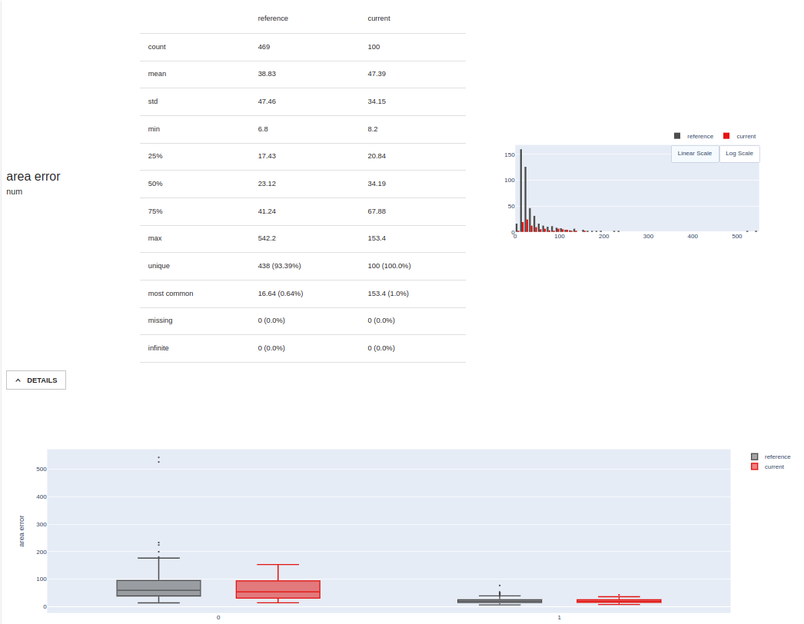

The Evidently [Data Validator](./data-validators.md) flavor
provided with the ZenML integration uses [Evidently](https://evidentlyai.com/)
to perform data quality, data drift, model drift and model performance analyses
and generate reports. The reports can be used to implement automated corrective
actions in your pipelines or to render interactive representations for further
visual interpretation, evaluation and documentation.

## When would you want to use it?

[Evidently](https://evidentlyai.com/) is an open-source library that you can use
to monitor and debug machine learning models by analyzing the data that they
use through a powerful set of data profiling and visualization features.
Evidently currently works with tabular data in `pandas.DataFrame` or CSV file
formats and can handle both regression and classification tasks.

You should use the Evidently Data Validator when you need the following data
and/or model validation features that are possible with Evidently:

* [Data Quality](https://docs.evidentlyai.com/reports/data-quality):
provides detailed feature statistics and a feature behavior overview for a
single dataset. It can also compare any two datasets. E.g. you can use it to
compare train and test data, reference and current data, or two subgroups of one
dataset.

* [Data Drift](https://docs.evidentlyai.com/reports/data-drift):
helps detects and explore feature distribution changes in the input data by
comparing two datasets with identical schema.

* [Numerical Target Drift](https://docs.evidentlyai.com/reports/num-target-drift)
and [Categorical Target Drift](https://docs.evidentlyai.com/reports/categorical-target-drift):
helps detect and explore changes in the target function and/or model predictions
by comparing two datasets where the target and/or prediction columns are
available.

* [Regression Performance](https://docs.evidentlyai.com/reports/reg-performance),
[Classification Performance](https://docs.evidentlyai.com/reports/classification-performance),
or [Probabilistic Classification Performance](https://docs.evidentlyai.com/reports/probabilistic-classification-performance):
evaluate the performance of a model by analyzing a single dataset where both the
target and prediction columns are available. It can also compare it to the past
performance of the same model, or the performance of an alternative model by
providing a second dataset.

You should consider one of the other [Data Validator flavors](./data-validators.md#data-validator-flavors)
if you need a different set of data validation features.

## How do you deploy it?

The Evidently Data Validator flavor is included in the Evidently ZenML
integration, you need to install it on your local machine to be able to register
an Evidently Data Validator and add it to your stack:

```shell
zenml integration install evidently -y
```

The Data Validator stack component does not have any configuration parameters.
Adding it to a stack is as simple as running e.g.:

```shell
# Register the Evidently data validator
zenml data-validator register evidently_data_validator --flavor=evidently

# Register and set a stack with the new data validator
zenml stack register custom_stack -dv evidently_data_validator ... --set
```

## How do you use it?

Evidently's profiling functions take in a `pandas.DataFrame` dataset or a pair
of datasets and generate results in the form of a `Profile` object containing
all the relevant information, or as a `Dashboard` visualization.

One of Evidently's notable characteristics is that it only requires datasets as
input. Even when running model performance comparison analyses, no model
needs to be present. However, that does mean that the input data needs to
include additional `target` and `prediction` columns for some profiling reports
and you have to include additional information about the dataset columns in the
form of [column mappings](https://docs.evidentlyai.com/features/dashboards/column_mapping).
Depending on how your data is structured, you may also need to include additional
steps in your pipeline before the data validation step to insert the additional
`target` and `prediction` columns into your data. This may also require
interacting with one or more models.

There are three ways you can use Evidently in your ZenML pipelines that allow
different levels of flexibility:

* instantiate, configure and insert [the standard `EvidentlyProfileStep`](#the-evidently-standard-step)
shipped with ZenML into your pipelines. This is the easiest way and the
recommended approach, but can only be customized through the supported step
configuration parameters.
* call the data validation methods provided by [the Evidently Data Validator](#the-evidently-data-validator)
in your custom step implementation. This method allows for more flexibility
concerning what can happen in the pipeline step, but you are still limited to the
functionality implemented in the Data Validator.
* [use the Evidently library directly](#call-evidently-directly) in
your custom step implementation. This gives you complete freedom in how you are
using Evidently's features.

Outside of the pipeline workflow, you can use [the ZenML Evidently visualizer](#the-evidently-zenml-visualizer)
to display and interact with the Evidently dashboards generated by your pipelines. 

### The Evidently standard step

ZenML wraps the Evidently functionality in the form of a standard
`EvidentlyProfileStep` step. You select which reports you want to generate in
your step by passing a list of string identifiers into the `EvidentlyProfileConfig`:

```python
from zenml.integrations.evidently.steps import (
    EvidentlyProfileConfig,
    evidently_profile_step,
)

drift_detector = evidently_profile_step(
    step_name="drift_detector",
    config=EvidentlyProfileConfig(
        profile_sections=[
            "datadrift",
        ],
        verbose_level=1,
    ),
)
```

The step can then be inserted into your pipeline where it can take in two
datasets, e.g.:

```python
@pipeline(required_integrations=[EVIDENTLY, SKLEARN])
def drift_detection_pipeline(
    data_loader,
    data_splitter,
    drift_detector,
    drift_analyzer,
):
    """Links all the steps together in a pipeline"""
    data = data_loader()
    reference_dataset, comparison_dataset = data_splitter(data)
    drift_report, _ = drift_detector(
        reference_dataset=reference_dataset,
        comparison_dataset=comparison_dataset,
    )
    drift_analyzer(drift_report)

pipeline = drift_detection_pipeline(
    data_loader=data_loader(),
    data_splitter=data_splitter(),
    drift_detector=drift_detector,
    drift_analyzer=analyze_drift(),
)
pipeline.run()
```

Possible report options supported by Evidently are:

- "datadrift"
- "categoricaltargetdrift"
- "numericaltargetdrift"
- "dataquality"
- "classificationmodelperformance"
- "regressionmodelperformance"
- "probabilisticmodelperformance"

As can be seen from the [step definition](https://apidocs.zenml.io/latest/api_docs/integrations/#zenml.integrations.evidently.steps.evidently_profile.EvidentlyProfileStep), the step takes in
a reference dataset and a comparison dataset required for data drift and
model comparison reports. It returns an Evidently `Profile` object and a
`Dashboard` rendered as an HTML string:

```python
class EvidentlyProfileStep(BaseDriftDetectionStep):
    """Step implementation implementing an Evidently Profile Step."""

    def entrypoint(  # type: ignore[override]
        self,
        reference_dataset: pd.DataFrame,
        comparison_dataset: pd.DataFrame,
        config: EvidentlyProfileConfig,
    ) -> Output(  # type:ignore[valid-type]
        profile=Profile, dashboard=str
    ):
        ...
```

If needed, Evidently column mappings can be passed into the step configuration,
but as `zenml.integrations.evidently.steps.EvidentlyColumnMapping` objects,
which have the exact same structure as `evidently.pipeline.column_mapping.ColumnMapping`:

```python
from zenml.integrations.evidently.steps import (
    EvidentlyColumnMapping,
    EvidentlyProfileConfig,
    evidently_profile_step,
)

drift_detector = evidently_profile_step(
    step_name="drift_detector",
    config=EvidentlyProfileConfig(
        column_mapping=EvidentlyColumnMapping(
            target="class", prediction="class_prediction"
        ),
        profile_sections=[
            "categoricaltargetdrift",
            "numericaltargetdrift",
            "datadrift",
        ],
        verbose_level=1,
    ),
)
```

You should consult [the official Evidently documentation](https://docs.evidentlyai.com/reports)
for more information on what each report is useful for and what data columns it
requires as input.

The `EvidentlyProfileConfig` step configuration also allows for additional
profile options and [dashboard options](https://docs.evidentlyai.com/user-guide/customization)
to be passed to the `Profile` and `Dashboard` constructors e.g.:


```python
from zenml.integrations.evidently.steps import (
    EvidentlyProfileConfig,
)

config=EvidentlyProfileConfig(
    column_mapping=EvidentlyColumnMapping(
        target="class", prediction="class_prediction"
    ),
    profile_sections=[
        "categoricaltargetdrift",
        "numericaltargetdrift",
        "datadrift",
    ],
    verbose_level=1,
    dashboard_options = [
        (
            "evidently.options.ColorOptions",{
                "primary_color": "#5a86ad",
                "fill_color": "#fff4f2",
                "zero_line_color": "#016795",
                "current_data_color": "#c292a1",
                "reference_data_color": "#017b92",
            }
        ),
    ],
)
```

You can view [the complete list of configuration parameters](https://apidocs.zenml.io/latest/api_docs/integrations/#zenml.integrations.evidently.steps.evidently_profile.EvidentlyProfileConfig) in the API
docs.

You can also check out our examples pages for working examples that use the
Evidently standard step:

- [Drift Detection with Evidently](https://github.com/zenml-io/zenml/tree/main/examples/evidently_drift_detection)

### The Evidently Data Validator

The Evidently Data Validator implements the same interface as do all Data
Validators, so this method forces you to maintain some level of compatibility
with the overall Data Validator abstraction, which guarantees an easier
migration in case you decide to switch to another Data Validator.

All you have to do is call the Evidently Data Validator methods when you need
to interact with Evidently to generate data profiles, e.g.:

```python

import pandas as pd
from evidently.model_profile import Profile
from evidently.pipeline.column_mapping import ColumnMapping
from zenml.integrations.evidently.data_validators import EvidentlyDataValidator
from zenml.steps import Output, step

@step
def data_drift_detection(
    reference_dataset: pd.DataFrame,
    comparison_dataset: pd.DataFrame,
) -> Output(
    profile=Profile, dashboard=str
):
    """Custom data drift detection step with Evidently

    Args:
        reference_dataset: a Pandas DataFrame
        comparison_dataset: a Pandas DataFrame of new data you wish to
            compare against the reference data

    Returns:
        profile: Evidently Profile generated for the data drift
        dashboard: HTML report extracted from an Evidently Dashboard
            generated for the data drift
    """

    # validation pre-processing (e.g. dataset preparation) can take place here

    data_validator = EvidentlyDataValidator.get_active_data_validator()
    profile, dashboard = data_validator.data_profiling(
        dataset=reference_dataset,
        comparison_dataset=comparison_dataset,
        profile_list=[
            "categoricaltargetdrift",
            "numericaltargetdrift",
            "datadrift",
        ],
        column_mapping=ColumnMapping(
            target="class",
            prediction="class_prediction"
        ),
        verbose_level=1,
    )

    # validation post-processing (e.g. interpret results, take actions) can happen here

    return [profile, dashboard.html()]
```

Have a look at [the complete list of methods and parameters available in the `EvidentlyDataValidator` API](https://apidocs.zenml.io/latest/api_docs/integrations/#zenml.integrations.evidently.data_validators.evidently_data_validator.EvidentlyDataValidator) in the API docs.

### Call Evidently directly

You can use the Evidently library directly in your custom pipeline steps, and
only leverage ZenML's capability of serializing, versioning and storing the
`Profile` objects in its Artifact Store, e.g.:

```python

import pandas as pd
from evidently.model_profile import Profile
from evidently.model_profile.sections import DataQualityProfileSection
from evidently.pipeline.column_mapping import ColumnMapping
from zenml.steps import step

@step
def data_quality_profiler(
    dataset: pd.DataFrame,
) -> Profile:
    """Custom data quality profiler step with Evidently

    Args:
        dataset: a Pandas DataFrame

    Returns:
        Evidently Profile generated for the dataset
    """

    # validation pre-processing (e.g. dataset preparation) can take place here

    profile = Profile(sections=[DataQualityProfileSection])
    profile.calculate(
        reference_data=dataset,
    )

    # validation post-processing (e.g. interpret results, take actions) can happen here

    return profile
```

### The Evidently ZenML Visualizer

In the [post-execution workflow](../../developer-guide/steps-pipelines/inspecting-pipeline-runs.md),
you can load and render the Evidently dashboards generated and returned by your
pipeline steps by means of the ZenML Evidently Visualizer, e.g.:

```python
from zenml.integrations.evidently.visualizers import EvidentlyVisualizer
from zenml.post_execution import get_pipeline

def visualize_results(pipeline_name: str, step_name: str) -> None:
    pipeline = get_pipeline(pipeline=pipeline_name)
    evidently_outputs = pipeline.runs[-1].get_step(step=step_name)
    EvidentlyVisualizer().visualize(evidently_outputs)

if __name__ == "__main__":
    visualize_results("drift_detection_pipeline", "drift_detector")
```

The Evidently dashboards will be opened as tabs in your browser, or displayed
inline in your Jupyter notebook, depending on where you are running the code:



