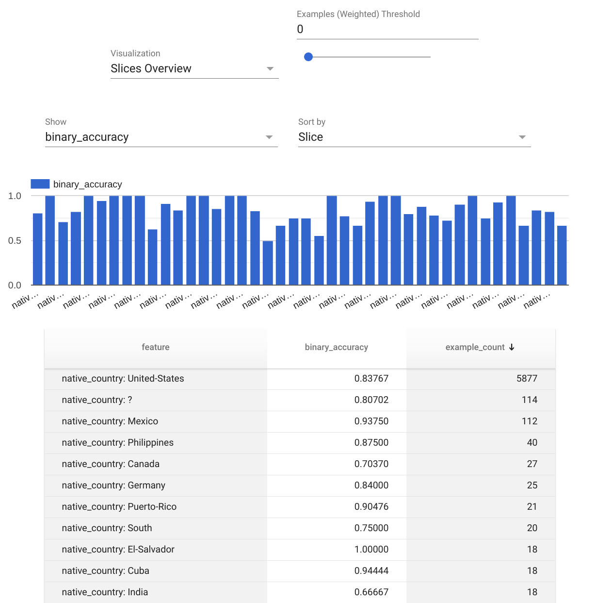
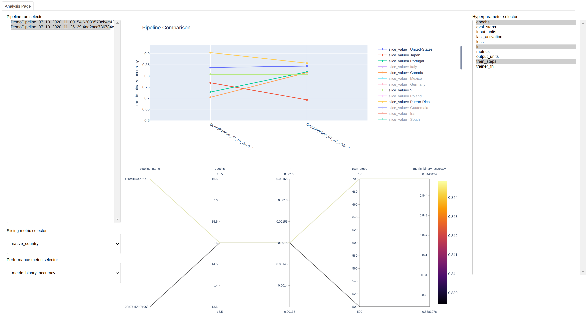

# Training Pipeline

A Training Pipeline is a general-purpose training pipeline for most ML training runs. One pipeline runs one experiment on a single datasource. It contains the following mandatory steps:

* `data`
* `split`
* `preprocesser`
* `trainer`

Please see more details at `zenml.core.pipelines.training_pipipeline.TrainingPipeline`.

## Analyze results
Once the TrainingPipeline is complete, ZenML provides you multiple built-in ways to analyze the outcome of 
your run. 

### Statistics
Starting from the very beginning, the first thing that you can check is the statistics of your dataset. 
The results will take your split configuration into consideration, so you will also be able to see whether 
you have selected a desired and fair split.

```python
pipeline.view_statistics()
```

This function utilizes the [Tensorflow Data Validation](https://www.tensorflow.org/tfx/guide/tfdv) library to 
display some calculated statistics for your data.


### Evaluation
If a [TFMAEvaluator](../steps/evaluator.md) step has been added to the pipeline, the following function will 
automatically generate visualizations for some important post-training evaluation:

```python
pipeline.evaluate()
```

Once executed, a new browser page will be created to run an evaluation notebook. 
Within this notebook, there are two distinct tools, namely [Tensorboard](https://www.tensorflow.org/tensorboard) and 
[Tensorflow Model Analysis](https://github.com/tensorflow/model-analysis). 

When it comes to evaluating the training process of a deep learning model, Tensorboard is probably one of 
the best visualization tools around.


In addition to Tensorboard,  the evaluation notebook also features Tensorflow Model Analysis (TFMA) 
that provides an analysis with configurable [post-training metrics and slices](../steps/evaluator.md).



```{warning}
Currently, the `evaluate()` function only works with the TFMAEvaluatorStep.
```

### Comparing pipeline results
Evaluation however should go beyond individual pipeline executions. As your pipelines are already grouped 
together in a repository, you can compare pipelines with each other. The direct comparison will let you 
judge the performance and results of different configurations against each other.

```python
from zenml.repo import Repository

repo = Repository.get_instance()
repo.compare_training_pipelines()
```

This will launch the `compare` tool that is built exclusively for TrainingPipeline comparisons. It is a local 
web app that helps compare different pipelines.



On the left hand side, you can see the pipeline runs. On the right hand side, you can see all the 
hyperparameters used in these pipelines. You can use the widgets to toggle different configurations to 
compare the pipelines across metrics and slices of data and across hyper-parameter