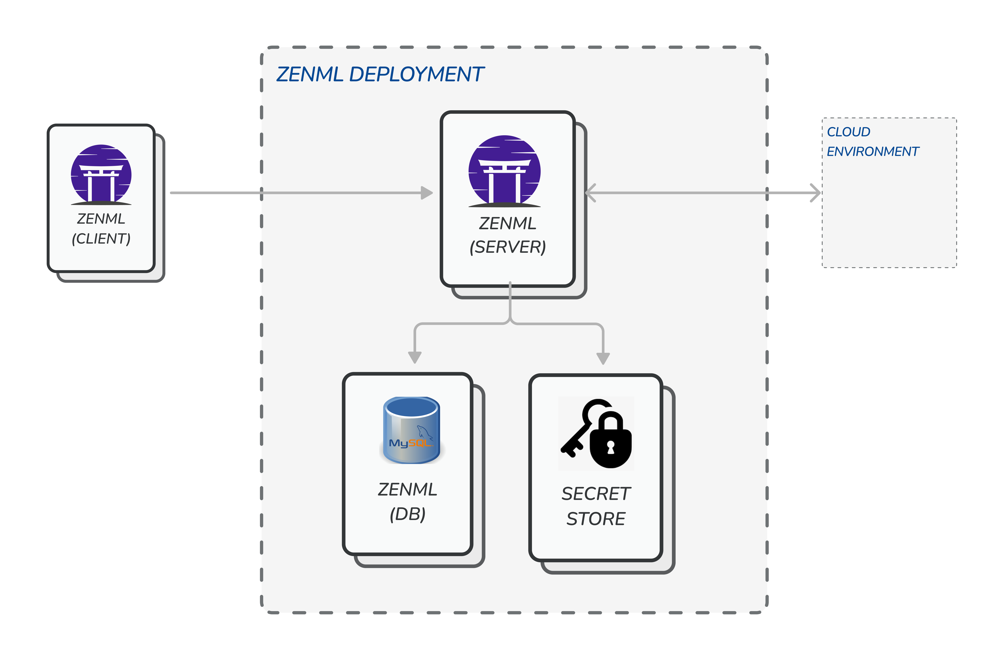

# Deploy ZenML

### The components of a ZenML Deployment

A ZenML deployment typically looks like this:

<figure><figcaption></figcaption></figure>

* An **HTTP server** that exposes a RESTful API
  * the client's machine connects to this server to read and write the stack configurations to allow collaboration.
  * the individual orchestrators and step operators communicate with the server to write and track the pipeline run data.
  * the dashboard is served from the server to give a UI interface to all of the metadata.
* An **SQL database** as the backend to track configurations and metadata.
  * For production, currently, only MySQL is supported
* An optional **secrets management service** that is used as a backend for the ZenML secrets store.

Choose the most appropriate deployment strategy for you out of the following options to get started with the deployment

<table data-view="cards"><thead><tr><th></th><th></th><th></th><th data-type="content-ref"></th></tr></thead><tbody><tr><td>Deploy to Kubernetes on AWS, GCP or Azure with the ZenML CLI</td><td></td><td></td><td><a href="deployment-using-the-cli.md">deployment-using-the-cli.md</a></td></tr><tr><td>Deploy anywhere using Docker</td><td></td><td></td><td><a href="deploy-with-docker.md">deploy-with-docker.md</a></td></tr><tr><td>Deploy to any Kubernetes cluster with Helm</td><td></td><td></td><td><a href="deploy-with-helm.md">deploy-with-helm.md</a></td></tr></tbody></table>

