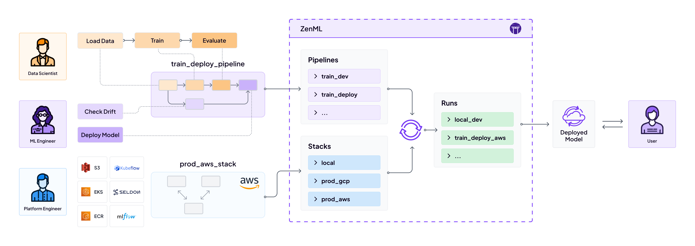
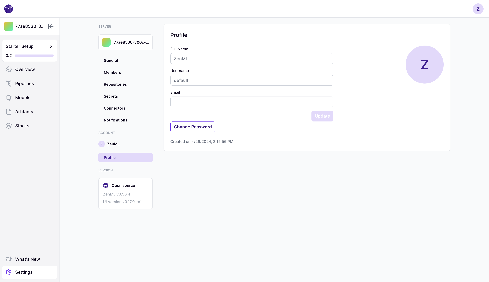
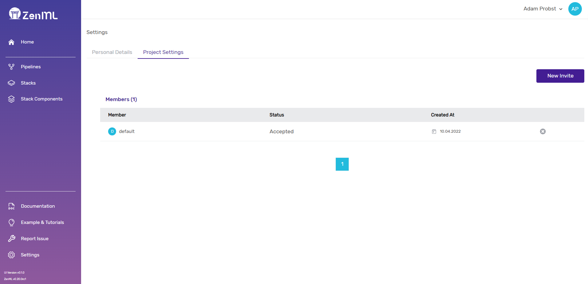
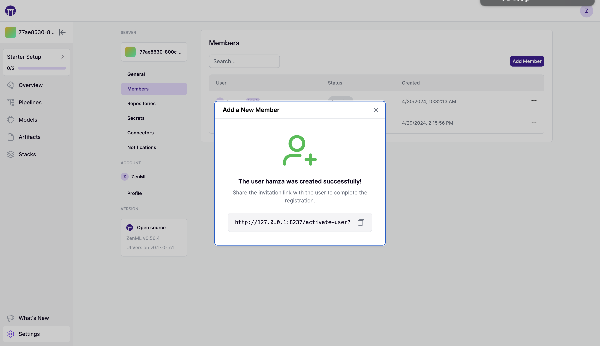
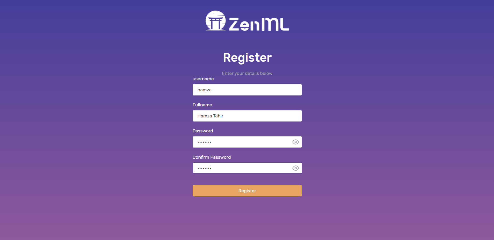


This is an older version of the ZenML documentation. To read and view the latest version please [visit this up-to-date URL](https://docs.zenml.io).



# User management

Collaboration is a vital aspect of any MLOps team, as it often requires bringing together individuals with diverse
skills and expertise to create a cohesive and effective workflow for machine learning projects. A successful MLOps team
needs seamless collaboration between data scientists, engineers, and DevOps professionals to develop, train, deploy, and
maintain machine learning models. This can be challenging, as it requires coordination across various tools, processes,
and frameworks.



This is where ZenML excels: providing a collaborative platform that goes beyond your team and includes the community.
With ZenML, you can effortlessly work together with others, sharing resources and insights to achieve your shared goals.
Removing barriers to collaboration enables teams to iterate on ideas and problems more efficiently, leading to faster
results.

* With a deployed ZenML instance, users can create their own teams and project structures. They can easily share
  pipelines, runs, stacks, and other resources, streamlining the workflow and promoting teamwork.
* On the other hand, there's the ZenML Hub. Here, you can browse a collection of community-driven solutions, share your
  own code, and collaborate with fellow community members.

This section will center on managing users, their roles, and permissions within a deployed ZenML instance, while
the [ZenML Hub](../../user-guide/advanced-guide/leverage-community-contributed-plugins.md)

## Team administration and user management

After you have [deployed ZenML and connected your local client with the deployment](/docs/book/platform-guide/set-up-your-mlops-platform/deploy-zenml/deploy-zenml.md), 
you can go ahead and start adding your teammates as users.

By default, all users have `Administrator` permissions throughout the ZenML dashboard. However, one user can always
choose to share or not share their stacks.

### Personal Settings

You can go to the settings page from the bottom of the sidebar or top right of the header, and edit your details below:



### Workspace Settings



In the project settings, you can see a list of users who are invited or signed up for this ZenML deployment. You can
invite a new user here with a unique username. The dashboard will generate a new token for you in the form of a URL that
you can copy and send to your teammate.



You can also mimic this behavior in a connected ZenML with the following commands:

```shell
zenml user create USERNAME
```

This creates a new user. If an empty password is configured, an activation token is generated and a link to the
dashboard is provided where the user can sign up. d

### Sign up

From the invitation URL, a user can sign up as expected:



And that's it 🚀. We went from a simple ZenML pip install to a fully-fledged multi-user, cloud deployment of ZenML.

Now, the next steps are to create stacks
with [components from the component gallery](/docs/book/user-guide/component-guide/component-guide.md), or dive
into [advanced topics](/docs/book/user-guide/advanced-guide/advanced-guide.md) to learn about the inner workings 
of ZenML!

## Permissions

The following global permissions are available within ZenML.

**read**: Read permission on all resources. **write**: Write permission on all resources. **me**: Permission for a user
to edit their own user metadata (username, password, etc.)

To view the available permissions through the CLI simply run:

`zenml permission list`

## Roles

Users are granted **Permissions** through **Roles**. You can list all roles with their associated permissions by
running.

`zenml role list`

### Default Roles

By default, ZenML comes with two roles.

**admin**: The admin role grants all permissions globally. (Permissions: read, write, me )

**guest**: The guest role lets users change their own user data and grants general global read access. (Permissions:
read, me )

### Custom Roles

You can also create your own roles through the CLI:

`zenml role create <ROLE_NAME> -p read -p write -p me`

## Assigning roles to users

Roles can be assigned to users through the CLI:

`zenml role assign <ROLE_NAME> --user <USER_NAME>`

alternatively, this can also be done during user creation

`zenml user create <USER_NAME> --role <ROLE_NAME>`


By default, user creation through the UI will grant the user `admin` rights. This default behavior will change in the
next iteration of the Dashboard as the role will be selectable during user creation and in the User settings menu.


## Listing active role assignments

If you want to inspect which roles have been assigned to which users, simply run:

`zenml role assignment list`

### Limitations

* For the time being, all roles apply permissions locally. This may change in the future. Feel free to let us know
  on [Slack](https://zenml.slack.com/join/shared\_invite/zt-t4aw242p-K6aCaUjhnxNOrLR7bcAb7g#/shared-invite/email) or
  through our [Roadmap](https://zenml.hellonext.co/roadmap) if this is important for you.
* Permissions and roles only become relevant if you are running through
  a [deployed ZenML Server](https://docs.zenml.io/getting-started/deploying-zenml). In local settings with a direct
  connection to a SQLite Database user access is not limited/granted by roles.

<!-- For scarf -->
<figure></figure>
