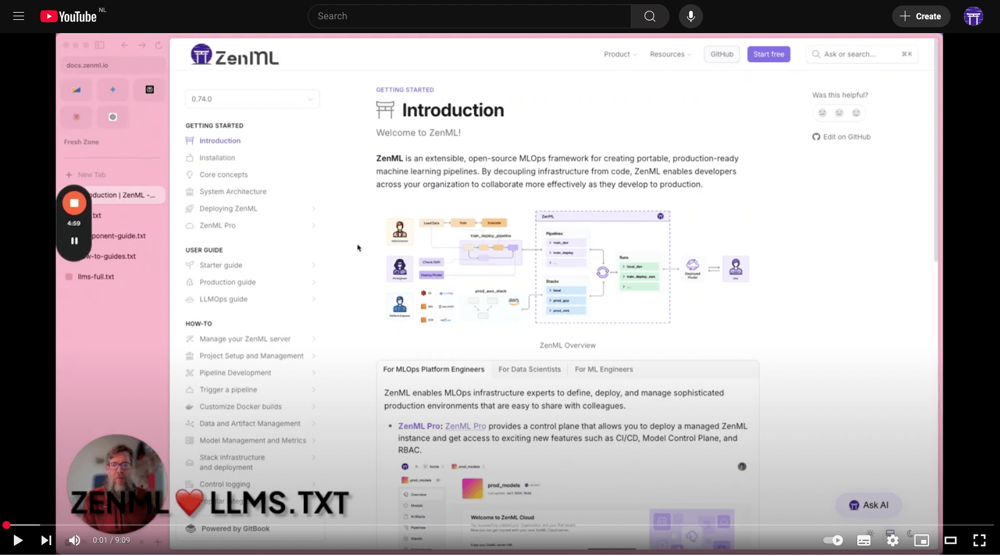

## About llms.txt
The llms.txt file format was proposed by [llmstxt.org](https://llmstxt.org/) as a standard way to provide information to help LLMs answer questions about a product/website. From their website:

> We propose adding a /llms.txt markdown file to websites to provide LLM-friendly content. This file offers brief background information, guidance, and links to detailed markdown files. llms.txt markdown is human and LLM readable, but is also in a precise format allowing fixed processing methods (i.e. classical programming techniques such as parsers and regex).

Our `llms.txt` file is a summary of the ZenML documentation that can be used to answer basic questions about ZenML. The base version is available at https://zenml.io/llms.txt. Read on to learn about additional files, where they are hosted and how to use them.

## Available llms.txt files

Owing to ZenML's vast documentation, we have created multiple `llms.txt` files that cover different parts of the documentation. You can find them on ZenML's [llms.txt HuggingFace dataset](https://huggingface.co/datasets/zenml/llms.txt).

| File | Tokens | Purpose |
|------|--------|---------|
| llms.txt | 120k | Basic ZenML concepts and getting started information |
| component-guide.txt | 180k | Details about ZenML integrations and stack components |
| how-to-guides.txt | 75k | Summarized how-to guides for common ZenML workflows |
| llms-full.txt | 600k | Complete, unabridged ZenML documentation |

1. [llms.txt](https://zenml.io/llms.txt)

**Tokens**: 120k

This is where you should start. It covers the [User Guides](https://docs.zenml.io/user-guides/starter-guide) and the [Getting Started](../getting-started/installation.md) section of the ZenML documentation, unsummarized, and can be used for answering basic questions about ZenML. This file can also be used alongside other domain-specific files in cases where you need better answers.

2. [component-guide.txt](https://zenml.io/component-guide.txt)

**Tokens**: 180k

This file covers all the [stack components in ZenML](https://docs.zenml.io/stacks), unsummarized, and can be used when you want to find answers pertaining to all of our integrations, how to configure/use them and more.

3. [how-to-guides.txt](https://zenml.io/how-to-guides.txt)

**Tokens**: 75k

This file contains all the doc pages in the [how-to section of our documentation](../how-to/manage-zenml-server/README.md); each page summarized to contain all useful information. For most cases, the how-to guides can answer all process questions.

4. [llms-full.txt](https://zenml.io/llms-full.txt)

**Tokens**: 600k

The whole ZenML documentation in its glory, un-summarized. Use this for the most accurate answers on ZenML.

## How to use the llms.txt file

Below are some tips and recommendations for using the `llms.txt` files.

- Choose the file that pertains to the part of ZenML you want answers for.
- In every file, the text comes prefixed with the filename which means you can ask your LLM to return file references when answering questions. This is particularly helpful when using the how-to guides which don't the full text, but rather a summary of it.
- You can mix two files, if your context window allows, to get more accurate results.
- While prompting, make sure you tell the LLM to not return an answer that it can't directly source to context within the given text file, to avoid getting hallucinated answers.
- Use a model with a large context window, like the Gemini models as the token count is high.

