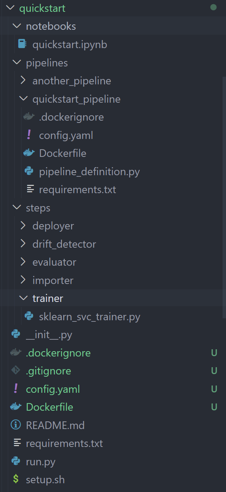

# External Integration Guide




One of the main goals of ZenML is to find some semblance of order in the ever-growing MLOps landscape. ZenML already provides [numerous integrations](https://zenml.io/integrations) into many popular tools, and allows you to [extend ZenML](../mlops\_stacks/extending.md) in order to fill in any gaps that are remaining.\
\
However, what if you want to make your extension of ZenML part of the main codebase, to share it with others? If you are such a person, e.g., a tooling provider in the ML/MLOps space, or just want to contribute a tooling integration to ZenML, this guide is intended for you.

## Step 1: Categorize your integration

In [Extending ZenML](../mlops\_stacks/extending.md), we already looked at the categories and abstractions that core ZenML defines. In order to create a new integration into ZenML, you would need to first find the categories that your integration belongs to. The list of categories can be found on [this page](../mlops\_stacks/extending.md).

Note that one integration may belong to different categories: For example, the cloud integrations (AWS/GCP/Azure) contain [container registries](../mlops\_stacks/container\_registries/overview.md), [artifact stores](../mlops\_stacks/artifact\_stores/overview.md), [metadata stores](../mlops\_stacks/metadata\_stores/overview.md), etc.

## Step 2: Create individual stack components

Each category selected above would correspond to a [stack component](../developer-guide/stacks-profiles-repositories/stacks\_profiles\_repositories.md). You can now start developing these individual stack components by following the detailed instructions on each stack component page. You may want to first register your stack components with the `zenml <STACK_COMPONENT> flavor register` command. E.g., when [developing an orchestrator](../mlops\_stacks/orchestrators/custom.md) you can use:

```
zenml orchestrator flavor register <THE-SOURCE-PATH-OF-YOUR-ORCHESTRATOR>
```

See the docs on extensibility of the different components [here ](../mlops\_stacks/extending.md)or get inspired by the many integrations that are already implemented, for example the mlflow [experiment tracker](https://github.com/zenml-io/zenml/blob/main/src/zenml/integrations/mlflow/experiment\_trackers/mlflow\_experiment\_tracker.py).

## Step 3: Integrate into the ZenML repo

You can now start the process of including your integration into the base ZenML package. Follow this checklist to prepare everything:

### Clone Repo

Once your stack components work as a custom flavor, you can now [clone the main zenml repository](https://github.com/zenml-io/zenml) and follow the [contributing guide](https://github.com/zenml-io/zenml/blob/main/CONTRIBUTING.md) to set up your local environment for develop.

### **Create the integration directory**

All integrations live within [`src/zenml/integrations/`](https://github.com/zenml-io/zenml/tree/main/src/zenml/integrations) in their own subfolder. You should create a new folder in this directory with the name of your integration.

### Define the name of your integration in constants

In [`zenml/integrations/constants.py`](https://github.com/zenml-io/zenml/blob/main/src/zenml/integrations/constants.py), add:

```python
EXAMPLE_INTEGRATION = "<name-of-integration>"
```

This will be the name of the integration when you run:

```shell
 zenml integration install <name-of-integration>
```

Or when you specify pipeline requirements:

```python
from zenml.pipelines import pipeline
from zenml.integrations.constants import <EXAMPLE_INTEGRATION>

@pipeline(required_integrations=[<EXAMPLE_INTEGRATION>])
def custom_pipeline():
    ...
```

### Create the integration class \_\_init\_\_.py

In `src/zenml/integrations/<YOUR_INTEGRATION>/`\_\_`init__.py` you must now create an new class, which is a subclass of the `Integration` class, set some important attributes (`NAME` and `REQUIREMENTS`), and overwrite the `flavors` class method.

```python
from typing import List

from zenml.enums import StackComponentType
from zenml.integrations.constants import <EXAMPLE_INTEGRATION>
from zenml.integrations.integration import Integration
from zenml.zen_stores.models import FlavorWrapper

# This is the flavor that will be used when registering this stack component
#  `zenml <type-of-stack-component> register ... -f example-orchestrator-flavor`
EXAMPLE_ORCHESTRATOR_FLAVOR = <"example-orchestrator-flavor">

# Create a Subclass of the Integration Class
class ExampleIntegration(Integration):
    """Definition of Example Integration for ZenML."""

    NAME = <EXAMPLE_INTEGRATION>
    REQUIREMENTS = ["<INSERT PYTHON REQUIREMENTS HERE>"]

    @classmethod
    def flavors(cls) -> List[FlavorWrapper]:
        """Declare the stack component flavors for the <EXAMPLE> integration."""
        return [
            # Create a FlavorWrapper for each Stack Component this Integration implements
            FlavorWrapper(
                name=EXAMPLE_ORCHESTRATOR_FLAVOR,    
                source="<path.to.the.implementation.of.the.component",      # Give the source of the component implementation
                type=StackComponentType.<TYPE-OF-STACK-COMPONENT>,      # Define which component is implemented
                integration=cls.NAME,
            )
        ]

ExampleIntegration.check_installation() # this checks if the requirements are installed
```

Have a look at the [MLflow Integration](https://github.com/zenml-io/zenml/blob/main/src/zenml/integrations/mlflow/\_\_init\_\_.py) as an example for how it is done.

### Copy your implementation(s)

As said above, each Integration can have implementations for multiple ZenML stack components. Generally the outer repository structure `src/zenml/<stack-component>/<base-component-impl.py` is reflected inside the integration folder: `integrations/<name-of-integration>/<stack-component>/<custom-component-impl.py`

Here, you can now copy the code you created in [Step 2](integrating.md#step-2-create-individual-stack-components) above.&#x20;

### Import in all the right places

The Integration itself must be imported within [`src/zenml/integrations/__init__.py`](https://github.com/zenml-io/zenml/blob/main/src/zenml/integrations/\_\_init\_\_.py)`.`

The Implementation of the individual stack components also needs to be imported within the sub-modules: `src/zenml/integrations/<name-of-integration>/<specifc-component>/__init__.py.`For example, in the mlflow integration, the [experiment tracker](https://github.com/zenml-io/zenml/blob/main/src/zenml/integrations/mlflow/experiment\_trackers/\_\_init\_\_.py) and [deployer](https://github.com/zenml-io/zenml/blob/main/src/zenml/integrations/mlflow/model\_deployers/\_\_init\_\_.py) are imported in the sub-module `__init__.py` files.

## Step 4: Create a PR and celebrate :tada:

You can now [create a PR](https://github.com/zenml-io/zenml/compare) to ZenML and wait for the core maintainers to take a look. Thank you so much for your contribution to the code-base, rock on!
