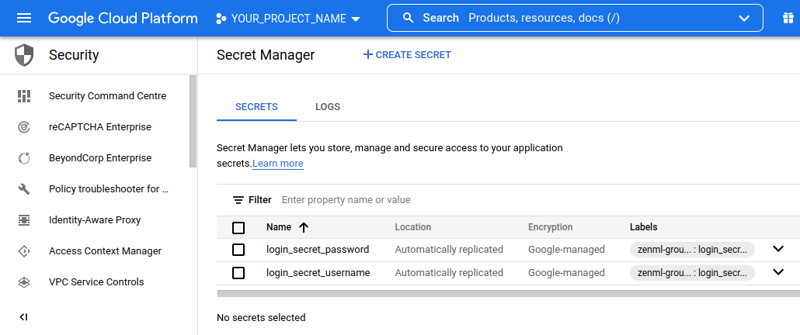

# Secrets Manager

Most projects involving either cloud infrastructure or of a certain complexity
will involve secrets of some kind. For example, you'll use secrets to connecting
to AWS, which requires an `access_key_id` and a `secret_access_key`. On your
local machine this is usually stored in your `~/.aws/credentials` file.
You might find you need to access those secrets from within your Kubernetes
cluster as it runs individual steps. You might also just want a centralized
location for the storage of secrets across your ZenML project. ZenML gives you
all this with the Secret Manager stack component.

# CLI

Check out the CLI commands concerning the secrets manager
[here](https://apidocs.zenml.io/latest/cli/#zenml.cli--setting-up-a-secrets-manager)
. This will help you set up the secrets manager as a stack component.

Once you have the stack component set up in your active stack, you'll be able to
interact with it using the `secrets` CLI group. You'll find the corresponding
CLI docs [here](https://apidocs.zenml.io/latest/cli/#zenml.cli--using-secrets)

# Implementations

## Local Secrets Manager

The local secrets manager is mainly built for the purpose of quickly getting
started with secrets outside any production setting. When using this secret
manager the secrets are store in your
[global zenml config](../developer-guide/repo-and-config.md#config).


The secrets will be saved base64 encoded without any encryption.
This offers **no** security benefits. Anyone with access to your machine will
have unrestricted access to these.


## AWS Secrets Manager

The Integration of the [AWS Secrets Manager](Southernlights#1942) gives you a
direct interface to your Secrets stored on AWS.

### Prerequisites

In order to use the secret manager you will need to have an AWS organization
with a secrets manager. Additionally, you will need to have at least read access
to this secrets manager with your account or through a service principal.

You will have to set up the CLI SDK on your local machine. We recommend this
[guide](https://docs.aws.amazon.com/sdk-for-java/v1/developer-guide/setup-credentials.html)
to get started.

### Setting up the Stack Component

The following flag is mandatory to create a GCP Secret Manager stack component:

* `--flavor aws`: This tells zenml to use the AWS Secrets Manager Integration

Additionally, you should supply the following flag:

* `--region_name==YOUR_PROJECT_REGION`: This is necessary to access the AWS
  project in the correct region.
  This defaults to `us-east-1`.

This means you'll be able to register an AWS Secrets Manager with a command like
this:

`zenml secrets-manager register SECRETS_MANAGER_NAME --flavor=aws --region_name==YOUR_PROJECT_REGION`

## GCP Secret Manager

### Prerequisites

To get going with gcp make sure to have gcloud set up locally with a user or 
ideally a service account with permissions to access the secret manager. 
[This](https://cloud.google.com/sdk/docs/install-sdk) guide should help you get 
started. Once everything is set up on your machine, make sure to enable the 
secrets manager API within your gcp project.

### Setting up the Stack Component

The following flags are mandatory to create a GCP Secret Manager stack
component:

* `--flavor gcp_secret_manager`: This tells zenml to use the GCP Secret Manager
  Integration
* `--project_id==YOUR_PROJECT_ID`: This is necessary to access the correct GCP
  project. The project_id of your GCP project space that contains the
  Secret Manager. You can find it
  like [this](https://support.google.com/googleapi/answer/7014113?hl=en).

This means you'll be able to register a GCP Secret Manager with a command like
this:

`zenml secrets-manager register SECRETS_MANAGER_NAME --flavor gcp_secret_manager --project_id==YOUR_PROJECT_ID`

### Good to Know

The Google Secret Manager considers a single key-value pair to be a secret.
Within ZenML and other
Integrations like the AWS Secret Manager a Secret is a collection of key-value
pairs.
An example for this would be a secret that contains username and password:

login_secret = {'username': 'aria', 'password': 'somepwd'}

In order to map this concept onto the GCP Secret Manager, ZenML uses labels and
prepended group_keys.
The example from above will show up in the GCP UI like this:



Note: 'login_secret_username' and 'login_secret_password' represent the two
key-value pairs associated
with the 'login_secret'.

When running:

```bash
zenml secret get login_secret
```

We get:

```
┏━━━━━━━━━━━━━━┯━━━━━━━━━━━━┯━━━━━━━━━━━━━━┓
┃ SECRET_NAME  │ SECRET_KEY │ SECRET_VALUE ┃
┠──────────────┼────────────┼──────────────┨
┃ login_secret │ password   │ somepwd      ┃
┃ login_secret │ username   │ aria         ┃
┗━━━━━━━━━━━━━━┷━━━━━━━━━━━━┷━━━━━━━━━━━━━━┛
```

## Build Your Own

WIP
