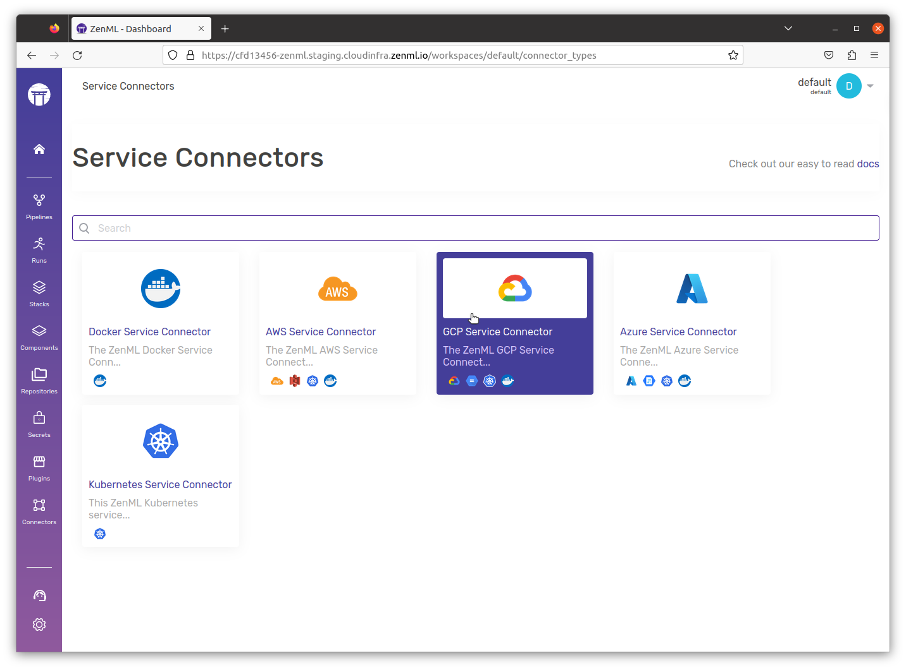
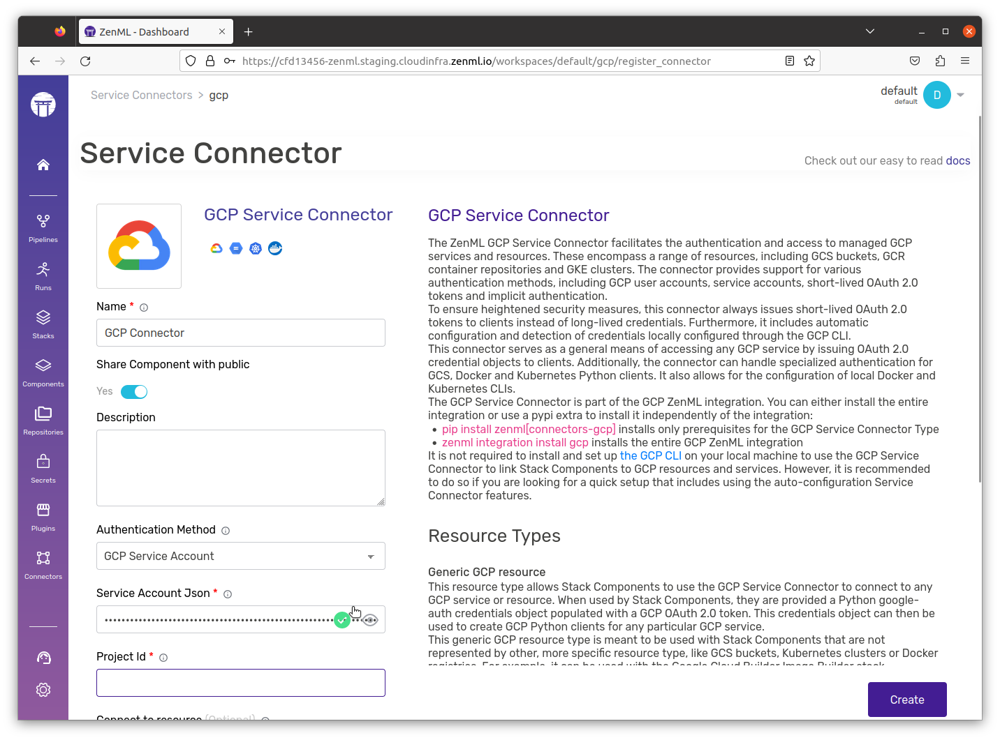
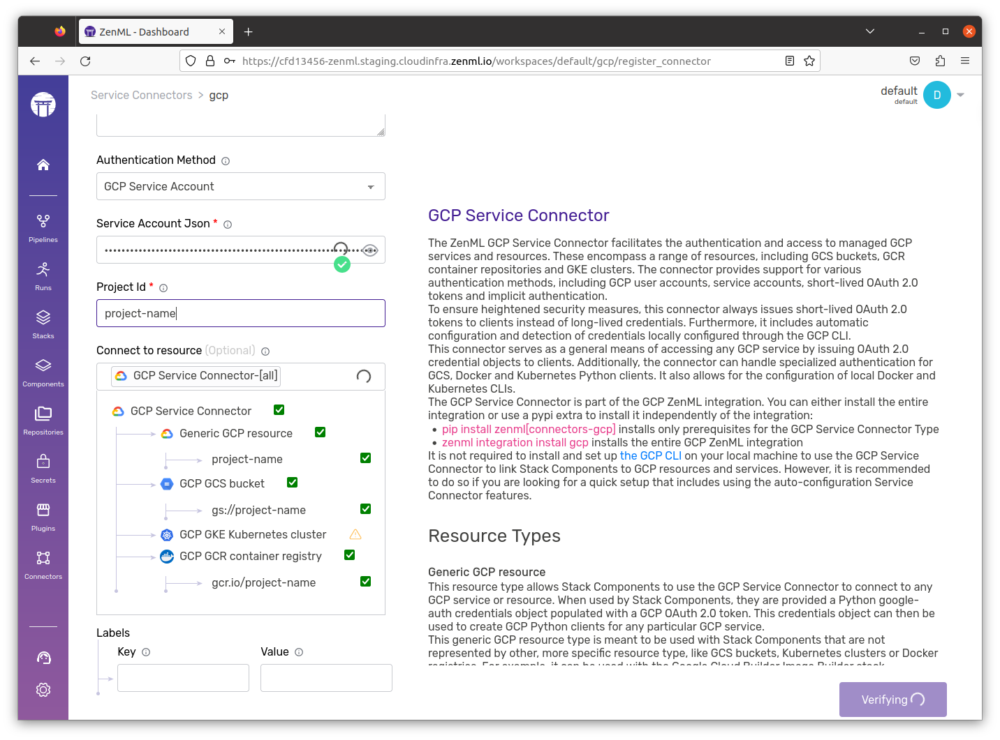
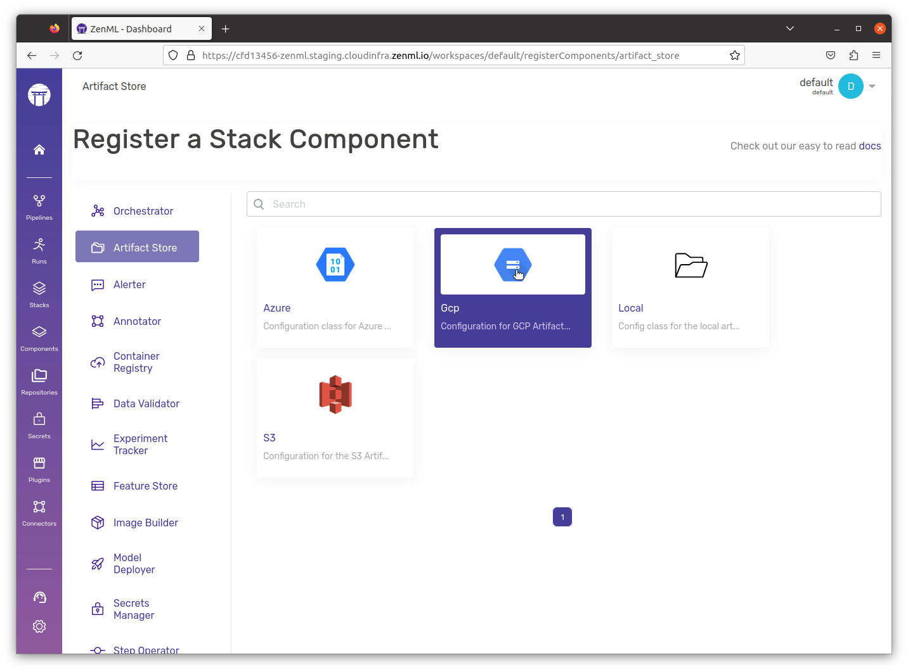
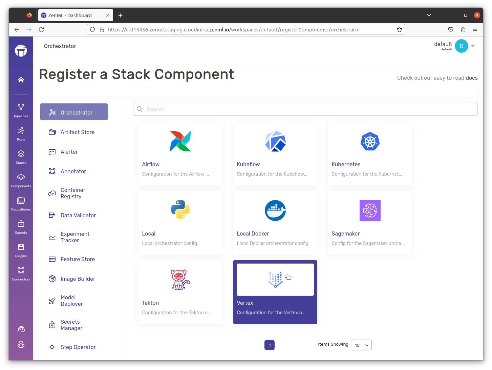
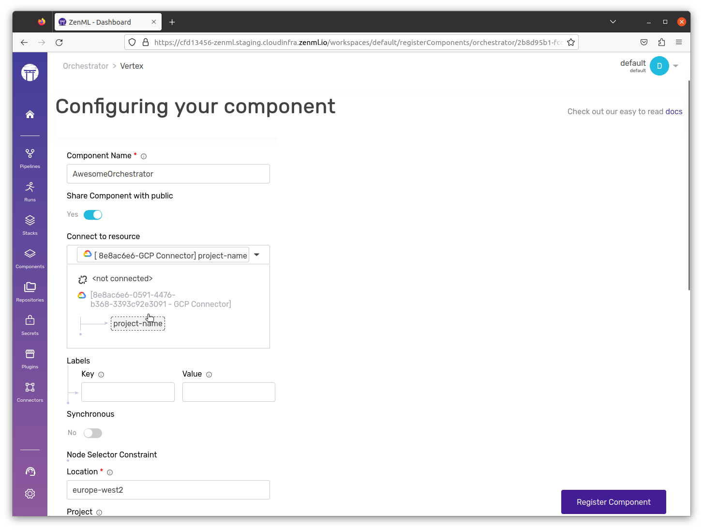
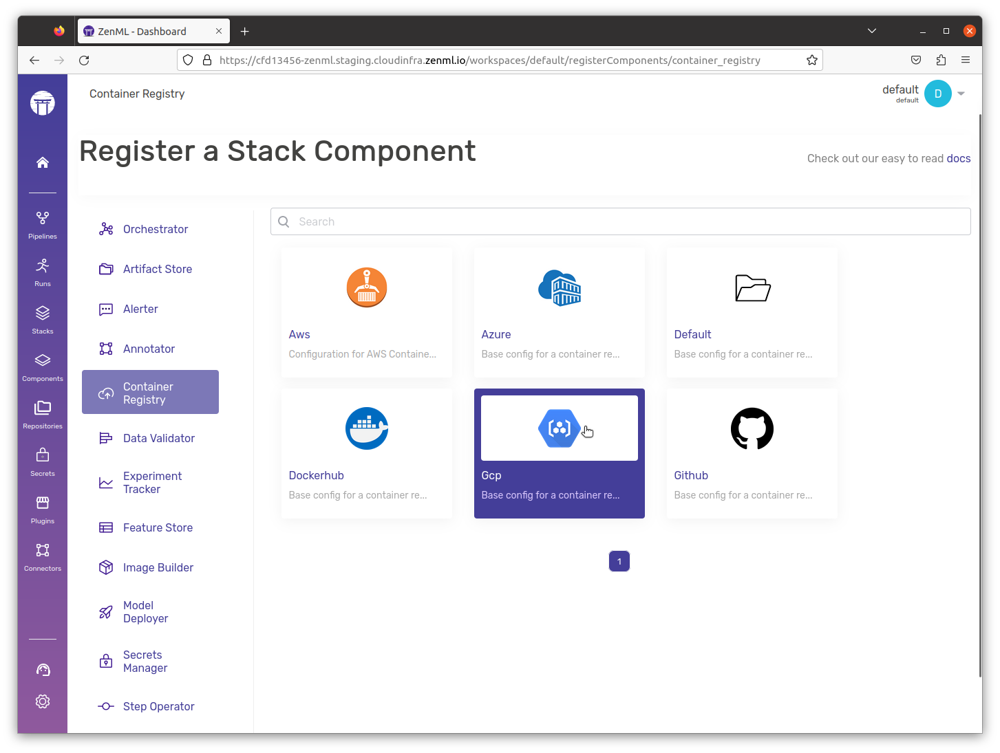
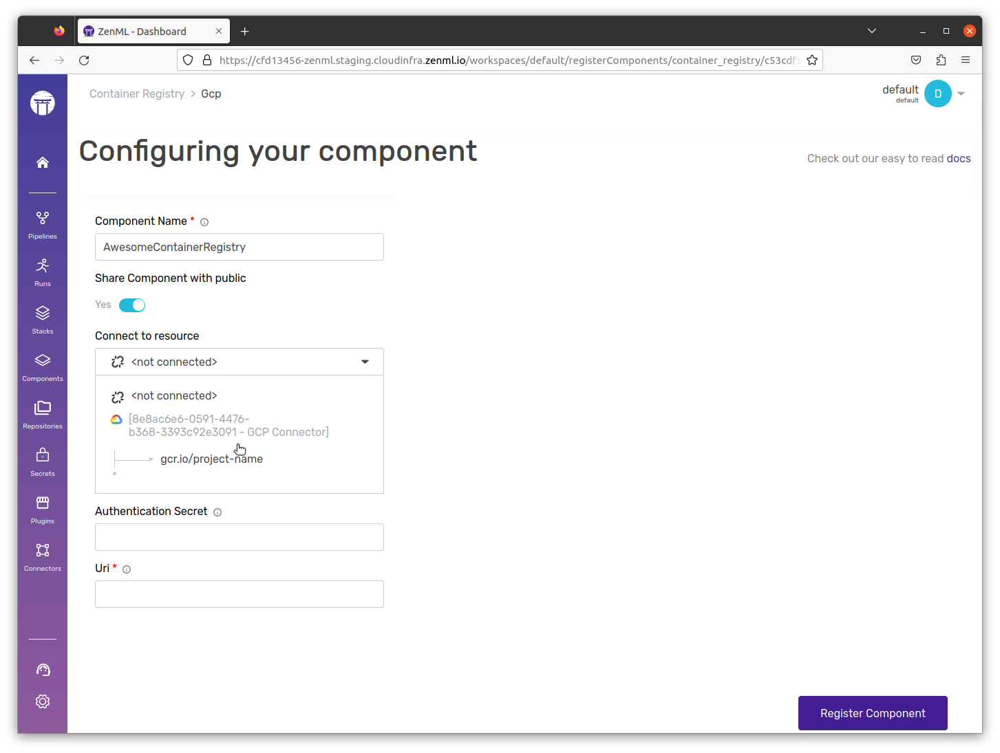

# Set up minimal GCP stack

Here's a 7-step guide to get a production-ready GCP stack.


### 1) Choose a GCP project&#x20;

In the Google Cloud console, on the project selector page, select or [create a Google Cloud project](https://cloud.google.com/resource-manager/docs/creating-managing-projects).


If you don't plan to keep the resources that you create in this procedure, create a new project. After you finish these steps, you can delete the project, thereby removing all resources associated with the project.


### 2) [Enable GCloud APIs](https://console.cloud.google.com/flows/enableapi?apiid=cloudfunctions,cloudbuild.googleapis.com,artifactregistry.googleapis.com,run.googleapis.com,logging.googleapis.com\&redirect=https://cloud.google.com/functions/docs/create-deploy-gcloud&\_ga=2.103703808.1862683951.1694002459-205697788.1651483076&\_gac=1.161946062.1694011263.Cj0KCQjwxuCnBhDLARIsAB-cq1ouJZlVKAVPMsXnYrgQVF2t1Q2hUjgiHVpHXi2N0NlJvG3j3y-PPh8aAoSIEALw\_wcB)

The following APIs will need to be enabled within your chosen gcp project.

* Cloud Functions API
* Cloud Build API
* Artifact Registry API
* Cloud Run Admin API
* Cloud Logging API

### 3) Create a dedicated service account

The service account should have these following roles.

* AI Platform Service Agent
* Storage Object Admin

These roles give permissions for full crud on storage objects and full permissions for compute within vertex.

### 4) [Create a JSON Key](https://cloud.google.com/iam/docs/keys-create-delete) for your service account

This json file will allow the service account to assume the identity of this service account. You will need the filepath of the downloaded file in the next step.

```bash
export JSON_KEY_FILE_PATH=<JSON_KEY_FILE_PATH>
```

### 5) Create a Service Connector within ZenML

The service connector will allow ZenML and other ZenML components to authenticate themselves with GCP.&#x20;



```bash
zenml integration install gcp \
&& zenml service-connector register gcp_connector \
--type gcp \
--auth-method service-account \
--service_account_json=@<FILE_PATH> \
--project_id=<GCP_PROJECT_ID>
```



<figure><figcaption><p>Choose the GCP Connector</p></figcaption></figure>

<figure><figcaption><p>Paste the entire contents of the key.json here</p></figcaption></figure>

<figure><figcaption><p>Make sure GCR, GCS and Generic GCP Resources are all selected here.</p></figcaption></figure>



### 6) Create Stack Components

#### Artifact Store

Before you run anything within the zenml CLI, head on over to GCP and create a GCS bucket, in case you don't have already one that you can use. Once this is done, you can create the zenml stack component as follows:



```bash
export ARTIFACT_STORE_NAME=gcp_artifact_store

# Register the GCS artifact-store and reference the target GCS bucket
zenml artifact-store register ${ARTIFACT_STORE_NAME} --flavor gcp \
    --path=gs://<YOUR_BUCKET_NAME>

# Connect the GCS artifact-store to the target bucket via a GCP Service Connector
zenml artifact-store connect ${ARTIFACT_STORE_NAME} -i
```


Head on over to our [docs](../../component-guide/artifact-stores/gcp/) to learn more about the registration of an artifact store.




<figure><figcaption><p>Choose the GCP Artifact Store.</p></figcaption></figure>

<figure><figcaption><p>Choose the name of your Artifact Store and the Connector you just created. This will allow you to pick the bucket of your choice.</p></figcaption></figure>



#### Orchestrator



```bash
export ORCHESTRATOR_NAME=gcp_vertex_orchestrator

# Register the GCS artifact-store and reference the target GCS bucket
zenml orchestrator register ${ORCHESTRATOR_NAME} --flavor=vertex 
  --project=<PROJECT_NAME> --location=europe-west2

# Connect the GCS orchestrator to the target gcp project via a GCP Service Connector
zenml orchestrator connect ${ORCHESTRATOR_NAME} -i
```


Head on over to our [docs](../../component-guide/orchestrators/vertex.md) to learn more about the registration of an orchestrator.




<figure><figcaption><p>Select the Vertex Orchestrator</p></figcaption></figure>

<figure><figcaption><p>Name it, Select the Connector and set an appropriate location. All other fields are optional.</p></figcaption></figure>



#### Container Registry



```bash
export CONTAINER_REGISTRY_NAME=gcp_container_registry

zenml container-registry register ${CONTAINER_REGISTRY_NAME} --flavor=gcp --uri=<GCR-URI>

# Connect the GCS orchestrator to the target gcp project via a GCP Service Connector
zenml container-registry connect ${CONTAINER_REGISTRY_NAME} -i
```


Head on over to our [docs](../../component-guide/container-registries/gcp.md) to learn more about the registration of a container registry.




<figure><figcaption><p>Choose the GCP Container Registry.</p></figcaption></figure>

<figure><figcaption><p>Name it and select the connector.</p></figcaption></figure>



### 7) Create Stack




```bash
export STACK_NAME=gcp_stack

zenml stack register ${STACK_NAME} -o ${ORCHESTRATOR_NAME} \
    -a ${ARTIFACT_STORE_NAME} -c ${CONTAINER_REGISTRY_NAME} --set
```


In case you want to also add any other stack components to this stack, feel free to do so.




<figure><figcaption><p>Combine the three stack components and you have your minimal GCP stack. Feel free to add any other component of your choice as well.</p></figcaption></figure>



## And you're already done!

Just like that, you now have a fully working GCP stack ready to go. Feel free to take it for a spin by running a pipeline on it.
