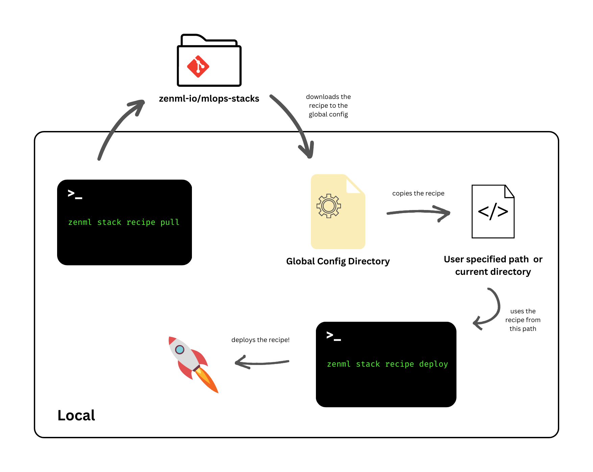

# Deploy a stack using mlstacks

MLStacks is a Python package that allows you to quickly spin up MLOps
infrastructure using Terraform. It is designed to be used with
[ZenML](https://zenml.io), but can be used with any MLOps tool or platform. You
can deploy a modular MLOps stack for AWS, GCP or K3D using mlstacks. Each deployment type is designed to offer a great deal of flexibility in configuring the resources while preserving the ease of application through the use of sensible defaults.

Check out [the full documentation for the mlstacks package](https://mlstacks.zenml.io/) for more information.

## When should I deploy something using mlstacks?

To answer this question, here are some pros and cons in comparison to the stack-component deploy method which can help you choose what works best for you!



* Offers a lot of flexibility in what you deploy.
* You can also add custom components that you don't want the public to use, to the existing recipes, for a complete deployment experience.
* Deploying with `mlstacks` gives you a full MLOps stack as the output. Your
  components and stack is automatically imported to ZenML. This saves you the
  effort of manually registering all the components.



* It involves more manual steps as compared to the stack component deployment.
* You have to directly edit the terraform files (either the `locals.tf` or the `variables.tf` if you want to customize the deployment. The stack-component CLI, on the other hand, gives you a Python interface for you to avoid dipping your toes in HCL code at all.



### Deploying a stack

Detailed steps are available [in the README](https://github.com/zenml-io/mlops-stacks#-list-of-recipes) of the respective stack recipes but here's what a simple flow could look like:

1.  📃 List all available recipes in the repository.

    <pre><code><strong>zenml stack recipe list
    </strong><strong> 
    </strong></code></pre>
2.  Pull the recipe that you wish to deploy to your local system.

    ```
    zenml stack recipe pull <STACK_RECIPE_NAME>
    ```
3. 🎨 Customize your deployment by editing the default values in the `locals.tf` file. This file holds all the configurable parameters for each of the stack components.
4. 🔐 Enable services and add your secret information like keys and passwords into the `values.tfvars.json` file which is not committed and only exists locally. You can learn what values can be configured here by taking a look at the `variables.tf` file.
5. 🚀 Deploy the recipe with the following command. Let's take the example of deploying a **Kubeflow, MLflow, and Seldon stack on GCP**.


````
```
zenml stack recipe deploy gcp-modular \
--enable_orchestrator_kubeflow=true --enable_model_deployer_seldon=true --enable_experiment_tracker_mlflow=true --no-server
```
````



If you want to allow ZenML to automatically import the created resources as a ZenML stack, pass the `--import` flag to the command above. By default, the imported stack will have the same name as the stack recipe and you can provide your own custom name with the `--stack-name` option.



This command will detect and deploy a ZenML server if you are not connected to one already. To prevent a server deployment, use the `--no-server` flag.


Once the recipe is deployed, you'll notice that a ZenML stack configuration file gets created. This YAML file can be imported as a ZenML stack manually by running the following command 🤯!

```
zenml stack import <STACK_NAME> -f <PATH_TO_THE_CREATED_STACK_CONFIG_YAML>
```

<details>

<summary>Want more details on how this works internally?</summary>

The stack recipe CLI interacts with the [mlops-stacks](https://github.com/zenml-io/mlops-stacks) repository to fetch the recipes and stores them locally in the **Global Config** directory. From here, they are pulled to your local directory or whatever directory you specify in the `--path` flag for the CLI.

This is what you see and where you can make any changes you want to the recipe files. You can also use native terraform commands like `terraform apply` to deploy components but this would require you to pass the variables manually using the `-var-file` flag to the terraform CLI.

</details>



### Deleting resources

1.  🗑️ Once you're done running your pipelines, there's only a single command you need to execute that will take care of cleaning up all the resources that you had created on your cloud.

    ```
    zenml stack recipe destroy <STACK_RECIPE_NAME>
    ```
2.  (Optional) 🧹 You can also remove all the downloaded recipe files from the `pull` execution by using the `clean` command.

    ```
    zenml stack recipe clean
    ```

Check out the [SDK docs](https://sdkdocs.zenml.io/) to learn more about each of these commands and the options that are available.

<figure><figcaption></figcaption></figure>
