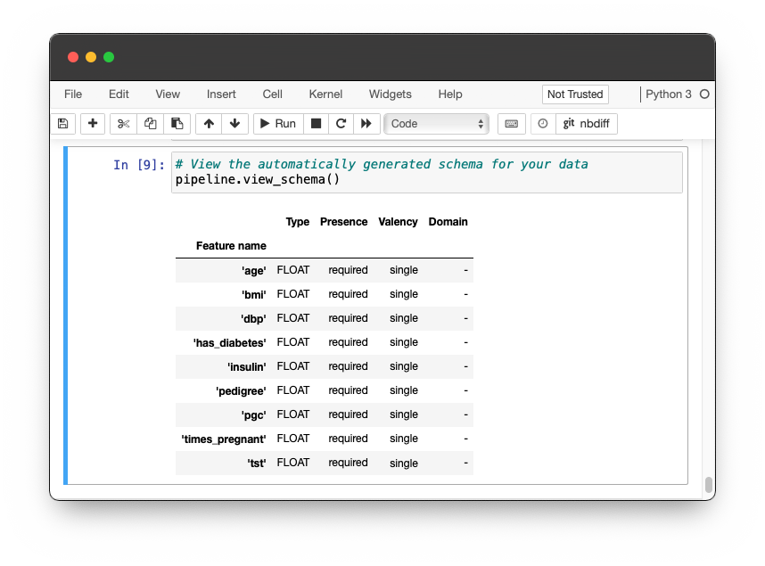
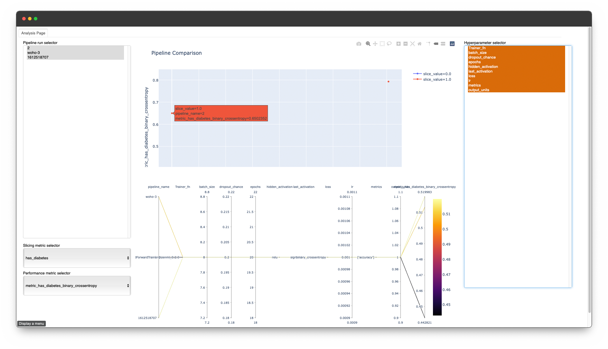

# Post-training workflow

**ZenML** comes equipped with numerous classic techniques to interact with the artifacts, once a **training pipeline** is finished.

## view\_schema

First of all, you can go ahead and take a peek at the schema of your dataset by using the `view_schema` method of your **pipeline** instance. 

```python
training_pipeline.view_schema()
```



## view\_statistics

Furthermore, you can check the statistics which are yielded by your **datasource** and split configuration through the method `view_statistics`. 


The default behavior of this method is to open a new window to showcase the statistics but if you are working on a Jupyter notebook and use the magic flag, you directly append the resulting visualization to your notebook.


```python
training_pipeline.view_statistics() # try setting magic=True in a Jupyter Notebook
```


## evaluate

You can also evaluate the results of your training by using the `evaluate` method of your **pipeline**. On default, it will create and serve a notebook with two distinct cells dedicated to two different tools.


Much like the `view_statistics`, if you execute `evaluate` with the `magic` flag in a Jupyter notebook, it will help you continue in your notebook and generate two new cells.


1. **Tensorboard** can help you to understand the behavior of your model during the training session
2. **TFMA** or **tensorflow\_model\_analysis** can help you assess your already trained model based on given metrics and slices on the evaluation dataset

```python
training_pipeline.evaluate() # try setting magic=True in a Jupyter Notebook
```

**Note:** If you have already set up your slices in the configuration of the evaluator and want to see the sliced results, comment in the last line and adjust it according to the slicing column. In the end, it should look something like this:

```python
tfma.view.render_slicing_metrics(evaluation, slicing_column='feature_name')
```


## compare

Evaluation however should go beyond individual **pipeline** executions. A direct comparison of the **pipelines** within a **repository** can allow you to judge the performance and results of configuration against each other. 

```python
from zenml.repo import Repository

repo: Repository = Repository.get_instance()
repo.compare_training_runs()
```

This will open up your browser to a local web app, which will help to compare the results of different pipeline runs.



