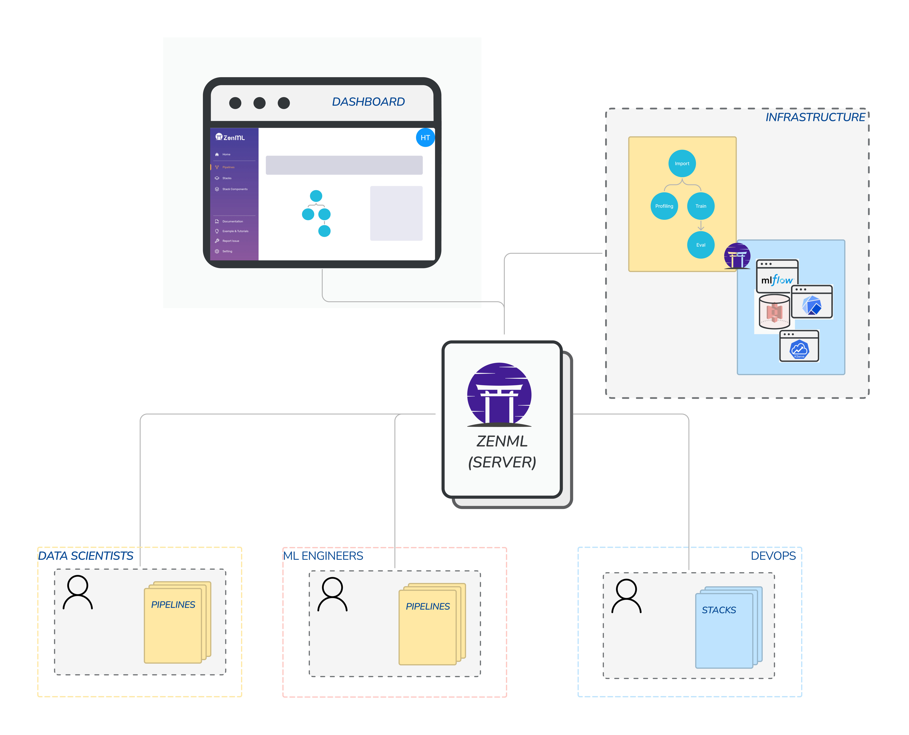
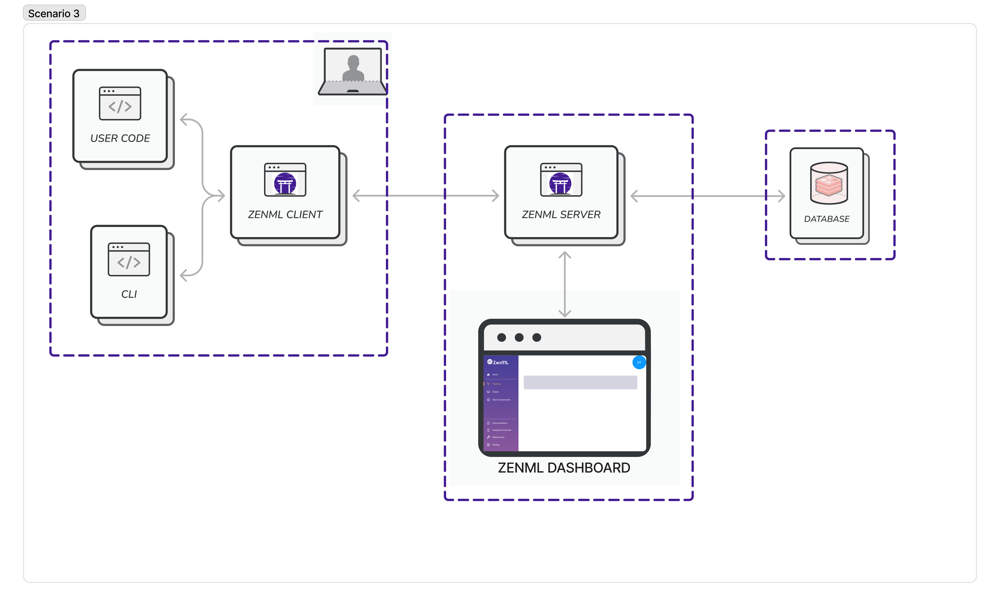
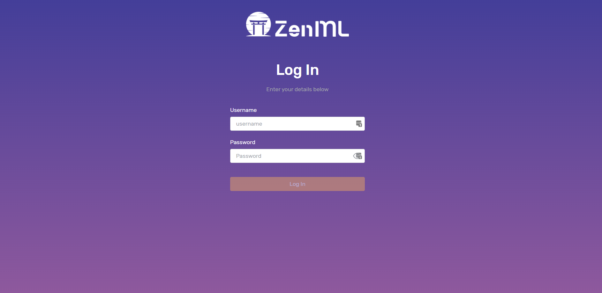


This is an older version of the ZenML documentation. To read and view the latest version please [visit this up-to-date URL](https://docs.zenml.io).



## Collaboration with ZenML Overview



The ZenML Server is a distributed client-server ZenML deployment scenario in which multiple ZenML clients can connect to a remote service that provides persistent storage and acts as a central management hub for all ZenML operations involving Stack configurations, Stack Components and other ZenML objects.

A typical organization scenario with ZenML is to have Data Scientists or ML Engineers write pipelines, while the DevOps Engineers help them provision and
register stacks. Typically, one can go through a CI/CD workflow to run pipelines on various different stacks.

Working with a ZenML Server involves two main aspects: deploying the ZenServer somewhere and connecting to it from your ZenML client. In this section, we will learn about the simplest way to deploy ZenML with the CLI, but [there are other similarly easy options available](../../getting-started/deploying-zenml/deploying-zenml.md).

### Deploying with the CLI

The easiest and fastest way to get running on the cloud is by using the `deploy` CLI command. It currently only supports deploying to [Kubernetes](https://kubernetes.io/) on managed cloud services. 

Before we begin, it will help to understand the [architecture](../../getting-started/deploying-zenml/deploying-zenml.md#scenario-3-server-and-database-hosted-in-the-cloud) around the ZenML server and the database that it uses. Here is an illustration:



If you don't have an existing Kubernetes cluster, you have the following two options to set it up:

- Creating it manually using the documentation for your cloud provider. For convenience, here are links for [AWS](https://docs.aws.amazon.com/eks/latest/userguide/create-cluster.html), [Azure](https://learn.microsoft.com/en-us/azure/aks/learn/quick-kubernetes-deploy-portal?tabs=azure-cli) and [GCP](https://cloud.google.com/kubernetes-engine/docs/how-to/creating-a-zonal-cluster#before_you_begin).
- Using [stack recipes](../../advanced-guide/practical/stack-recipes.md) that set up a cluster along with other tools that you might need in your cloud stack like artifact stores, and secret managers. Take a look at all [available stack recipes](https://github.com/zenml-io/mlops-stacks#-list-of-recipes) to see if there's something that works for you.

> **Note**
> Once you have created your cluster, make sure that you configure your [kubectl](https://kubernetes.io/docs/tasks/tools/#kubectl) client to talk to it. If you have used stack recipes, this step is already done for you!

You're now ready to deploy ZenML! Run the following command:
```
zenml deploy
```

You will be prompted to provide a name for your deployment and details like what cloud provider you want to deploy to, in addition to the username, password and email you want to set for the default user — and that's it! It creates the database and any VPCs, permissions and more that is needed.

> **Note**
> To be able to run the deploy command, you should have your cloud provider's CLI configured locally with permissions to create resources like MySQL databases and networks.

Reasonable defaults are in place for you already and if you wish to configure more settings, take a look at the next scenario that uses a config file.

If you would like more control over the `zenml deploy` command, then read [option 2 here](../../getting-started/deploying-zenml/cli.md#option-2-using-existing-cloud-resources).

 
If you have trouble with the `zenml deploy` command and are stuck at
this point, please join our [Slack community](https://zenml.io/slack-invite) and send a message to the #general channel. The
community is more than willing to help out and the core team are also there to answer questions.


At the end of the deployment, you will receive:

- A `URL` (e.g. `https://acaaf63af2074as394ab675ee71d85a-1399000d0.us-east-1.elb.amazonaws.com`). Visiting this URL on the browser will show you the same ZenML dashboard that you have seen locally, this time over the web. The ZenML Server and the Dashboard are deployed in the same web application and served at this URL. You can use login with your credentials (`username` and `password`) to view the dashboard.
 
If certificates have not been provisioned properly with the deployment, your browser might ask you to press a button to allow you
to see the dashboard. It is important that you give permission in such a scenario, otherwise it will render ZenML unusable from the browser.


- A `username`: This can be configured but is `default` by default.
- A `password`: This can be configured but is empty by default.
- (Optionally) A `TLS certificate` that you can use to connect securely to the deployment (see below).



### Connecting to a deployed ZenML Server

Once ZenML is deployed, one or multiple users can connect to with the
`zenml connect` command. If no arguments are supplied, ZenML
will attempt to connect to the last ZenML server deployed from the local host using the `zenml deploy` command:

### ZenML Connect: Various options

```bash
zenml connect
```

To connect to a ZenML server, you can either pass the configuration as command
line arguments or as a YAML file:

```bash
zenml connect --url=https://zenml.example.com:8080 --username=admin --no-verify-ssl
```

or

```bash
zenml connect --config=/path/to/zenml_server_config.yaml
```

The YAML file should have the following structure when connecting to a ZenML
server:

```yaml
url: <The URL of the ZenML server>
username: <The username to use for authentication>
password: <The password to use for authentication>
verify_ssl: |
   <Either a boolean, in which case it controls whether the
   server's TLS certificate is verified, or a string, in which case it
   must be a path to a CA certificate bundle to use or the CA bundle
   value itself>
```

Example of a ZenML server YAML configuration file:

```yaml
url: https://ac8ef63af203226194a7725ee71d85a-7635928635.us-east-1.elb.amazonaws.com/zenml
username: admin
password: Pa$$word123
verify_ssl: |
-----BEGIN CERTIFICATE-----
MIIDETCCAfmgAwIBAgIQYUmQg2LR/pHAMZb/vQwwXjANBgkqhkiG9w0BAQsFADAT
MREwDwYDVQQDEwh6ZW5tbC1jYTAeFw0yMjA5MjYxMzI3NDhaFw0yMzA5MjYxMzI3
...
ULnzA0JkRWRnFqH6uXeJo1KAVqtxn1xf8PYxx3NlNDr9wi8KKwARf2lwm6sH4mvq
1aZ/0iYnGKCu7rLJzxeguliMf69E
-----END CERTIFICATE-----
```

Both options can be combined, in which case the command line arguments will
override the values in the YAML file. For example, it is possible and
recommended that you supply the password only as a command line argument:

```bash
zenml connect --username zenml --password=Pa@#$#word --config=/path/to/zenml_server_config.yaml
```

### ZenML Disconnect: To go back to single-player mode.

To disconnect from the current ZenML server and revert to using the local default database, use the following command:

```bash
zenml disconnect
```

You can inspect the current ZenML configuration at any given time using the
following command:

```bash
zenml status
```

Example output:

```
 zenml status
Running without an active repository root.
Connected to a ZenML server: 'https://ac8ef63af203226194a7725ee71d85a-7635928635.us-east-1.elb.amazonaws.com'
The current user is: 'default'
The active workspace is: 'default' (global)
The active stack is: 'default' (global)
The status of the local dashboard:
              ZenML server 'local'              
┏━━━━━━━━━━━━━━━━┯━━━━━━━━━━━━━━━━━━━━━━━━━━━━━┓
┃ URL            │ http://172.17.0.1:9000      ┃
┠────────────────┼─────────────────────────────┨
┃ STATUS         │ ✅                          ┃
┠────────────────┼─────────────────────────────┨
┃ STATUS_MESSAGE │ Docker container is running ┃
┠────────────────┼─────────────────────────────┨
┃ CONNECTED      │                             ┃
┗━━━━━━━━━━━━━━━━┷━━━━━━━━━━━━━━━━━━━━━━━━━━━━━┛
```

Ok that was easy! By running a few commands on the terminal, you have now a
shared ZenML Server and Dashboard deployed and ready to go. The next step is to
[invite your teammates](../collaborate/users.md).
