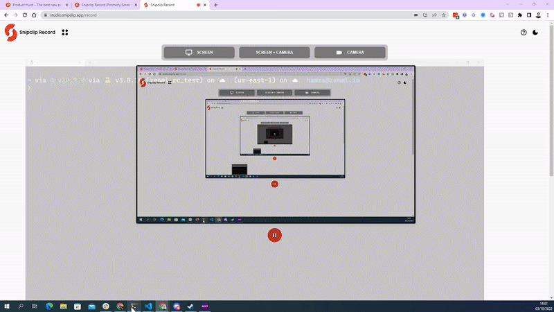


This is an older version of the ZenML documentation. To read and view the latest version please [visit this up-to-date URL](https://docs.zenml.io).



# Managing ZenML Stacks

## Managing local stacks (Single-player mode)


If you are working locally and in a non-collaborative setting, then you should be
aware of how ZenML by default stores stacks you are creating locally.
There are two main locations where it stores information on the local machine.
These are the [Global Configuration](../../guidelines/global-config.md) and the 
_Repository_. The latter is also referred to as the _.zen folder_.

The ZenML **Repository** related to a pipeline run is the folder that contains 
all the files needed to execute the run, such as the respective Python scripts
and modules where the pipeline is defined, or other associated files.
The repository plays a double role in ZenML:

* It is used by ZenML to identify which files must be copied into Docker images 
in order to execute pipeline steps remotely, e.g., when orchestrating pipelines
with [Kubeflow](../../component-gallery/orchestrators/kubeflow.md).
* It defines the local active Stack that will be used when running
pipelines from the repository root or one of its sub-folders.

### Registering a Repository

You can register your current working directory as a ZenML
repository by running:

```bash
zenml init
```

This will create a `.zen` directory, which contains a single
`config.yaml` file that stores the local settings:

```yaml
active_project_name: default
active_stack_id: de4d4a39-356b-48fa-8091-309fb090246f
```


It is recommended to use the `zenml init` command to initialize a ZenML
_Repository_ in the same location of your custom Python source tree where you
would normally point `PYTHONPATH`, especially if your Python code relies on a
hierarchy of modules spread out across multiple sub-folders.

ZenML CLI commands and ZenML code will display a warning if they are not running
in the context of a ZenML repository, e.g.:

```shell
$ zenml stack list

Unable to find ZenML repository in your current working directory (/private/tmp/zenml) or any parent directories. If you want to use an existing repository which is in a different location, set the environment variable 'ZENML_REPOSITORY_PATH'. If you want to create a new repository, run zenml init.
Running without an active repository root.
Using the default local database.
Running with active project: 'default' (global)
┏━━━━━━━━┯━━━━━━━━━━━━┯━━━━━━━━━━━━━━━━━━━━━━━━━━━━━━━━━━━━━━┯━━━━━━━━┯━━━━━━━━━┯━━━━━━━━━━━━━━┯━━━━━━━━━━━━━━━━┓
┃ ACTIVE │ STACK NAME │ STACK ID                             │ SHARED │ OWNER   │ ORCHESTRATOR │ ARTIFACT_STORE ┃
┠────────┼────────────┼──────────────────────────────────────┼────────┼─────────┼──────────────┼────────────────┨
┃   👉   │ default    │ 4fc6795b-fd9e-447d-2349-233d5c80a199 │ ➖     │ default │ default      │ default        ┃
┗━━━━━━━━┷━━━━━━━━━━━━┷━━━━━━━━━━━━━━━━━━━━━━━━━━━━━━━━━━━━━━┷━━━━━━━━┷━━━━━━━━━┷━━━━━━━━━━━━━━┷━━━━━━━━━━━━━━━━┛
```


#### Setting the Local Active Stack

One of the most useful features of repositories is that you can configure a
different active stack for each of your projects. This is great if
you want to use ZenML for multiple projects on the same machine. Whenever you
create a new ML project, we recommend you run `zenml init` to create a separate
repository, then use it to define your stacks:

```bash
zenml init
zenml stack register ...
zenml stack set ...
```

If you do this, the correct stack will automatically get activated
whenever you change directory from one project to another in your terminal.


Note that the stacks and stack components are still stored globally, even when
running from inside a ZenML repository. It is only the active stack setting
that can be configured locally.


### Detailed Example

<details>
<summary>Detailed usage example of local stacks</summary>

The following example shows how the active stack can be configured locally for a
project without impacting the global settings:

```
/tmp/zenml$ zenml stack list
Unable to find ZenML repository in your current working directory (/private/tmp/zenml) or any parent directories. If you want to use an existing repository which is in a different location, set the environment variable 'ZENML_REPOSITORY_PATH'. If you want to create a new repository, run zenml init.
Running without an active repository root.
Using the default local database.
Running with active project: 'default' (global)
┏━━━━━━━━┯━━━━━━━━━━━━┯━━━━━━━━━━━━━━━━━━━━━━━━━━━━━━━━━━━━━━┯━━━━━━━━┯━━━━━━━━━┯━━━━━━━━━━━━━━┯━━━━━━━━━━━━━━━━┓
┃ ACTIVE │ STACK NAME │ STACK ID                             │ SHARED │ OWNER   │ ORCHESTRATOR │ ARTIFACT_STORE ┃
┠────────┼────────────┼──────────────────────────────────────┼────────┼─────────┼──────────────┼────────────────┨
┃   👉   │ default    │ 4fc6795b-fd9e-447d-afe9-233d5c80a199 │ ➖     │ default │ default      │ default        ┃
┠────────┼────────────┼──────────────────────────────────────┼────────┼─────────┼──────────────┼────────────────┨
┃        │ zenml      │ 20419515-3738-4783-bdf1-ef97f4e59a55 │ ➖     │ default │ default      │ default        ┃
┗━━━━━━━━┷━━━━━━━━━━━━┷━━━━━━━━━━━━━━━━━━━━━━━━━━━━━━━━━━━━━━┷━━━━━━━━┷━━━━━━━━━┷━━━━━━━━━━━━━━┷━━━━━━━━━━━━━━━━┛

/tmp/zenml$ zenml init
⠧ Initializing ZenML repository at /private/tmp/zenml.
Setting the repo active project to default.
ZenML repository initialized at /private/tmp/zenml.
The local active stack was initialized to 'default'. This local configuration will only take effect when you're running ZenML from the initialized repository 
root, or from a subdirectory. For more information on repositories and configurations, please visit https://docs.zenml.io/starter-guide/stacks/managing-stacks.


/tmp/zenml$ zenml stack list
Using the default local database.
Running with active project: 'default' (repository)
┏━━━━━━━━┯━━━━━━━━━━━━┯━━━━━━━━━━━━━━━━━━━━━━━━━━━━━━━━━━━━━━┯━━━━━━━━┯━━━━━━━━━┯━━━━━━━━━━━━━━┯━━━━━━━━━━━━━━━━┓
┃ ACTIVE │ STACK NAME │ STACK ID                             │ SHARED │ OWNER   │ ORCHESTRATOR │ ARTIFACT_STORE ┃
┠────────┼────────────┼──────────────────────────────────────┼────────┼─────────┼──────────────┼────────────────┨
┃   👉   │ default    │ 4fc6795b-fd9e-447d-afe9-233d5c80a199 │ ➖     │ default │ default      │ default        ┃
┠────────┼────────────┼──────────────────────────────────────┼────────┼─────────┼──────────────┼────────────────┨
┃        │ zenml      │ 20419515-3738-4783-bdf1-ef97f4e59a55 │ ➖     │ default │ default      │ default        ┃
┗━━━━━━━━┷━━━━━━━━━━━━┷━━━━━━━━━━━━━━━━━━━━━━━━━━━━━━━━━━━━━━┷━━━━━━━━┷━━━━━━━━━┷━━━━━━━━━━━━━━┷━━━━━━━━━━━━━━━━┛

/tmp/zenml$ zenml stack set zenml
Using the default local database.
Running with active project: 'default' (repository)
Active repository stack set to: 'zenml'

/tmp/zenml$ zenml stack list
Using the default local database.
Running with active project: 'default' (repository)
┏━━━━━━━━┯━━━━━━━━━━━━┯━━━━━━━━━━━━━━━━━━━━━━━━━━━━━━━━━━━━━━┯━━━━━━━━┯━━━━━━━━━┯━━━━━━━━━━━━━━┯━━━━━━━━━━━━━━━━┓
┃ ACTIVE │ STACK NAME │ STACK ID                             │ SHARED │ OWNER   │ ORCHESTRATOR │ ARTIFACT_STORE ┃
┠────────┼────────────┼──────────────────────────────────────┼────────┼─────────┼──────────────┼────────────────┨
┃        │ default    │ 4fc6795b-fd9e-447d-afe9-233d5c80a199 │ ➖     │ default │ default      │ default        ┃
┠────────┼────────────┼──────────────────────────────────────┼────────┼─────────┼──────────────┼────────────────┨
┃   👉   │ zenml      │ 20419515-3738-4783-bdf1-ef97f4e59a55 │ ➖     │ default │ default      │ default        ┃
┗━━━━━━━━┷━━━━━━━━━━━━┷━━━━━━━━━━━━━━━━━━━━━━━━━━━━━━━━━━━━━━┷━━━━━━━━┷━━━━━━━━━┷━━━━━━━━━━━━━━┷━━━━━━━━━━━━━━━━┛

/tmp/zenml$ cd ..
/tmp$ zenml stack list
Unable to find ZenML repository in your current working directory (/private/tmp) or any parent directories. If you want to use an existing repository which is in a different location, set the environment variable 'ZENML_REPOSITORY_PATH'. If you want to create a new repository, run zenml init.
Running without an active repository root.
Using the default local database.
Running with active project: 'default' (global)
┏━━━━━━━━┯━━━━━━━━━━━━┯━━━━━━━━━━━━━━━━━━━━━━━━━━━━━━━━━━━━━━┯━━━━━━━━┯━━━━━━━━━┯━━━━━━━━━━━━━━┯━━━━━━━━━━━━━━━━┓
┃ ACTIVE │ STACK NAME │ STACK ID                             │ SHARED │ OWNER   │ ORCHESTRATOR │ ARTIFACT_STORE ┃
┠────────┼────────────┼──────────────────────────────────────┼────────┼─────────┼──────────────┼────────────────┨
┃        │ zenml      │ 20419515-3738-4783-bdf1-ef97f4e59a55 │ ➖     │ default │ default      │ default        ┃
┠────────┼────────────┼──────────────────────────────────────┼────────┼─────────┼──────────────┼────────────────┨
┃   👉   │ default    │ 4fc6795b-fd9e-447d-afe9-233d5c80a199 │ ➖     │ default │ default      │ default        ┃
┗━━━━━━━━┷━━━━━━━━━━━━┷━━━━━━━━━━━━━━━━━━━━━━━━━━━━━━━━━━━━━━┷━━━━━━━━┷━━━━━━━━━┷━━━━━━━━━━━━━━┷━━━━━━━━━━━━━━━━┛
```

</details>

With collaboration being the key part of ZenML, the 0.20.0 release puts the
concepts of Users and Projects front and center and introduces
the possibility to share stacks and stack components with other users by
means of the ZenML server.

When your client is connected to a ZenML server, entities such as Stacks, Stack
Components, Stack Component Flavors, Pipelines, Pipeline Runs, and Artifacts are
scoped to a Project and owned by the User that creates them. Only the objects
that are owned by the current user used to authenticate to the ZenML server and
that are part of the current project are available to the client.

Stacks and Stack Components can also be shared within the same project with
other users. To share an object, either set it as shared during creation time
(e.g. `zenml stack register mystack ... --share`) or afterwards (e.g. through
`zenml stack share mystack`).

To differentiate between shared and private Stacks and Stack Components, these
can now be addressed by name, id or the first few letters of the id in the cli.
E.g. for a stack `default` with id `179ebd25-4c5b-480f-a47c-d4f04e0b6185` you
can now run `zenml stack describe default` or `zenml stack describe 179` or
`zenml stack describe 179ebd25-4c5b-480f-a47c-d4f04e0b6185`.

We also introduce the notion of `local` vs `non-local` stack components. Local
stack components are stack components that are configured to run locally while
non-local stack components are configured to run remotely or in a cloud
environment. Consequently:

* stacks made up of local stack components should not be shared on a central
ZenML Server, even though this is not enforced by the system.
* stacks made up of non-local stack components are only functional if they
are shared through a remotely deployed ZenML Server.


### Viewing the dashboard

While in single-player mode, you can still use the dashboard. ZenML natively supports running the HTTP server and dashboard either as a process running in the background. By default, the `zenml up` command starts the HTTP server as a local daemon process that uses the same database configuration as your local client. A URL is provided where the ZenML Dashboard can be loaded to show your available stacks, pipeline runs and team settings among other things.

`zenml down` does the opposite and spins the process down. You can read more about this [here](../../getting-started/deploying-zenml/deploying-zenml.md).



## Managing Remote Stacks (Multi-player mode)

If you are working in a non-local, collaborative setting, then the first
question you would ask is how to share pipelines and stacks with other 
people. There are two answers to this question:

### Export and Import Stacks

If you wish to transfer one of your stacks to another user or even another
machine, you can do so by exporting the stack configuration and then importing
it again.

To export a stack to YAML, run the following command:

```bash
zenml stack export STACK_NAME FILENAME.yaml
```

This will create a FILENAME.yaml containing the config of your stack and all
of its components, which you can then import again like this:

```bash
zenml stack import STACK_NAME -f FILENAME.yaml
```

#### Known Limitations

The exported Stack is only a configuration. It may have local dependencies
that are not exported and thus will not be available when importing the Stack
on another machine:

* the secrets stored in the local Secrets Managers
* any references to local files and local services not accessible from outside
the machine where the Stack is exported, such as the local Artifact Store.
* perhaps critically, the exported stack would not contain any pipelines or
pipeline runs. For that you need to set up a ZenML Server (see section below).

### Sharing stacks over a ZenML Server


To unleash the real power of ZenML, one must [deploy it in the cloud](../../getting-started/deploying-zenml/).
Once you have a deployed ZenML in the cloud, you can connect your client to it locally.
Entities such as Stacks, Stack Components, Stack Component Flavors, Pipelines, Pipeline Runs, 
and Artifacts are scoped to a Project and owned by the User that creates them. Only the objects
that are owned by the current user used to authenticate to the ZenML server and
that are part of the current project are available to the client.

Stacks and Stack Components can also be shared within the same project with
other users. To share a stack, either set it as shared during creation time:

```shell
zenml stack register mystack ... --share
```

or afterwards:

```shell
zenml stack share mystack
```

To differentiate between shared and private Stacks and Stack Components, these
can now be addressed by name, id or the first few letters of the id in the cli.
E.g. for a stack `default` with id `179ebd25-4c5b-480f-a47c-d4f04e0b6185` you
can run:

```shell
 zenml stack describe default
 ```

 or:
 
 ```shell
 zenml stack describe 179
 ```
 or:
 
 ```shell
zenml stack describe 179ebd25-4c5b-480f-a47c-d4f04e0b6185
```

While understanding the shared stacks, one must also understand
the notion of `local` vs `non-local` stack components. 

* Local stack components are stack components that are configured to run locally
* Non-local stack components are configured to run remotely or in a cloud
environment. 

Consequently:

* Stacks made up of local stack components should not be shared on a central
ZenML Server, even though this is not enforced by the system.
* Stacks made up of non-local stack components are only functional if they
are shared through a remotely deployed ZenML Server.

Collaboration as a topic deserves its own section, and that's exactly  what we'll
dive into [next](../collaborate/collaborate.md).
