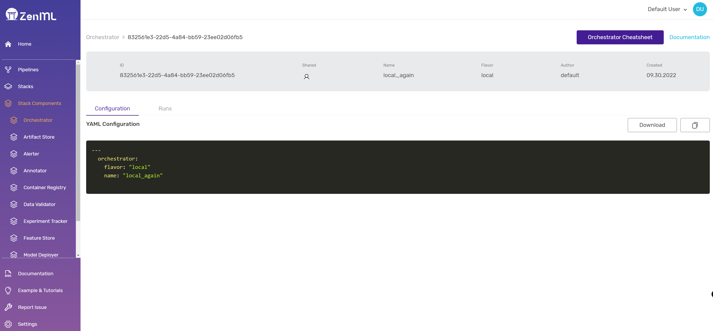


This is an older version of the ZenML documentation. To read and view the latest version please [visit this up-to-date URL](https://docs.zenml.io).



## Registering Stacks, Components, and Flavors

You can combine various MLOps tools into a ZenML stack as follows:

1. [Register a stack component](#registering-stack-components) to configure each tool
using `zenml <STACK_COMPONENT> register`.
2. [Register a stack](#registering-a-stack) to bring a particular combination of stack components 
together using `zenml stack register`.
3. [Register a stack flavor](../../advanced-guide/stacks/custom-flavors.md) to add a
new tool to the ZenML flavor registry, if the tool you are looking for is not supported out-of-the-box,
or if you want to modify standard behavior of standard flavors.

In this guide, we will learn about the first two, while the last is a slightly
[advanced topic covered later](../../advanced-guide/stacks/custom-flavors.md).

### Registering Stack Components

First, you need to create a new instance of the respective stack component
with the desired flavor using `zenml <STACK_COMPONENT> register <NAME> --flavor=<FLAVOR>`. 
Most flavors require further parameters that you can pass as additional
arguments `--param=value`, similar to how we passed the flavor.

E.g., to register a *local* artifact store, we could use the following command:

```shell
zenml artifact-store register <ARTIFACT_STORE_NAME> \
    --flavor=local \
    --path=/path/to/your/store
```

In case you do not know all the available parameters, you can also use the 
interactive mode to register stack components. This will then walk you through 
each parameter (to skip just press ENTER):

```shell
zenml artifact-store register <ARTIFACT_STORE_NAME> \
    --flavor=local -i
```

Or you could simply describe the flavor to give a list of configuration available:

```shell
zenml artifact-store flavor describe local
```

After registering, you should be able to see the new artifact store in the
list of registered artifact stores, which you can access using the following command:

```shell
zenml artifact-store list
```

Or on the UI directly:




Our CLI features a wide variety of commands that let you manage and use your
stack components and flavors. If you would like to learn more, please run
`zenml <STACK_COMPONENT> --help` or visit [our CLI docs](https://apidocs.zenml.io/latest/cli/).


### Registering a Stack

After registering each tool as the respective stack components, you can combine
all of them into one stack using the `zenml stack register` command:

```shell
zenml stack register <STACK_NAME> \
    --orchestrator <ORCHESTRATOR_NAME> \
    --artifact-store <ARTIFACT_STORE_NAME> \
    ...
```


You can use `zenml stack register --help` to see a list of all possible 
arguments to the `zenml stack register` command, including a list of which 
option to use for which stack component.


And see them on the UI:


### Activating a Stack

Finally, to start using the stack you just registered, set it as active:

```shell
zenml stack set <STACK_NAME>
```
Now all your code is automatically executed using this stack.


Some advanced stack component flavors might require connecting to remote 
infrastructure components prior to running code on the stack. This can be done
using `zenml stack up`. See the [Managing Stack States](../../advanced-guide/stacks/stack-state-management.md)
section for more details.


### Changing Stacks

If you have multiple stacks configured, you can switch between them using the
`zenml stack set` command, similar to how you [activate a stack](#activating-a-stack).

### Accessing the Active Stack in Python

The following code snippet shows how you can retrieve or modify information
of your active stack and stack components in Python:

```python
from zenml.client import Client

client = Client()
active_stack = client.active_stack
print(active_stack.name)
print(active_stack.orchestrator.name)
print(active_stack.artifact_store.name)
print(active_stack.artifact_store.path)
```

### Unregistering Stacks

To unregister (delete) a stack and all of its components, run

```shell
zenml stack delete <STACK_NAME>
```

to delete the stack itself, followed by

```shell
zenml <STACK_COMPONENT> delete <STACK_COMPONENT_NAME>
```

to delete each of the individual stack components.


If you provisioned infrastructure related to the stack, make sure to
deprovision it using `zenml stack down --force` before unregistering the stack.
See the [Managing Stack States](../advanced-usage/stack-state-management.md) section for more details.
