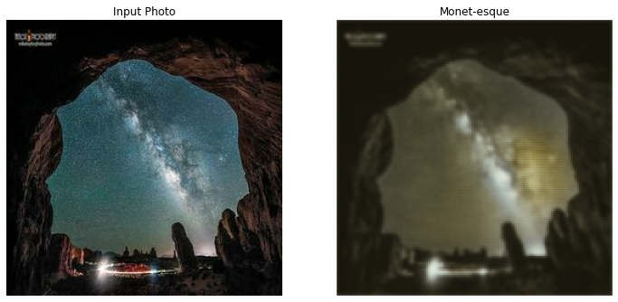

# Style Transfer using a CycleGAN

Generative Neural Networks are a very different story compared to "normal" Neural Networks. Since they are trained to learn the probability distribution from data rather than the marginal distribution of a target feature, you can sample them just like any other probability distribution and "create" your own data. A very well-known example of this is the **Generative Adversarial Network** \(GAN\), in which two rival networks are trained to generate realistic data based on a training input.

A visually appealing example of this type of architecture is the **CycleGAN.** Conceptually, it is an adversarial network designed to learn a mapping between two different datasets, in order to be able to create data from one or the other. A lot of additional information, as well as some examples for this concept, can be found on the original paper author's page [here](https://junyanz.github.io/CycleGAN/).

Now we want to take real photographs and use a CycleGAN network to turn it into something that looks just like a Monet painting. This concept is commonly called Style Transfer - with it, you could for example take any painter's style and apply it to your heart's content on any image, creating a perfectly realistic rendition of that image in that painter's style, provided you have enough real sample paintings to sufficiently train such a network.

## Getting started

If you have never run a ZenML pipeline before, we recommend you check out [the quickstart first.](../steps/quickstart.md)

If you are interested in the source code powering this example, feel free to check it out on [GitHub.](https://github.com/maiot-io/zenml/tree/main/examples/gan)

Other than that, we can jump right in! Let us import the necessary ZenML functionality and create a fresh training pipeline.

```python
from examples.gan.preprocessing.preprocessor import GANPreprocessor
from examples.gan.trainer.trainer_step import CycleGANTrainer
from zenml.datasources import ImageDatasource
from zenml.pipelines import TrainingPipeline
from zenml.repo import Repository
from zenml.steps.split import CategoricalDomainSplit

gan_pipeline = TrainingPipeline(name="cycle_gan", enable_cache=True)
```

### Preparing the data

#### Disclaimer: The data is sourced from the CycleGAN repository located [here.](https://junyanz.github.io/CycleGAN/)

Citation for the original paper:

```text
Unpaired Image-to-Image Translation using Cycle-Consistent Adversarial Networks.

Jun-Yan Zhu*, Taesung Park*, Phillip Isola, Alexei A. Efros

Berkeley AI Research Lab, UC Berkeley

IEEE International Conference on Computer Vision (ICCV) 2017. (* equal contributions)
```

The data that we are dealing with in this example are images. Some of them are images of Monet paintings, others are real images with arbitrary contents. This data is made available on a public ZenML Google Cloud Storage bucket. You can access it for your pipeline by defining an image datasource and adding it to your pipeline. In this particular case, we point the datasource to a smaller fraction of the dataset by selecting the `cycle_gan_mini` subfolder.

```python
base_path = "gs://zenml_quickstart/cycle_gan_mini"

ds = ImageDatasource(name="gan_images", base_path=base_path)

gan_pipeline.add_datasource(ds)
```

The `gs://zenml_quickstart/cycle_gan_mini` storage folder contains a small fraction of the full dataset of images. Running a pipeline on the full data takes a considerable amount of time and might be overkill if you are just looking for a quick demo. If you do want to run the pipeline with the full dataset, there are two options:

1. Either change the path to `base_path="gs://zenml_quickstart/cycle_gan"`, the folder that contains the whole dataset,

   or

2. Download the full dataset from the folder to your local machine \(about 100 MB in size\) and customize your data by

   using the `prepare_gan_images.py` script located in the

   [GitHub source folder.](https://github.com/maiot-io/zenml/tree/main/examples/gan)

### Adding a split

We now add a split component to our pipeline. In this example, the split takes a slightly different role than it otherwise would. Normally, the split takes care of partitioning the data into different subsets that are used for training and model evaluation. In this case, we use the split to separate the Monet paintings from the real images. The CycleGAN architecture works by feeding the model a pair consisting of a real image and a Monet painting, which it uses to calculate cycle losses and gradients.

As a split attribute, we put in a metadata feature called `label` into the image metadata, which equals `monet` for Monet paintings and `real` for real photos. Defining a split based on this attribute works as follows:

```python
label_split = CategoricalDomainSplit(categorical_column="label",
                                     split_map={"train": ["monet"],
                                                "eval": ["real"]})
gan_pipeline.add_split(label_split)
```

This way, we assigned all Monet paintings to the `train` dataset and all real photos to the `eval` dataset. These names are a little misleading in this context, as both datasets will be used in training, but the logic behind this is the same.

### Adding a preprocessing step

Before we can use the images in a training pipeline, we have to read them in first. Internally, images are treated as byte strings, which cannot be processed directly in a machine learning model. Therefore, we need to convert them to tensors first. Additionally, we normalize the image values between -1 and 1. This happens in a custom preprocessing step.

```python
gan_pipeline.add_preprocesser(GANPreprocessor())
```

### Adding a trainer step

Now we are almost done with the required pipeline components. The only missing component is the trainer, which takes responsibility for training and saving the machine learning model.

Just as for the preprocessing, we opt for a custom Trainer step by subclassing the built-in feedforward trainer designed for use with feedforward neural networks. Our custom step contains the CycleGAN implementation as well as some data preparation code. In addition, there is a custom `TensorBoardImage` callback that applies the trained model to the same image after every training epoch, thus visualizing the development of the model's style learning process over the course of the training.

```python
gan_pipeline.add_trainer(CycleGANTrainer(epochs=25))
```

You can specify any number of epochs you like here. Just be aware that a single CycleGAN step \(i.e. processing a single image pair\) takes between 1-10 seconds depending on your local hardware, so a full epoch could easily take a couple of minutes.

### Running your pipeline and checking your results

Now we are ready to run the CycleGAN pipeline.

```python
gan_pipeline.run()
```

Beautiful! To visualize your model's style learning process, you can start a TensorBoard session in the location of your CycleGAN's training artifact location. The exact process is detailed in the full Jupyter Notebook example on [GitHub.](https://github.com/maiot-io/zenml/blob/main/examples/gan/cycle_gan.ipynb)


In TensorBoard, by clicking on the "images" tab, you can view the evolving styling of the example image over the course of all epochs by moving the slider.

An example comparison between a real image and a Monet-esque generated one can be seen below. This particular image was output by a model that was trained on Google Cloud AI Platform with a GPU instance. To learn how to train a CycleGAN model using a Google Cloud GPU, check out the [source code on Github](https://github.com/maiot-io/zenml/tree/main/examples/gan).



We hope you enjoyed this tutorial. See you for the next one!

