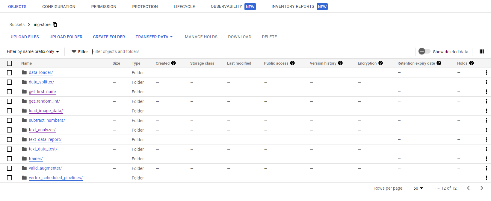
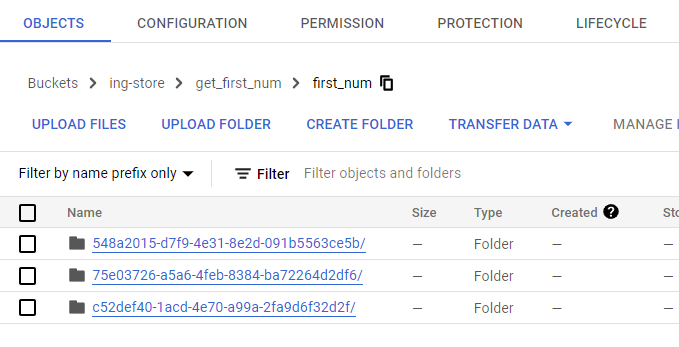
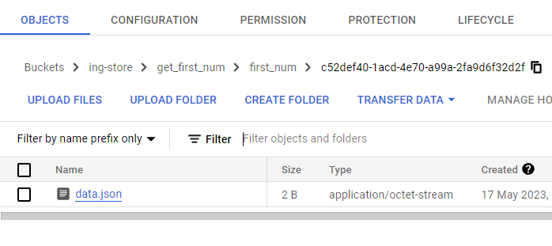
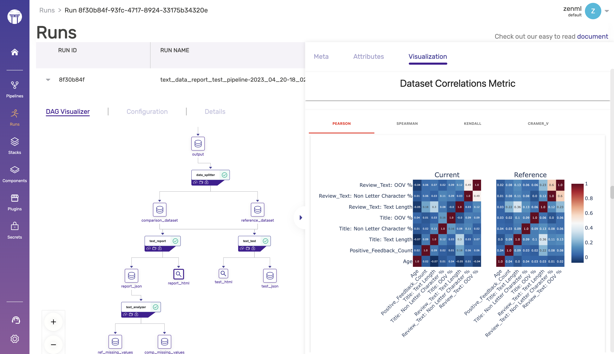


This is an older version of the ZenML documentation. To check the latest version please [visit https://docs.zenml.io](https://docs.zenml.io)


# Artifact management

ZenML seamlessly integrates data versioning and lineage into its core functionality. When a pipeline is executed, each run generates automatically tracked and managed artifacts. One can easily [view the entire lineage](../../starter-guide/fetch-runs-after-execution.md) of how artifacts are created and interact with them. The dashboard is also a way to interact with the artifacts produced by different pipeline runs. ZenML's artifact management, caching, lineage tracking, and visualization capabilities can help gain valuable insights, streamline the experimentation process, and ensure the reproducibility and reliability of machine learning workflows.

## Artifact Versioning, Caching, and Lineage

Each time a ZenML pipeline runs, the system first checks if there have been any changes in the inputs, outputs, parameters, or configuration of the pipeline steps. Each step in a run gets a new directory in the artifact store:

Suppose a step is new or has been modified. In that case, ZenML creates a new directory structure in the [Artifact Store](../../../stacks-and-components/component-guide/artifact-stores/artifact-stores.md) with a unique ID and stores the data using the appropriate materializers in this directory.

On the other hand, if the step remains unchanged, ZenML intelligently decides whether to cache the step or not. By caching steps that have not been modified, ZenML can save [valuable time and computational resources](../../starter-guide/cache-previous-executions.md), allowing you to focus on experimenting with different configurations and improving your machine-learning models without the need to rerun unchanged parts of your pipeline.

With ZenML, you can easily trace an artifact back to its origins and understand the exact sequence of executions that led to its creation, such as a trained model. This feature enables you to gain insights into the entire lineage of your artifacts, providing a clear understanding of how your data has been processed and transformed throughout your machine-learning pipelines. With ZenML, you can ensure the reproducibility of your results, and identify potential issues or bottlenecks in your pipelines. This level of transparency and traceability is essential for maintaining the reliability and trustworthiness of machine learning projects, especially when working in a team or across different environments.

By tracking the lineage of artifacts across environments and stacks, ZenML enables ML engineers to reproduce results and understand the exact steps taken to create a model. This is crucial for ensuring the reliability and reproducibility of machine learning models, especially when working in a team or across different environments.

## Artifact Management with Materializers

[Materializers](handle-custom-data-types.md) play a crucial role in ZenML's artifact management system. They are responsible for handling the serialization and deserialization of artifacts, ensuring that data is consistently stored and retrieved from the [artifact store](../../../stacks-and-components/component-guide/artifact-stores/artifact-stores.md). Each materializer stores data flowing through a pipeline in one or more files within a unique directory in the artifact store:

Materializers are designed to be extensible and customizable, allowing you to define your own serialization and deserialization logic for specific data types or storage systems. By default, ZenML provides built-in materializers for common data types and uses `cloudpickle` to pickle objects where there is no default materializer. If you want direct control over how objects are serialized, you can easily create custom materializers by extending the `BaseMaterializer` class and implementing the required methods for your specific use case. Read more about materializers [here](handle-custom-data-types.md).

When a pipeline runs, ZenML uses the appropriate materializers to save and load artifacts using the ZenML `fileio` system (built to work across multiple artifact stores). This not only simplifies the process of working with different data formats and storage systems but also enables artifact caching and lineage tracking. You can see an example of a default materializer (the `numpy` materializer) in action [here](https://github.com/zenml-io/zenml/blob/main/src/zenml/materializers/numpy_materializer.py).

## Visualizing Artifacts

Materializers can also generate visualizations for your data. By overriding the `save_visualizations()` method in your custom materializer, you can create tailored visualizations for specific artifact types. These visualizations can be viewed in the ZenML dashboard or interactively explored in Jupyter notebooks using the `visualize()` method of an artifact.

ZenML automatically saves visualizations for many common data types, allowing you to view them in the ZenML dashboard. This provides an intuitive way to explore and understand the artifacts generated by your ML pipelines, making it easier to identify patterns, trends, and potential issues in your data and models.

By leveraging ZenML's artifact management, caching, lineage tracking, and visualization capabilities, you can gain valuable insights into your models, streamline your experimentation process, and ensure the reproducibility and reliability of your machine-learning workflows.

See the [Artifact Visualization Docs Page](visualize-artifacts.md) for more
information.

<!-- For scarf -->
<figure></figure>
