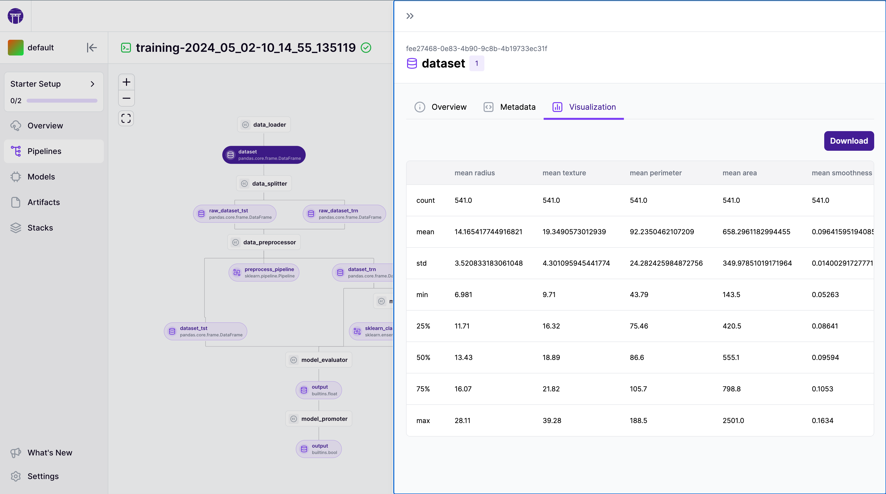

# Visualize artifacts

ZenML automatically saves visualizations of many common data types and allows you to view these visualizations in the ZenML dashboard:


Alternatively, any of these visualizations can also be displayed in Jupyter notebooks using the [artifact.visualize() method](../../starter-guide/fetch-runs-after-execution.md#artifact-visualizations):


Currently, the following visualization types are supported:

* **HTML:** Embedded HTML visualizations such as data validation reports,
* **Image:** Visualizations of image data such as Pillow images or certain numeric numpy arrays,
* **CSV:** Tables, such as the pandas DataFrame `.describe()` output,
* **Markdown:** Markdown strings or pages.

## Creating Custom Visualizations

There are two ways how you can add custom visualizations to the dashboard:

* If you are already handling HTML, Markdown, or CSV data in one of your steps, you can have them visualized in just a few lines of code by casting them to a [special class](visualize-artifacts.md#visualization-via-special-return-types) inside your step.
* If you want to automatically extract visualizations for all artifacts of a certain data type, you can define type-specific visualization logic by [building a custom materializer](visualize-artifacts.md#visualization-via-materializers).

### Visualization via Special Return Types

If you already have HTML, Markdown, or CSV data available as a string inside your step, you can simply cast them to one of the following types and return them from your step:

* `zenml.types.HTMLString` for strings in HTML format, e.g., `"# Header\nSome text"`,
* `zenml.types.MarkdownString` for strings in Markdown format, e.g., `"<h1>Header</h1>Some text"`,
* `zenml.types.CSVString` for strings in CSV format, e.g., `"a,b,c\n1,2,3"`.

#### Example:

```python
from zenml.types import CSVString

@step
def my_step() -> CSVString:
    some_csv = "a,b,c\n1,2,3"
    return CSVString(some_csv)
```

This would create the following visualization in the dashboard:



### Visualization via Materializers

If you want to automatically extract visualizations for all artifacts of a certain data type, you can do so by overriding the `save_visualizations` method of the corresponding materializer. See the [materializer docs page](handle-custom-data-types.md#optional-how-to-visualize-the-artifact) for more information on how to create custom materializers that do this.

## Disabling Visualizations

If you would like to disable artifact visualization altogether, you can set `enable_artifact_visualization` at either pipeline or step level:

```python
@step(enable_artifact_visualization=False)
def my_step():
    ...

@pipeline(enable_artifact_visualization=False)
def my_pipeline():
    ...
```

## Troubleshooting

### Configuring Artifact Stores

If all visualizations of a certain pipeline run are not showing up in the dashboard, it might be that your ZenML server does not have the required dependencies or permissions to access that artifact store. See the [custom artifact store docs page](../../../stacks-and-components/component-guide/artifact-stores/custom.md#enabling-artifact-visualizations-with-custom-artifact-stores) for more information.

<!-- For scarf -->
<figure></figure>
