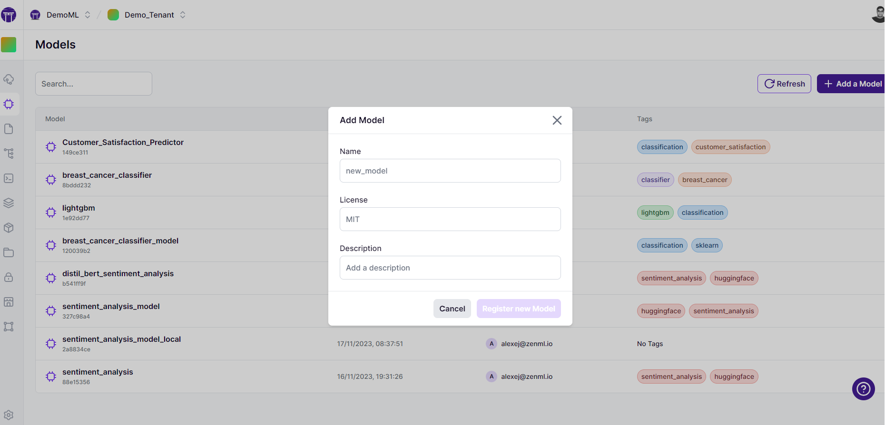

# Model management

A `Model` is simply an entity that groups pipelines, artifacts, metadata, and other crucial business data into a unified entity. Please note that one of the most common artifacts that is associated with a Model in ZenML is the so-called technical model, which is the actually model file/files that holds the weight and parameters of a machine learning training result. However, this is not the only artifact that is relevant; artifacts such as the training data and the predictions this model produces in production are also linked inside a ZenML Model. In this sense, a ZenML Model is a concept that more broadly encapsulates your ML products business logic.

Models are first-class citizens in ZenML and as such
viewing and using them is unified and centralized in the ZenML API, client as
well as on the [ZenML Cloud](https://zenml.io/cloud) dashboard.

A Model captures lineage information and more. Within a Model, different Model
versions can be staged. For example, you can rely on your predictions at a
specific stage, like `Production`, and decide whether the Model version should
be promoted based on your business rules during training. Plus, accessing data
from other Models and their versions is just as simple.

The Model Control Plane is how you manage your models through this unified
interface. It allows you to combine the logic of your pipelines, artifacts and
crucial business data along with the actual 'technical model'.

## Model versions

ZenML is already versioning your models and storing some metadata, but the Model
Control Plane allows you more flexibility in terms of how you refer to and use
the models. Moreover, you can now also associate them with stages and promote
them to production, e.g. based on your business rules during training. You also
have an interface that allows you to link these versions with non-technical
artifacts and data, e.g. business data, datasets, or even stages in your process
and workflow.

## Registering models

Registering models can be done in a number of ways depending on your specific
needs. You can explicitly register models using the CLI or the Python SDK, or
you can just allow ZenML to implicitly register your models as part of a
pipeline run. (If you are using [ZenML Cloud](https://cloud.zenml.io/?utm_source=docs&utm_medium=referral_link&utm_campaign=cloud_promotion&utm_content=signup_link/) you already
have access to [a dashboard interface that allows you to register
models](./model-control-plane-dashboard.md).)

### Explicit CLI registration

Registering models using the CLI is as straightforward as the following command:

```bash
zenml model register iris_logistic_regression --license=... --description=...
```

You can view some of the options of what can be passed into this command by
running `zenml model register --help` but since you are using the CLI outside a
pipeline run the arguments you can pass in are limited to non-runtime items. You
can also associate tags with models at this point, for example, using the
`--tag` option.

### Explicit dashboard registration

[ZenML Cloud](https://zenml.io/cloud) can register their models directly from
the cloud dashboard interface.

<figure><figcaption><p>Register a model on the [ZenML Cloud](https://zenml.io/cloud) dashboard</p></figcaption></figure>

### Explicit Python SDK registration

You can register a model using the Python SDK as follows:

```python
from zenml.models import Model
from zenml import Client

Client().create_model(
    name="iris_logistic_regression",
    license="Copyright (c) ZenML GmbH 2023",
    description="Logistic regression model trained on the Iris dataset.",
    tags=["regression", "sklearn", "iris"],
)
```

### Implicit registration by ZenML

The most common use case for registering models is to do so implicitly as part
of a pipeline run. This is done by specifying a `Model` object as part of
the `model` argument of the `@pipeline` decorator.

As an example, here we have a training pipeline which orchestrates the training
of a model object, storing datasets and the model object itself as links within
a newly created Model version. This integration is achieved by configuring the
pipeline within a Model Context using `Model`. The name
is specified, while other fields remain optional for this task.

```python
from zenml import pipeline
from zenml.model import Model

@pipeline(
    enable_cache=False,
    model=Model(
        name="demo",
        license="Apache",
        description="Show case Model Control Plane.",
    ),
)
def train_and_promote_model():
    ...
```

Running the training pipeline creates a new model version, all while
maintaining a connection to the artifacts.

## Model versions

Each model can have many versions. Model versions are a way for you to
track different iterations of your training process, complete with some extra
dashboard and API functionality to support the full ML lifecycle.

### When are model versions created?

Model versions are created implicitly as you are running your machine learning
training, so you don't have to immediately think about this. If you want more
control over versions, our API has you covered, with an option to explicitly
name your versions.

### Explicitly name your model version

If you want to explicitly name your model version, you can do so by passing in
the `version` argument to the `Model` object. If you don't do this, ZenML
will automatically generate a version number for you.

```python
from zenml.model import Model

model= Model(
    name="my_model",
    version="1.0.5"
)

# The step configuration will take precedence over the pipeline
@step(model=model)
def svc_trainer(...) -> ...:
    ...

# This configures it for all steps within the pipeline
@pipeline(model=model)
def training_pipeline( ... ):
    # training happens here
```

Here we are specifically setting the model configuration for a particular step or for
the pipeline as a whole.

### Autonumbering of versions

ZenML automatically numbers your model versions for you. If you don't specify a version number, or if you pass `None` into the `version`
argument of the `Model` object, ZenML will automatically generate a
version number (or a new version, if you already have a version) for you. For
example if we had a model version `really_good_version` for model `my_model` and
we wanted to create a new version of this model, we could do so as follows:

```python
from zenml import Model, step

model = Model(
    name="my_model",
    version="even_better_version"
)

@step(model=model)
def svc_trainer(...) -> ...:
    ...
```

A new model version will be created and ZenML will track that this is the next
in the iteration sequence of the models using the `number` property. If
`really_good_version` was the 5th version of `my_model`, then
`even_better_version` will be the 6th version of `my_model`.

```python
earlier_version = Model(
    name="my_model",
    version="really_good_version"
).number # == 5

updated_version = Model(
    name="my_model",
    version="even_better_version"
).number # == 6
```

## Stages and Promotion

Model stages are a way to model the progress that different versions takes through various
stages in its lifecycle. A ZenML Model version can be promoted to a different
stage through the Dashboard, the ZenML CLI or code.

This is a way to signify the progression of your model version through the ML
lifecycle and are an extra layer of metadata to identify the state of a
particular model version. Possible options for stages are:

- `staging`: This version is staged for production.
- `production`: This version is running in a production setting.
- `latest`: The latest version of the model. This is a virtual stage to retrieve the latest version only - versions cannot be promoted to `latest`.
- `archived`: This is archived and no longer relevant. This stage occurs when a
  model moves out of any other stage.

Your own particular business or use case logic will determine which model
version you choose to promote, and you can do this in the following ways:

### Promotion via CLI

This is probably the least common way that you'll use, but it's still possible
and perhaps might be useful for some use cases or within a CI system, for
example. You simply use the following CLI subcommand:

```bash
zenml model version update iris_logistic_regression --stage=...
```

### Promotion via Cloud Dashboard

This feature is not yet available, but soon you will be able to promote your
model versions directly from the ZenML Cloud dashboard. You can learn more about
this feature [here](./model-control-plane-dashboard.md).

### Promotion via Python SDK

This is the most common way that you'll use to promote your models. You
can see how you would do this here:

```python
from zenml import Client

MODEL_NAME = "iris_logistic_regression"
from zenml.enums import ModelStages

model = Model(name=MODEL_NAME, version="1.2.3")
model.set_stage(stage=ModelStages.PRODUCTION)

# get latest model and set it as Staging
# (if there is current Staging version it will get Archived)
latest_model = Model(name=MODEL_NAME, version=ModelStages.LATEST)
latest_model.set_stage(stage=ModelStages.STAGING)
```

Within a pipeline context, you would get the model from the step context
but the mechanism for setting the stage is the same.

```python
from zenml import get_step_context, step, pipeline
from zenml.enums import ModelStages

@step
def promote_to_staging():
    model = get_step_context().model
    model.set_stage(ModelStages.STAGING, force=True)

@pipeline(
    ...
)
def train_and_promote_model():
    ...
    promote_to_staging(after=["train_and_evaluate"])
```

## Linking Artifacts to Models

Artifacts generated during pipeline runs can be linked to models in ZenML. This connecting of artifacts provides lineage tracking and transparency into what data and models are used during training, evaluation, and inference.

There are a few ways to link artifacts:

### Configuring the Model

The easiest way is to configure the `model` parameter on the `@pipeline` decorator or `@step` decorator:

```python
from zenml.model import Model

model = Model(
    name="my_model",
    version="1.0.0"
)

@pipeline(model=model)
def my_pipeline():
    ...
```

This will automatically link all artifacts from this pipeline run to the
specified model configuration.

### Artifact Configuration

A ZenML model supports linking three types of artifacts:

* `Data artifacts`: These are the default artifacts. If nothing is specified, all artifacts are grouped under this category.
* `Model artifacts`: If there is a physical model artifact like a `.pkl` file or a model neural network weights file, it should be grouped in this category.
* `Deployment artifacts`: These artifacts are to do with artifacts related to the endpoints and deployments of the models.

You can also explicitly specify the linkage on a per-artifact basis by passing a
special configuration to the Annotated output:

```python
from zenml import get_step_context, step, ArtifactConfig

@step
def svc_trainer(
    X_train: pd.DataFrame,
    y_train: pd.Series,
    gamma: float = 0.001,
) -> Tuple[
    # This third argument marks this as a Model Artifact
    Annotated[ClassifierMixin, ArtifactConfig("trained_model", is_model_artifact=True)],
    # This third argument marks this as a Data Artifact
    Annotated[str, ArtifactConfig("deployment_uri", is_deployment_artifact=True)],
]:
    ...
```

The `ArtifactConfig` object allows configuring model linkage directly on the
artifact, and you specify whether it's for a model or deployment by using the
`is_model_artifact` and `is_deployment_artifact` flags (as shown above) else it
will be assumed to be a data artifact.

### Produce intermediate artifacts

It often handy to save some of your work half-way: steps like epoch-based training can be running slow and you don't want to loose any checkpoints along the way if an error occurs.
You can use the `save_artifact` utility function to save your data assets as ZenML artifacts. Moreover, if your step has the Model context configured in the `@pipeline` or `@step` decorator it will be automatically linked to it, so you can get easy access to it using the Model Control Plane features.

```python
from zenml import step, Model
from zenml.artifacts.utils import save_artifact


@step(model=Model(name="MyModel", version="1.2.42"))
def trainer(
    trn_dataset: pd.DataFrame,
) -> Annotated[
    ClassifierMixin, ArtifactConfig("trained_model", is_model_artifact=True)
]:  # this configuration will be applied to `model` output
    """Step running slow training."""
    ...

    for epoch in epochs:
        checkpoint = model.train(epoch)
        # this will save each checkpoint in `training_checkpoint` artifact
        # with distinct version e.g. `1.2.42_0`, `1.2.42_1`, etc.
        # Checkpoint artifacts will be linked to `MyModel` version `1.2.42`
        # implicitly.
        save_artifact(
            data=checkpoint,
            name="training_checkpoint",
            version=f"1.2.42_{epoch}",
        )

    ...

    return model
```

### Link artifacts explicitly

If you would like to link an artifact to a model not from the step context or even outside of a step, you can use the `link_artifact_to_model` function.
All you need is ready to link artifact and the configuration of a model.

```python
from zenml import step, Model, link_artifact_to_model, save_artifact
from zenml.client import Client


@step
def f_() -> None:
    # produce new artifact
    new_artifact = save_artifact(data="Hello, World!", name="manual_artifact")
    # and link it inside a step
    link_artifact_to_model(
        artifact_version_id=new_artifact.id,
        model=Model(name="MyModel", version="0.0.42"),
    )


# use existing artifact
existing_artifact = Client().get_artifact_version(name_id_or_prefix="existing_artifact")
# and link it even outside of a step
link_artifact_to_model(
    artifact_version_id=existing_artifact.id,
    model=Model(name="MyModel", version="0.2.42"),
)
```

<!-- For scarf -->
<figure></figure>
