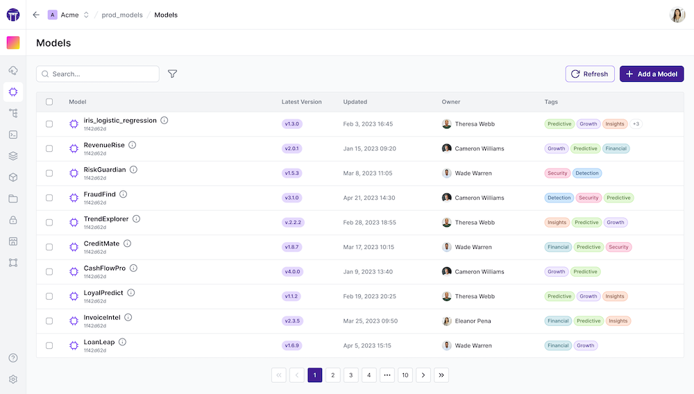

# Model Control Plane Dashboard

The Model Control Plane Dashboard is a web-based dashboard that allows you to
view and manage your models. It is currently available to users of ZenML Cloud.

To try this out, please sign up for ZenML Cloud and use the dashboard available
there to view your models. Some of the features are also highlighted in the
starter guide so be sure to [check out the section on tracking ML models](../../starter-guide/track-ml-models.md) for more.

<!-- For scarf -->
<figure></figure>
