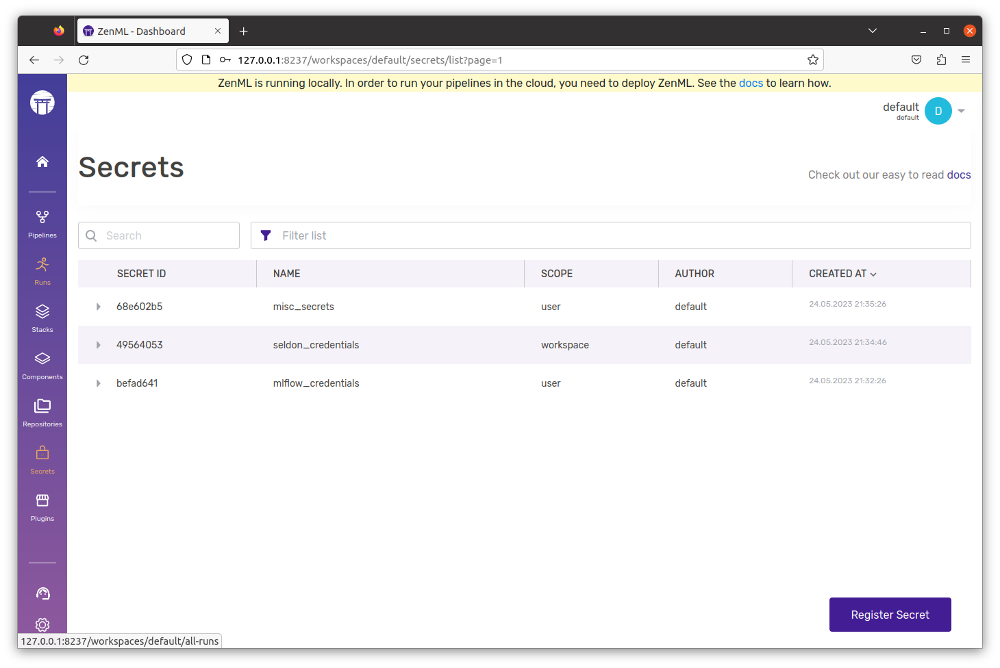

# Use the Secret Store

## What is a ZenML secret?

ZenML secrets are groupings of **key-value pairs** which are securely stored in the ZenML secrets store. Additionally, a secret always has a **name** that allows you to fetch or reference them in your pipelines and stacks.

<figure><figcaption>
List of Secrets managed through ZenML
</figcaption></figure>

## Centralized secrets store


The stack component formerly known as Secrets Managers is being deprecated in favor of [the centralized ZenML secrets store](secret-management.md#centralized-secrets-store). Going forward, it is recommended to use the ZenML secrets store instead of secrets manager stack components to configure and store secrets. [Referencing secrets in your pipelines and stacks](secret-management.md#use-the-secret-store) works the same way regardless of whether you are using a secrets manager or the centralized secrets store. If you already use secrets managers to manage your secrets, please use the provided `zenml secrets-manager secrets migrate` CLI command to migrate your secrets to the centralized secrets store.


ZenML provides a centralized secrets management system that allows you to register and manage secrets in a secure way. In a local ZenML deployment, the secrets are stored in the local SQLite database. Once you are connected to a remote ZenML server, the secrets are stored in the secrets management back-end that the server is configured to use, but all access to the secrets is done through the ZenML server API.

Currently, the ZenML server can be configured to use one of the following supported secrets store back-ends:

* the SQL database that the ZenML server is using to store other managed objects such as pipelines, stacks, etc. This is the default option.
* the AWS Secrets Manager
* the GCP Secret Manager
* the Azure Key Vault
* the HashiCorp Vault
* a custom secrets store back-end implementation is also supported

Configuring the specific secrets store back-end that the ZenML server uses is done at deployment time. For more information on how to deploy a ZenML server and configure the secrets store back-end, refer to your deployment strategy inside the [deployment guide](../../../deploying-zenml/zenml-self-hosted/zenml-self-hosted.md).

<!-- For scarf -->
<figure></figure>
