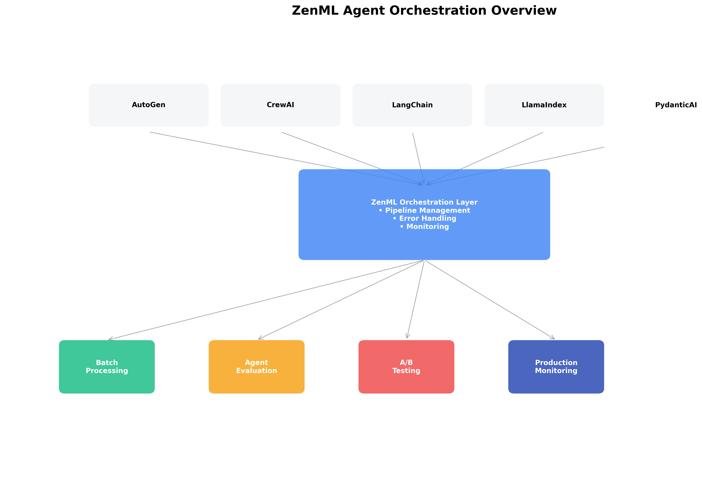

# Agent guide

Transform your agent development from experimental scripts into systematic, production-ready workflows using ZenML as your agent development platform.

<figure><figcaption>
ZenML provides a complete agent development workflow with evaluation, versioning, and deployment capabilities.
</figcaption></figure>

## Why pipelines for agents (for ML/AI engineers)

Agents evolve quickly: prompts change, tools are added/removed, and behavior shifts in production. A pipeline-first approach gives you reproducibility, lineage, and safe iteration: you version prompts and configs, deploy with confidence, and evaluate continuously on real traces. 

ZenML lets you apply the same rigor you use for classical ML to agents—regardless of whether you use an agent framework or direct LLM calls. The benefit is speed with control: faster iteration loops, clear governance, and a shared operating model across teams.

Common pitfalls of ad‑hoc agent work today:
- Experiment across notebooks and frameworks without shared structure
- Eyeball outputs instead of evaluating systematically  
- Deploy without lineage, then hope production matches development
- Struggle to improve based on real usage and missing traces

**ZenML changes this** by applying the same systematic rigor you use for traditional ML to agent development.

Looking for a runnable starting point? See the end-to-end minimal example in [`examples/minimal_agent_production`](https://github.com/zenml-io/zenml/tree/main/examples/minimal_agent_production).

## This Guide's Journey

We'll take you through the complete agent development workflow:

1. **[Development & Experimentation](agent-fundamentals.md)** - Set up systematic agent development with ZenML, covering framework integration, tool setup, and experiment tracking
2. **[Production & Deployment](agent-deployment.md)** - Deploy your agents with observability and monitoring while maintaining ZenML integration
3. **[Evaluation & Improvement](agent-evaluation.md)** - Use production data to systematically evaluate and improve agents using proven LLMOps patterns

Each chapter builds on the previous one, creating a complete workflow from initial experimentation through deployment to data-driven improvement.

## What You'll Learn

**After Chapter 1**: How to wrap any agent (framework or custom) in ZenML pipelines for systematic development
**After Chapter 2**: How to deploy agents in production while maintaining configuration lineage and observability
**After Chapter 3**: How to use production traces to systematically evaluate and improve agents over time

## Prerequisites

- Python 3.9+ environment with ZenML installed
- Familiarity with [ZenML fundamentals](../starter-guide/)
- Experience with [LLM evaluation patterns](../llmops-guide/evaluation/) (helpful but not required)

Ready? Let's start with [development fundamentals](agent-fundamentals.md) to set up your systematic agent development workflow.