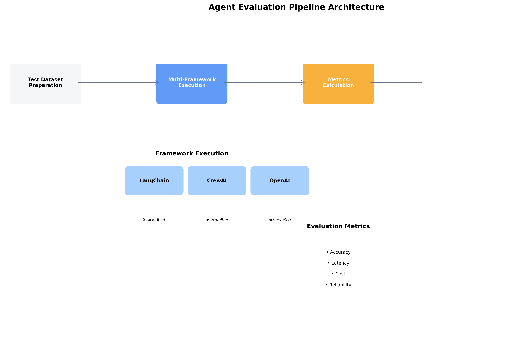

# Evaluation & improvement

Now that you have systematic agent development ([Chapter 1](agent-fundamentals.md)) and production deployment ([Chapter 2](agent-deployment.md)) set up, let's learn how to use production data to evaluate and improve your agents systematically. Instead of eyeballing outputs, you'll apply the same rigorous evaluation patterns used in LLM development.

<figure><figcaption><p>Systematic evaluation transforms guesswork into data-driven agent improvement.</p></figcaption></figure>

## Building on Your Development Setup

From Chapter 1 you have development results, and from Chapter 2 you have production traces. The question now is: which configuration performs best, and should you promote or iterate?

## Leveraging LLM Evaluation Patterns

Production agent evaluation builds directly on ZenML's [proven LLM evaluation patterns](../llmops-guide/evaluation/) using real production data. The key insight: **agents are LLMs with enhanced capabilities**, so the same evaluation principles apply.

### Quality Evaluation

Apply the same patterns as [LLM generation evaluation](../llmops-guide/evaluation/generation.md) to production agent data:

```python
@step
def evaluate_agent_responses(
    agent_results: Dict[str, Any]
) -> Annotated[Dict[str, float], "quality_metrics"]:
    """Evaluate response quality using LLM-as-judge patterns."""
    
    evaluator = LLMEvaluator(model="gpt-4")  # Same as LLMOps guide
    
    responses = [r["response"] for r in agent_results["results"]]
    queries = [r["query"] for r in agent_results["results"]]
    
    # Apply standard evaluation metrics
    accuracy_scores = evaluator.evaluate_batch(
        responses=responses,
        queries=queries,
        metric="accuracy"
    )
    
    helpfulness_scores = evaluator.evaluate_batch(
        responses=responses,
        queries=queries,
        metric="helpfulness"
    )
    
    return {
        "accuracy": np.mean(accuracy_scores),
        "helpfulness": np.mean(helpfulness_scores),
        "response_count": len(responses)
    }
```

### Tool Usage Evaluation

For production agents that use tools, extend [retrieval evaluation patterns](../llmops-guide/evaluation/retrieval.md):

```python
@step
def evaluate_tool_usage(
    agent_results: Dict[str, Any]
) -> Annotated[Dict[str, float], "tool_metrics"]:
    """Evaluate how well agents select and use tools."""
    
    results_with_tools = [r for r in agent_results["results"] 
                         if "tools_used" in r]
    
    if not results_with_tools:
        return {"tool_selection_accuracy": 0.0, "tool_usage_rate": 0.0}
    
    # Tool selection accuracy (like retrieval precision)
    correct_tool_usage = sum(1 for r in results_with_tools 
                           if validate_tool_usage(r))
    
    return {
        "tool_selection_accuracy": correct_tool_usage / len(results_with_tools),
        "tool_usage_rate": len(results_with_tools) / len(agent_results["results"])
    }
```

## Complete Evaluation Pipeline

Now systematically evaluate your production agent performance:

```python
@pipeline
def agent_comparison_pipeline() -> Annotated[Dict[str, Any], "comparison_report"]:
    """Compare different agent configurations systematically."""
    
    # Load the same test dataset for fair comparison
    test_queries = load_evaluation_dataset()
    
    # Get production data from Chapter 2 deployment
    production_traces = collect_production_traces()
    production_data = convert_traces_to_evaluation_format(production_traces)
    
    # Run current production agent on test dataset
    current_results = evaluate_production_agent_on_dataset(test_queries)
    
    # Evaluate production performance
    production_quality = evaluate_agent_responses(production_data)
    current_quality = evaluate_agent_responses(current_results)
    
    production_tools = evaluate_tool_usage(production_data)
    current_tools = evaluate_tool_usage(current_results)
    
    # Compare production vs current performance
    comparison = {
        "production_traces": {**production_quality, **production_tools},
        "current_evaluation": {**current_quality, **current_tools}
    }
    
    # Determine if retraining is needed
    improvement_needed = determine_improvement_needs(comparison)
    
    return {
        "comparison": comparison,
        "improvement_needed": improvement_needed,
        "production_dataset_size": len(production_traces),
        "evaluation_dataset_size": len(test_queries)
    }
```

## Using Your Existing LLM Infrastructure

The power of this approach: **your existing LLM evaluation setup works directly with production agent data**.

```python
@step
def reuse_llm_evaluation_infrastructure(
    agent_results: Dict[str, Any]
) -> Annotated[Dict[str, Any], "comprehensive_metrics"]:
    """Reuse existing LLM evaluation datasets and metrics."""
    
    # Combine production traces with existing evaluation datasets
    production_dataset = convert_traces_to_dataset(agent_results["production_traces"])
    existing_dataset = load_evaluation_dataset("customer_support_v1")  # From LLM work
    combined_dataset = combine_datasets([production_dataset, existing_dataset])
    
    # Apply your existing evaluation metrics to production data
    quality_scores = evaluate_with_existing_metrics(
        agent_results["results"], 
        combined_dataset
    )
    
    # Use your existing LLM evaluators on production traces
    semantic_similarity = calculate_semantic_similarity(
        agent_results["results"],
        combined_dataset
    )
    
    return {
        "quality_scores": quality_scores,
        "semantic_similarity": semantic_similarity,
        "production_data_included": True
    }
```

## Making Data-Driven Decisions

With production traces, you have real performance data:

```python
@step
def select_winning_configuration(
    comparison_report: Dict[str, Any]
) -> Annotated[Dict[str, Any], "selection_decision"]:
    """Make data-driven agent selection."""
    
    comparison = comparison_report["comparison"]
    
    # Define success criteria
    quality_threshold = 0.8
    tool_accuracy_threshold = 0.7
    
    scores = {}
    for config_name, metrics in comparison.items():
        quality_score = metrics.get("accuracy", 0) * 0.6 + metrics.get("helpfulness", 0) * 0.4
        tool_score = metrics.get("tool_selection_accuracy", 1.0)  # Default to 1.0 if no tools
        
        combined_score = quality_score * 0.7 + tool_score * 0.3
        scores[config_name] = combined_score
    
    winner = max(scores, key=scores.get)
    
    return {
        "winner": winner,
        "scores": scores,
        "meets_threshold": scores[winner] > quality_threshold,
        "recommendation": "deploy" if scores[winner] > quality_threshold else "iterate"
    }
```

## Integration with ZenML Tracking

Every evaluation run is automatically tracked with:

- **Evaluation datasets** and versions
- **Metric calculations** and thresholds
- **Comparison results** across configurations  
- **Winner selection** and reasoning
- **Complete lineage** from development to evaluation

Check your ZenML dashboard to see all evaluations, compare runs, and track improvements over time.

## Best Practices from LLMOps

Following [proven LLM evaluation principles](../llmops-guide/evaluation/evaluation-in-practice.md):

1. **Use consistent datasets** - Same test set for fair comparison
2. **Multiple metrics** - Don't rely on single scores
3. **Statistical significance** - Test with sufficient data  
4. **Automated evaluation** - Run with every experiment
5. **Version everything** - Track datasets, metrics, and thresholds

## What's Next?

You now have systematic evaluation using production data. You can confidently say "Our production agent maintains 85% accuracy on real user queries, with 15% improvement opportunity identified."

This completes the full agent development workflow: systematic development (Chapter 1), production deployment (Chapter 2), and data-driven evaluation and improvement (Chapter 3).


**Key Achievement**: You've created a complete feedback loop from production traces back to systematic agent improvement using proven evaluation patterns.
