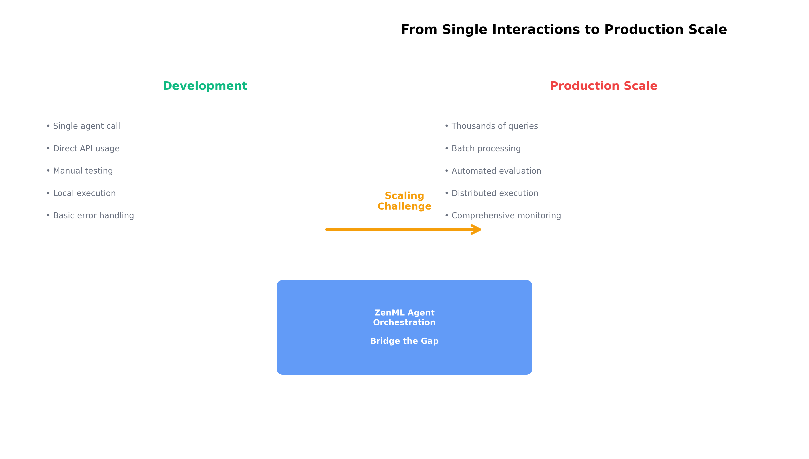
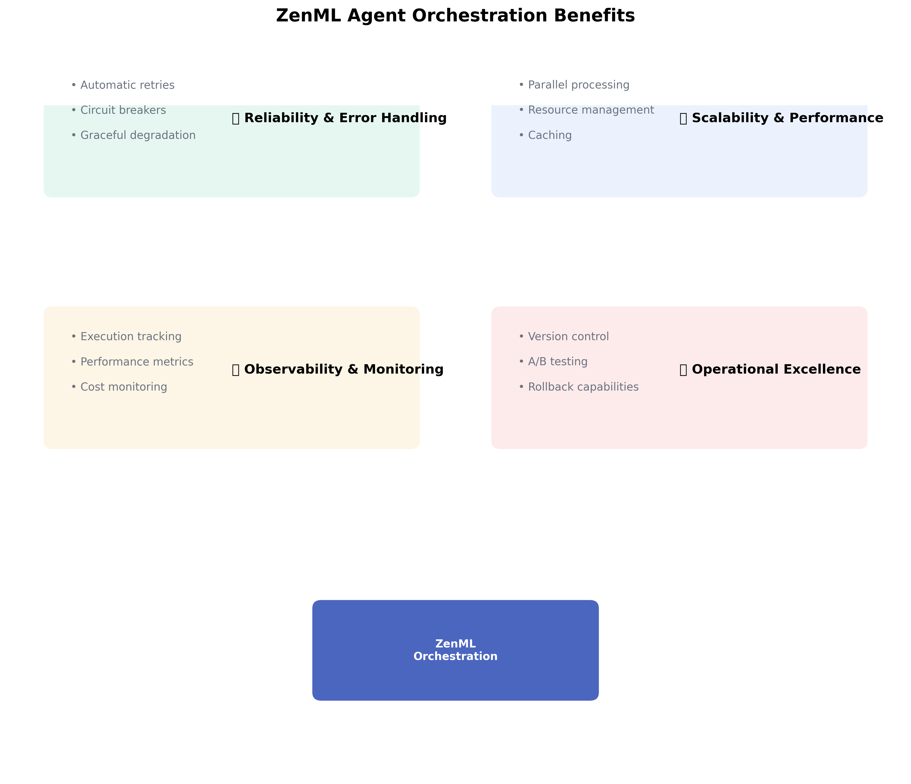

# Development & experimentation

This chapter shows you how to transform experimental agent code into systematic, trackable development using ZenML. You'll learn to wrap any agent implementation in ZenML pipelines for proper experiment tracking and version management.

<figure><figcaption><p>ZenML transforms agent development from experimental scripts into systematic, trackable workflows.</p></figcaption></figure>

## A note on agent orchestrators vs ZenML

Some of you might already be familiar with agent orchestration frameworks like [LangGraph](https://www.langchain.com/langgraph) or the [OpenAI SDK](https://openai.github.io/openai-agents-python/). The good news is that these frameworks integrate seamlessly with ZenML pipelines: you can easily embed agent workflows as steps within your pipeline, allowing you to orchestrate, track, and version your agent experiments alongside the rest of your ML workflow. This means you get the benefits of both worlds—leveraging powerful agent frameworks while maintaining systematic experiment tracking and reproducibility through ZenML.

Having said that, you don't need agent frameworks. Many successful production systems use direct LLM API calls. ZenML works with any approach - frameworks, custom code, or direct API calls. The key is systematic development, not the underlying implementation.


**Quick Start**: If you want to see working examples of ZenML with agent frameworks first, check our [framework integrations example](https://github.com/zenml-io/zenml/tree/main/examples/agent_framework_integrations) with 11+ ready-to-run examples.


## From Scripts to Systematic Development

Most agent development starts like this:

```python
# Experimental notebook approach
agent_v1 = create_langgraph_agent(prompt_template_v1)
agent_v2 = create_custom_agent(prompt_template_v2)

response_v1 = agent_v1.invoke("Analyze this customer feedback...")
response_v2 = agent_v2.run("Analyze this customer feedback...")

# Manual comparison by eyeballing outputs
print("V1:", response_v1)
print("V2:", response_v2)
# Which is better? Hard to tell...
```

ZenML makes this systematic:

```python
@pipeline
def agent_experiment_pipeline(
    agent_config: Dict[str, Any]
) -> Annotated[Dict[str, Any], "experiment_results"]:
    """Track agent experiments systematically."""
    
    # ZenML automatically versions:
    # - Agent configurations and prompts
    # - Test datasets and responses
    # - Performance metrics
    
    test_queries = load_test_dataset()
    agent_responses = run_agent_experiment(agent_config, test_queries)
    
    return agent_responses

# Run multiple experiments - all tracked automatically
config_v1 = {"framework": "langchain", "prompt": "template_v1"}
config_v2 = {"framework": "custom", "prompt": "template_v2"}

results_v1 = agent_experiment_pipeline(config_v1)
results_v2 = agent_experiment_pipeline(config_v2)

# ZenML Dashboard shows all experiments, configurations, and results
```

## Framework-Agnostic Development

ZenML works with any agent implementation. Here is the canonical pattern; choose one of the three approaches and link to the examples below.

### Pattern 1: Direct LLM calls (canonical inline example)
```python
@step
def run_direct_llm_agent(query: str) -> Annotated[str, "llm_response"]:
    """Simple, effective - no framework needed."""
    
    system_prompt = """You are a customer support assistant.
    Analyze the query and provide helpful responses."""
    
    response = openai_client.chat.completions.create(
        model="gpt-5",
        messages=[
            {"role": "system", "content": system_prompt},
            {"role": "user", "content": query}
        ]
    )
    
    return response.choices[0].message.content
```

### Pattern 2: Agent Frameworks
```python
@step  
def run_framework_agent(query: str) -> Annotated[str, "framework_response"]:
    """Use any framework - LangChain, CrewAI, etc."""
    
    # Framework choice doesn't matter to ZenML
    agent = create_langgraph_agent()  # or CrewAI, AutoGen, etc.
    response = agent.invoke(query)
    
    return str(response)
```

### Pattern 3: Custom agent logic
```python
@step
def run_custom_agent(query: str) -> Annotated[Dict[str, Any], "custom_response"]:
    """Your own agent implementation."""
    
    # Multi-step custom logic
    context = retrieve_relevant_context(query)
    analysis = analyze_query_intent(query)
    response = generate_contextual_response(query, context, analysis)
    
    return {
        "response": response,
        "context_used": context,
        "intent": analysis
    }
```

## Tool Integration & Configuration

Modern agents need tools. ZenML helps you manage tool configurations:

```python
@step
def setup_agent_tools() -> Annotated[Dict[str, Any], "tool_config"]:
    """Configure agent capabilities."""
    
    return {
        "tools": [
            {"name": "web_search", "api_key": "search_key"},
            {"name": "database_query", "connection": "postgresql://..."},
            {"name": "send_email", "smtp_config": {...}}
        ],
        "mcp_servers": [
            {"name": "filesystem", "path": "/allowed/files"},
            {"name": "github", "repo": "company/repo"}
        ]
    }

@step
def run_agent_with_tools(
    query: str, 
    tool_config: Dict[str, Any]
) -> Annotated[Dict[str, Any], "agent_results"]:
    """Run agent with configured tools."""
    
    # Initialize tools from config
    tools = initialize_tools(tool_config["tools"])
    
    # Any framework can use these tools
    agent = create_agent_with_tools(tools)
    result = agent.run(query)
    
    # Track which tools were actually used
    tool_usage = extract_tool_usage(result)
    
    return {
        "response": result.response,
        "tools_used": tool_usage,
        "config_version": tool_config.get("version")
    }
```

## Complete Development Pipeline

Here's how everything comes together:

```python
@pipeline
def complete_agent_development_pipeline(
    agent_type: str,
    test_queries: List[str]
) -> Annotated[Dict[str, Any], "development_results"]:
    """Complete agent development workflow."""
    
    # 1. Setup tools and configuration
    tool_config = setup_agent_tools()
    
    # 2. Run agent experiments
    results = []
    for query in test_queries:
        if agent_type == "direct":
            response = run_direct_llm_agent(query)
        elif agent_type == "framework":
            response = run_framework_agent(query)
        else:
            response = run_custom_agent(query)
            
        results.append({"query": query, "response": response})
    
    # 3. Track everything for next chapter (evaluation)
    return {
        "agent_type": agent_type,
        "tool_config": tool_config,
        "results": results,
        "timestamp": datetime.now()
    }
```

## What ZenML Tracks Automatically

Every time you run an experiment, ZenML captures:

- **Agent Configuration**: Framework, prompts, model parameters
- **Tool Setup**: Available tools, MCP servers, API configurations  
- **Input Data**: Test queries and datasets used
- **Outputs**: Agent responses and metadata
- **Environment**: Dependencies, versions, runtime environment
- **Lineage**: Complete chain from config to results

## Ready-to-Use Examples

We provide working examples for 11+ frameworks. Each follows the same ZenML pattern:

- [AutoGen](https://github.com/zenml-io/zenml/tree/main/examples/agent_framework_integrations/autogen) - Multi-agent conversations
- [LangGraph](https://github.com/zenml-io/zenml/tree/main/examples/agent_framework_integrations/langgraph) - Graph-based agents
- [CrewAI](https://github.com/zenml-io/zenml/tree/main/examples/agent_framework_integrations/crewai) - Role-based crews
- [OpenAI SDK](https://github.com/zenml-io/zenml/tree/main/examples/agent_framework_integrations/openai_agents_sdk) - Official OpenAI agents
- [And 7 more...](https://github.com/zenml-io/zenml/tree/main/examples/agent_framework_integrations)

## Getting Started

1. **Pick your approach**: Direct LLM calls, existing framework, or custom logic
2. **Wrap in ZenML pipeline**: Use the patterns shown above
3. **Run experiments**: ZenML tracks everything automatically
4. **Check the dashboard**: See all your experiments and configurations

You now have systematic agent development with full experiment tracking. Next, we'll learn how to [deploy these agents in production](agent-deployment.md) while maintaining ZenML integration.

<figure><figcaption><p>ZenML provides systematic tracking for all your agent development experiments.</p></figcaption></figure>