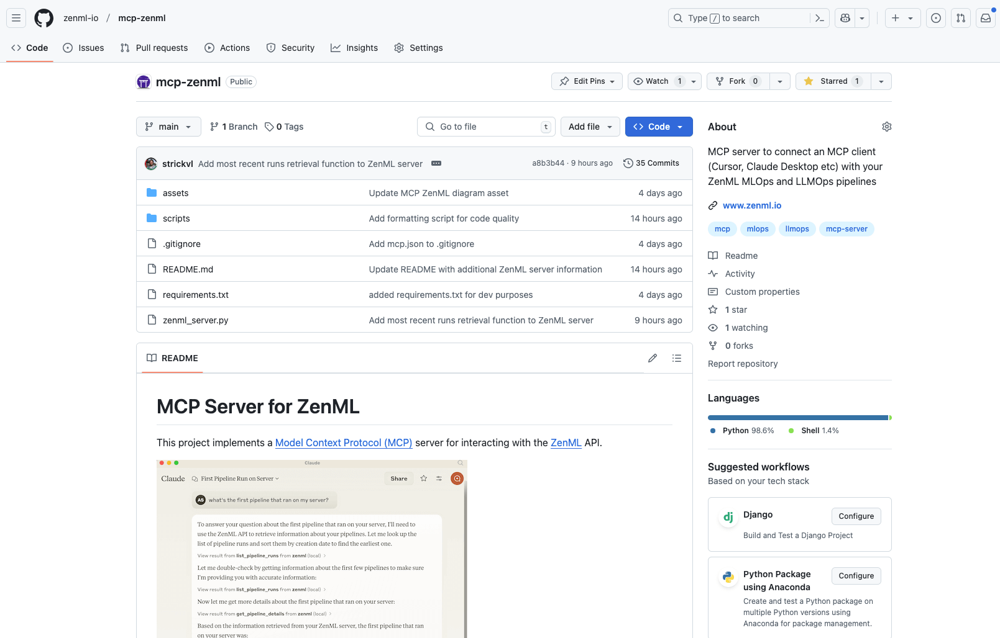
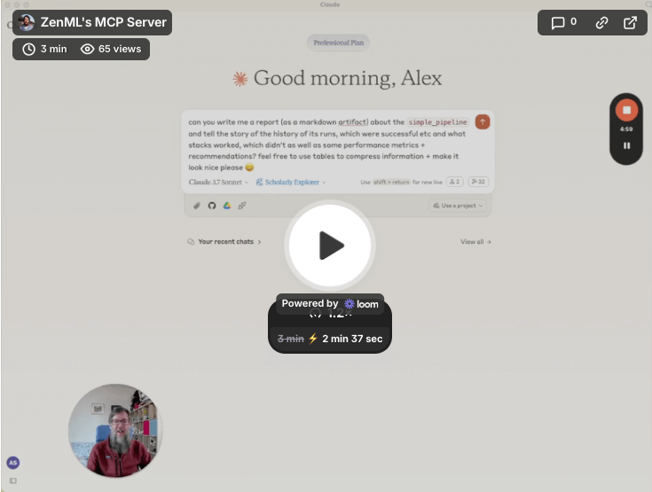
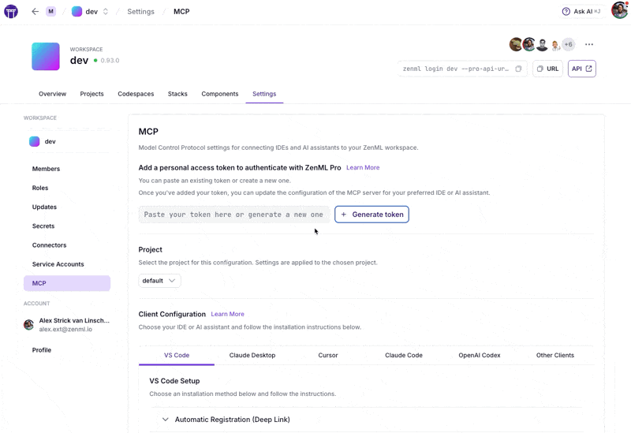
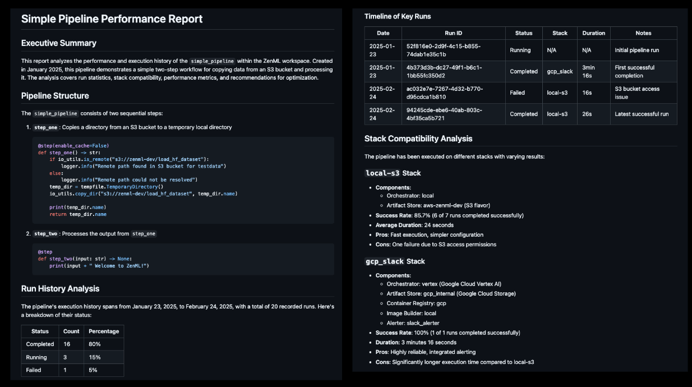
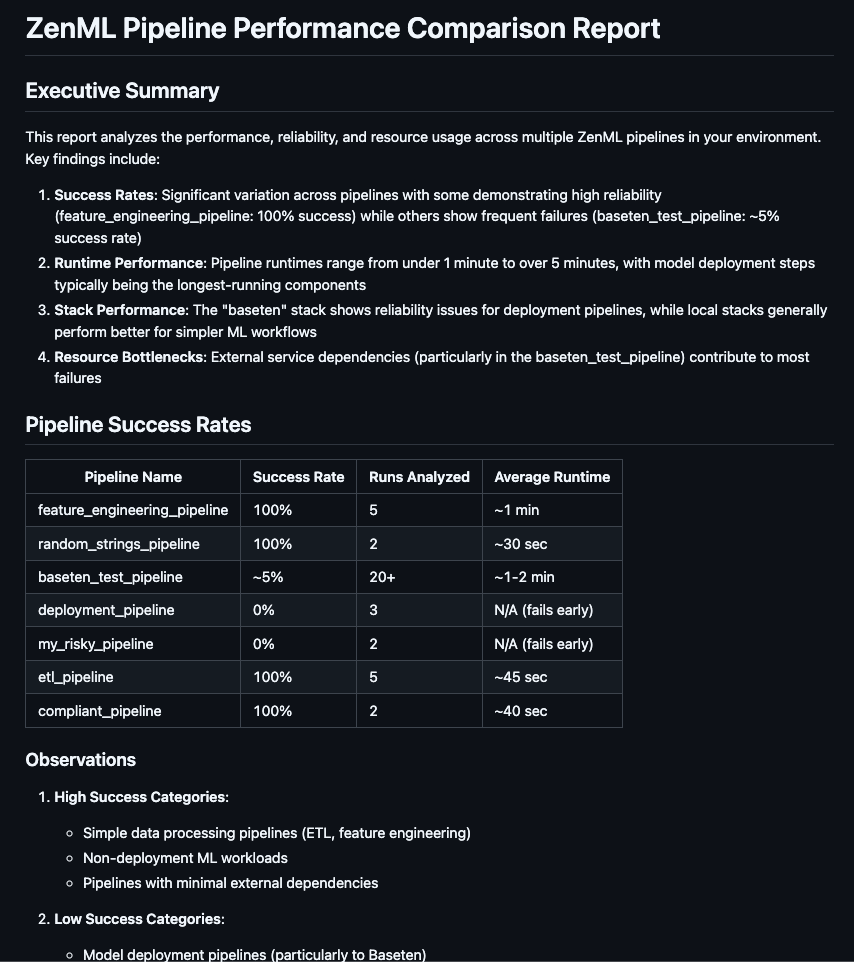
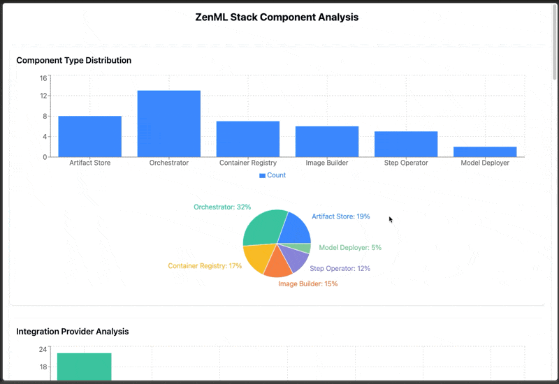

# Leveraging MCP

ZenML server supports a chat interface that allows you to interact with the server using natural language through the [Model Context Protocol (MCP)](https://modelcontextprotocol.io/). This feature enables you to query your ML pipelines, analyze performance metrics, and generate reports using conversational language instead of traditional CLI commands or dashboard interfaces.



## What is MCP?

The Model Context Protocol (MCP) is an open protocol that standardizes how applications provide context to Large Language Models (LLMs). Think of it as a "USB-C port for AI applications" - providing a standardized way to connect AI models to different data sources and tools.

MCP follows a client-server architecture where:

* **MCP Clients**: Programs like Claude Desktop or IDEs (Cursor, Windsurf, etc.) that want to access data through MCP
* **MCP Servers**: Lightweight programs that expose specific capabilities\
  through the standardized protocol. Our implementation is of an MCP server that connects to your ZenML server.

## Why use MCP with ZenML?

The ZenML MCP Server offers several advantages for developers and teams:

1. **Natural Language Interaction**: Query your ZenML metadata, code and logs using conversational language instead of memorizing CLI commands or navigating dashboard interfaces.
2. **Contextual Development**: Get insights about failing pipelines or performance metrics without switching away from your development environment.
3. **Accessible Analytics**: Generate custom reports and visualizations about your pipelines directly through conversation.
4. **Streamlined Workflows**: Trigger pipeline runs via natural language requests when you're ready to execute.

You can get a sense of how it works in the following video:

[](https://www.loom.com/share/4cac0c90bd424df287ed5700e7680b14?sid=200acd11-2f1b-4953-8577-6fe0c65cad3c)

## Features

The ZenML MCP server provides access to core read functionality from your ZenML server, allowing you to get live information about:

* Users
* Stacks
* Pipelines
* Pipeline runs
* Pipeline steps
* Services
* Stack components
* Flavors
* Pipeline run templates
* Schedules
* Artifacts (metadata about data artifacts, not the data itself)
* Service Connectors
* Step code
* Step logs (if the step was run on a cloud-based stack)

It also allows you to trigger new pipeline runs through existing run templates.

## Getting Started

The easiest way to set up the ZenML MCP Server is through the **MCP Settings page** in the ZenML dashboard. This provides a guided experience for configuring your IDE or AI assistant to connect to your ZenML server.

### Using the Dashboard Settings Page (Recommended)

Both ZenML OSS and ZenML Pro include an MCP settings page that generates the correct configuration for your environment.



Navigate to **Settings → MCP** in your ZenML dashboard to access the configuration page. The page provides:

* **Token configuration**: Enter or generate the API token needed for authentication
* **IDE-specific instructions**: Tabbed configuration for VS Code, Claude Desktop, Cursor, Claude Code, OpenAI Codex, and other MCP clients
* **Multiple installation methods**: Deep links for automatic setup, CLI commands, and manual JSON configuration options
* **Docker and uv options**: Choose your preferred runtime for the MCP server

#### ZenML Pro vs OSS Setup Differences

| Feature | ZenML Pro | ZenML OSS |
|---------|-----------|-----------|
| Token generation | One-click PAT generation within the settings page | Paste a service account token (create via Settings → Service Accounts) |
| Project selection | Select which project to connect to | Single project (automatic) |
| Configuration output | Includes project ID in generated configs | Simplified configuration |


**ZenML Pro users** can generate a Personal Access Token (PAT) directly from the MCP settings page with a single click. The token will be automatically included in the generated configuration snippets.

**ZenML OSS users** need to first create a service account token via **Settings → Service Accounts**, then paste it into the MCP settings page.


### Manual Setup

For manual setup or the most up-to-date instructions, please refer to the [ZenML MCP Server GitHub repository](https://github.com/zenml-io/mcp-zenml). We recommend using the `uv` package manager to install the dependencies since it's the most reliable and fastest setup experience.

#### Prerequisites:

* Access to a ZenML server (Cloud or self-hosted)
* [`uv`](https://docs.astral.sh/uv/) installed locally
* A local clone of the repository

#### Configuration:

* Create an MCP config file with your ZenML server details
* Configure your preferred MCP client (Claude Desktop, Cursor, VS Code, etc.)

For detailed manual setup instructions, please refer to the [GitHub repository](https://github.com/zenml-io/mcp-zenml).

## Example Usage

Once set up, you can interact with your ZenML infrastructure through natural language. Here are some example prompts you can try:

1.  **Pipeline Analysis Report**:

    ```
    Can you write me a report (as a markdown artifact) about the 'simple_pipeline' and tell the story of the history of its runs, which were successful etc., and what stacks worked, which didn't, as well as some performance metrics + recommendations?
    ```



2.  **Comparative Pipeline Analysis**:

    ```
    Could you analyze all our ZenML pipelines and create a comparison report (as a markdown artifact) that highlights differences in success rates, average run times, and resource usage? Please include a section on which stacks perform best for each pipeline type.
    ```



3.  **Stack Component Analysis**:

    ```
    Please generate a comprehensive report or dashboard on our ZenML stack components, showing which ones are most frequently used across our pipelines. Include information about version compatibility issues and performance variations.
    ```



## Get Involved

We invite you to try the [ZenML MCP Server](https://github.com/zenml-io/mcp-zenml) and share your experiences with us through our [Slack community](https://zenml.io/slack). We're particularly interested in:

* Whether you need additional write actions (creating stacks, registering components, etc.)
* Examples of how you're using the server in your workflows
* Suggestions for additional features or improvements

Contributions and pull requests to [the core repository](https://github.com/zenml-io/mcp-zenml) are always welcome!
