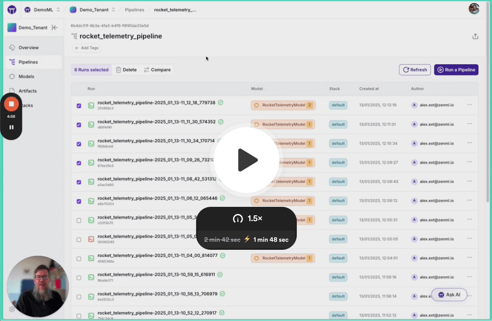
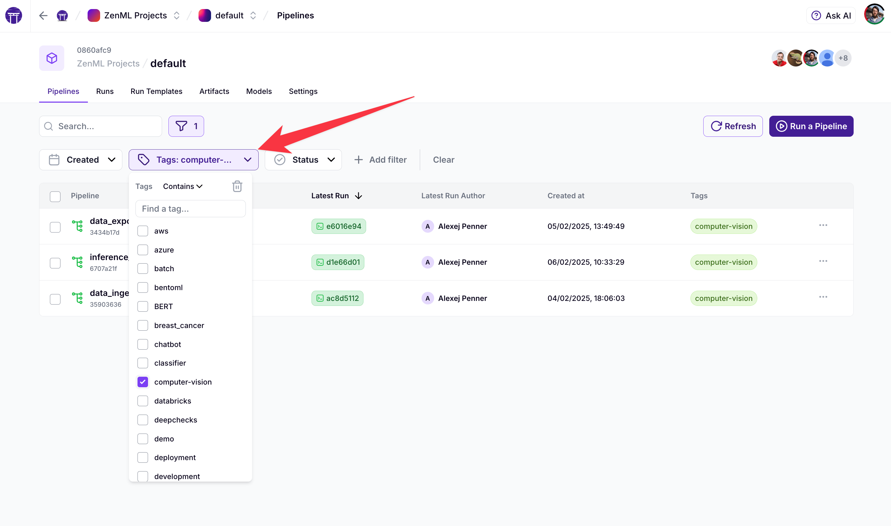
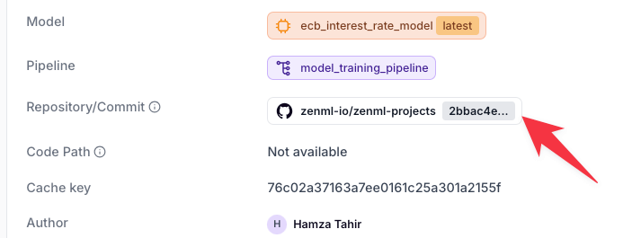
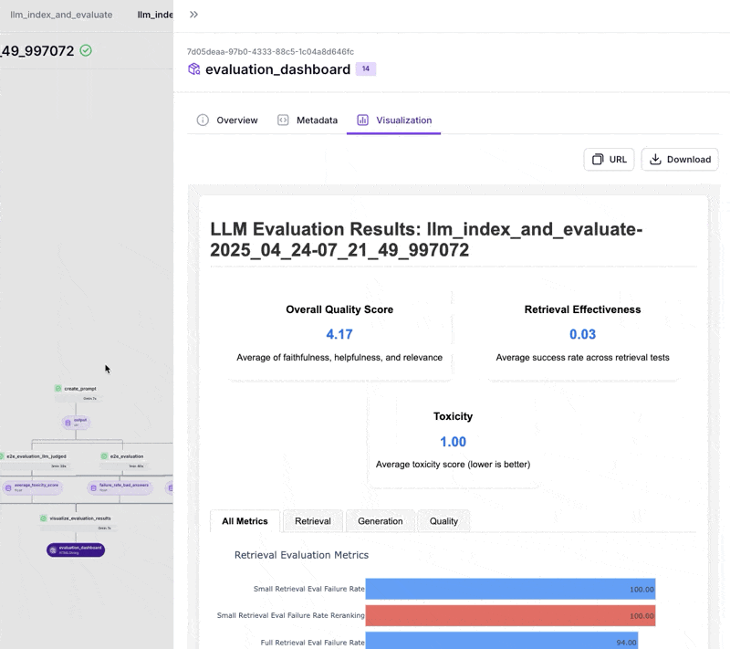

# Quick Wins

Below is a menu of 5-minute quick wins you can sprinkle into an existing ZenML
project with almost no code changes. Each entry explains why it matters, the
micro-setup (under 5 minutes) and any tips or gotchas to anticipate.

| Quick Win | What it does | Why you need it |
|-----------|--------------|----------------|
| [Log rich metadata](#id-1-log-rich-metadata-on-every-run) | Track params, metrics, and properties on every run | Foundation for reproducibility and analytics |
| [Experiment comparison](#id-2-activate-the-experiment-comparison-view-zenml-pro) | Visualize and compare runs with parallel plots | Identify patterns and optimize faster |
| [Autologging](#id-3-drop-in-experiment-tracker-autologging) | Automatic metric and artifact tracking | Zero-effort experiment tracking |
| [Slack/Discord alerts](#id-4-instant-alerter-notifications-for-successesfailures) | Instant notifications for pipeline events | Stay informed without checking dashboards |
| [Cron scheduling](#id-5-schedule-the-pipeline-on-a-cron) | Run pipelines automatically on schedule | Promote notebooks to production workflows |
| [Warm pools/resources](#id-6-kill-cold-starts-with-sagemaker-warm-pools--vertex-persistent-resources) | Eliminate cold starts in cloud environments | Reduce iteration time from minutes to seconds |
| [Secret management](#id-7-centralize-secrets-tokens-db-creds-s3-keys) | Centralize credentials and tokens | Keep sensitive data out of code |
| [Local smoke tests](#id-8-run-smoke-tests-locally-before-going-to-the-cloud) | Faster iteration on Docker before cloud | Quick feedback without cloud waiting times |
| [Organize with tags](#id-9-organize-with-tags) | Classify and filter ML assets | Find and relate your ML assets with ease |
| [Git repo hooks](#id-10-hook-your-git-repo-to-every-run) | Track code state with every run | Perfect reproducibility and faster builds |
| [HTML reports](#id-11-simple-html-reports) | Create rich visualizations effortlessly | Beautiful stakeholder-friendly outputs |
| [Model Control Plane](#id-12-register-models-in-the-model-control-plane) | Track models and their lifecycle | Central hub for model lineage and governance |
| [Parent Docker images](#id-13-create-a-parent-docker-image-for-faster-builds) | Pre-configure your dependencies in a base image | Faster builds and consistent environments |
| [ZenML docs via MCP](#id-14-enable-ide-ai-zenml-docs-via-mcp-server) | Connect your IDE assistant to live ZenML docs | Faster, grounded answers and doc lookups while coding |
| [Export CLI data](#id-15-export-cli-data-in-multiple-formats) | Get machine-readable output from list commands | Perfect for scripting, automation, and data analysis |


## 1 Log rich metadata on every run
**Why** -- instant lineage, reproducibility, and the raw material for all other dashboard analytics. Metadata is the foundation for experiment tracking, model governance, and comparative analysis.

```python
from zenml import log_metadata

# Basic metadata logging at step level - automatically attaches to current step
log_metadata({"lr": 1e-3, "epochs": 10, "prompt": my_prompt})

# Group related metadata in categories for better dashboard organization
log_metadata({
    "training_params": {
        "learning_rate": 1e-3,
        "epochs": 10,
        "batch_size": 32
    },
    "dataset_info": {
        "num_samples": 10000,
        "features": ["age", "income", "score"]
    }
})

# Use special types for consistent representation
from zenml.metadata.metadata_types import StorageSize, Uri
log_metadata({
    "dataset_source": Uri("gs://my-bucket/datasets/source.csv"),
    "model_size": StorageSize(256000000)  # in bytes
})
```

**Works at multiple levels:**
- **Within steps**: Logs automatically attach to the current step
- **Pipeline runs**: Track environment variables or overall run characteristics
- **Artifacts**: Document data characteristics or processing details
- **Models**: Capture hyperparameters, evaluation metrics, or deployment information

**Best practices:**
- Use consistent keys across runs for better comparison
- Group related metadata using nested dictionaries
- Use ZenML's special metadata types for standardized representation

*Metadata becomes the foundation for the Experiment Comparison tool and other dashboard views.* (Learn more: [Metadata](https://docs.zenml.io/concepts/metadata), [Tracking Metrics with Metadata](https://docs.zenml.io/concepts/models#tracking-metrics-and-metadata))

## 2 Activate the **Experiment Comparison** view (ZenML Pro)

**Why** -- side-by-side tables + parallel-coordinate plots of any numerical metadata help you quickly identify patterns, trends, and outliers across multiple runs. This visual analysis speeds up debugging and parameter tuning.

**Setup** -- once you've logged metadata (see quick win #1) nothing else to do; open **Dashboard → Compare**.  

[](https://www.loom.com/share/693b2d829600492da7cd429766aeba6a)

**Compare experiments at a glance:**
- **Table View**: See all runs side-by-side with automatic change highlighting
- **Parallel Coordinates Plot**: Visualize relationships between hyperparameters and metrics
- **Filter & Sort**: Focus on specific runs or metrics that matter most
- **CSV Export**: Download experiment data for further analysis (Pro tier)

**Practical uses:**
- Compare metrics across model architectures or hyperparameter settings
- Identify which parameters have the greatest impact on performance
- Track how metrics evolve across iterations of your pipeline

(Learn more: [Metadata](https://docs.zenml.io/concepts/models#tracking-metrics-and-metadata), [New Dashboard Feature: Compare Your Experiments - ZenML Blog](https://www.zenml.io/blog/new-dashboard-feature-compare-your-experiments))


## 3 Drop-in Experiment Tracker Autologging

**Why** -- Stream metrics, system stats, model files, and artifacts—all without modifying step code. Different experiment trackers offer varying levels of automatic tracking to simplify your MLOps workflows.
**Setup**

```bash
# First install your preferred experiment tracker integration
zenml integration install mlflow -y  # or wandb, neptune, comet
# Register the experiment tracker in your stack
zenml experiment-tracker register <NAME> --flavor=mlflow  # or wandb, neptune, comet
zenml stack update your_stack_name -e your_experiment_tracker_name
```

The experiment tracker's autologging capabilities kick in based on your tracker's features:

| Experiment Tracker | Autologging Capabilities |
|--------------------|-----------------------|
| **MLflow** | Comprehensive framework-specific autologging for TensorFlow, PyTorch, scikit-learn, XGBoost, LightGBM, Spark, Statsmodels, Fastai, and more. Automatically tracks parameters, metrics, artifacts, and environment details. |
| **Weights & Biases** | Out-of-the-box tracking for ML frameworks, media artifacts, system metrics, and hyperparameters. |
| **Neptune** | Requires explicit logging for most frameworks but provides automatic tracking of hardware metrics, environment information, and various model artifacts. |
| **Comet** | Automatic tracking of hardware metrics, hyperparameters, model artifacts, and source code. Framework-specific autologging similar to MLflow. |

**Example: Enable autologging in steps**

```python
# Get tracker from active stack
from zenml.client import Client
experiment_tracker = Client().active_stack.experiment_tracker

# Apply to specific steps that need tracking
@step(experiment_tracker=experiment_tracker.name)
def train_model(data):
    # Framework-specific training code
    # metrics and artifacts are automatically logged
    return model
```

**Best Practices**
* Store API keys in ZenML secrets (see quick win #7) to prevent exposure in Git.
* Configure the experiment tracker settings in your steps for more granular control.
* For MLflow, use `@step(experiment_tracker="mlflow")` to enable autologging in specific steps only.
* Disable MLflow autologging when needed, e.g.: `experiment_tracker.disable_autologging()`.

**Resources**
* [MLflow Experiment Tracking](https://docs.zenml.io/stacks/stack-components/experiment-trackers/mlflow)
* [Weights & Biases Integration](https://docs.zenml.io/stacks/stack-components/experiment-trackers/wandb)
* [Neptune Integration](https://docs.zenml.io/stacks/stack-components/experiment-trackers/neptune)
* [Comet Integration](https://docs.zenml.io/stacks/stack-components/experiment-trackers/comet)

## 4 Instant **alerter notifications** for successes/failures

**Why** -- get immediate notifications when pipelines succeed or fail, enabling
faster response times and improved collaboration. Alerter notifications ensure
your team is always aware of critical model training status, data drift alerts,
and deployment changes without constantly checking dashboards.


ZenML supports multiple alerter flavors including Slack and Discord. The example below uses Slack, but the pattern is similar for other alerters.


```bash
# Install your preferred alerter integration
zenml integration install slack -y  # or discord, -y

# Register the alerter with your credentials
zenml alerter register slack_alerter \
    --flavor=slack \
    --slack_token=<SLACK_TOKEN> \
    --default_slack_channel_id=<SLACK_CHANNEL_ID>

# Add the alerter to your stack
zenml stack update your_stack_name -al slack_alerter
```

**Using in your pipelines**
```python
from zenml.integrations.slack.steps import slack_alerter_post_step

@pipeline
def pipeline_with_alerts():
    # Your pipeline steps
    train_model_step(...)

    # Post a simple text message
    slack_alerter_post_step(
        message="Model training completed successfully!"
    )

    # Or use advanced formatting with payload and metadata
    slack_alerter_post_step(
        message="Model metrics report",
        params=SlackAlerterParameters(
            slack_channel_id="#alerts-channel",  # Override default channel
            payload=SlackAlerterPayload(
                pipeline_name="Training Pipeline",
                step_name="Evaluation",
                stack_name="Production"
            )
        )
    )
```

**Key features**
* **Rich message formatting** with custom blocks, embedded metadata and pipeline artifacts
* **Human-in-the-loop approval** using alerter ask steps for critical deployment decisions
* **Flexible targeting** to notify different teams with specific alerts
* **Custom approval options** to configure which responses count as approvals/rejections

Learn more: [Full Slack alerter documentation](https://docs.zenml.io/stacks/stack-components/alerters/slack), [Alerters overview](https://docs.zenml.io/stacks/stack-components/alerters)

## 5 Schedule the pipeline on a cron

**Why** -- promote "run-by-hand" notebooks to automated, repeatable jobs. Scheduled pipelines ensure consistency, enable overnight training runs, and help maintain regularly updated models.


Scheduling works with any orchestrator that supports schedules (Kubeflow, Airflow, Vertex AI, etc.)


**Setup - Using Python**
```python
from zenml.config.schedule import Schedule
from zenml import pipeline

# Define a schedule with a cron expression
schedule = Schedule(
    name="daily-training",
    cron_expression="0 3 * * *"  # Run at 3 AM every day
)

def my_pipeline():
    # Your pipeline steps
    pass

# Attach the schedule to your pipeline
my_pipeline = my_pipeline.with_options(schedule=schedule)

# Run once to register the schedule
my_pipeline()
```

**Key Features**
* **Cron expressions** for flexible scheduling (daily, weekly, monthly)
* **Start/end time controls** to limit when schedules are active
* **Timezone awareness** to ensure runs start at your preferred local time
* **Orchestrator-native scheduling** leveraging your infrastructure's capabilities

**Best Practices**
* Use descriptive schedule names like `daily-feature-engineering-prod-v1`
* For critical pipelines, add alert notifications for failures
* Verify schedules were created both in ZenML and the orchestrator
* When updating schedules, delete the old one before creating a new one

**Common troubleshooting**
* For cloud orchestrators, verify service account permissions
* Remember that deleting a schedule from ZenML doesn't remove it from the orchestrator!

Learn more: [Scheduling Pipelines](../../how-to/steps-pipelines/scheduling.md), [Managing Scheduled Pipelines](../../user-guide/tutorial/managing-scheduled-pipelines.md)

## 6 Kill cold-starts with **SageMaker Warm Pools / Vertex Persistent Resources**

**Why** -- eliminate infrastructure initialization delays and reduce model iteration cycle time. Cold starts can add minutes to your workflow, but with warm pools, containers stay ready and model iterations can start in seconds.


This feature works with AWS SageMaker and Google Cloud Vertex AI orchestrators.


**Setup for AWS SageMaker**
```bash
# Register SageMaker orchestrator with warm pools enabled
zenml orchestrator register sagemaker_warm \
    --flavor=sagemaker \
    --use_warm_pools=True

# Update your stack to use this orchestrator
zenml stack update your_stack_name -o sagemaker_warm
```

**Setup for Google Cloud Vertex AI**
```bash
# Register Vertex step operator with persistent resources
zenml step-operator register vertex_persistent \
    --flavor=vertex \
    --persistent_resource_id=my-resource-id

# Update your stack to use this step operator
zenml stack update your_stack_name -s vertex_persistent
```

**Key benefits**
* **Faster iteration cycles** - no waiting for VM provisioning and container startup
* **Cost-effective** - share resources across pipeline runs
* **No code changes** - zero modifications to your pipeline code
* **Significant speedup** - reduce startup times from minutes to seconds

**Important considerations**
* SageMaker warm pools incur charges when resources are idle
* For Vertex AI, set an appropriate persistent resource name for tracking
* Resources need occasional recycling for updates or maintenance

Learn more: [AWS SageMaker Orchestrator](https://docs.zenml.io/stacks/stack-components/orchestrators/sagemaker), [Google Cloud Vertex AI Step Operator](https://docs.zenml.io/stacks/stack-components/step-operators/vertex)

## 7 Centralize secrets (tokens, DB creds, S3 keys)

**Why** -- eliminate hardcoded credentials from your code and gain centralized control over sensitive information. Secrets management prevents exposing sensitive information in version control, enables secure credential rotation, and simplifies access management across environments.

**Setup - Basic usage**
```bash
# Create a secret with a key-value pair
zenml secret create wandb --api_key=$WANDB_KEY

# Reference the secret in stack components
zenml experiment-tracker register wandb_tracker \
    --flavor=wandb \
    --api_key={{wandb.api_key}}

# Update your stack with the new component
zenml stack update your_stack_name -e wandb_tracker
```

**Setup - Multi-value secrets**
```bash
# Create a secret with multiple values
zenml secret create database_creds \
    --username=db_user \
    --password=db_pass \
    --host=db.example.com

# Reference specific secret values
zenml artifact-store register my_store \
    --flavor=s3 \
    --aws_access_key_id={{database_creds.username}} \
    --aws_secret_access_key={{database_creds.password}}
```

**Key features**
* **Secure storage** - credentials kept in secure backend storage, not in your code
* **Scoped access** - restrict secret visibility based on user permissions
* **Easy rotation** - update credentials in one place when they change
* **Multiple backends** - support for Vault, AWS Secrets Manager, GCP Secret Manager, and more
* **Templated references** - use `{{secret_name.key}}` syntax in any stack configuration

**Best practices**
* Use a dedicated secret store in production instead of the default file-based store
* Set up CI/CD to use service accounts with limited permissions
* Regularly rotate sensitive credentials like API keys and access tokens

Learn more: [Secret Management](https://docs.zenml.io/concepts/secrets), [Working with Secrets](https://docs.zenml.io/deploying-zenml/deploying-zenml/secret-management)

## 8 Run smoke tests locally before going to the cloud

**Why** -- significantly reduce iteration and debugging time by testing your pipelines with a local Docker orchestrator before deploying to remote cloud infrastructure. This approach gives you fast feedback cycles for containerized execution without waiting for cloud provisioning, job scheduling, and data transfer—ideal for development, troubleshooting, and quick feature validation.

```bash
# Check Docker installation status and exit with message if not available
docker ps > /dev/null 2>&1 && echo "Docker is installed and running." || { echo "Docker is not installed or not running. Please install Docker to continue."; exit 0; }

# Create a smoke-test stack with the local Docker orchestrator
zenml orchestrator register local_docker_orch --flavor=local_docker
zenml stack register smoke_test_stack -o local_docker_orch \
    --artifact-store=<YOUR_ARTIFACT_STORE> \
    --container-registry=<YOUR_CONTAINER_REGISTRY>
zenml stack set smoke_test_stack
```

```python
from zenml import pipeline, step
from typing import Dict

# 1. Create a configuration-aware pipeline
@pipeline
def training_pipeline(sample_fraction: float = 0.01):
    """Pipeline that can work with sample data for local testing."""
    # Sample a small subset of your data
    train_data = load_data_step(sample_fraction=sample_fraction)
    model = train_model_step(train_data, epochs=2)  # Reduce epochs for testing
    evaluate_model_step(model, train_data)

# 2. Separate load step that supports sampling
@step
def load_data_step(sample_fraction: float) -> Dict:
    """Load data with sampling for faster smoke tests."""
    # Your data loading code with sampling logic
    full_data = load_your_dataset()
    
    # Only use a small fraction during smoke testing
    if sample_fraction < 1.0:
        sampled_data = sample_dataset(full_data, sample_fraction)
        print(f"SMOKE TEST MODE: Using {sample_fraction*100}% of data")
        return sampled_data
    
    return full_data

# 3. Run pipeline with the local Docker orchestrator
training_pipeline(sample_fraction=0.01)
```

**When to switch back to cloud**
```bash
# When your smoke tests pass, switch back to your cloud stack
zenml stack set production_stack  # Your cloud-based stack

# Run the same pipeline with full data
training_pipeline(sample_fraction=1.0)  # Use full dataset
```

**Key benefits**
* **Fast feedback cycles** - Get results in minutes instead of hours
* **Cost savings** - Test on your local machine instead of paying for cloud resources
* **Simplified debugging** - Easier access to logs and containers
* **Consistent environments** - Same Docker containerization as production
* **Reduced friction** - No cloud provisioning delays or permission issues during development

**Best practices**
* Create a small representative dataset for smoke testing
* Use configuration parameters to enable smoke-test mode
* Keep dependencies identical between smoke tests and production
* Run the exact same pipeline code locally and in the cloud
* Store sample data in version control for reliable testing
* Use `prints` or logging to clearly indicate when running in smoke-test mode

This approach works best when you design your pipelines to be configurable from the start, allowing them to run with reduced data size, shorter training cycles, or simplified processing steps during development.

Learn more: [Local Docker Orchestrator](https://docs.zenml.io/stacks/stack-components/orchestrators/local-docker)

## 9 Organize with tags

**Why** -- add flexible, searchable labels to your ML assets that bring order to chaos as your project grows. Tags provide a lightweight organizational system that helps you filter pipelines, artifacts, and models by domain, status, version, or any custom category—making it easy to find what you're looking for in seconds.

```python
from zenml import pipeline, step, add_tags, Tag

# 1. Tag your pipelines with meaningful categories
@pipeline(tags=["fraud-detection", "training", "financial"])
def training_pipeline():
    # Your pipeline steps
    preprocess_step(...)
    train_step(...)
    evaluate_step(...)

# 2. Create "exclusive" tags for state management
@pipeline(tags=[
    Tag(name="production", exclusive=True),  # Only one pipeline can be "production"
    "financial"
])
def production_pipeline():
    pass

# 3. Tag artifacts programmatically from within steps
@step
def evaluate_step():
    # Your evaluation code here
    accuracy = 0.95
    
    # Tag based on performance
    if accuracy > 0.9:
        add_tags(tags=["high-accuracy"], infer_artifact=True)
    
    # Tag with metadata values
    add_tags(tags=[f"accuracy-{int(accuracy*100)}"], infer_artifact=True)
    
    return accuracy

# 4. Use cascade tags to apply pipeline tags to all artifacts
@pipeline(tags=[Tag(name="experiment-12", cascade=True)])
def experiment_pipeline():
    # All artifacts created in this pipeline will also have the "experiment-12" tag
    pass
```

**Key features**
* **Filter and search** - Quickly find all assets related to a specific domain or project
* **Exclusive tags** - Create tags where only one entity can have the tag at a time (perfect for "production" status)
* **Cascade tags** - Apply pipeline tags automatically to all artifacts created during execution
* **Flexible organization** - Create any tagging system that makes sense for your projects
* **Multiple entity types** - Tag pipelines, runs, artifacts, models, snapshots and deployments



**Common tag operations**
```python
from zenml.client import Client

# Find all models with specific tags
production_models = Client().list_models(tags=["production", "classification"])

# Find artifacts from a specific domain
financial_datasets = Client().list_artifacts(tags=["financial", "cleaned"])

# Advanced filtering with prefix/contains
experimental_runs = Client().list_runs(tags=["startswith:experiment-"])
validation_artifacts = Client().list_artifacts(tags=["contains:valid"])

# Remove tags when no longer needed
Client().delete_run_tags(run_name_or_id="my_run", tags=["test", "debug"])
```

**Best practices**
* Create consistent tag categories (environment, domain, status, version, etc.)
* Use a tag registry to standardize tag names across your team
* Use exclusive tags for state management (only one "production" model)
* Combine prefix patterns for better organization (e.g., "domain-financial", "status-approved")
* Update tags as assets progress through your workflow
* Document your tagging strategy for team alignment

Learn more: [Tags](https://docs.zenml.io/concepts/tags), [Tag Registry](https://docs.zenml.io/user-guides/best-practices/organizing-pipelines-and-models#create-a-tag-registry-for-consistency)

## 10 Hook your Git repo to every run

**Why** -- capture exact code state for reproducibility, automatic model versioning, and faster Docker builds. Connecting your Git repo transforms data science from local experiments to production-ready workflows with minimal effort:

- **Code reproducibility**: All pipelines track their exact commit hash and detect dirty repositories
- **Docker build acceleration**: ZenML avoids rebuilding images when your code hasn't changed
- **Model provenance**: Trace any model back to the exact code that created it
- **Team collaboration**: Share builds across the team for faster iteration

**Setup**
```bash
# Install the GitHub or GitLab integration
zenml integration install github  # or gitlab

# Register your code repository
zenml code-repository register project_repo \
    --type=github \
    --url=https://github.com/your/repo.git \
    --token=<GITHUB_TOKEN>  # use {{github_secret.token}} for stored secrets
```



**How it works**
1. When you run a pipeline, ZenML checks if your code is tracked in a registered repository
2. Your current commit and any uncommitted changes are detected and stored
3. ZenML can download files from the repository inside containers instead of copying them
4. Docker builds become highly optimized and are automatically shared across the team

**Best practices**
* Keep a clean repository state when running important pipelines
* Store your GitHub/GitLab tokens in ZenML secrets
* For CI/CD workflows, this pattern enables automatic versioning with Git SHAs
* Consider using `zenml pipeline build` to pre-build images once, then run multiple times

This simple setup can save hours of engineering time compared to manually tracking code versions and managing Docker builds yourself.

Learn more: [Code Repositories](https://docs.zenml.io/user-guides/production-guide/connect-code-repository)

## 11 Simple HTML reports

**Why** -- create beautiful, interactive visualizations and reports with minimal effort using ZenML's HTMLString type and LLM assistance. HTML reports are perfect for sharing insights, summarizing pipeline results, and making your ML projects more accessible to stakeholders.


This approach works with any LLM integration (GitHub Copilot, Claude in Cursor, ChatGPT, etc.) to generate complete, styled HTML reports with just a few prompts.


**Setup**
```python
from zenml.types import HTMLString
from typing import Dict, Any

@step
def generate_html_report(metrics: Dict[str, Any]) -> HTMLString:
    """Generate a beautiful HTML report from metrics dictionary."""
    # This HTML can be generated by an LLM or written manually
    html = f"""
    <html>
      <head>
        <style>
          body {{ font-family: 'Segoe UI', Arial, sans-serif; margin: 0; padding: 20px; background: #f7f9fc; }}
          .report {{ max-width: 800px; margin: 0 auto; background: white; padding: 25px; border-radius: 10px; box-shadow: 0 3px 10px rgba(0,0,0,0.1); }}
          h1 {{ color: #2d3748; border-bottom: 2px solid #e2e8f0; padding-bottom: 10px; }}
          .metric {{ display: flex; margin: 15px 0; align-items: center; }}
          .metric-name {{ font-weight: 600; width: 180px; }}
          .metric-value {{ font-size: 20px; color: #4a5568; }}
          .good {{ color: #38a169; }}
          .bad {{ color: #e53e3e; }}
        </style>
      </head>
      <body>
        <div class="report">
          <h1>Model Training Report</h1>
          <div class="metric">
            <div class="metric-name">Accuracy:</div>
            <div class="metric-value">{metrics["accuracy"]:.4f}</div>
          </div>
          <div class="metric">
            <div class="metric-name">Loss:</div>
            <div class="metric-value">{metrics["loss"]:.4f}</div>
          </div>
          <div class="metric">
            <div class="metric-name">Training Time:</div>
            <div class="metric-value">{metrics["training_time"]:.2f} seconds</div>
          </div>
        </div>
      </body>
    </html>
    """
    return HTMLString(html)

@pipeline
def training_pipeline():
    # Your training pipeline steps
    metrics = model_training_step()
    # Generate an HTML report from metrics
    generate_html_report(metrics)
```

**Sample LLM prompt for building reports**
```
Generate an HTML report with CSS styling that displays the metrics that are input into the template in a visually appealing way.

Include:
1. A clean, modern design with responsive layout
2. Color coding for good/bad metrics
3. A simple bar chart using pure HTML/CSS to visualize the metrics
4. A summary section that interprets what these numbers mean

Provide only the HTML code without explanations. The HTML will be used with ZenML's HTMLString type.
```




**Key features**
* **Rich formatting** - Full HTML/CSS support for beautiful reports
* **Interactive elements** - Add charts, tables, and responsive design
* **Easy sharing** - Reports appear directly in ZenML dashboard
* **LLM assistance** - Generate complex visualizations with simple prompts
* **No dependencies** - Works out of the box without extra libraries

**Advanced use cases**
* Include interactive charts using [D3.js](https://d3js.org/) or [Chart.js](https://www.chartjs.org/)
* Create comparative reports showing before/after metrics
* Build error analysis dashboards with filtering capabilities
* Generate PDF-ready reports for stakeholder presentations

Simply return an `HTMLString` from any step, and your visualization will automatically appear in the ZenML dashboard for that step's artifacts.

Learn more: [Visualizations](https://docs.zenml.io/concepts/artifacts/visualizations)

## 12 Register models in the Model Control Plane

**Why** -- create a central hub for organizing all resources related to a particular ML feature or capability. The Model Control Plane (MCP) treats a "model" as more than just code—it's a namespace that connects pipelines, artifacts, metadata, and workflows for a specific ML solution, providing seamless lineage tracking and governance that's essential for reproducibility, auditability, and collaboration.

```python
from zenml import pipeline, step, Model, log_metadata

# 1. Create a model entity in the Control Plane
model = Model(
    name="my_classifier",
    description="Classification model for customer data",
    license="Apache 2.0",
    tags=["classification", "production"]
)

# 2. Associate the model with your pipeline
@pipeline(model=model)
def training_pipeline():
    # Your pipeline steps
    train_step()
    eval_step()

# 3. Log important metadata to the model from within steps
@step
def eval_step():
    # Your evaluation code
    accuracy = 0.92
    
    # Automatically attach to the current model
    log_metadata(
        {"accuracy": accuracy, "f1_score": 0.89},
        infer_model=True  # Automatically finds pipeline's model
    )
```

**Key features**
* **Namespace organization** - group related pipelines, artifacts, and resources under a single entity
* **Version tracking** - automatically version your ML solutions with each pipeline run
* **Lineage management** - trace all components back to training pipelines, datasets, and code
* **Stage promotion** - promote solutions through lifecycle stages (dev → staging → production)
* **Metadata association** - attach any metrics or parameters to track performance over time
* **Workflow integration** - connect training, evaluation, and deployment pipelines in a unified view

**Common model operations**
```python
from zenml import Model
from zenml.client import Client

# Get all models in your project
models = Client().list_models()

# Get a specific model version
model = Client().get_model_version("my_classifier", "latest")

# Promote a model to production
model = Model(name="my_classifier", version="v2")
model.set_stage(stage="production", force=True)

# Compare models with their metadata
model_v1 = Client().get_model_version("my_classifier", "v1")
model_v2 = Client().get_model_version("my_classifier", "v2")
print(f"Accuracy v1: {model_v1.run_metadata['accuracy'].value}")
print(f"Accuracy v2: {model_v2.run_metadata['accuracy'].value}")
```

**Best practices**
* Create models with meaningful names that reflect the ML capability or business feature they represent
* Use consistent metadata keys across versions for better comparison and tracking
* Tag models with relevant attributes for easier filtering and organization
* Set up model stages to track which ML solutions are in which environments
* Use a single model entity to group all iterations of a particular ML capability, even when the underlying technical implementation changes

Learn more: [Models](https://docs.zenml.io/concepts/models#tracking-metrics-and-metadata)

## 13 Create a parent Docker image for faster builds

**Why** -- reduce Docker build times from minutes to seconds and avoid dependency headaches by pre-installing common libraries in a custom parent image. This approach gives you faster iteration cycles, consistent environments across your team, and simplified dependency management—especially valuable for large projects with complex requirements.

```bash
# 1. Create a Dockerfile for your parent image
cat > Dockerfile.parent << EOF
FROM python:3.11-slim

# Install system dependencies
RUN apt-get update && apt-get install -y --no-install-recommends \
    git \
    curl \
    build-essential \
    && rm -rf /var/lib/apt/lists/*

# Install Python dependencies that rarely change
RUN pip install --no-cache-dir \
    zenml==0.54.0 \
    tensorflow==2.12.0 \
    torch==2.0.0 \
    scikit-learn==1.2.2 \
    pandas==2.0.0 \
    numpy==1.24.3 \
    matplotlib==3.7.1

# Create app directory (ZenML expects this)
WORKDIR /app

# Install stack component requirements
# Use stack export-requirements to add stack dependencies
# Example: zenml stack export-requirements my_stack --output-file stack_reqs.txt
COPY stack_reqs.txt /tmp/stack_reqs.txt
RUN pip install --no-cache-dir -r /tmp/stack_reqs.txt
EOF

# 2. Export requirements from your current stack
zenml stack export-requirements --output-file stack_reqs.txt

# 3. Build and push your parent image
docker build -t your-registry.io/zenml-parent:latest -f Dockerfile.parent .
docker push your-registry.io/zenml-parent:latest
```

**Using your parent image in pipelines**

```python
from zenml import pipeline
from zenml.config import DockerSettings

# Configure your pipeline to use the parent image
docker_settings = DockerSettings(
    parent_image="your-registry.io/zenml-parent:latest",
    # Only install project-specific requirements
    requirements=["your-custom-package==1.0.0"]
)

@pipeline(settings={"docker": docker_settings})
def training_pipeline():
    # Your pipeline steps
    pass
```

**Boost team productivity with a shared image**

```python
# For team settings, register a stack with the parent image configuration
from zenml.config import DockerSettings

# Create a DockerSettings object for your team's common environment
team_docker_settings = DockerSettings(
    parent_image="your-registry.io/zenml-parent:latest"
)

# Share these settings via your stack configuration YAML file
# stack_config.yaml
"""
settings:
  docker:
    parent_image: your-registry.io/zenml-parent:latest
"""
```

**Key benefits**
* **Dramatically faster builds** - Only project-specific packages need installation
* **Consistent environments** - Everyone uses the same base libraries
* **Simplified dependency management** - Core dependencies defined once
* **Reduced cloud costs** - Spend less on compute for image building
* **Lower network usage** - Download common large packages just once

**Best practices**
* Include all heavy dependencies and stack component requirements in your parent image
* Version your parent image (e.g., `zenml-parent:0.54.0`) to track changes
* Document included packages with a version listing in a requirements.txt
* Use multi-stage builds if your parent image needs compiled dependencies
* Periodically update the parent image to incorporate security patches
* Consider multiple specialized parent images for different types of workloads

For projects with heavy dependencies like deep learning frameworks, this approach can cut build times by 80-90%, turning a 5-minute build into a 30-second one. This is especially valuable in cloud environments where you pay for build time.

Learn more: [Containerization](https://docs.zenml.io/concepts/containerization)

## 14 Enable IDE AI: ZenML docs via MCP server

**Why** -- wire your IDE AI assistant into the live ZenML docs in under 5 minutes. Get grounded answers, code snippets, and API lookups without context switching or hallucinations—perfect if you already use Claude Code or Cursor.


The MCP server works with any MCP-compatible client. Below we demonstrate popular examples using Claude Code (VS Code) and Cursor. The server indexes the latest released documentation, not the develop branch.


**Setup**

### Claude Code (VS Code)
```bash
claude mcp add zenmldocs --transport http https://docs.zenml.io/~gitbook/mcp
```

### Cursor (JSON settings)
```json
{
  "mcpServers": {
    "zenmldocs": {
      "transport": {
        "type": "http",
        "url": "https://docs.zenml.io/~gitbook/mcp"
      }
    }
  }
}
```

**Try it**
```
Using the zenmldocs MCP server, show me how to register an MLflow experiment tracker in ZenML and add it to my stack. Cite the source page.
```

**Key features**
- **Live answers** from ZenML docs directly in your IDE assistant
- **Fewer hallucinations** thanks to source-of-truth grounding and citations
- **IDE-native experience** — no code changes required in your project
- **Great for API lookups** and "how do I" questions while coding

**Best practices**
- Prefix prompts with: "Use the zenmldocs MCP server …" and ask for citations
- Remember: it indexes the latest released docs, not develop; for full offline context use `llms-full.txt`, for selective interactive queries prefer MCP
- Keep the server name consistent (e.g., `zenmldocs`) across machines/projects
- If your IDE supports tool selection, explicitly enable/select the `zenmldocs` MCP tool
- For bleeding-edge features on develop, consult the repo or develop docs directly

Learn more: [Access ZenML documentation via llms.txt and MCP](https://docs.zenml.io/reference/llms-txt)

## 15 Export CLI data in multiple formats

All `zenml list` commands support multiple output formats for scripting, CI/CD integration, and data analysis.

```bash
# Get stack data as JSON for processing with jq
zenml stack list --output=json | jq '.items[] | select(.name=="production")'

# Export pipeline runs to CSV for analysis
zenml pipeline runs list --output=csv > pipeline_runs.csv

# Get deployment info as YAML for configuration management
zenml deployment list --output=yaml

# Filter columns to see only what you need
zenml stack list --columns=id,name,orchestrator

# Combine filtering with custom output formats
zenml pipeline list --columns=id,name,num_runs --output=json
```

**Available formats**
- **json** - Structured data with pagination info, perfect for programmatic processing
- **yaml** - Human-readable structured format, great for configuration
- **csv** - Comma-separated values for spreadsheets and data analysis
- **tsv** - Tab-separated values for simpler parsing
- **table** (default) - Formatted tables with colors and alignment

**Key features**
- **Column filtering** - Use `--columns` to show only the fields you need
- **Scriptable** - Combine with tools like `jq`, `grep`, `awk` for powerful automation
- **Environment control** - Set `ZENML_DEFAULT_OUTPUT` to change the default format
- **Width control** - Override terminal width with `ZENML_CLI_COLUMN_WIDTH` for consistent formatting

**Best practices**
- Use JSON format for robust parsing in scripts (includes pagination metadata)
- Use CSV/TSV for importing into spreadsheet tools or databases
- Use `--columns` to reduce noise and focus on relevant data
- Set default formats via environment variables in CI/CD environments

**Example automation script**
```bash
#!/bin/bash
# Export all production stacks to a report

export ZENML_DEFAULT_OUTPUT=json

# Get all stacks and filter for production
zenml stack list | jq '.items[] | select(.name | contains("prod"))' > prod_stacks.json

# Generate a summary CSV
zenml stack list --output=csv --columns=name,orchestrator,artifact_store > stack_summary.csv

echo "Reports generated: prod_stacks.json and stack_summary.csv"
```

Learn more: [Environment Variables](https://docs.zenml.io/reference/environment-variables#cli-output-formatting)
