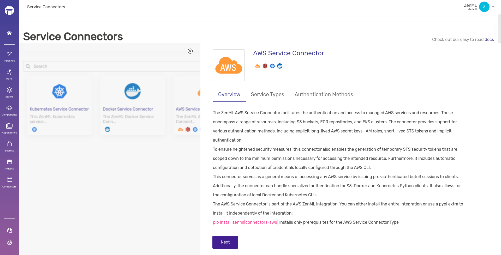

# Connect your AWS account to ZenML

This page aims to quickly set up a minimal production stack on AWS. With just a
few simple steps you will set up an IAM user with specifically-scoped
permissions that ZenML can use to authenticate with the relevant AWS resources.

## 1) Set up credentials and local environment

To follow this guide, you need:

- An active AWS account with necessary permissions for AWS S3, SageMaker, and ECR.
- ZenML [installed](../../getting-started/installation.md)
- AWS CLI installed and configured with your AWS credentials. You can follow the instructions [here](https://docs.aws.amazon.com/cli/latest/userguide/getting-started-install.html).

Once ready, navigate to the AWS console:

1. Choose an AWS region
In the AWS console, choose the region where you want to deploy your ZenML stack resources. Make note of the region name (e.g. `us-east-1`, `eu-west-2`, etc.) as you will need it in subsequent steps.

1. Create an IAM user
Create a new IAM user that ZenML will use to access AWS resources:

- Go to the IAM dashboard in the AWS console
- Click on "Users" in the left sidebar
- Click "Add user"
- Enter a user name like zenml-user
- Select "Programmatic access" under "Access type"
- Click "Next: Permissions"
- Click "Attach existing policies directly"
- Search for and select the following policies:
  - AmazonS3FullAccess
  - AmazonECS_FullAccess
  - AmazonECRFullAccess
- Click "Next: Tags"
- Optionally add tags and click "Next: Review"
- Click "Create user"
- Click "Download .csv" to save the access key ID and secret access key. You will need these in the next step.

 Keep the access keys secure and do not share them publicly as they allow full access to your AWS resources! 

3. If you have not already, install the AWS and S3 ZenML integrations:

```shell
zenml integration install aws s3 -y
```

## 2) Create a Service Connector within ZenML

Create an AWS Service Connector within ZenML the service connector will allow ZenML and other ZenML components to authenticate themselves with AWS.




```shell
zenml service-connector register aws_connector \
  --type aws \
  --auth-method secret-key \
  --aws_access_key_id=<YOUR_ACCESS_KEY_ID> \  
  --aws_secret_access_key=<YOUR_SECRET_ACCESS_KEY> \
  --region=<YOUR_REGION>
```

Replace <YOUR_ACCESS_KEY_ID>, <YOUR_SECRET_ACCESS_KEY> and <YOUR_REGION> with the respective values.


<figure><figcaption><p>Create the service connector easily in the dashboard</p></figcaption></figure>

You can use the "Connectors" section of the ZenML dashboard to create a AWS service connector in a no-code manner.



## 3) Create Stack Components

### Artifact Store (S3)

An [artifact store](../production-guide/remote-storage.md) is used for storing and versioning data flowing through your pipelines.

1. Before you run anything within the ZenML CLI, head on over to AWS and create a AWS bucket, in case you don't already have one that you can use. 

```shell
aws s3api create-bucket --bucket your-bucket-name --region your-region-name
```

Once this is done, you can create the ZenML stack component as follows:

2. Register an S3 Artifact Store with the connector

```shell
zenml artifact-store register cloud_artifact_store -f s3 --path=s3://bucket-name --connector aws_connector
```

More details [here](../../stacks-and-components/component-guide/artifact-stores/s3.md).

### Orchestrator (Sagemaker Pipelines)

An [orchestrator](../production-guide/cloud-orchestration.md) is the compute backend to run your pipelines.

1. Before you run anything within the ZenML CLI, head on over to AWS and create a Sagemaker domain (Skip this if you already have one)

```shell
aws sagemaker create-domain --region <REGION> --domain-name <DOMAIN_NAME>
```

Once this is done, you can create the ZenML stack component as follows:

2. Register a Sagemaker Pipelines orchestrator stack component:

```shell
zenml orchestrator register sagemaker-orchestrator --flavor=sagemaker --region=<REGION>
```

**Note**: SageMaker orchestrator utilizes the AWS configuration for operation and does not require direct connection via a service connector for authentication, as it relies on your AWS CLI configurations or environment variables.

More details [here](../../stacks-and-components/component-guide/orchestrators/sagemaker.md).

### Container Registry (ECR)

An [orchestrator](../production-guide/cloud-orchestration.md) is the compute backend to run your pipelines.

1. Before you run anything within the ZenML CLI, head on over to AWS and create a Sagemaker domain (Skip this if you already have one)

```shell
aws ecr create-repository --repository-name zenml-repository --region <REGION>
```

Once this is done, you can create the ZenML stack component as follows:

2. Register a ECR container registry stack component:

```shell
zenml container-registry register ecr-registry --flavor=aws --uri=<ACCOUNT_ID>.dkr.ecr.<REGION>.amazonaws.com --connector aws-connector
```

More details [here](../../stacks-and-components/component-guide/container-registries/aws.md).

## 4) Create stack



```bash
export STACK_NAME=aws_stack

zenml stack register ${STACK_NAME} -o ${ORCHESTRATOR_NAME} \
    -a ${ARTIFACT_STORE_NAME} -c ${CONTAINER_REGISTRY_NAME} --set
```


In case you want to also add any other stack components to this stack, feel free to do so.




<figure><figcaption><p>Combine the three stack components and you have your AWS stack. Feel free to add any other component of your choice as well.</p></figcaption></figure>



## 5) And you're already done!

Just like that, you now have a fully working AWS stack ready to go. Feel free to take it for a spin by running a pipeline on it.

Define a ZenML pipeline:

```python
from zenml import pipeline, step

@step
def hello_world() -> str:
    return "Hello from SageMaker!"

@pipeline
def aws_sagemaker_pipeline():
    hello_step()

if __name__ == "__main__":
    aws_sagemaker_pipeline()
```

Save this code to `run.py` and execute it. The pipeline will use AWS S3 for artifact storage, Amazon SageMaker Pipelines for orchestration, and Amazon ECR for container registry.

```shell
python run.py
```

<figure><figcaption><p>Sequence of events that happen when running a pipeline on a remote stack with a code repository</p></figcaption></figure>

Read more in the [production guide](../production-guide/production-guide.md).

## Cleanup

Delete any AWS resources you no longer use to avoid additional charges.

## Conclusion

This guide showed you how to configure ZenML to interface with AWS SageMaker Pipelines along with S3 and ECR, offering a robust setup for deploying scalable machine learning workloads on AWS. Make sure you follow AWS security best practices for managing permissions and access to resources.

<!-- For scarf -->
<figure></figure>