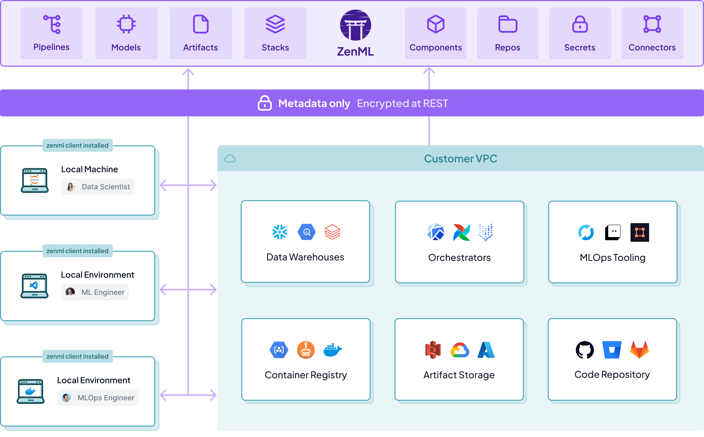

# ☁️ Cloud guide

This section of the guide consists of easy to follow guides on how to connect the major public clouds to your ZenML deployment. We achieve this by configuring a [stack](../production-guide/understand-stacks.md).

A `stack` is the configuration of tools and infrastructure that your pipelines can run on. When you run a pipeline, ZenML performs a different series of actions depending on the stack.

<figure><figcaption>
ZenML is the translation layer that allows your code to run on any of your stacks
</figcaption></figure>

Note, this guide focuses on the *registering* a stack, meaning that the resources required to run pipelines have already been *provisioned*. In order to provision the underlying infrastructure, you can either do so manually, use the [in-browser stack deployment wizard](../../how-to/infrastructure-deployment/stack-deployment/deploy-a-cloud-stack.md), the [stack registration wizard](../../how-to/infrastructure-deployment/stack-deployment/register-a-cloud-stack.md),
or [the ZenML Terraform modules](../../how-to/infrastructure-deployment/stack-deployment/deploy-a-cloud-stack-with-terraform.md).

<!-- For scarf -->
<figure></figure>
