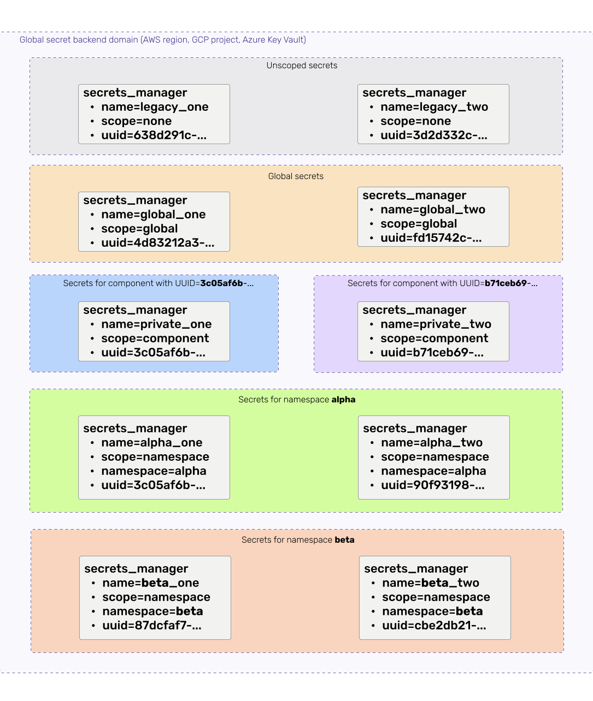


This is an older version of the ZenML documentation. To read and view the latest version please [visit this up-to-date URL](https://docs.zenml.io).



# Secrets Managers

Secrets managers provide a secure way of storing confidential information that is needed to run your ML pipelines. Most
production pipelines will run on cloud infrastructure and therefore need credentials to authenticate with those
services. Instead of storing these credentials in code or files, ZenML secrets managers can be used to store and
retrieve these values in a secure manner.


We are deprecating secrets managers in favor of
the [centralized ZenML secrets store](/docs/book/platform-guide/set-up-your-mlops-platform/use-the-secret-store/use-the-secret-store.md)
. Going forward, we recommend using the secrets store instead of secrets managers to configure and store secrets.

If you already use secrets managers to manage your secrets, please use the
provided `zenml secrets-manager secrets migrate` CLI command to migrate your secrets to the centralized secrets store.

Managing secrets through a secrets manager stack component suffers from a number of limitations, some of which are:

* you need to configure a Secrets Manager stack component and add it to your active stack before you can register and
  access secrets. With centralized secrets management, you don't need to configure anything; your ZenML local deployment
  or ZenML server replaces the secrets manager role.
* even with a secrets manager configured in your active stack, if you are using a secrets manager flavor with a cloud
  back-end (e.g. AWS, GCP, or Azure), you still need to configure all your ZenML clients with the authentication
  credentials required to access the back-end directly. This is not only an inconvenience, it is also a security risk
  because it basically represents a large attack surface. With centralized secrets management, you only need to
  configure the ZenML server to access the cloud back-end.

ZenML currently supports configuring the ZenML server to use the following back-ends as centralized secrets store
replacements for secrets managers:

* the SQL database that the ZenML server is using to store other managed objects such as pipelines, stacks, etc. This is
  the default option and replaces the `local` secrets manager flavor.
* AWS Secrets Manager - replaces the `aws` secrets manager flavor.
* GCP Secret Manager - replaces the `gcp` secrets manager flavor.
* Azure Key Vault - replaces the `azure` secrets manager flavor.
* HashiCorp Vault - replaces the `vault` secrets manager flavor.

The centralized secrets store also supports using a custom back-end implementation.

There is no direct migration path planned for the GitHub secrets manager flavor, given that it can only be used inside a
GitHub Actions workflow and thus is not a service that can be used as a centralized secrets store. If you are using the
GitHub secrets manager flavor, you have the option of manually transferring your secrets to one of the other supported
secrets store back-ends.


### When to use it

You should include a secrets manager in your ZenML stack if any other component of your stack requires confidential
information (such as authentication credentials) or you want to access secret values inside your pipeline steps.

### How they secret managers slot into the stack

Here is an architecture diagram that shows how remote secrets managers fit into the overall story of a remote stack. As
you can see the secrets manager is accessed from the client side as well as from the orchestrator/step operator. On the
client side, the secret manager could be used to resolve credentials for the orchestrator and container registry.
Orchestrators and Step Operators can also query the secrets manager to get credentials for other stack components, data
sources, or other environments.


### Secrets Manager Flavors

Out of the box, ZenML comes with a `local` secrets manager that stores secrets in local files. Additional cloud secrets
managers are provided by integrations:

| Secrets Manager             | Flavor  | Integration | Scoping Support | Notes                                  |
|-----------------------------|---------|-------------|-----------------|----------------------------------------|
| [Local](local.md)           | `local` | _built-in_  | No              | Uses local files to store secrets      |
| [AWS](aws.md)               | `aws`   | `aws`       | Yes             | Uses AWS to store secrets              |
| [GCP](gcp.md)               | `gcp`   | `gcp`       | Yes             | Uses GCP to store secretes             |
| [Azure](azure.md)           | `azure` | `azure`     | Yes             | Uses Azure Key Vaults to store secrets |
| [HashiCorp Vault](vault.md) | `vault` | `vault`     | Yes             | Uses HashiCorp Vault to store secrets  |

If you would like to see the available flavors of secrets managers, you can use the command:

```shell
zenml secrets-manager flavor list
```

### How to use it

#### In the CLI

A full guide on using the CLI interface to register, access, update and delete secrets is
available [here](https://sdkdocs.zenml.io/latest/cli/#zenml.cli--secrets-management-with-secrets-managers).


A ZenML secret is a grouping of key-value pairs that are defined by a schema. An AWS SecretSchema, for example, has
key-value pairs for `AWS_ACCESS_KEY_ID` and `AWS_SECRET_ACCESS_KEY` as well as an optional `AWS_SESSION_TOKEN`. If you
don't specify a schema when registering a secret, ZenML will use the `ArbitrarySecretSchema`, a schema where arbitrary
keys are allowed.


Note that there are two ways you can register or update your secrets. If you wish to do so interactively, passing the
secret name in as an argument (as in the following example) will initiate an interactive process:

```shell
zenml secrets-manager secret register SECRET_NAME -i
```

If you wish to specify key-value pairs using command line arguments, you can do so instead:

```shell
zenml secrets-manager secret register SECRET_NAME --key1=value1 --key2=value2
```

For secret values that are too big to pass as a command line argument, or have special characters, you can also use the
special `@` syntax to indicate to ZenML that the value needs to be read from a file:

```bash
zenml secrets-manager secret register SECRET_NAME --attr_from_literal=value \
   --attr_from_file=@path/to/file.txt ...
```

#### In a ZenML Step

You can access the secrets manager directly from within your steps, allowing you to use
your secrets for querying APIs from within your step without hard-coding your access keys.

```python
from zenml import step, get_step_context


@step(enable_cache=True)
def secret_loader() -> None:
    """Load the example secret from the secret manager."""
    # Load Secret from the active secret manager. This will fail if no secret
    # manager is active or if that secret does not exist.
    retrieved_secret = Client().active_stack.secrets_manager.get_secret( < SECRET_NAME >)

    # retrieved_secret.content will contain a dictionary with all Key-Value
    # pairs within your secret.
    return
```


This will only work if the environment that your orchestrator uses to execute steps has access to the secrets manager.
For example, a local secrets manager will not work in combination with a remote orchestrator.


### Secret Schemas

The concept of secret schemas exists to support strongly typed secrets that validate which keys can be configured for a
given secret and which values are allowed for those keys.

Secret schemas are available as built-in schemas or loaded when an integration is installed. Custom schemas can also be
defined by sub-classing the `zenml.secret.BaseSecretSchema` class. For example, the following is the builtin schema
defined for a MySQL secret:

```python
from typing import ClassVar, Optional

from zenml.secret.base_secret import BaseSecretSchema

MYSQL_METADATA_STORE_SCHEMA_TYPE = "mysql"


class MYSQLSecretSchema(BaseSecretSchema):
    TYPE: ClassVar[str] = MYSQL_METADATA_STORE_SCHEMA_TYPE

    user: Optional[str]
    password: Optional[str]
    ssl_ca: Optional[str]
    ssl_cert: Optional[str]
    ssl_key: Optional[str]
    ssl_verify_server_cert: Optional[bool] = False
```

To register a secret regulated by a schema, the `--schema` argument must be passed to
the `zenml secrets-manager secret register` command:

```shell
zenml secrets-manager secret register mysql_secret --schema=mysql --user=user --password=password
--ssl_ca=@./ca.pem --ssl_verify_server_cert=true
```

The keys and values passed to the CLI are validated using regular Pydantic rules:

* optional attributes don't need to be passed to the CLI and will be set to their default value if omitted
* required attributes must be passed to the CLI or an error will be raised
* all values must be a valid string representation of the data type indicated in the schema (i.e. that can be converted
  to the type indicated) or an error will be raised

### Secret References

Secret references work with any secrets manager and allow you to securely specify sensitive configurations for
your stack components. Check out the corresponding 
[documentation page](/docs/book/platform-guide/set-up-your-mlops-platform/use-the-secret-store/use-the-secret-store.md)
for more information.

### Secret Scopes

Examples of situations in which Secrets Manager scoping can be useful:

* you want to control whether a secret configured in a Secrets Manager stack component is visible in another Secrets
  Manager stack component. This is useful when you want to share secrets without
  necessarily sharing stack components.
* you want to be able to configure two or more secrets with the same name but with different values in different Secrets
  Manager stack components.
* you want to emulate multiple virtual Secrets Manager instances on top of a single infrastructure secret management
  service

The scope determines how secrets are shared across different _Secrets Manager instances_ that use the same _backend
domain_ (e.g. the same AWS region, GCP project, or Azure Key Vault). To understand if and how that is important for you,
we first need to define what these terms mean:

* a _Secrets Manager instance_ is created by running `zenml secrets-manager register`. An instance is uniquely
  identified by its UUID (not by its name).
* a _Secrets Manager backend domain_ can generally be thought of as the bucket where a Secrets Manager instance stores
  its secrets. Every Secrets Manager flavor uses a different implementation-specific backend domain (e.g. an AWS region,
  a GCP project, or an Azure Key Vault). This is usually reflected in the attributes that need to be configured for the
  Secrets Manager stack component.

All secrets in a backend domain share one global namespace, meaning that all Secrets Manager instances configured to use
the same backend domain have to compete over the names of secrets that they store there. Secrets Manager scoping
basically controls how the ZenML secret namespace is mapped to the underlying backend namespace.

The following diagram depicts the available secret scopes that you can configure for your Secrets Manager instance if
the flavor supports secret scoping. Note how the different secret namespaces are isolated from each other:



#### Secret Scope Configuration

All Secrets Managers have two configuration attributes that determine how and if a Secrets Manager instance shares
secrets with other Secrets Manager instances connected to the same back-end domain:

* `scope` determines the secret scope and can be set to one of the following values:
    * `none`: no secret scoping is used when this scope value is configured. This essentially means that all secrets use
      the same global namespace that is shared not only with other ZenML Secrets Manager instances using a `none` scope,
      but also with other applications and users that configure secrets directly in the backend. This mode of operation
      is only used to preserve backward compatibility with Secrets Manager instances that were already in use prior to
      the ZenML release 0.12.0 that introduced the concept of scoping. It is not recommended to use this scope with
      Secrets Manager instances that support scoping, as it will be deprecated and phased out in future ZenML versions.
    * `global`: secrets are shared across all Secrets Manager instances that connect to the same backend and have
      a `global` scope. You should use this scope if you want to share your secrets with everyone using ZenML in your
      team or organization and are not interested in micro-managing access to these secrets.
    * `component`: secrets are not visible outside a Secrets Manager instance. This is the default for new instances of
      Secrets Manager flavors that support scoping. Use this scope if you don't intend to share your secrets with other
      projects or stacks. The component scope means that only stacks with a Secrets Manager with the exact UUID as your
      stack can access your secrets. The global or namespace scope is more suitable for sharing access to secrets.
    * `namespace`: secrets in a namespace scope are shared only by Secrets Manager instances that connect to the same
      backend and have the same `namespace` attribute value configured (see below). Use a namespace scope when you want
      to fine-tune the visibility of secrets across stacks and projects.
* `namespace` is a scope namespace value to use with the namespace scope

<!-- For scarf -->
<figure></figure>
