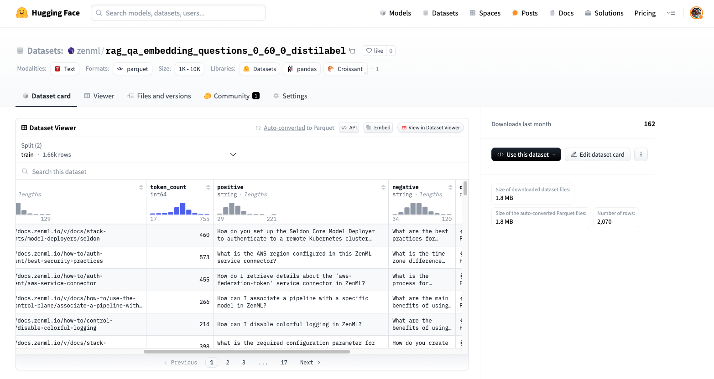

We now have a dataset that we can use to finetune our embeddings. You can
[inspect the positive and negative examples](https://huggingface.co/datasets/zenml/rag_qa_embedding_questions_0_60_0_distilabel) on the Hugging Face [datasets page](https://huggingface.co/datasets/zenml/rag_qa_embedding_questions_0_60_0_distilabel) since
our previous pipeline pushed the data there.



Our pipeline for finetuning the embeddings is relatively simple. We'll do the
following:

- load our data either from Hugging Face or [from Argilla via the ZenML
  annotation integration](../../../component-guide/annotators/argilla.md)
- finetune our model using the [Sentence
  Transformers](https://www.sbert.net/) library
- evaluate the base and finetuned embeddings
- visualize the results of the evaluation


## Loading data

By default the pipeline will load the data from our Hugging Face dataset. If
you've annotated your data in Argilla, you can load the data from there instead.
You'll just need to pass an `--argilla` flag to the Python invocation when
you're running the pipeline like so:

```bash
python run.py --embeddings --argilla
```

This assumes that you've set up an Argilla annotator in your stack. The code
checks for the annotator and downloads the data that was annotated in Argilla.
Please see our [guide to using the Argilla integration with ZenML](../../../component-guide/annotators/argilla.md) for more details.

## Finetuning with Sentence Transformers

The `finetune` step in the pipeline is responsible for finetuning the embeddings model using the Sentence Transformers library. Let's break down the key aspects of this step:

1. **Model Loading**: The code loads the base model (`EMBEDDINGS_MODEL_ID_BASELINE`) using the Sentence Transformers library. It utilizes the SDPA (Self-Distilled Pruned Attention) implementation for efficient training with Flash Attention 2.

2. **Loss Function**: The finetuning process employs a custom loss function called `MatryoshkaLoss`. This loss function is a wrapper around the `MultipleNegativesRankingLoss` provided by Sentence Transformers. The Matryoshka approach involves training the model with different embedding dimensions simultaneously. It allows the model to learn embeddings at various granularities, improving its performance across different embedding sizes.

3. **Dataset Preparation**: The training dataset is loaded from the provided `dataset` parameter. The code saves the training data to a temporary JSON file and then loads it using the Hugging Face `load_dataset` function.

4. **Evaluator**: An evaluator is created using the `get_evaluator` function. The evaluator is responsible for assessing the model's performance during training.

5. **Training Arguments**: The code sets up the training arguments using the `SentenceTransformerTrainingArguments` class. It specifies various hyperparameters such as the number of epochs, batch size, learning rate, optimizer, precision (TF32 and BF16), and evaluation strategy.

6. **Trainer**: The `SentenceTransformerTrainer` is initialized with the model,
   training arguments, training dataset, loss function, and evaluator. The
   trainer handles the training process. The `trainer.train()` method is called
   to start the finetuning process. The model is trained for the specified
   number of epochs using the provided hyperparameters.

7. **Model Saving**: After training, the finetuned model is pushed to the Hugging Face Hub using the `trainer.model.push_to_hub()` method. The model is saved with the specified ID (`EMBEDDINGS_MODEL_ID_FINE_TUNED`).

9. **Metadata Logging**: The code logs relevant metadata about the training process, including the training parameters, hardware information, and accelerator details.

10. **Model Rehydration**: To handle materialization errors, the code saves the
    trained model to a temporary file, loads it back into a new
    `SentenceTransformer` instance, and returns the rehydrated model.

(*Thanks and credit to Phil Schmid for [his tutorial on finetuning embeddings](https://www.philschmid.de/fine-tune-embedding-model-for-rag) with Sentence
Transformers and a Matryoshka loss function. This project uses many ideas and
some code from his implementation.*)

## Finetuning in code

Here's a simplified code snippet highlighting the key parts of the finetuning process:

```python
# Load the base model
model = SentenceTransformer(EMBEDDINGS_MODEL_ID_BASELINE)
# Define the loss function
train_loss = MatryoshkaLoss(model, MultipleNegativesRankingLoss(model))
# Prepare the training dataset
train_dataset = load_dataset("json", data_files=train_dataset_path)
# Set up the training arguments
args = SentenceTransformerTrainingArguments(...)
# Create the trainer
trainer = SentenceTransformerTrainer(model, args, train_dataset, train_loss)
# Start training
trainer.train()
# Save the finetuned model
trainer.model.push_to_hub(EMBEDDINGS_MODEL_ID_FINE_TUNED)
```

The finetuning process leverages the capabilities of the Sentence Transformers library to efficiently train the embeddings model. The Matryoshka approach allows for learning embeddings at different dimensions simultaneously, enhancing the model's performance across various embedding sizes.

Our model is finetuned, saved in the Hugging Face Hub for easy access and
reference in subsequent steps, but also versioned and tracked within ZenML for
full observability. At this point the pipeline will evaluate the base and
finetuned embeddings and visualize the results.

<!-- For scarf -->
<figure></figure>


