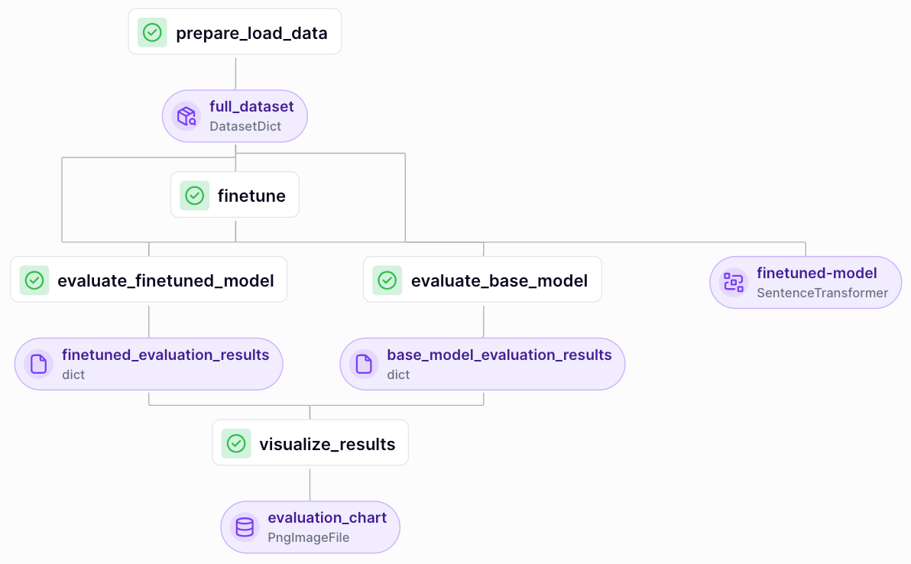

We now have a dataset that we can use to finetune our embeddings. You can
[inspect the positive and negative examples](https://huggingface.co/datasets/zenml/rag_qa_embedding_questions_0_60_0_distilabel) on the Hugging Face [datasets page](https://huggingface.co/datasets/zenml/rag_qa_embedding_questions_0_60_0_distilabel) since
our previous pipeline pushed the data there.

Our pipeline for finetuning the embeddings is relatively simple. We'll do the
following:

- load our data either from Hugging Face or [from Argilla via the ZenML
  annotation integration](../../../component-guide/annotators/argilla.md)
- finetune our model using the [Sentence
  Transformers](https://www.sbert.net/) library
- evaluate the base and finetuned embeddings
- visualise the results of the evaluation

<!-- For scarf -->
<figure></figure>

