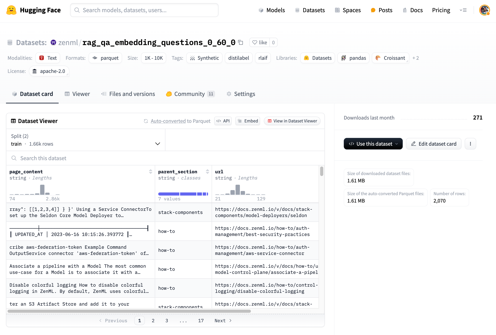
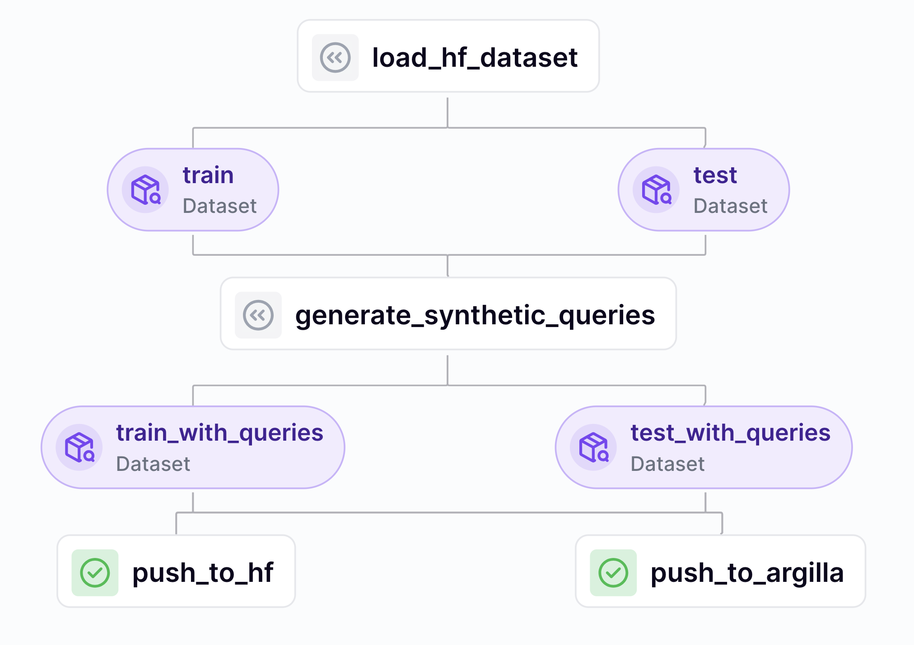

We already have [a dataset of technical documentation](https://huggingface.co/datasets/zenml/rag_qa_embedding_questions_0_60_0) that was generated
previously while we were working on the RAG pipeline. We'll use this dataset
to generate synthetic data with `distilabel`. You can inspect the data directly
[on the Hugging Face dataset page](https://huggingface.co/datasets/zenml/rag_qa_embedding_questions_0_60_0).



As you can see, it is made up of some `page_content` (our chunks) as well as the
source URL from where the chunk was taken from. With embeddings, what we're
going to want to do is pair the `page_content` with a question that we want to
answer. In a pre-LLM world we might have actually created a new column and
worked to manually craft questions for each chunk. However, with LLMs, we can
use the `page_content` to generate questions.

## Pipeline overview

Our pipeline to generate synthetic data will look like this:



We'll load the Hugging Face dataset, then we'll use `distilabel` to generate the
synthetic data. To finish off, we'll push the newly-generated data to a new
Hugging Face dataset and also push the same data to our Argilla instance for
annotation and inspection.

## Synthetic data generation

[`distilabel`](https://github.com/argilla-io/distilabel) provides a scalable and
reliable approach to distilling knowledge from LLMs by generating synthetic data
or providing AI feedback with LLMs as judges. We'll be using it a relatively
simple use case to generate some queries appropriate to our documentation
chunks, but it can be used for a variety of other tasks.

We can set up a `distilabel` pipeline easily in our ZenML step to handle the
dataset creation. We'll be using `gpt-4o` as the LLM to generate the synthetic
data so you can follow along, but `distilabel` supports a variety of other LLM
providers (including Ollama) so you can use whatever you have available.

```python
import os
from typing import Annotated, Tuple

import distilabel
from constants import (
    DATASET_NAME_DEFAULT,
    OPENAI_MODEL_GEN,
    OPENAI_MODEL_GEN_KWARGS_EMBEDDINGS,
)
from datasets import Dataset
from distilabel.llms import OpenAILLM
from distilabel.steps import LoadDataFromHub
from distilabel.steps.tasks import GenerateSentencePair
from zenml import step

synthetic_generation_context = """
The text is a chunk from technical documentation of ZenML.
ZenML is an MLOps + LLMOps framework that makes your infrastructure and workflow metadata accessible to data science teams.
Along with prose explanations, the text chunk may include code snippets and logs but these are identifiable from the surrounding backticks.
"""

@step
def generate_synthetic_queries(
    train_dataset: Dataset, test_dataset: Dataset
) -> Tuple[
    Annotated[Dataset, "train_with_queries"],
    Annotated[Dataset, "test_with_queries"],
]:
    llm = OpenAILLM(
        model=OPENAI_MODEL_GEN, api_key=os.getenv("OPENAI_API_KEY")
    )

    with distilabel.pipeline.Pipeline(
        name="generate_embedding_queries"
    ) as pipeline:
        load_dataset = LoadDataFromHub(
            output_mappings={"page_content": "anchor"},
        )
        generate_sentence_pair = GenerateSentencePair(
            triplet=True,  # `False` to generate only positive
            action="query",
            llm=llm,
            input_batch_size=10,
            context=synthetic_generation_context,
        )

        load_dataset >> generate_sentence_pair

    train_distiset = pipeline.run(
        parameters={
            load_dataset.name: {
                "repo_id": DATASET_NAME_DEFAULT,
                "split": "train",
            },
            generate_sentence_pair.name: {
                "llm": {
                    "generation_kwargs": OPENAI_MODEL_GEN_KWARGS_EMBEDDINGS
                }
            },
        },
    )

    test_distiset = pipeline.run(
        parameters={
            load_dataset.name: {
                "repo_id": DATASET_NAME_DEFAULT,
                "split": "test",
            },
            generate_sentence_pair.name: {
                "llm": {
                    "generation_kwargs": OPENAI_MODEL_GEN_KWARGS_EMBEDDINGS
                }
            },
        },
    )

    train_dataset = train_distiset["default"]["train"]
    test_dataset = test_distiset["default"]["train"]

    return train_dataset, test_dataset
```

As you can see, we set up the LLM, create a `distilabel` pipeline, load the
dataset, mapping the `page_content` column so that it becomes `anchor`. (This
column renaming will make things easier a bit later when we come to finetuning
the embeddings.) Then we generate the synthetic data by using the `GenerateSentencePair`
step. This will create queries for each of the chunks in the dataset, so if the
chunk was about registering a ZenML stack, the query might be "How do I register
a ZenML stack?". It will also create negative queries, which are queries that
would be inappropriate for the chunk. We do this so that the embeddings model
can learn to distinguish between appropriate and inappropriate queries.

We add some context to the generation process to help the LLM
understand the task and the data we're working with. In particular, we explain
that some parts of the text are code snippets and logs. We found performance to
be better when we added this context.

When this step runs within ZenML it will handle spinning up the necessary
processes to make batched LLM calls to the OpenAI API. This is really useful
when working with large datasets. `distilabel` has also implemented a caching
mechanism to avoid recomputing results for the same inputs. So in this case you
have two layers of caching: one in the `distilabel` pipeline and one in the
ZenML orchestrator. This helps [speed up the pace of iteration](https://www.zenml.io/blog/iterate-fast) and saves you money.

## Data annotation with Argilla


<!-- For scarf -->
<figure></figure>


