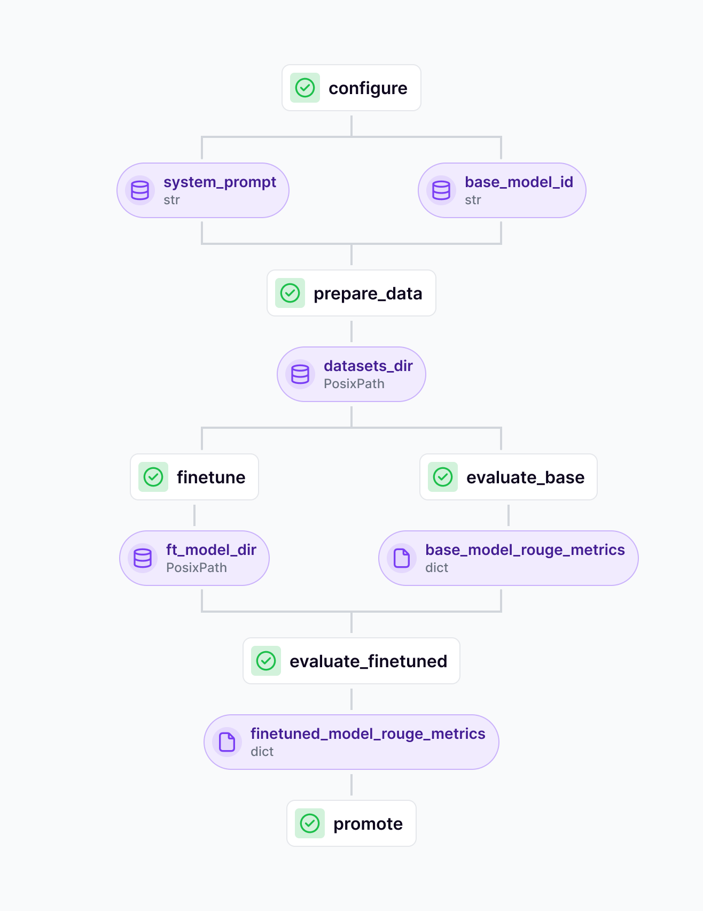

# Finetuning an LLM with Accelerate and PEFT

We're finally ready to get our hands on the code and see how it works. In this
example we'll be finetuning models on [the Viggo
dataset](https://huggingface.co/datasets/GEM/viggo). This is a dataset that
contains pairs of meaning representations and their corresponding natural language
descriptions for video game dialogues. The dataset was created to help train
models that can generate natural language responses from structured meaning
representations in the video game domain. It contains over 5,000 examples with
both the structured input and the target natural language output. We'll be
finetuning a model to learn this mapping and generate fluent responses from the
structured meaning representations.


For a
full walkthrough of how to run the LLM finetuning yourself, visit [the LLM Lora
Finetuning
project](https://github.com/zenml-io/zenml-projects/tree/main/llm-lora-finetuning)
where you'll find instructions and the code.


## The Finetuning Pipeline

Our finetuning pipeline combines the actual model finetuning with some
evaluation steps to check the performance of the finetuned model.



As you can see in the DAG visualization, the pipeline consists of the following
steps:

- **prepare_data**: We load and preprocess the Viggo dataset.
- **finetune**: We finetune the model on the Viggo dataset.
- **evaluate_base**: We evaluate the base model (i.e. the model before finetuning) on the Viggo dataset.
- **evaluate_finetuned**: We evaluate the finetuned model on the Viggo dataset.
- **promote**: We promote the best performing model to "staging" in the [Model Control Plane](../../../how-to/use-the-model-control-plane/README.md).

If you adapt the code to your own use case, the specific logic in each step
might differ but the overall structure should remain the same. When you're
starting out with this pipeline, you'll probably want to start with model with
smaller size (e.g. one of the Llama 3.1 family at the ~8B parameter mark) and
then iterate on that. This will allow you to quickly run through a number of
experiments and see how the model performs on your use case.

In this early stage, experimentation is important. Accordingly, any way you can maximize the number of experiments you can run will help increase the amount you can learn. So we want to minimize the amount of time it takes to iterate to a new experiment. Depending on the precise details of what you do, you might iterate on your data, on some hyperparameters of the finetuning process, or you might even try out different use case options.

## Implementation details

Our `prepare_data` step is very minimalistic. It loads the data from the Hugging
Face hub and tokenizes it with the model tokenizer. Potentially for your use
case you might want to do some more sophisticated filtering or formatting of the
data. Make sure to be especially careful about the format of your input data,
particularly when using instruction tuned models, since a mismatch here can
easily lead to unexpected results. It's a good rule of thumb to log inputs and
outputs for the finetuning step and to inspect these to make sure they look
correct.

For finetuning we use the `accelerate` library. This allows us to easily run the
finetuning on multiple GPUs should you choose to do so. After setting up the
parameters, the actual finetuning step is set up quite concisely:

```python
model = load_base_model(
        base_model_id,
        use_accelerate=use_accelerate,
        should_print=should_print,
        load_in_4bit=load_in_4bit,
        load_in_8bit=load_in_8bit,
    )

    trainer = transformers.Trainer(
        model=model,
        train_dataset=tokenized_train_dataset,
        eval_dataset=tokenized_val_dataset,
        args=transformers.TrainingArguments(
            output_dir=output_dir,
            warmup_steps=warmup_steps,
            per_device_train_batch_size=per_device_train_batch_size,
            gradient_checkpointing=False,
            gradient_checkpointing_kwargs={'use_reentrant':False} if use_accelerate else {},
            gradient_accumulation_steps=gradient_accumulation_steps,
            max_steps=max_steps,
            learning_rate=lr,
            logging_steps=(
                min(logging_steps, max_steps) if max_steps >= 0 else logging_steps
            ),
            bf16=bf16,
            optim=optimizer,
            logging_dir="./logs",
            save_strategy="steps",
            save_steps=min(save_steps, max_steps) if max_steps >= 0 else save_steps,
            evaluation_strategy="steps",
            eval_steps=eval_steps,
            do_eval=True,
            label_names=["input_ids"],
            ddp_find_unused_parameters=False,
        ),
        data_collator=transformers.DataCollatorForLanguageModeling(
            tokenizer, mlm=False
        ),
        callbacks=[ZenMLCallback(accelerator=accelerator)],
    )
```

Here are some things to note:

- The `ZenMLCallback` is used to log the training and evaluation metrics to
  ZenML.
- The `gradient_checkpointing_kwargs` are used to enable gradient checkpointing
  when using Accelerate.
- All the other significant parameters are parameterised in the configuration file that is
  used to run the pipeline. This means that you can easily swap out different
  values to try out different configurations without having to edit the code.

For the evaluation steps, we use [the `evaluate` library](https://github.com/huggingface/evaluate) to compute the ROUGE
scores. ROUGE (Recall-Oriented Understudy for Gisting Evaluation) is a set of metrics for evaluating automatic summarization and machine translation. It works by comparing generated text against reference texts by measuring:

- **ROUGE-N**: Overlap of n-grams (sequences of n consecutive words) between generated and reference texts
- **ROUGE-L**: Longest Common Subsequence between generated and reference texts
- **ROUGE-W**: Weighted Longest Common Subsequence that favors consecutive matches
- **ROUGE-S**: Skip-bigram co-occurrence statistics between generated and reference texts

These metrics help quantify how well the generated text captures the key
information and phrasing from the reference text, making them useful for
evaluating model outputs.

It is a generic evaluation that can be used for a wide range of tasks beyond
just finetuning LLMs. We use it here as a placeholder for a more sophisticated
evaluation step. See the next [evaluation section](./evaluation-for-finetuning.md) for more.

### Using the ZenML Accelerate Decorator

While the above implementation shows the use of Accelerate directly within your training code, ZenML also provides a more streamlined approach through the `@run_with_accelerate` decorator. This decorator allows you to easily enable distributed training capabilities without modifying your training logic:

```python
from zenml.integrations.huggingface.steps import run_with_accelerate

@run_with_accelerate(num_processes=4, multi_gpu=True, mixed_precision='bf16')
@step
def finetune_step(
    tokenized_train_dataset,
    tokenized_val_dataset,
    base_model_id: str,
    output_dir: str,
    # ... other parameters
):
    model = load_base_model(
        base_model_id,
        use_accelerate=True,
        should_print=True,
        load_in_4bit=load_in_4bit,
        load_in_8bit=load_in_8bit,
    )
    
    trainer = transformers.Trainer(
        # ... trainer setup as shown above
    )
    
    trainer.train()
    return trainer.model
```

The decorator approach offers several advantages:
- Cleaner separation of distributed training configuration from model logic
- Easy toggling of distributed training features through pipeline configuration
- Consistent interface across different training scenarios

Remember that when using the decorator, your Docker environment needs to be properly configured with CUDA support and Accelerate dependencies:

```python
from zenml import pipeline
from zenml.config import DockerSettings

docker_settings = DockerSettings(
    parent_image="pytorch/pytorch:1.12.1-cuda11.3-cudnn8-runtime",
    requirements=["accelerate", "torchvision"]
)

@pipeline(settings={"docker": docker_settings})
def finetuning_pipeline(...):
    # Your pipeline steps here
```

This configuration ensures that your training environment has all the necessary
components for distributed training. For more details, see the [Accelerate documentation](../../../how-to/advanced-topics/training-with-gpus/accelerate-distributed-training.md).

## Dataset iteration

While these stages offer lots of surface area for intervention and customization, the most significant thing to be careful with is the data that you input into the model. If you find that your finetuned model offers worse performance than the base, or if you get garbled output post-fine tuning, this would be a strong indicator that you have not correctly formatted your input data, or something is mismatched with the tokeniser and so on. To combat this, be sure to inspect your data at all stages of the process!

The main behavior and activity while using this notebook should be around being
more serious about your data. If you are finding that you're on the low end of
the spectrum, consider ways to either supplement that data or to synthetically
generate data that could be substituted in. You should also start to think about
evaluations at this stage (see [the next guide](./evaluation-for-finetuning.md) for more) since
the changes you will likely want to measure how well your model is doing,
especially when you make changes and customizations. Once you have some basic
evaluations up and running, you can then start thinking through all the optimal
parameters and measuring whether these updates are actually doing what you think
they will.

At a certain point, your mind will start to think beyond the details of what data you use as inputs and what hyperparameters or base models to experiment with. At that point you'll start to turn to the following:

- [better evaluations](./evaluation-for-finetuning.md)
- [how the model will be served (inference)](./deploying-finetuned-models.md)
- how the model and the finetuning process will exist within pre-existing production architecture at your company

A goal that might be also worth considering: 'how small can we get our model that would be acceptable for our needs and use case?' This is where evaluations become important. In general, smaller models mean less complexity and better outcomes, especially if you can solve a specific scoped-down use case.

Check out the sections that follow as suggestions for ways to think about these
larger questions.
