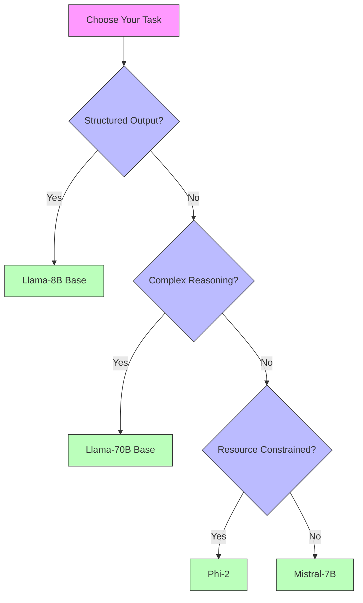


This is an older version of the ZenML documentation. To read and view the latest version please [visit this up-to-date URL](https://docs.zenml.io).


# Starter choices for finetuning LLMs

Finetuning large language models can be a powerful way to tailor their
capabilities to specific tasks and datasets. This guide will walk you through
the initial steps of finetuning LLMs, including selecting a use case, gathering
the appropriate data, choosing a base model, and evaluating the success of your
finetuning efforts. By following these steps, you can ensure that your
finetuning project is well-scoped, manageable, and aligned with your goals.

This is a high-level overview before we dive into the code examples, but it's
important to get these decisions right before you start coding. Your use case is
only as good as your data, and you'll need to choose a base model that is
appropriate for your use case.

## 🔍 Quick Assessment Questions

Before starting your finetuning project, ask:

1. Can you define success with numbers?
   - ✅ "95% accuracy in extracting order IDs"
   - ❌ "Better customer satisfaction"

2. Is your data ready?
   - ✅ "We have 1000 labeled support tickets"
   - ❌ "We could manually label some emails"

3. Is the task consistent?
   - ✅ "Convert email to 5 specific fields"
   - ❌ "Respond naturally to customers"

4. Can a human verify correctness?
   - ✅ "Check if extracted date matches document"
   - ❌ "Evaluate if response is creative"

## Picking a use case

In general, try to pick something that is small and self-contained, ideally the smaller the better. It should be something that isn't easily solvable by other (non-LLM) means — as then you'd be best just solving it that way — but it also shouldn't veer too much in the direction of 'magic'. Your LLM use case, in other words, should be something where you can test to know if it is handling the task you're giving to it.

For example, a general use case of "answer all customer support emails" is almost certainly too vague, whereas something like "triage incoming customer support queries and extract relevant information as per some pre-defined checklist or schema" is much more realistic.

It's also worth picking something where you can reach some sort of answer as to whether this the right approach in a short amount of time. If your use case depends on the generation or annotation of lots of data, or organisation and sorting of pre-existing data, this is less of an ideal starter project than if you have data that already exists within your organisation and that you can repurpose here.

## Picking data for your use case

The data needed for your use case will follow directly from the specific use case you're choosing, but ideally it should be something that is already *mostly* in the direction of what you need. It will take time to annotate and manually transform data if it is too distinct from the specific use case you want to use, so try to minimise this as much as you possibly can.

A couple of examples of where you might be able to reuse pre-existing data:

- you might have examples of customer support email responses for some specific scenario which deal with a well-defined technical topic that happens often but that requires these custom responses instead of just a pro-forma reply
- you might have manually extracted metadata from customer data or from business data and you have hundreds or (ideally) thousands of examples of these

In terms of data volume, a good rule of thumb is that for a result that will be rewarding to work on, you probably want somewhere in the order of hundreds to thousands of examples.

### 🎯 Good vs Not-So-Good Use Cases

| Good Use Cases ✅ | Why It Works | Example | Data Requirements |
|------------------|--------------|---------|-------------------|
| **Structured Data Extraction** | Clear inputs/outputs, easily measurable accuracy | Extracting order details from customer emails (`order_id`, `issue_type`, `priority`) | 500-1000 annotated emails |
| **Domain-Specific Classification** | Well-defined categories, objective evaluation | Categorizing support tickets by department (Billing/Technical/Account) | 1000+ labeled examples per category |
| **Standardized Response Generation** | Consistent format, verifiable accuracy | Generating technical troubleshooting responses from documentation | 500+ pairs of queries and approved responses |
| **Form/Document Parsing** | Structured output, clear success metrics | Extracting fields from invoices (date, amount, vendor) | 300+ annotated documents |
| **Code Comment Generation** | Specific domain, measurable quality | Generating docstrings for Python functions | 1000+ function/docstring pairs |

| Challenging Use Cases ⚠️ | Why It's Tricky | Alternative Approach |
|-------------------------|------------------|---------------------|
| **Open-ended Chat** | Hard to measure success, inconsistent format | Use instruction tuning or prompt engineering instead |
| **Creative Writing** | Subjective quality, no clear metrics | Focus on specific formats/templates rather than open creativity |
| **General Knowledge QA** | Too broad, hard to validate accuracy | Narrow down to specific knowledge domain or use RAG |
| **Complex Decision Making** | Multiple dependencies, hard to verify | Break down into smaller, measurable subtasks |
| **Real-time Content Generation** | Consistency issues, timing constraints | Use templating or hybrid approaches |

As you can see, the challenging use cases are often the ones that are more
open-ended or creative, and so on. With LLMs and finetuning, the real skill is
finding a way to scope down your use case to something that is both small and
manageable, but also where you can still make meaningful progress.

### 📊 Success Indicators

You can get a sense of how well-scoped your use case is by considering the following indicators:

| Indicator | Good Sign | Warning Sign |
|-----------|-----------|--------------|
| **Task Scope** | "Extract purchase date from receipts" | "Handle all customer inquiries" |
| **Output Format** | Structured JSON, fixed fields | Free-form text, variable length |
| **Data Availability** | 500+ examples ready to use | "We'll need to create examples" |
| **Evaluation Method** | Field-by-field accuracy metrics | "Users will tell us if it's good" |
| **Business Impact** | "Save 10 hours of manual data entry" | "Make our AI more human-like" |

You'll want to pick a use case that has a good mix of these indicators and where
you can reasonably expect to be able to measure success in a timely manner.

## Picking a base model

In these early stages, picking the right model probably won't be the most significant choice you make. If you stick to some tried-and-tested base models you will usually be able to get a sense of how well the LLM is able to align itself to your particular task. That said, choosing from the Llama3.1-8B or Mistral-7B families would probably be the best option.

As to whether to go with a base model or one that has been instruction-tuned,
this depends a little on your use case. If your use case is in the area of
structured data extraction (highly recommended to start with something
well-scoped like this) then you're advised to use the base model as it is more
likely to align to this kind of text generation. If you're looking for something
that more resembles a chat-style interface, then an instruction-tuned model is
probably more likely to give you results that suit your purposes. In the end
you'll probably want to try both out to confirm this, but this rule of thumb
should give you a sense of what to start with.

### 📊 Quick Model Selection Matrix

| Model Family | Best For | Resource Requirements | Characteristics | When to Choose |
|-------------|----------|----------------------|-----------------|----------------|
| [**Llama 3.1 8B**](https://huggingface.co/meta-llama/Llama-3.1-8B) | • Structured data extraction • Classification • Code generation | • 16GB GPU RAM • Mid-range compute | • 8 billion parameters • Strong logical reasoning • Efficient inference | When you need a balance of performance and resource efficiency |
| [**Llama 3.1 70B**](https://huggingface.co/meta-llama/Llama-3.1-70B) | • Complex reasoning • Technical content • Longer outputs | • 80GB GPU RAM • High compute | • 70 billion parameters • Advanced reasoning • More nuanced outputs • Higher accuracy | When accuracy is critical and substantial resources are available |
| [**Mistral 7B**](https://huggingface.co/mistralai/Mistral-7B-v0.3) | • General text generation • Dialogue • Summarization | • 16GB GPU RAM • Mid-range compute | • 7.3 billion parameters • Strong instruction following • Good context handling • Efficient training | When you need reliable instruction following with moderate resources |
| [**Phi-2**](https://huggingface.co/microsoft/phi-2) | • Lightweight tasks • Quick experimentation • Educational use | • 8GB GPU RAM • Low compute | • 2.7 billion parameters • Fast training • Smaller footprint • Good for prototyping | When resources are limited or for rapid prototyping |

## 🎯 Task-Specific Recommendations

Remember: Start with the smallest model that meets your needs - you can always scale up if necessary!

## How to evaluate success

Part of the work of scoping your use case down is to make it easier to define whether the project has been successful or not. We have [a separate section which deals with evaluation](./evaluation-for-finetuning.md) but the important thing to remember here is that if you are unable to specify some sort of scale of how well the LLM addresses your problems then it's going to be both hard to know if you should continue with the work and also hard to know whether specific tweaks and changes are pushing you more into the right direction.

In the early stages, you'll rely on so-called 'vibes'-based checks. You'll try out some queries or tasks and see whether the response is roughly what you'd expect, or way off and so on. But beyond that, you'll want to have a more precise measurement of success. So the extent to which you can scope the use case down will define how much you're able to measure your success.

A use case which is simply to function as a customer-support chatbot is really hard to measure. Which aspects of this task should we track and which should we classify as some kind of failure scenario? In the case of structured data extraction, we can do much more fine-grained measurement of exactly which parts of the data extraction are difficult for the LLM and how they improve (or degrade) when we change certain parameters, and so on.

For structured data extraction, you might measure:

- Accuracy of extracted fields against a test dataset
- Precision and recall for specific field types
- Processing time per document
- Error rates on edge cases

These are all covered in more detail in the [evaluation section](./evaluation-for-finetuning.md).

## Next steps

Now that you have a clear understanding of how to scope your finetuning project,
select appropriate data, and evaluate results, you're ready to dive into the
technical implementation. In the next section, we'll walk through [a practical example of finetuning using the Accelerate library](./finetuning-with-accelerate.md),
showing you how to implement
these concepts in code.
