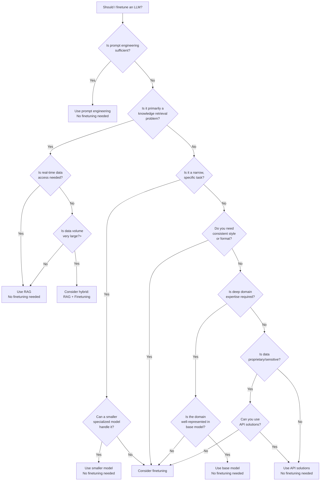


This is an older version of the ZenML documentation. To read and view the latest version please [visit this up-to-date URL](https://docs.zenml.io).


# Why and when to finetune LLMs

This guide is intended to be a practical overview that gets you started with
finetuning models on your custom data and use cases. Before we dive into the details of this, it's worth taking a moment to bear in mind the following:

- LLM finetuning is not a universal solution or approach: it won't and cannot solve every problem, it might not reach the required levels of accuracy or performance for your use case and you should know that by going the route of finetuning you are taking on a not-inconsiderable amount of technical debt.
- Chatbot-style interfaces are not the only way LLMs can be used: there are lots of uses for LLMs and this finetuning approach which don't include any kind of chatbot. What's more, these non-chatbot interfaces should often to be considered preferable since the surface area of failure is much lower.
- The choice to finetune an LLM should probably be the final step in a series of experiments. As with the first point, you shouldn't just jump to it because other people are doing it. Rather, you should probably rule out other approaches (smaller models for more decomposed tasks, [RAG](../rag-with-zenml/understanding-rag.md) if you're working on a retrieval or long-context problem, or a mixture of the above for more complete use cases).

## When does it make sense to finetune an LLM?

Finetuning an LLM can be a powerful approach in certain scenarios. Here are some situations where it might make sense:

1. **Domain-specific knowledge**: When you need the model to have deep understanding
   of a particular domain (e.g., medical, legal, or technical fields) that isn't
   well-represented in the base model's training data. Usually, RAG will be a
   better choice for novel domains, but if you have a lot of data and a very
   specific use case, finetuning might be the way to go.

2. **Consistent style or format**: If you require outputs in a very specific style
   or format that the base model doesn't naturally produce. This is especially
   true for things like code generation or structured data generation/extraction.

3. **Improved accuracy on specific tasks**: When you need higher accuracy on particular tasks that are crucial for your application.

4. **Handling proprietary information**: If your use case involves working with confidential or proprietary information that can't be sent to external API endpoints.

5. **Custom instructions or prompts**: If you find yourself repeatedly using the
   same set of instructions or prompts, finetuning can bake these into the model
   itself. This might save you latency and costs compared to repeatedly sending the same prompt to an API.

6. **Improved efficiency**: Finetuning can sometimes lead to better performance with shorter prompts, potentially reducing costs and latency.

Here's a flowchart representation of these points:

## Alternatives to consider

Before deciding to finetune an LLM, consider these alternatives:

- Prompt engineering: Often, carefully crafted prompts can achieve good results without the need for finetuning.
- [Retrieval-Augmented Generation (RAG)](../rag-with-zenml/understanding-rag.md): For many use cases involving specific knowledge bases, RAG can be more effective and easier to maintain than finetuning.
- Smaller, task-specific models: For narrow tasks, smaller models trained specifically for that task might outperform a finetuned large language model.
- API-based solutions: If your use case doesn't require handling sensitive data, using API-based solutions from providers like OpenAI or Anthropic might be simpler and more cost-effective.

Finetuning LLMs can be a powerful tool when used appropriately, but it's important to carefully consider whether it's the best approach for your specific use case. Always start with simpler solutions and move towards finetuning only when you've exhausted other options and have a clear need for the benefits it provides.

In the next section we'll look at some of the practical considerations you have
to take into account when finetuning LLMs.
