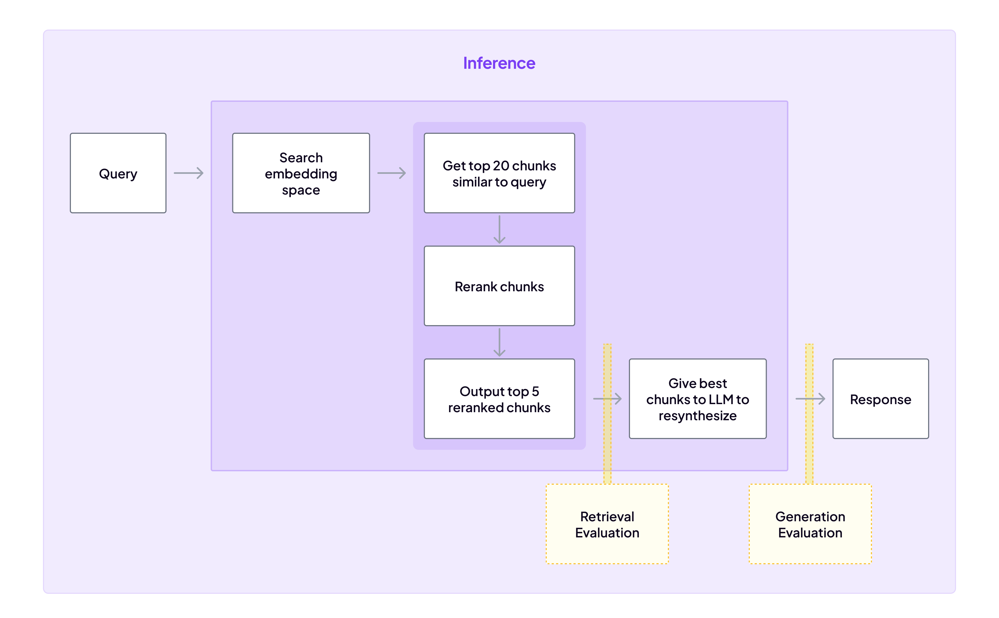

# Evaluating reranking performance

We've already set up an evaluation pipeline, so adding reranking evaluation is relatively straightforward. In this section, we'll explore how to evaluate the performance of your reranking model using ZenML.

### Evaluating Reranking Performance

The simplest first step in evaluating the reranking model is to compare the retrieval performance before and after reranking. You can use the same metrics we discussed in the [evaluation section](../evaluation/) to assess the performance of the reranking model.



If you recall, we have a hand-crafted set of queries and relevant documents that we use to evaluate the performance of our retrieval system. We also have a set that was [generated by LLMs](../evaluation/retrieval.md#automated-evaluation-using-synthetic-generated-queries). The actual retrieval test is implemented as follows:

```python
def perform_retrieval_evaluation(
    sample_size: int, use_reranking: bool
) -> float:
    """Helper function to perform the retrieval evaluation."""
    dataset = load_dataset("zenml/rag_qa_embedding_questions", split="train")
    sampled_dataset = dataset.shuffle(seed=42).select(range(sample_size))

    total_tests = len(sampled_dataset)
    failures = 0

    for item in sampled_dataset:
        generated_questions = item["generated_questions"]
        question = generated_questions[
            0
        ]  # Assuming only one question per item
        url_ending = item["filename"].split("/")[
            -1
        ]  # Extract the URL ending from the filename

        # using the method above to query similar documents
        # we pass in whether we want to use reranking or not
        _, _, urls = query_similar_docs(question, url_ending, use_reranking)

        if all(url_ending not in url for url in urls):
            logging.error(
                f"Failed for question: {question}. Expected URL ending: {url_ending}. Got: {urls}"
            )
            failures += 1

    logging.info(f"Total tests: {total_tests}. Failures: {failures}")
    failure_rate = (failures / total_tests) * 100
    return round(failure_rate, 2)
```

This function takes a sample size and a flag indicating whether to use reranking and evaluates the retrieval performance based on the generated questions and relevant documents. It queries similar documents for each question and checks whether the expected URL ending is present in the retrieved URLs. The failure rate is calculated as the percentage of failed tests over the total number of tests.

This function is then called in two separate evaluation steps: one for the retrieval system without reranking and one for the retrieval system with reranking.

```python
@step
def retrieval_evaluation_full(
    sample_size: int = 100,
) -> Annotated[float, "full_failure_rate_retrieval"]:
    """Executes the retrieval evaluation step without reranking."""
    failure_rate = perform_retrieval_evaluation(
        sample_size, use_reranking=False
    )
    logging.info(f"Retrieval failure rate: {failure_rate}%")
    return failure_rate


@step
def retrieval_evaluation_full_with_reranking(
    sample_size: int = 100,
) -> Annotated[float, "full_failure_rate_retrieval_reranking"]:
    """Executes the retrieval evaluation step with reranking."""
    failure_rate = perform_retrieval_evaluation(
        sample_size, use_reranking=True
    )
    logging.info(f"Retrieval failure rate with reranking: {failure_rate}%")
    return failure_rate
```

Both of these steps return the failure rate of the respective retrieval systems. If we want, we can look into the logs of those steps (either on the dashboard or in the terminal) to see specific examples that failed. For example:

```
...
Loading default flashrank model for language en
Default Model: ms-marco-MiniLM-L-12-v2
Loading FlashRankRanker model ms-marco-MiniLM-L-12-v2
Loading model FlashRank model ms-marco-MiniLM-L-12-v2...
Running pairwise ranking..
Failed for question:  Based on the provided ZenML documentation text, here's a question
 that can be asked: "How do I develop a custom alerter as described on the Feast page, 
 and where can I find the 'How to use it?' guide?". Expected URL ending: feature-stores.
  Got: ['https://docs.zenml.io/stacks-and-components/component-guide/alerters/custom', 
  'https://docs.zenml.io/v/docs/stacks-and-components/component-guide/alerters/custom', 
  'https://docs.zenml.io/v/docs/reference/how-do-i', 'https://docs.zenml.io/stacks-and-components/component-guide/alerters', 
  'https://docs.zenml.io/stacks-and-components/component-guide/alerters/slack']

Loading default flashrank model for language en
Default Model: ms-marco-MiniLM-L-12-v2
Loading FlashRankRanker model ms-marco-MiniLM-L-12-v2
Loading model FlashRank model ms-marco-MiniLM-L-12-v2...
Running pairwise ranking..
Step retrieval_evaluation_full_with_reranking has finished in 4m20s.
```

We can see here a specific example of a failure in the reranking evaluation. It's quite a good one because we can see that the question asked was actually an anomaly in the sense that the LLM has generated two questions and included its meta-discussion of the two questions it generated. Obviously this is not a representative question for the dataset, and if we saw a lot of these we might want to take some time to both understand why the LLM is generating these questions and how we can filter them out.

### Visualizing our reranking performance

Since ZenML can display visualizations in its dashboard, we can showcase the results of our experiments in a visual format. For example, we can plot the failure rates of the retrieval system with and without reranking to see the impact of reranking on the performance.

Our documentation explains how to set up your outputs so that they appear as visualizations in the ZenML dashboard. You can find more information [here](../../../how-to/visualize-artifacts/README.md). There are lots of options, but we've chosen to plot our failure rates as a bar chart and export them as a `PIL.Image` object. We also plotted the other evaluation scores so as to get a quick global overview of our performance.

```python
# passing the results from all our previous evaluation steps

@step(enable_cache=False)
def visualize_evaluation_results(
    small_retrieval_eval_failure_rate: float,
    small_retrieval_eval_failure_rate_reranking: float,
    full_retrieval_eval_failure_rate: float,
    full_retrieval_eval_failure_rate_reranking: float,
    failure_rate_bad_answers: float,
    failure_rate_bad_immediate_responses: float,
    failure_rate_good_responses: float,
    average_toxicity_score: float,
    average_faithfulness_score: float,
    average_helpfulness_score: float,
    average_relevance_score: float,
) -> Optional[Image.Image]:
    """Visualizes the evaluation results."""
    step_context = get_step_context()
    pipeline_run_name = step_context.pipeline_run.name

    normalized_scores = [
        score / 20
        for score in [
            small_retrieval_eval_failure_rate,
            small_retrieval_eval_failure_rate_reranking,
            full_retrieval_eval_failure_rate,
            full_retrieval_eval_failure_rate_reranking,
            failure_rate_bad_answers,
        ]
    ]

    scores = normalized_scores + [
        failure_rate_bad_immediate_responses,
        failure_rate_good_responses,
        average_toxicity_score,
        average_faithfulness_score,
        average_helpfulness_score,
        average_relevance_score,
    ]

    labels = [
        "Small Retrieval Eval Failure Rate",
        "Small Retrieval Eval Failure Rate Reranking",
        "Full Retrieval Eval Failure Rate",
        "Full Retrieval Eval Failure Rate Reranking",
        "Failure Rate Bad Answers",
        "Failure Rate Bad Immediate Responses",
        "Failure Rate Good Responses",
        "Average Toxicity Score",
        "Average Faithfulness Score",
        "Average Helpfulness Score",
        "Average Relevance Score",
    ]

    # Create a new figure and axis
    fig, ax = plt.subplots(figsize=(10, 6))

    # Plot the horizontal bar chart
    y_pos = np.arange(len(labels))
    ax.barh(y_pos, scores, align="center")
    ax.set_yticks(y_pos)
    ax.set_yticklabels(labels)
    ax.invert_yaxis()  # Labels read top-to-bottom
    ax.set_xlabel("Score")
    ax.set_xlim(0, 5)
    ax.set_title(f"Evaluation Metrics for {pipeline_run_name}")

    # Adjust the layout
    plt.tight_layout()

    # Save the plot to a BytesIO object
    buf = io.BytesIO()
    plt.savefig(buf, format="png")
    buf.seek(0)

    image = Image.open(buf)

    return image
```

For one of my runs of the evaluation pipeline, this looked like the following in the dashboard:


You can see that for the full retrieval evaluation we do see an improvement. Our small retrieval test, which as of writing only included five questions, showed a considerable degradation in performance. Since these were specific examples where we knew the answers, this would be something we'd want to look into to see why the reranking model was not performing as expected.

We can also see that regardless of whether reranking was performed or not, the retrieval scores aren't great. This is a good indication that we might want to look into the retrieval model itself (i.e. our embeddings) to see if we can improve its performance. This is what we'll turn to next as we explore finetuning our embeddings to improve retrieval performance.

### Try it out!

To see how this works in practice, you can run the evaluation pipeline using the project code. The reranking is included as part of the pipeline, so providing you've run the main `rag` pipeline, you can run the evaluation pipeline to see how the reranking model is performing.

To run the evaluation pipeline, first clone the project repository:

```bash
git clone https://github.com/zenml-io/zenml-projects.git
```

Then navigate to the `llm-complete-guide` directory and follow the instructions in the `README.md` file to run the evaluation pipeline. (You'll have to have first run the main pipeline to generate the embeddings.)

To run the evaluation pipeline, you can use the following command:

```bash
python run.py --evaluation
```

This will run the evaluation pipeline and output the results to the dashboard. As always, you can inspect the progress, logs, and results in the dashboard!

<figure><figcaption></figcaption></figure>
