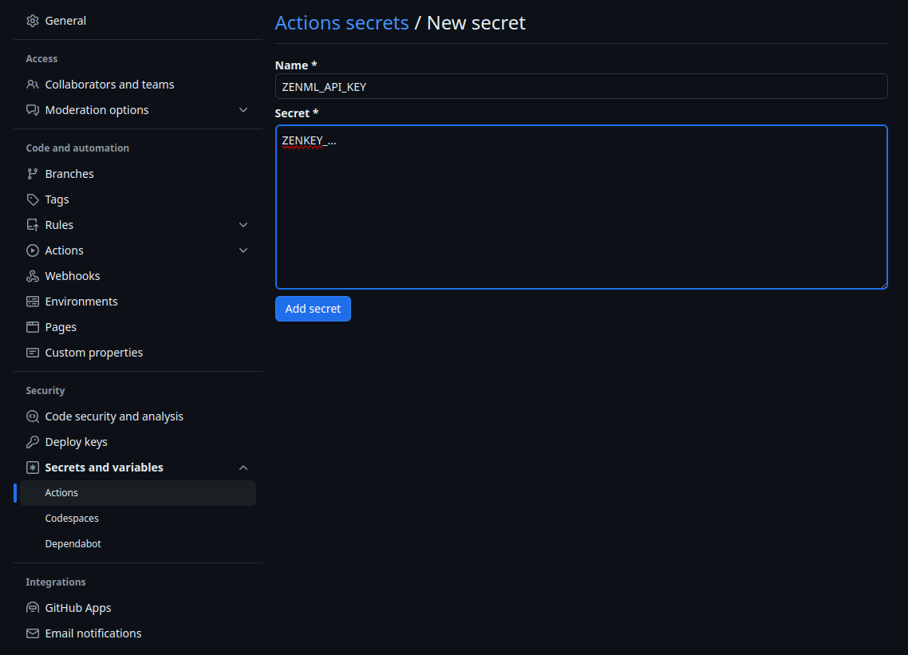

# Set up CI/CD

Until now, we have been executing ZenML pipelines locally. While this is a good mode of operating pipelines, in
production it is often desirable to mediate runs through a central workflow engine baked into your CI.

This allows data scientists to experiment with data processing and model training locally and then have code changes
automatically tested and validated through the standard pull request/merge request peer review process. Changes that
pass the CI and code-review are then deployed automatically to production. Here is how this could look like:


## Breaking it down

To illustrate this, let's walk through how this process could be set up on
a GitHub Repository. Basically we'll be using gh actions in order to set up
a proper CI/CD workflow. For this we will be using Github Action workflows.

To see this in action, check out the [ZenML Gitflow Repository](https://github.com/zenml-io/zenml-gitflow/). This
repository showcases how ZenML can be used for machine learning with a GitHub workflow that automates CI/CD with
continuous model training and continuous model deployment to production. The repository is also meant to be used as a
template: you can fork it and easily adapt it to your own MLOps stack, infrastructure, code and data.

## Configure an API Key in ZenML

In order to facilitate machine-to-machine connection you need to create an API key within ZenML. Learn more about those
[here](https://docs.zenml.io/how-to/connecting-to-zenml/connect-with-a-service-account).

```bash
zenml service-account create github_action_api_key
```

This will return the API Key to you like this. This will not be shown to you again, so make sure to copy it here for
use in the next section.

```bash
Created service account 'github_action_api_key'.
Successfully created API key `default`.
The API key value is: 'ZENKEY_...'
Please store it safely as it will not be shown again.
To configure a ZenML client to use this API key, run:

...
```

## Set up your secrets in Github

For our Github Actions we will need to set up some secrets [for our repository](https://docs.github.com/en/actions/security-guides/using-secrets-in-github-actions#creating-secrets-for-a-repository). 
Specifically, you should use github secrets to store the `ZENML_API_KEY` that you created above.



The other values that are loaded from secrets into the environment [here](https://github.com/zenml-io/zenml-gitflow/blob/main/.github/workflows/pr.yaml#L14-L23)
can also be set explicitly or as variables.

## Set up different stacks for Staging and Production

You might not necessarily want to use the same stack with the same resources for your staging and production use. 

This step is optional, all you'll need for certain is one cloud stack (remote orchestration and artifact storage). The
rest is up to you.

## Run Pipeline for PRs

One way to ensure only fully working code makes it into production, you should use a staging environment to test all
the changes made to your code base and verify they work as intended. To do so automatically you should set up a
github action workflow that runs your pipeline for you when you make changes to it. 
[Here](https://github.com/zenml-io/zenml-gitflow/blob/main/.github/workflows/pr.yaml) is an example that you can use.

To only run the Github Action on a PR, you can configure the yaml like this 
```bash
on:
  pull_request:
    branches: [staging, main]
```

When the workflow starts we want to set some important values. Here is a simplified version that you can use.
```bash
jobs:
  run-staging-workflow:
    runs-on: ubuntu-dind-runners
    env:
      ZENML_HOST: ${{ secrets.ZENML_HOST }}  # Put your server url here
      ZENML_API_KEY: ${{ secrets.ZENML_API_KEY }}  # Retrieves the api key for use  
      ZENML_STAGING_STACK: staging_stack_name  #  Use this to decide which stack is used for staging
      ZENML_PRODUCTION_STACK: prod_stack_name  #  Use this to decide which stack is used for staging
      ZENML_GITHUB_SHA: ${{ github.event.pull_request.head.sha }}
      ZENML_GITHUB_URL_PR: ${{ github.event.pull_request._links.html.href }}
```

After configuring these things so they apply to your specific situation the rest of the template should work as is for 
you.

<figure><figcaption></figcaption></figure>
