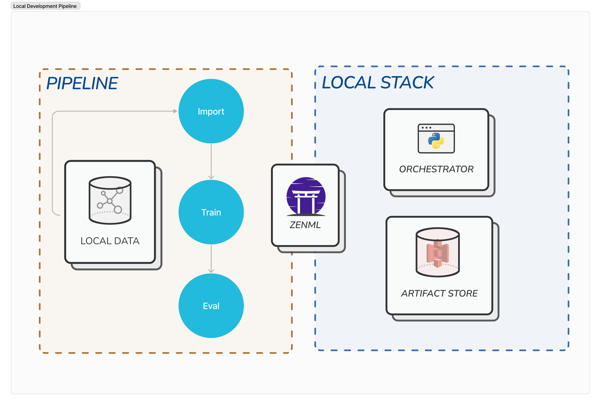


This is an older version of the ZenML documentation. To read and view the latest version please [visit this up-to-date URL](https://docs.zenml.io).


# Set up CI/CD

Until now, we have been executing ZenML pipelines locally. While this is a good mode of operating pipelines, in production it is often desirable to mediate runs through a central workflow engine baked into your CI.

This allows data scientists to experiment with data processing and model training locally and then have code changes automatically tested and validated through the standard pull request/merge request peer review process. Changes that pass the CI and code-review are then deployed automatically to production. Here is how this could look like:

## Breaking it down

To illustrate this, let's walk through how this process might be set up on a [GitHub Repository](https://github.com/zenml-io/zenml-gitflow).

A data scientist wants to make improvements to the ML pipeline. They clone the repository, create a new branch, and experiment with new models or data processing steps on their local machine.

Once the data scientist thinks they have improved the pipeline, they create a pull request for their branch on GitHub. This automatically triggers a GitHub Action that will run the same pipeline in the staging environment (e.g. a pipeline running on a cloud stack in GCP), potentially with different test data. As long as the pipeline does not run successfully in the staging environment, the PR cannot be merged. The pipeline also generates a set of metrics and test results that are automatically published to the PR, where they can be peer-reviewed to decide if the changes should be merged.

Once the PR has been reviewed and passes all checks, the branch is merged into `main`. This automatically triggers another GitHub Action that now runs a pipeline in the production environment, which trains the same model on production data, runs some checks to compare its performance with the model currently served in production and then, if all checks pass, automatically deploys the new model.

To see this in action, check out the [ZenML Gitflow Repository](https://github.com/zenml-io/zenml-gitflow/). This repository showcases how ZenML can be used for machine learning with a GitHub workflow that automates CI/CD with continuous model training and continuous model deployment to production. The repository is also meant to be used as a template: you can fork it and easily adapt it to your own MLOps stack, infrastructure, code and data.

<figure><figcaption></figcaption></figure>
