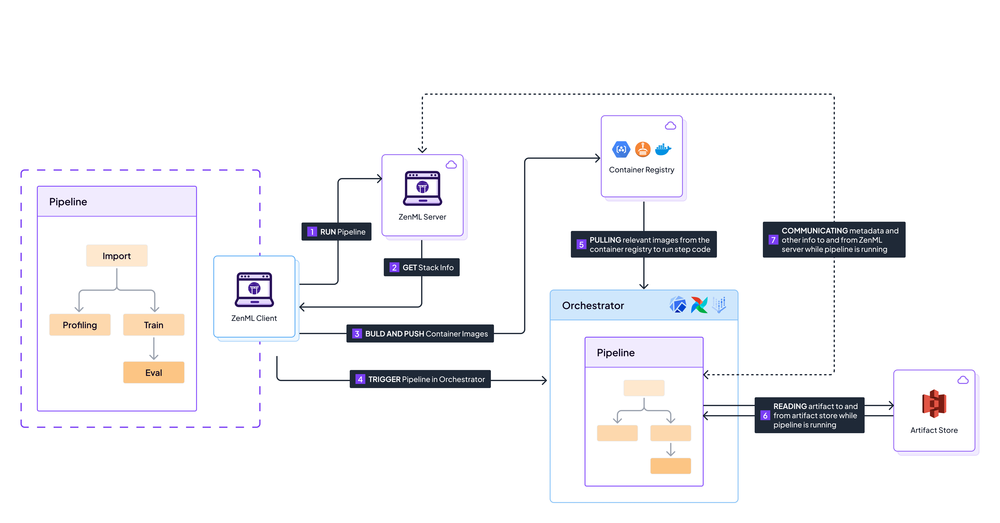

# Orchestrate on the cloud

Until now, we've only run pipelines locally. The next step is to get free from our local machines and transition our pipelines to execute on the cloud. This will enable you to run your MLOps pipelines in a cloud environment, leveraging the scalability and robustness that cloud platforms offer.

In order to do this, we need to get familiar with two more stack components:

* The [orchestrator](../../component-guide/orchestrators/orchestrators.md) manages the workflow and execution of your pipelines.
* The [container registry](../../component-guide/container-registries/container-registries.md) is a storage and content delivery system that holds your Docker container images.

These, along with [remote storage](remote-storage.md), complete a basic cloud stack where our pipeline is entirely running on the cloud.


Would you like to skip ahead and deploy a full ZenML cloud stack already?

Registering a remote stack is one of the first steps towards taking your ZenML
project to production and it can get complicated. ZenML supports you in this
process by providing a few different shortcuts to help you deploy your first
stack based on real cloud infrastructure with minimal effort:

* you can let ZenML take the wheel and use [the automated 1-click stack deployment flow](../../how-to/stack-deployment/deploy-a-cloud-stack.md) to build your ZenML cloud stack from scratch. This is the easiest way to get started with cloud ZenML stacks, in the dashboard or with the CLI:

```shell
zenml stack deploy --provider aws|gcp|azure
```
* if you already have some infrastructure pieces provisioned in your cloud and you prefer to have more control over the stack configuration, 
you can also use [the stack wizard](../../how-to/stack-deployment/register-a-cloud-stack.md) to seamlessly register your ZenML cloud stack in the dashboard or with the CLI:

```shell
zenml stack register <STACK_NAME> --provider aws|gcp|azure
```

* if you are a hardened infrastructure professional who prefers a more hands-on approach that gives you more control over the infrastructure that is provisioned, you can use [one of our Terraform modules](../../how-to/stack-deployment/deploy-a-cloud-stack-with-terraform.md) to deploy a ZenML cloud stack with Terraform. 


## Starting with a basic cloud stack

The easiest cloud orchestrator to start with is the [Skypilot](https://skypilot.readthedocs.io/) orchestrator running on a public cloud. The advantage of Skypilot is that it simply provisions a VM to execute the pipeline on your cloud provider.

Coupled with Skypilot, we need a mechanism to package your code and ship it to the cloud for Skypilot to do its thing. ZenML uses [Docker](https://www.docker.com/) to achieve this. Every time you run a pipeline with a remote orchestrator, [ZenML builds an image](../../how-to/setting-up-a-project-repository/connect-your-git-repository.md) for the entire pipeline (and optionally each step of a pipeline depending on your [configuration](../../how-to/customize-docker-builds/README.md)). This image contains the code, requirements, and everything else needed to run the steps of the pipeline in any environment. ZenML then pushes this image to the container registry configured in your stack, and the orchestrator pulls the image when it's ready to execute a step.

To summarize, here is the broad sequence of events that happen when you run a pipeline with such a cloud stack:

<figure><figcaption><p>Sequence of events that happen when running a pipeline on a full cloud stack.</p></figcaption></figure>

1. The user runs a pipeline on the client machine. This executes the `run.py` script where ZenML reads the `@pipeline` function and understands what steps need to be executed.
2. The client asks the server for the stack info, which returns it with the configuration of the cloud stack.
3. Based on the stack info and pipeline specification, the client builds and pushes an image to the `container registry`. The image contains the environment needed to execute the pipeline and the code of the steps.
4. The client creates a run in the `orchestrator`. For example, in the case of the [Skypilot](https://skypilot.readthedocs.io/) orchestrator, it creates a virtual machine in the cloud with some commands to pull and run a Docker image from the specified container registry.
5. The `orchestrator` pulls the appropriate image from the `container registry` as it's executing the pipeline (each step has an image).
6. As each pipeline runs, it stores artifacts physically in the `artifact store`. Of course, this artifact store needs to be some form of cloud storage.
7. As each pipeline runs, it reports status back to the ZenML server and optionally queries the server for metadata.

## Provisioning and registering an orchestrator alongside a container registry

While there are detailed docs on [how to set up a Skypilot orchestrator](../../component-guide/orchestrators/skypilot-vm.md) and a [container registry](../../component-guide/container-registries/container-registries.md) on each public cloud, we have put the most relevant details here for convenience:



In order to launch a pipeline on AWS with the SkyPilot orchestrator, the first thing that you need to do is to install the AWS and Skypilot integrations:

```shell
zenml integration install aws skypilot_aws -y
```

Before we start registering any components, there is another step that we have to execute. As we [explained in the previous section](remote-storage.md#configuring-permissions-with-your-first-service-connector), components such as orchestrators and container registries often require you to set up the right permissions. In ZenML, this process is simplified with the use of [Service Connectors](../../how-to/auth-management/README.md). For this example, we need to use the [IAM role authentication method of our AWS service connector](../../how-to/auth-management/aws-service-connector.md#aws-iam-role):

```shell
AWS_PROFILE=<AWS_PROFILE> zenml service-connector register cloud_connector --type aws --auto-configure
```

Once the service connector is set up, we can register [a Skypilot orchestrator](../../component-guide/orchestrators/skypilot-vm.md):

```shell
zenml orchestrator register cloud_orchestrator -f vm_aws
zenml orchestrator connect cloud_orchestrator --connector cloud_connector
```

The next step is to register [an AWS container registry](../../component-guide/container-registries/aws.md). Similar to the orchestrator, we will use our connector as we are setting up the container registry:

```shell
zenml container-registry register cloud_container_registry -f aws --uri=<ACCOUNT_ID>.dkr.ecr.<REGION>.amazonaws.com
zenml container-registry connect cloud_container_registry --connector cloud_connector
```

With the components registered, everything is set up for the next steps.

For more information, you can always check the [dedicated Skypilot orchestrator guide](../../component-guide/orchestrators/skypilot-vm.md).



In order to launch a pipeline on GCP with the SkyPilot orchestrator, the first thing that you need to do is to install the GCP and Skypilot integrations:

```shell
zenml integration install gcp skypilot_gcp -y
```

Before we start registering any components, there is another step that we have to execute. As we [explained in the previous section](remote-storage.md#configuring-permissions-with-your-first-service-connector), components such as orchestrators and container registries often require you to set up the right permissions. In ZenML, this process is simplified with the use of [Service Connectors](../../how-to/auth-management/README.md). For this example, we need to use the [Service Account authentication feature of our GCP service connector](../../how-to/auth-management/gcp-service-connector.md#gcp-service-account):

```shell
zenml service-connector register cloud_connector --type gcp --auth-method service-account --service_account_json=@<PATH_TO_SERVICE_ACCOUNT_JSON> --project_id=<PROJECT_ID> --generate_temporary_tokens=False
```

Once the service connector is set up, we can register [a Skypilot orchestrator](../../component-guide/orchestrators/skypilot-vm.md):

```shell
zenml orchestrator register cloud_orchestrator -f vm_gcp 
zenml orchestrator connect cloud_orchestrator --connect cloud_connector
```

The next step is to register [a GCP container registry](../../component-guide/container-registries/gcp.md). Similar to the orchestrator, we will use our connector as we are setting up the container registry:

```shell
zenml container-registry register cloud_container_registry -f gcp --uri=gcr.io/<PROJECT_ID>
zenml container-registry connect cloud_container_registry --connector cloud_connector
```

With the components registered, everything is set up for the next steps.

For more information, you can always check the [dedicated Skypilot orchestrator guide](../../component-guide/orchestrators/skypilot-vm.md).



As of [v0.60.0](https://github.com/zenml-io/zenml/releases/tag/0.60.0), alongside the switch to `pydantic` v2, due to an incompatibility between the new version `pydantic` and the `azurecli`, the `skypilot[azure]` flavor can not be installed at the same time. Therefore, for Azure users, an alternative is to use the [Kubernetes Orchestrator](../../component-guide/orchestrators/kubernetes.md). You can easily deploy a Kubernetes cluster in your subscription using the [Azure Kubernetes Service](https://azure.microsoft.com/en-us/products/kubernetes-service).

In order to launch a pipeline on Azure with the Kubernetes orchestrator, the first thing that you need to do is to install the Azure and Kubernetes integrations:

```shell
zenml integration install azure kubernetes -y
```

You should also ensure you have [kubectl installed](https://kubernetes.io/docs/tasks/tools/).

Before we start registering any components, there is another step that we have to execute. As we [explained in the previous section](remote-storage.md#configuring-permissions-with-your-first-service-connector), components such as orchestrators and container registries often require you to set up the right permissions. In ZenML, this process is simplified with the use of [Service Connectors](../../how-to/auth-management/README.md). For this example, we will need to use the [Service Principal authentication feature of our Azure service connector](../../how-to/auth-management/azure-service-connector.md#azure-service-principal):

```shell
zenml service-connector register cloud_connector --type azure --auth-method service-principal --tenant_id=<TENANT_ID> --client_id=<CLIENT_ID> --client_secret=<CLIENT_SECRET>
```

Once the service connector is set up, we can register [a Kubernetes orchestrator](../../component-guide/orchestrators/kubernetes.md):

```shell
# Ensure your service connector has access to the AKS cluster:
zenml service-connector list-resources --resource-type kubernetes-cluster -e
zenml orchestrator register cloud_orchestrator --flavor kubernetes
zenml orchestrator connect cloud_orchestrator --connect cloud_connector
```

The next step is to register [an Azure container registry](../../component-guide/container-registries/azure.md). Similar to the orchestrator, we will use our connector as we are setting up the container registry.

```shell
zenml container-registry register cloud_container_registry -f azure --uri=<REGISTRY_NAME>.azurecr.io
zenml container-registry connect cloud_container_registry --connector cloud_connector
```

With the components registered, everything is set up for the next steps.

For more information, you can always check the [dedicated Kubernetes orchestrator guide](../../component-guide/orchestrators/kubernetes.md).




Having trouble with setting up infrastructure? Try reading the [stack deployment](../../how-to/stack-deployment/README.md) section of the docs to gain more insight. If that still doesn't work, join the [ZenML community](https://zenml.io/slack) and ask!


## Running a pipeline on a cloud stack

Now that we have our orchestrator and container registry registered, we can [register a new stack](understand-stacks.md#registering-a-stack), just like we did in the previous chapter:



```shell
zenml stack register minimal_cloud_stack -o cloud_orchestrator -a cloud_artifact_store -c cloud_container_registry
```



Now, using the [code from the previous chapter](understand-stacks.md#run-a-pipeline-on-the-new-local-stack), we can run a training pipeline. First, set the minimal cloud stack active:

```shell
zenml stack set minimal_cloud_stack
```

and then, run the training pipeline:

```shell
python run.py --training-pipeline
```

You will notice this time your pipeline behaves differently. After it has built the Docker image with all your code, it will push that image, and run a VM on the cloud. Here is where your pipeline will execute, and the logs will be streamed back to you. So with a few commands, we were able to ship our entire code to the cloud!

Curious to see what other stacks you can create? The [Component Guide](../../component-guide/README.md) has an exhaustive list of various artifact stores, container registries, and orchestrators that are integrated with ZenML. Try playing around with more stack components to see how easy it is to switch between MLOps stacks with ZenML.

<figure><figcaption></figcaption></figure>