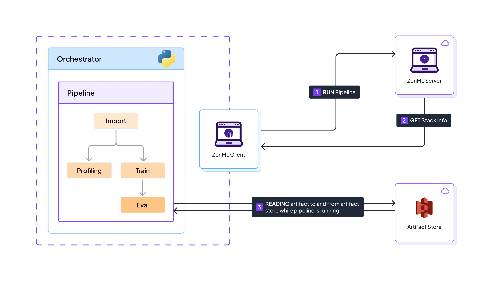
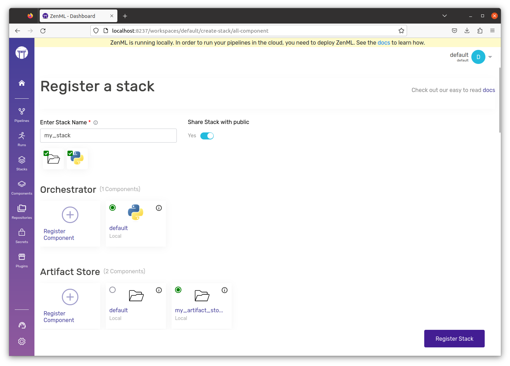

# Connecting remote storage

In the previous chapters, we've been working with artifacts stored locally on our machines. This setup is fine for individual experiments, but as we move towards a collaborative and production-ready environment, we need a solution that is more robust, shareable, and scalable. Enter remote storage!

Remote storage allows us to store our artifacts in the cloud, which means they're accessible from anywhere and by anyone with the right permissions. This is essential for team collaboration and for managing the larger datasets and models that come with production workloads.

When using a stack with remote storage, nothing changes except the fact that the artifacts get materialized in a central and remote storage location. This diagram explains the flow:

<figure><figcaption><p>Sequence of events that happen when running a pipeline on a remote artifact store.</p></figcaption></figure>

## Provisioning and registering a remote artifact store


Don't want to learn how to deploy and register stack components manually? Feel free to skip this chapter
and go to the [easy stack registration](easy-stack-registration.md) for an easier way to get to the same
outcome!


Out of the box, ZenML ships with [many different supported artifact store flavors](../../component-guide/artifact-stores/artifact-stores.md). For convenience, here are some brief instructions on how to quickly get up and running on the major cloud providers:



You will need to install and set up the AWS CLI on your machine as a prerequisite, as covered in [the AWS CLI documentation](https://docs.aws.amazon.com/cli/latest/userguide/getting-started-install.html), before you register the S3 Artifact Store.

The Amazon Web Services S3 Artifact Store flavor is provided by the [S3 ZenML integration](../../component-guide/artifact-stores/s3.md), you need to install it on your local machine to be able to register an S3 Artifact Store and add it to your stack:

```shell
zenml integration install s3 -y
```


Having trouble with this command? You can use `poetry` or `pip` to install the requirements of any ZenML integration directly. In order to obtain the exact requirements of the AWS S3 integration you can use `zenml integration requirements s3`.


The only configuration parameter mandatory for registering an S3 Artifact Store is the root path URI, which needs to point to an S3 bucket and take the form `s3://bucket-name`. In order to create a S3 bucket, refer to the [AWS documentation](https://docs.aws.amazon.com/AmazonS3/latest/userguide/create-bucket-overview.html).

With the URI to your S3 bucket known, registering an S3 Artifact Store can be done as follows:

```shell
# Register the S3 artifact-store
zenml artifact-store register cloud_artifact_store -f s3 --path=s3://bucket-name
```

For more information, read the [dedicated S3 artifact store flavor guide](../../component-guide/artifact-stores/s3.md).



You will need to install and set up the Google Cloud CLI on your machine as a prerequisite, as covered in [the Google Cloud documentation](https://cloud.google.com/sdk/docs/install-sdk) , before you register the GCS Artifact Store.

The Google Cloud Storage Artifact Store flavor is provided by the [GCP ZenML integration](../../component-guide/artifact-stores/gcp.md), you need to install it on your local machine to be able to register a GCS Artifact Store and add it to your stack:

```shell
zenml integration install gcp -y
```


Having trouble with this command? You can use `poetry` or `pip` to install the requirements of any ZenML integration directly. In order to obtain the exact requirements of the GCP integrations you can use `zenml integration requirements gcp`.


The only configuration parameter mandatory for registering a GCS Artifact Store is the root path URI, which needs to point to a GCS bucket and take the form `gs://bucket-name`. Please read [the Google Cloud Storage documentation](https://cloud.google.com/storage/docs/creating-buckets) on how to provision a GCS bucket.

With the URI to your GCS bucket known, registering a GCS Artifact Store can be done as follows:

```shell
# Register the GCS artifact store
zenml artifact-store register cloud_artifact_store -f gcp --path=gs://bucket-name
```

For more information, read the [dedicated GCS artifact store flavor guide](../../component-guide/artifact-stores/gcp.md).



You will need to install and set up the Azure CLI on your machine as a prerequisite, as covered in [the Azure documentation](https://learn.microsoft.com/en-us/cli/azure/install-azure-cli), before you register the Azure Artifact Store.

The Microsoft Azure Artifact Store flavor is provided by the [Azure ZenML integration](../../component-guide/artifact-stores/azure.md), you need to install it on your local machine to be able to register an Azure Artifact Store and add it to your stack:

```shell
zenml integration install azure -y
```


Having trouble with this command? You can use `poetry` or `pip` to install the requirements of any ZenML integration directly. In order to obtain the exact requirements of the Azure integration you can use `zenml integration requirements azure`.


The only configuration parameter mandatory for registering an Azure Artifact Store is the root path URI, which needs to point to an Azure Blog Storage container and take the form `az://container-name` or `abfs://container-name`. Please read [the Azure Blob Storage documentation](https://docs.microsoft.com/en-us/azure/storage/blobs/storage-quickstart-blobs-portal) on how to provision an Azure Blob Storage container.

With the URI to your Azure Blob Storage container known, registering an Azure Artifact Store can be done as follows:

```shell
# Register the Azure artifact store
zenml artifact-store register cloud_artifact_store -f azure --path=az://container-name
```

For more information, read the [dedicated Azure artifact store flavor guide](../../component-guide/artifact-stores/azure.md).



You can create a remote artifact store in pretty much any environment, including other cloud providers using a cloud-agnostic artifact storage such as [Minio](../../component-guide/artifact-stores/artifact-stores.md).

It is also relatively simple to create a [custom stack component flavor](../../how-to/stack-deployment/implement-a-custom-stack-component.md) for your use case.




Having trouble with setting up infrastructure? Join the [ZenML community](https://zenml.io/slack) and ask for help!


## Configuring permissions with your first service connector

While you can go ahead and [run your pipeline on your stack](remote-storage.md#running-a-pipeline-on-a-cloud-stack) if your local client is configured to access it, it is best practice to use a [service connector](../../how-to/auth-management/) for this purpose. Service connectors are quite a complicated concept (We have a whole [docs section](../../how-to/auth-management/) on them) - but we're going to be starting with a very basic approach.

First, let's understand what a service connector does. In simple words, a
service connector contains credentials that grant stack components access to
cloud infrastructure. These credentials are stored in the form of a
[secret](../../how-to/interact-with-secrets.md),
and are available to the ZenML server to use. Using these credentials, the
service connector brokers a short-lived token and grants temporary permissions
to the stack component to access that infrastructure. This diagram represents
this process:

<figure><figcaption><p>Service Connectors abstract away complexity and implement security best practices</p></figcaption></figure>



There are [many ways to create an AWS service connector](../../how-to/auth-management/aws-service-connector.md#authentication-methods), but for the sake of this guide, we recommend creating one by [using the IAM method](../../how-to/auth-management/aws-service-connector.md#aws-iam-role).

```shell
AWS_PROFILE=<AWS_PROFILE> zenml service-connector register cloud_connector --type aws --auto-configure
```



There are [many ways to create a GCP service connector](../../how-to/auth-management/gcp-service-connector.md#authentication-methods), but for the sake of this guide, we recommend creating one by [using the Service Account method](../../how-to/auth-management/gcp-service-connector.md#gcp-service-account).

```shell
zenml service-connector register cloud_connector --type gcp --auth-method service-account --service_account_json=@<PATH_TO_SERVICE_ACCOUNT_JSON> --project_id=<PROJECT_ID> --generate_temporary_tokens=False
```



There are [many ways to create an Azure service connector](../../how-to/auth-management/azure-service-connector.md#authentication-methods), but for the sake of this guide, we recommend creating one by [using the Service Principal method](../../how-to/auth-management/azure-service-connector.md#azure-service-principal).

```shell
zenml service-connector register cloud_connector --type azure --auth-method service-principal --tenant_id=<TENANT_ID> --client_id=<CLIENT_ID> --client_secret=<CLIENT_SECRET>
```



Once we have our service connector, we can now attach it to stack components. In this case, we are going to connect it to our remote artifact store:

```shell
zenml artifact-store connect cloud_artifact_store --connector cloud_connector
```

Now, every time you (or anyone else with access) uses the `cloud_artifact_store`, they will be granted a temporary token that will grant them access to the remote storage. Therefore, your colleagues don't need to worry about setting up credentials and installing clients locally!

## Running a pipeline on a cloud stack

Now that we have our remote artifact store registered, we can [register a new stack](understand-stacks.md#registering-a-stack) with it, just like we did in the previous chapter:



```shell
zenml stack register local_with_remote_storage -o default -a cloud_artifact_store
```



<figure><figcaption><p>Register a new stack.</p></figcaption></figure>



Now, using the [code from the previous chapter](understand-stacks.md#run-a-pipeline-on-the-new-local-stack), we run a training pipeline:

Set our `local_with_remote_storage` stack active:

```shell
zenml stack set local_with_remote_storage
```

Let us continue with the example from the previous page and run the training pipeline:

```shell
python run.py --training-pipeline
```

When you run that pipeline, ZenML will automatically store the artifacts in the specified remote storage, ensuring that they are preserved and accessible for future runs and by your team members. You can ask your colleagues to connect to the same [ZenML server](deploying-zenml.md), and you will notice that if they run the same pipeline, the pipeline would be partially cached, **even if they have not run the pipeline themselves before**.

You can list your artifact versions as follows:



```shell
# This will give you the artifacts from the last 15 minutes
zenml artifact version list --created="gte:$(date -d '15 minutes ago' '+%Y-%m-%d %H:%M:%S')"
```



[ZenML Pro](https://zenml.io/pro) features an [Artifact Control Plane](../starter-guide/manage-artifacts.md) to visualize artifact versions:

<figure><figcaption><p>See artifact versions in the cloud.</p></figcaption></figure>



You will notice above that some artifacts are stored locally, while others are stored in a remote storage location.

By connecting remote storage, you're taking a significant step towards building a collaborative and scalable MLOps workflow. Your artifacts are no longer tied to a single machine but are now part of a cloud-based ecosystem, ready to be shared and built upon.

<figure><figcaption></figcaption></figure>
