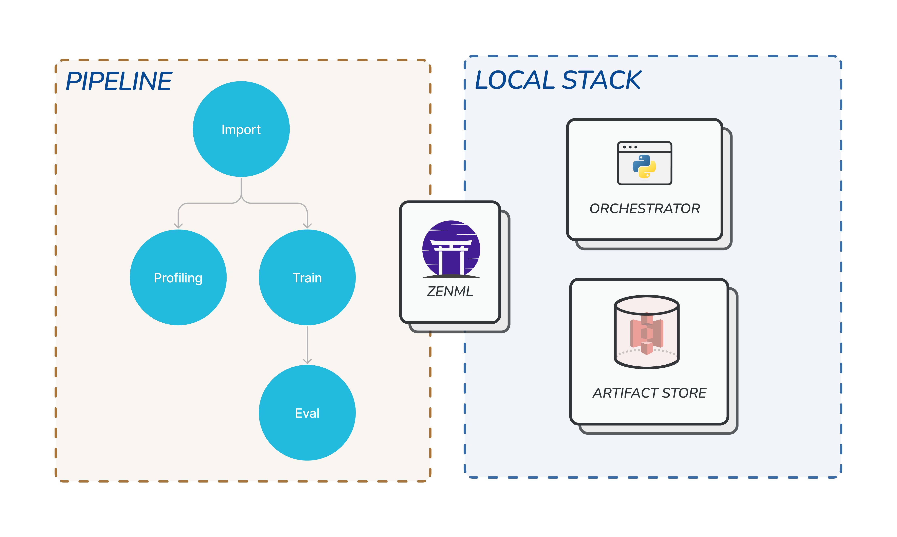

# Understanding stacks

Now that we have ZenML deployed, we can take the next steps in making sure that our machine learning workflows are production-ready. As you were running [your first pipelines](../starter-guide/create-an-ml-pipeline.md), you might have already noticed the term `stack` in the logs and on the dashboard.

A `stack` is the configuration of tools and infrastructure that your pipelines can run on. When you run ZenML code without configuring a stack, the pipeline will run on the so-called `default` stack.

<figure><figcaption><p>ZenML is the translation layer that allows your code to run on any of your stacks</p></figcaption></figure>

### Separation of code from configuration and infrastructure

As visualized in the diagram above, there are two separate domains that are connected through ZenML. The left side shows the code domain. The user's Python code is translated into a ZenML pipeline. On the right side, you can see the infrastructure domain, in this case, an instance of the `default` stack. By separating these two domains, it is easy to switch the environment that the pipeline runs on without making any changes in the code. It also allows domain experts to write code/configure infrastructure without worrying about the other domain.

### The `default` stack



`zenml stack describe` lets you find out details about your active stack:

```bash
...
        Stack Configuration        
┏━━━━━━━━━━━━━━━━┯━━━━━━━━━━━━━━━━┓
┃ COMPONENT_TYPE │ COMPONENT_NAME ┃
┠────────────────┼────────────────┨
┃ ARTIFACT_STORE │ default        ┃
┠────────────────┼────────────────┨
┃ ORCHESTRATOR   │ default        ┃
┗━━━━━━━━━━━━━━━━┷━━━━━━━━━━━━━━━━┛
     'default' stack (ACTIVE)      
Stack 'default' with id '...' is owned by user default and is 'private'.
...
```

`zenml stack list` lets you see all stacks that are registered in your zenml deployment.

```bash
...
┏━━━━━━━━┯━━━━━━━━━━━━┯━━━━━━━━━━━┯━━━━━━━━┯━━━━━━━━━┯━━━━━━━━━━━━━━━━┯━━━━━━━━━━━━━━┓
┃ ACTIVE │ STACK NAME │ STACK ID  │ SHARED │ OWNER   │ ARTIFACT_STORE │ ORCHESTRATOR ┃
┠────────┼────────────┼───────────┼────────┼─────────┼────────────────┼──────────────┨
┃   👉   │ default    │ ...       │ ➖     │ default │ default        │ default      ┃
┗━━━━━━━━┷━━━━━━━━━━━━┷━━━━━━━━━━━┷━━━━━━━━┷━━━━━━━━━┷━━━━━━━━━━━━━━━━┷━━━━━━━━━━━━━━┛
...
```


As you can see a stack can be **active** on your **client**. This simply means that any pipeline you run will be using the **active stack** as its environment.




You can get the `pip` requirements of your stack by running the `zenml stack export-requirements <STACK-NAME>` CLI command.

## Components of a stack

As you can see in the section above, a stack consists of multiple components. All stacks have at minimum an **orchestrator** and an **artifact store**.

### Orchestrator

The **orchestrator** is responsible for executing the pipeline code. In the simplest case, this will be a simple Python thread on your machine. Let's explore this default orchestrator.



`zenml orchestrator list` lets you see all orchestrators that are registered in your zenml deployment.

```bash
┏━━━━━━━━┯━━━━━━━━━┯━━━━━━━━━━━━━━┯━━━━━━━━┯━━━━━━━━┯━━━━━━━━━┓
┃ ACTIVE │ NAME    │ COMPONENT ID │ FLAVOR │ SHARED │ OWNER   ┃
┠────────┼─────────┼──────────────┼────────┼────────┼─────────┨
┃   👉   │ default │ ...          │ local  │ ➖     │ default ┃
┗━━━━━━━━┷━━━━━━━━━┷━━━━━━━━━━━━━━┷━━━━━━━━┷━━━━━━━━┷━━━━━━━━━┛
```



### Artifact store

The **artifact store** is responsible for persisting the step outputs. As we learned in the previous section, the step outputs are not passed along in memory, rather the outputs of each step are stored in the **artifact store** and then loaded from there when the next step needs them. By default this will also be on your own machine:



`zenml artifact-store list` lets you see all artifact stores that are registered in your zenml deployment.

```bash
┏━━━━━━━━┯━━━━━━━━━┯━━━━━━━━━━━━━━┯━━━━━━━━┯━━━━━━━━┯━━━━━━━━━┓
┃ ACTIVE │ NAME    │ COMPONENT ID │ FLAVOR │ SHARED │ OWNER   ┃
┠────────┼─────────┼──────────────┼────────┼────────┼─────────┨
┃   👉   │ default │ ...          │ local  │ ➖     │ default ┃
┗━━━━━━━━┷━━━━━━━━━┷━━━━━━━━━━━━━━┷━━━━━━━━┷━━━━━━━━┷━━━━━━━━━┛
```



### Other stack components

There are many more components that you can add to your stacks, like experiment trackers, model deployers, and more. You can see all supported stack component types in a single table view [here](../../component-guide/README.md)

Perhaps the most important stack component after the orchestrator and the artifact store is the [container registry](../../component-guide/container-registries/container-registries.md). A container registry stores all your containerized images, which hold all your code and the environment needed to execute them. We will learn more about them in the next section!

## Registering a stack

Just to illustrate how to interact with stacks, let's create an alternate local stack. We start by first creating a local artifact store.

### Create an artifact store



```bash
zenml artifact-store register my_artifact_store --flavor=local 
```

Let's understand the individual parts of this command:

* `artifact-store` : This describes the top-level group, to find other stack components simply run `zenml --help`
* `register` : Here we want to register a new component, instead, we could also `update` , `delete` and more `zenml artifact-store --help` will give you all possibilities
* `my_artifact_store` : This is the unique name that the stack component will have.
* `--flavor=local`: A flavor is a possible implementation for a stack component. So in the case of an artifact store, this could be an s3-bucket or a local filesystem. You can find out all possibilities with `zenml artifact-store flavor --list`

This will be the output that you can expect from the command above.

```bash
Using the default local database.
Running with active stack: 'default' (global)
Successfully registered artifact_store `my_artifact_store`.bash
```

To see the new artifact store that you just registered, just run:

```bash
zenml artifact-store describe my_artifact_store
```



### Create a local stack

With the artifact store created, we can now create a new stack with this artifact store.



```bash
zenml stack register a_new_local_stack -o default -a my_artifact_store
```

* `stack` : This is the CLI group that enables interactions with the stacks
* `register`: Here we want to register a new stack. Explore other operations with`zenml stack --help`.
* `a_new_local_stack` : This is the unique name that the stack will have.
* `--orchestrator` or `-o` are used to specify which orchestrator to use for the stack
* `--artifact-store` or `-a` are used to specify which artifact store to use for the stack

The output for the command should look something like this:

```bash
Using the default local database.
Stack 'a_new_local_stack' successfully registered!
```

You can inspect the stack with the following command:

```bash
 zenml stack describe a_new_local_stack
```

Which will give you an output like this:

```bash
         Stack Configuration          
┏━━━━━━━━━━━━━━━━┯━━━━━━━━━━━━━━━━━━━┓
┃ COMPONENT_TYPE │ COMPONENT_NAME    ┃
┠────────────────┼───────────────────┨
┃ ORCHESTRATOR   │ default           ┃
┠────────────────┼───────────────────┨
┃ ARTIFACT_STORE │ my_artifact_store ┃
┗━━━━━━━━━━━━━━━━┷━━━━━━━━━━━━━━━━━━━┛
           'a_new_local_stack' stack           
Stack 'a_new_local_stack' with id '...' is owned by user default and is 'private'.
```



### Switch stacks with our VS Code extension


If you are using [our VS Code
extension](https://marketplace.visualstudio.com/items?itemName=ZenML.zenml-vscode),
you can easily view and switch your stacks by opening the sidebar (click on the
ZenML icon). You can then click on the stack you want to switch to as well as
view the stack components it's made up of.

### Run a pipeline on the new local stack

Let's use the pipeline in our starter project from the [previous guide](../starter-guide/starter-project.md) to see it in action.

If you have not already, clone the starter template:

```bash
pip install "zenml[templates,server]" notebook
zenml integration install sklearn -y
mkdir zenml_starter
cd zenml_starter
zenml init --template starter --template-with-defaults

# Just in case, we install the requirements again
pip install -r requirements.txt
```

<details>

<summary>Above doesn't work? Here is an alternative</summary>

The starter template is the same as the [ZenML mlops starter example](https://github.com/zenml-io/zenml/tree/main/examples/mlops_starter). You can clone it like so:

```bash
git clone --depth 1 git@github.com:zenml-io/zenml.git
cd zenml/examples/mlops_starter
pip install -r requirements.txt
zenml init
```

</details>

To run a pipeline using the new stack:

1.  Set the stack as active on your client

    ```bash
    zenml stack set a_new_local_stack
    ```
2.  Run your pipeline code:

    ```bash
    python run.py --training-pipeline
    ```

Keep this code handy as we'll be using it in the next chapters!

<figure><figcaption></figcaption></figure>
