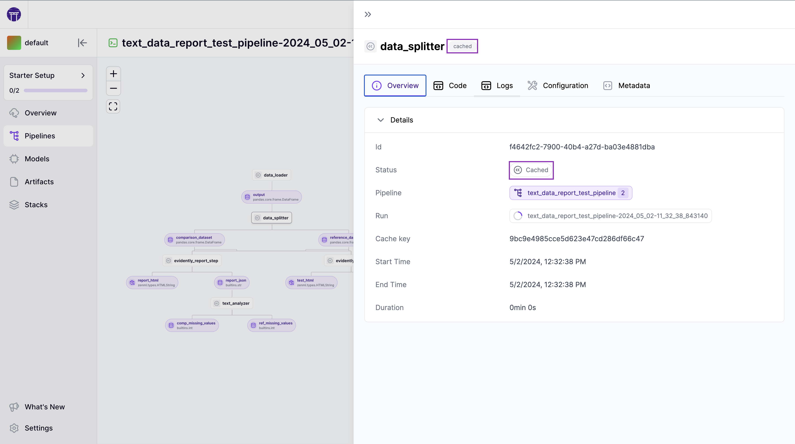
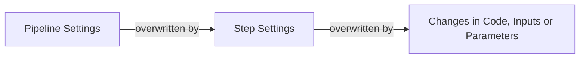


This is an older version of the ZenML documentation. To read and view the latest version please [visit this up-to-date URL](https://docs.zenml.io).



# Cache previous executions

Developing machine learning pipelines is very iterative. ZenML speeds you up in this work with the caching feature of steps and pipelines.

In the logs of your previous runs, you might have noticed at this point that rerunning the pipeline a second time will use caching on the first step:







```bash
Step training_data_loader has started.
Using cached version of training_data_loader.
Step svc_trainer has started.
Train accuracy: 0.3416666666666667
Step svc_trainer has finished in 0.932s.
```



ZenML understands that nothing has changed between subsequent runs, so it re-uses the output of the previous run (the outputs are persisted in the [artifact store](../component-guide/artifact-stores/artifact-stores.md)). This behavior is known as **caching**.

In ZenML, caching is enabled by default. Since ZenML automatically tracks and versions all inputs, outputs, and parameters of steps and pipelines, steps will not be re-executed within the **same pipeline** on subsequent pipeline runs as long as there is **no change** in the inputs, parameters, or code of a step.


Currently, the caching does not automatically detect changes within the file system or on external APIs. Make sure to **manually** set caching to `False` on steps that depend on **external inputs, file-system changes,** or if the step should run regardless of caching.


## Configuring caching behavior of your pipelines

With caching as the default behavior, there will be times when you need to disable it.

There are levels at which you can take control of when and where caching is used.



### Caching at the pipeline level

On a pipeline level, the caching policy can be set as a parameter within the `@pipeline` decorator as shown below:

```python
@pipeline(enable_cache=False)
def first_pipeline(....):
    """Pipeline with cache disabled"""
```

The setting above will disable caching for all steps in the pipeline unless a step explicitly sets `enable_cache=True` ( see below).


When writing your pipelines, be explicit. This makes it clear when looking at the code if caching is enabled or disabled for any given pipeline.


### Dynamically configuring caching for a pipeline run

Sometimes you want to have control over caching at runtime instead of defaulting to the hard-coded pipeline and step decorator settings. ZenML offers a way to override all caching settings at runtime:

```python
first_pipeline = first_pipeline.with_options(enable_cache=False)
```

The code above disables caching for all steps of your pipeline, no matter what you have configured in the `@step` or `@pipeline` decorators.

### Caching at a step-level

Caching can also be explicitly configured at a step level via a parameter of the `@step` decorator:

```python
@step(enable_cache=False)
def import_data_from_api(...):
    """Import most up-to-date data from public api"""
    ...
```

The code above turns caching off for this step only.

<!-- For scarf -->
<figure></figure>
