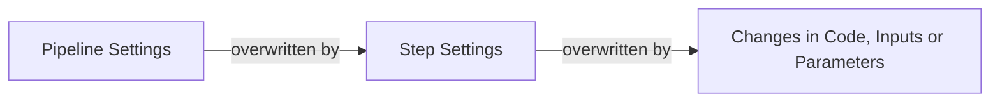

# Cache previous executions

Developing machine learning pipelines is iterative in nature. ZenML speeds up development in this work with step caching.

In the logs of your previous runs, you might have noticed at this point that rerunning the pipeline a second time will use caching on the first step:

```bash
Step training_data_loader has started.
Using cached version of training_data_loader.
Step svc_trainer has started.
Train accuracy: 0.3416666666666667
Step svc_trainer has finished in 0.932s.
```


ZenML understands that nothing has changed between subsequent runs, so it re-uses the output of the previous run (the outputs are persisted in the [artifact store](https://docs.zenml.io/stacks/artifact-stores)). This behavior is known as **caching**.

In ZenML, caching is enabled by default. Since ZenML automatically tracks and versions all inputs, outputs, and parameters of steps and pipelines, steps will not be re-executed within the **same pipeline** on subsequent pipeline runs as long as there is **no change** in the inputs, parameters, or code of a step.

If you run a pipeline without a schedule, ZenML will be able to compute the cached steps on your client machine. This means that these steps don't have to be executed by your [orchestrator](https://docs.zenml.io/stacks/orchestrators), which can save time and money when you're executing your pipelines remotely. If you always want your orchestrator to compute cached steps dynamically, you can set the `ZENML_PREVENT_CLIENT_SIDE_CACHING` environment variable to `True`.


The caching does not automatically detect changes within the file system or on external APIs. Make sure to **manually** set caching to `False` on steps that depend on **external inputs, file-system changes,** or if the step should run regardless of caching.

```python
from zenml import step

@step(enable_cache=False)
def load_data_from_external_system(...) -> ...:
    # This step will always be run
```


## Enabling and disabling the caching behavior of your pipelines

With caching as the default behavior, there will be times when you need to disable it.

There are levels at which you can take control of when and where caching is used.



### Caching at the pipeline level

On a pipeline level, the caching policy can be set as a parameter within the `@pipeline` decorator as shown below:

```python
from zenml import pipeline

@pipeline(enable_cache=False)
def first_pipeline(....):
    """Pipeline with cache disabled"""
```

The setting above will disable caching for all steps in the pipeline unless a step explicitly sets `enable_cache=True` ( see below).


When writing your pipelines, be explicit. This makes it clear when looking at the code if caching is enabled or disabled for any given pipeline.


#### Dynamically configuring caching for a pipeline run

Sometimes you want to have control over caching at runtime instead of defaulting to the hard-coded pipeline and step decorator settings. ZenML offers a way to override all caching settings at runtime:

```python
first_pipeline = first_pipeline.with_options(enable_cache=False)
```

The code above disables caching for all steps of your pipeline, no matter what you have configured in the `@step` or `@pipeline` decorators.

The `with_options` function allows you to configure all sorts of things this way. We will learn more about it in the [coming chapters](../production-guide/configure-pipeline.md)!

### Caching at a step-level

Caching can also be explicitly configured at a step level via a parameter of the `@step` decorator:

```python
from zenml import step

@step(enable_cache=False)
def import_data_from_api(...):
    """Import most up-to-date data from public api"""
    ...
```

The code above turns caching off for this step only.

You can also use `with_options` with the step, just as in the pipeline:

```python
import_data_from_api = import_data_from_api.with_options(enable_cache=False)

# use in your pipeline directly
```

## Fine-tuning caching with cache policies

ZenML offers fine-grained control over caching behavior through **cache policies**. A cache policy determines what factors are considered when generating the cache key for a step. By default, ZenML uses all available information, but you can customize this to optimize caching for your specific use case.

### Understanding cache keys

ZenML generates a unique cache key for each step execution based on various factors:

- **Step code**: The actual implementation of your step function
- **Step parameters**: Configuration parameters passed to the step
- **Input artifact values or IDs**: The content/data of input artifacts or their IDs
- **Additional file or source dependencies**: The file content or source code of additional dependencies that you can specify in your cache policy.
- **Custom cache function value**: The value returned by a custom cache function that you can specify in your cache policy. 

When any of these factors change, the cache key changes, and the step will be re-executed.

### Configuring cache policies

You can configure cache policies at both the step and pipeline level using the `CachePolicy` class.
Similar to enabling and disabling the cache above, you can define this cache policy
on both pipeline and step either via the decorator or the `with_options(...)` method. Configuring
a cache policy for a pipeline will configure it for all its steps.


```python
from zenml import step, pipeline
from zenml.config import CachePolicy

custom_cache_policy = CachePolicy(include_step_code=False)

@step(cache_policy=custom_cache_policy)
def my_step():
    ...

# or
my_step = my_step.with_options(cache_policy=custom_cache_policy)


@pipeline(cache_policy=custom_cache_policy)
def my_pipeline():
    ...

# or
my_pipeline = my_pipeline.with_options(cache_policy=custom_cache_policy)
```

### Cache policy options

Each cache policy option controls a different aspect of caching:
* `include_step_code` (default: `True`): Controls whether changes to your step implementation invalidate the cache. 


Setting `include_step_code=False` can lead to unexpected behavior if you modify your step logic but expect the changes to take effect.


* `include_step_parameters` (default: `True`): Controls whether step parameter changes invalidate the cache.
* `include_artifact_values` (default: `True`): Whether to include the artifact values in the cache key. If the materializer for an
artifact doesn't support generating a content hash, the artifact ID will be used as a fallback if enabled.
* `include_artifact_ids` (default: `True`): Whether to include the artifact IDs in the cache key.
* `ignored_inputs`: Allows you to exclude specific step inputs from cache key calculation.
* `file_dependencies`: Allows you to specify a list of files that your step depends on. The content of these files will be read and included in the cache key,
which means changes to any of the files will lead to a new cache key and therefore not cache from previous step executions.


Files specified in this list must be relative to your [source root](https://docs.zenml.io/concepts/steps_and_pipelines/sources#source-root)


* `source_dependencies`: Allows you to specify a list of Python objects (modules, classes, functions) that your step depends on. The source code of these objects
will be read and included in the cache key, which means changes to any of the objects will lead to a new cache key and therefore not cache from previous step executions.
* `cache_func`: Allows you to specify a function (without arguments) that returns a string. This function will be called as part of the cache key computation, and the
return value will be included in the cache key.

Both source dependencies as well as the cache function can be passed directly directly in code or as a [source](https://docs.zenml.io/concepts/steps_and_pipelines/sources#source-paths) string:
```python
from zenml.config import CachePolicy

def my_helper_function():
    ...

# pass function directly..
cache_policy = CachePolicy(source_dependencies=[my_helper_function])
# ..or pass the function source. This also works when
# configuring the cache policy with a config file
cache_policy = CachePolicy(source_dependencies=["run.my_helper_function"]) 
```

#### Cache expiration

By default, any step that executes successfully is a caching candidate for future step runs. Any step with the same [cache key](#understanding-cache-keys) running afterwards
can reuse the output artifacts produced by the caching candidate instead of actually executing the step code. In some cases however you might want to limit the time for how long
a step run is a valid cache candidate for future steps. You can do that by configuring an expiration time for your step runs:

```python
from zenml.config import CachePolicy
from zenml import step

# Expire the cache after 24 hours
custom_cache_policy = CachePolicy(expires_after=60*60*24)

@step(cache_policy=custom_cache_policy)
def my_step():
    ...
```

## Code Example

This section combines all the code from this section into one simple script that you can use to see caching easily:

<details>

<summary>Code Example of this Section</summary>

```python
from typing import Tuple, Annotated
import pandas as pd
from sklearn.datasets import load_iris
from sklearn.model_selection import train_test_split
from sklearn.base import ClassifierMixin
from sklearn.svm import SVC

from zenml import pipeline, step
from zenml.logger import get_logger

logger = get_logger(__name__)


@step
def training_data_loader() -> Tuple[
    Annotated[pd.DataFrame, "X_train"],
    Annotated[pd.DataFrame, "X_test"],
    Annotated[pd.Series, "y_train"],
    Annotated[pd.Series, "y_test"],
]:
    """Load the iris dataset as tuple of Pandas DataFrame / Series."""
    iris = load_iris(as_frame=True)
    X_train, X_test, y_train, y_test = train_test_split(
        iris.data, iris.target, test_size=0.2, shuffle=True, random_state=42
    )
    return X_train, X_test, y_train, y_test


@step
def svc_trainer(
    X_train: pd.DataFrame,
    y_train: pd.Series,
    gamma: float = 0.001,
) -> Tuple[
    Annotated[ClassifierMixin, "trained_model"],
    Annotated[float, "training_acc"],
]:
    """Train a sklearn SVC classifier and log to MLflow."""
    model = SVC(gamma=gamma)
    model.fit(X_train.to_numpy(), y_train.to_numpy())
    train_acc = model.score(X_train.to_numpy(), y_train.to_numpy())
    print(f"Train accuracy: {train_acc}")
    return model, train_acc


@pipeline
def training_pipeline(gamma: float = 0.002):
    X_train, X_test, y_train, y_test = training_data_loader()
    svc_trainer(gamma=gamma, X_train=X_train, y_train=y_train)


if __name__ == "__main__":
    training_pipeline()

    # Step one will use cache, step two will rerun. 
    # ZenML will detect a different value for the
    # `gamma` input of the second step and disable caching.
    logger.info("\n\nFirst step cached, second not due to parameter change")
    training_pipeline(gamma=0.0001)

    # This will disable cache for the second step.
    logger.info("\n\nFirst step cached, second not due to settings")
    svc_trainer = svc_trainer.with_options(enable_cache=False)
    training_pipeline()

    # This will disable cache for all steps.
    logger.info("\n\nCaching disabled for the entire pipeline")
    training_pipeline.with_options(enable_cache=False)()
```

</details>

<figure><figcaption></figcaption></figure>
